# Python UDF JIT 架构设计说明书

## 0.1 产品版本&密级

| 项目 | 内容 |
|---|---|
| 产品/方案 | Python Data UDF JIT Compiler & Runtime |
| 文档版本 | 0.9 |
| 方案阶段 | 架构草案 |
| 密级 | 内部技术设计 |
| 本期目标 | Daft 0.7.2 + Ray 2.55.0（Flotilla）集群；Lance 7.0.0 数据源基线 |
| 本期交付路径 | Ray Job Driver + Daft Swordfish Ray Actor；打通 CinderX Provider 与 CPython fallback，保留 Vectorized、PyTorch、Native Kernel Provider 扩展边界 |

## 0.2 拟制信息

| 项目 | 内容 |
|---|---|
| 拟制日期 | 2026-07-13 |
| 拟制方式 | 基于用户需求、CinderX 架构以及编译器/机器学习编译框架的横向分析形成 |
| 文档状态 | 待评审 |

## 0.3 修订记录

| 版本 | 日期 | 修订内容 | 修订人 |
|---|---|---|---|
| 0.1 | 2026-07-13 | 初版：完成总体架构、组件边界、运行模型、产物模型、部署及 DFX 设计 | Codex |
| 0.2 | 2026-07-13 | 重构构建/交付模型；补充 UDF Runtime JIT 在既有 Worker 内的自动注入、任务挂载、运行生命周期和用户透明性边界 | Codex |
| 0.3 | 2026-07-13 | 补充实现、构建、交付、部署和运行视图 | Codex |
| 0.4 | 2026-07-13 | 本期范围收敛为 Daft + Ray；移除展示性追踪编号并精简表格；重画 Ray 集群部署拓扑和 Swordfish Actor 进程/线程模型 | Codex |
| 0.5 | 2026-07-13 | 以运行主体重组 UDF JIT 三个组件；补齐组件/模块逻辑接口；区分代码目标、编译文件与交付包；重画部署和运行视图并完成图块结构与映射一致性校验 | Codex |
| 0.6 | 2026-07-13 | 总体架构抽象为跨框架分层结构；逻辑接口集中到上下文模型；构建清单恢复产物视角；Daft/Ray 交付收敛为单 Wheel 与独立 CLI 二进制 | Codex |
| 0.7 | 2026-07-17 | 将 Region Formation 下移为 Capture 后的 Core IR Pass；明确 Daft 0.7.2 无源码修改的 `.pth`/运行时 Hook 接入；以标量 Python 与主机列式/向量 Execution Provider 重构后端及 Fallback 边界 | Codex |
| 0.8 | 2026-07-17 | 迁入独立 Python UDF JIT 项目；建立 RFC-001～012 特性设计索引；统一主线 `1.15x`、高阶增量 `0.15`、最终原始基线 `1.30x` 的加法验收口径 | Codex |
| 0.9 | 2026-08-06 | 以多后端信息归属专项架构修正 Provider SPI、Guard 责任和 CinderX 对接路径：CinderX callable-first，Semantic Region 可选，穿刺期专用入口不作为上游公共 API | Codex |

## 0.4 Keywords 关键词

Python UDF、Daft、PySpark、PyFlink、Framework Adapter、Ray、JIT、CinderX、Vectorization、PyTorch、Native Kernel、Graph Capture、Core UDF IR、Schema、Data Layout、Guard、Graph Break、Portable Artifact、Worker Specialization

## 0.5 Abstract 摘要

本文设计一套面向数据工程框架的 Python UDF JIT 编译与运行系统。系统通过 Framework Adapter 在框架公开 API 和版本专用兼容 Hook 可见的边界采集 UDF 候选、Schema 与使用上下文，形成 `CaptureRequest`；Capture Frontend 生成 IR，Core IR Pass 再识别可联合优化的 UDF Region。控制端生成 Portable UDF Artifact，Worker 侧结合真实数据布局、CPU 能力和运行库版本完成目标特化。

总体采用“框架前端与编译/运行核心分离、控制端/Worker 两阶段编译、多层 IR、能力与成本驱动的多执行域、始终可续接原语义”架构。Framework Adapter SPI 为 Daft、PySpark、PyFlink 及后续框架提供稳定接入边界；本期只交付 Daft + Ray Adapter，并把 Worker Runtime 直接加载到既有 Swordfish Actor 进程。目标 Provider SPI 同时支持 CinderX、Vectorized、PyTorch 和 Native Kernel；CinderX Provider 内的 Guard Miss、Graph Break 或 Deopt 在同一 CPython 运行时续接解释执行，因此不要求用户改写现有 UDF。

信息来源、Guard 正确性责任、Provider-neutral SPI 和 CinderX 上游边界以[多后端信息归属与接入架构](2026-08-06-multi-provider-information-ownership-architecture.md)为准：UDF JIT 只把后端无法自行恢复的框架合同、跨算子语义和外部条件作为稳定输入；类型、行为分类、调用目标以及后端代码 Guard 由具备原生前端的 Provider 自行分析和闭环。

## 0.6 List of abbreviations 缩略语清单

| 缩略语 | 英文全称 | 中文名 |
|---|---|---|
| ABI | Application Binary Interface | 应用二进制接口 |
| AOT | Ahead-of-Time Compilation | 提前编译 |
| CFG | Control Flow Graph | 控制流图 |
| DCE | Dead Code Elimination | 死代码消除 |
| DLS | Data Layout Specialization | 数据布局特化 |
| EP | Execution Provider | 执行提供者/后端 |
| GIL | Global Interpreter Lock | Python 全局解释器锁 |
| GCS | Global Control Service | Ray 全局控制服务 |
| HIR | High-level Intermediate Representation | 高层中间表示 |
| IPC | Inter-Process Communication | 进程间通信 |
| IR | Intermediate Representation | 中间表示 |
| JIT | Just-in-Time Compilation | 即时编译 |
| LIR | Low-level Intermediate Representation | 低层中间表示 |
| OM | Operations and Maintenance | 运维管理 |
| PGO | Profile-Guided Optimization | 基于画像的优化 |
| SSA | Static Single Assignment | 静态单赋值形式 |
| UDF | User-Defined Function | 用户自定义函数 |

## 0.7 前言

Daft、Spark、Flink 等框架能够优化 LogicalPlan、表达式、分区和分布式执行，但对任意 Python UDF 的内部语义可见性有限；CinderX 等 Python JIT 能优化单个 Python 函数，却缺少框架 Schema、批数据布局、跨 UDF 数据流和任务上下文。PyTorch、TensorFlow、ONNX Runtime、TVM、IREE、TensorRT 等系统则证明了动态图捕获、多层 IR、能力分区、目标特化和运行时多版本能够共同改变执行模型，而不只是减少解释器开销。

本文将上述两类软件的经验组合为一套完整 UDF JIT 架构。本文为架构级设计，重点定义模块职责、交互关系、数据边界、实现与部署模型以及关键质量属性；单个 Pass、Opcode、HIR Node 和框架 Hook 的代码级设计由后续功能设计和详细设计承接。

# 1 简介

## 1.1 目的

本文目的如下：

1. 定义 Python UDF JIT 的系统边界、总体结构和关键技术决策。
2. 定义 Framework Adapter SPI，并说明本期 Daft LogicalPlan、Flotilla 调度和 Swordfish Ray Actor 如何落到该边界。
3. 明确 Capture IR、Core UDF IR、Region Plan、Physical IR、CinderX HIR 等表示之间的职责和信息边界。
4. 定义 Graph Optimizer 与 Data Layout Specializer 的重新分层方式。
5. 定义 Ray Job Driver 侧可移植编译、Swordfish Actor 侧目标特化、Artifact 分发、缓存、Guard、Fallback 和反馈闭环。
6. 为后续功能设计、详细设计、原型实现和性能验证建立统一基线。
7. 以 [特性 RFC 索引](../rfcs/README.md) 将架构组件分解为可独立设计、实现和验收的特性。

## 1.2 范围

### 1.2.1 本文范围

- 标量 UDF、Pandas/向量 UDF 以及可从标量 UDF 自动提升的批处理区域。
- 单 UDF 与连续 UDF/算子区域的捕获和优化。
- Ray Head、Ray Job Driver、Flotilla Scheduler、Ray Worker Node、Swordfish Actor 和 Ray Object Store 的部署关系。
- CinderX Execution Provider（CinderX JIT + CPython fallback）、Vectorized、PyTorch 与 Native Kernel Provider。
- Schema、Null、数据布局、Buffer 所有权、物化和 IPC 边界。
- 多版本特化、缓存、失效、回退、可观测性、安全和可靠性。

### 1.2.2 非目标

- 不替代 Daft Optimizer、Flotilla Scheduler、Ray 调度器或 Ray Object Store。
- 本期不实现 PySpark、PyFlink 或其他数据框架 Adapter；但控制端接入、Worker 接入、Schema/Layout 和任务产物承载必须遵循统一 Framework Adapter SPI。
- 不保证任意动态 Python、任意 C Extension 或带复杂副作用的 UDF 都能编译。
- 不在首期实现完整 TVM/TensorRT 式自动调优搜索空间。
- 不要求所有执行都脱离 Swordfish Actor；纯 Native Operator 下沉属于后续演进。
- 不以自研方式替代 Arrow、NumPy、Pandas、BLAS 等成熟数据与科学计算生态。
- 不把 CinderX HIR 暴露为跨框架、跨版本的可移植产物格式。

## 1.3 文档结构

本文采用总分结构：

- 第 2～7 章给出概念模型、目标、原则、系统用例、关键技术和逻辑架构，建立整体视角。
- 第 8 章按组件统一展开职责、输入、输出、边界和关键不变量。
- 第 9 章说明实现、构建、交付、部署和运行模型。
- 第 10～11 章说明安全、可靠性、性能、可运维性和组件独立能力。
- 第 12～13 章记录演进建议、开放问题和参考资料。
- 独立特性的功能、接口与 Benchmark 见 [RFC-001～RFC-012](../rfcs/README.md)，本文不重复其详细设计。

## 1.4 利益相关人

| 角色 | 关注点 |
|---|---|
| 数据框架用户 | 是否需要修改 UDF、兼容性、错误是否可诊断、是否稳定提速 |
| 框架集成开发者 | Planner/UDF Hook、任务元数据、Worker 初始化、Schema/Layout 和版本兼容 |
| CinderX 开发者 | Bytecode/HIR 接入点、Deopt、Python ABI、改动范围和维护成本 |
| 编译器开发者 | IR 边界、Pass 管理、分析失效、分区和 Execution Provider 接口 |
| Runtime 开发者 | Buffer/GIL/对象生命周期、Guard、缓存和并发发布 |
| Ray 平台运维人员 | Runtime Environment、Actor 生命周期、编译开销、缓存、灰度、熔断和指标 |
| 安全人员 | 不可信 UDF、Native Code、Artifact 完整性、权限边界 |
| 性能工程师 | Execution Provider 覆盖率、转换成本、编译预算、收益归因 |

## 1.5 对已有架构的借鉴与反思

| 来源 | 借鉴内容 | 不直接照搬的部分 |
|---|---|---|
| LLVM/CinderX | 原子 Pass、Analysis、SSA、分层 Lowering、目标代码生成、Deopt | 仅从 Python Bytecode 视角无法理解跨 UDF 和框架数据语义 |
| MLIR | 多层 Dialect、每层不变量、显式 Lowering | 首期不要求引入完整 MLIR 基础设施 |
| PyTorch | Bytecode Capture、Guard、Graph Break、Functionalization、Core Ops、Backend | 张量程序通常比 Python 数据逻辑更纯、更规则 |
| TensorFlow/XLA | ConcreteFunction 多版本、MetaOptimizer、图优化与目标 Lowering | Shape 不能完整替代 Schema、Null、编码和对象身份 |
| ONNX Runtime | Provider-independent 优化、Capability Partition、Provider-specific 优化、Fallback | ONNX 适合作为交换图，不足以表达完整 Python 语义 |
| TVM/IREE | Graph IR 与循环/Buffer IR 分层、显式 Dispatch/资源生命周期、规则与搜索混合 | 首期不建立大规模 Kernel 搜索和设备编译栈 |
| TensorRT | Tactic Search、Timing Cache、目标绑定 Engine | 目标绑定产物不能作为集群可移植格式 |
| Moko | 通过专用 Bytecode/Intrinsic 连接 Python 与数据系统、降低接入侵入性 | 专用 Bytecode 只携带逻辑访问 ID，具体布局必须由 Worker Descriptor 绑定，不能把布局信息硬编码进通用字节码 |

# 2 概念模型

## 2.1 一句话定义

Python UDF JIT 是可嵌入多种数据工程框架的编译运行层：它在框架控制端理解 UDF 区域，在 Worker 侧结合真实数据布局生成并执行特化代码。

## 2.2 总体架构图

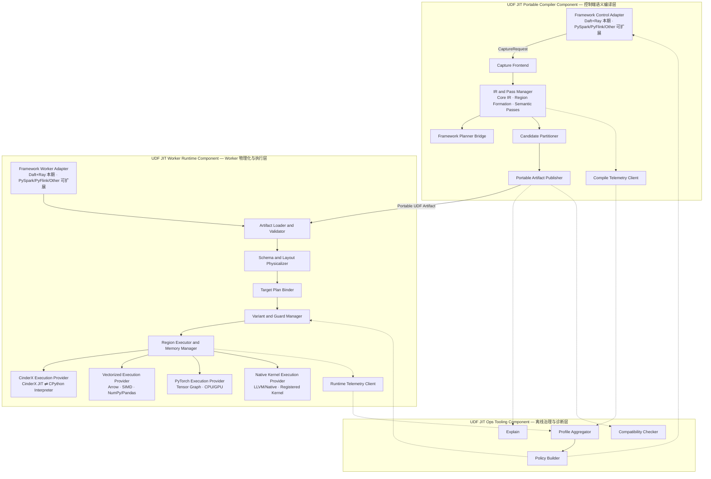

总体架构由 Portable Compiler、Worker Runtime 和 Ops Tooling 三个组件构成。框架接入分别收敛在前两个组件的 Control Adapter 与 Worker Adapter 模块中；其余编译、IR、Runtime 和 Execution Provider 模块不依赖 Daft、Spark 或 Flink 私有类型。Framework Control Adapter 只形成捕获请求，UDF Region 由 Capture 后的 Core IR Pass 根据数据依赖、控制流、Effect 和框架边界识别。本期实现 Daft + Ray Adapter，PySpark、PyFlink 和其他框架通过同一 Adapter SPI 扩展。

## 2.3 三条主链

### 2.3.1 编译控制链

Framework/UDF 事件 → `CaptureRequest` → Capture IR → Core UDF IR → Region Formation Pass → Semantic Region Graph → Candidate Region Plan → Portable Artifact。

控制链只处理程序、Schema 约束、能力和元数据，不承载业务数据。

### 2.3.2 Worker 数据执行链

Framework Batch → Layout Binding → Guard Dispatch → 标量 Python/主机列式 Region → Framework Output。

执行链不依赖中心编译服务；Worker 进程可命中本地 Variant Cache。未命中、不支持或 Deopt 时，由 CinderX Provider 在同一 CPython 进程内调用原始 UDF 或从 CinderX JIT 续接解释执行。

### 2.3.3 反馈治理链

Compile/Execute Metrics → Worker/Job 聚合 → Cost/Policy Update → 下一版本分区或特化决策。

反馈链异步运行，不能阻塞数据热路径，也不能以历史画像替代运行时 Guard。

## 2.4 系统边界

| 系统 | 负责 | 不负责 |
|---|---|---|
| 数据工程框架 Planner/Scheduler | LogicalPlan、表达式、Join、分区、任务调度和故障恢复 | 推断任意 Python UDF 的内部语义 |
| Framework Adapter | 在框架可见边界采集 UDF 候选、Schema/用途，接入 Worker Batch 和任务产物承载 | 假设可以读取框架未暴露的完整优化计划，或在通用核心中保留框架私有对象 |
| UDF JIT Portable Compiler Component | Python 捕获、Core UDF IR、语义分析、候选 Region 分区、Portable Artifact | 重建框架 Planner 或 Scheduler |
| UDF JIT Worker Runtime Component | 布局绑定、Guard、多版本、Region 调度、Buffer/GIL/对象生命周期 | 改变框架的分区、重试和异常语义 |
| CinderX Execution Provider | 在 CPython 内统一承载 CinderX JIT、解释续接、普通 Python/C Extension 调用和原始 UDF | 列式/Tensor/Native 布局规划和批量 Kernel 调度 |
| Vectorized Execution Provider | Arrow/SIMD、NumPy/Pandas 批量调用 | 承诺任意 Python 副作用、对象身份或异常顺序都可向量化 |
| PyTorch Execution Provider | Tensor Graph、Shape/DType Guard 与 CPU/GPU Runtime | 承诺任意 Python 对象可以无损 Tensor 化 |
| Native Kernel Execution Provider | Verified Region、Buffer Contract、LLVM/native codegen 或注册内核 | 猜测 Bounds、Alias、Ownership 或目标 ABI |

## 2.5 关键架构决策

| 决策 | 理由 |
|---|---|
| 本期仅实现 Daft + Ray | 先验证一条完整集群执行链，避免框架差异稀释 Capture、Layout 和 Runtime 核心工作 |
| 架构保留 Framework Adapter SPI | 将控制端 Hook、Worker Hook、Schema/Layout 和 Artifact Carrier 隔离在 Adapter 内，后续接入 PySpark/PyFlink 不修改通用 IR 与 Runtime |
| Ray Jobs 为生产主入口，Ray Client 仅作开发兼容 | Job Driver 和 Worker 使用同一集群依赖环境，部署与故障边界更清晰 |
| Driver 可移植编译 + Swordfish Actor 目标特化 | 同时利用 Daft Plan/Schema 与 Worker 真实布局、ABI、CPU 信息 |
| Runtime 加载到既有 Swordfish Actor | 保留 Daft 数据路径、Ray Actor 故障语义和 Arrow Buffer 所有权 |
| Artifact 复用 Daft UDF Wrapper/Expression 序列化与 Ray Object Reference | Daft 0.7.2 无 Task Metadata 扩展 SPI；Artifact Handle 随生成的 UDF Wrapper/Expression 进入既有计划与闭包序列化链，本期不增加独立 Registry 或 Compile Service |
| 使用多层 IR 和原子 Pass | 每层只保留自身优化所需信息，明确语义优化与布局特化边界 |
| CinderX JIT 与 CPython 解释执行归入同一 CinderX Execution Provider | 二者共享 CPython 对象、Frame、异常和 Deopt 语义；Fallback 是 Provider 内执行路径，不是独立后端 |
| Provider 按可独立探测、编译、执行和失效的能力边界划分 | 目标支持 CinderX、Vectorized、PyTorch、Native Kernel；CPython 解释执行是 CinderX Provider 的 fallback，不是第五个 Provider |
| CinderX callable-first，外部 Semantic Region 为可选输入 | 普通 Python 函数复用 CinderX 原生 Bytecode→HIR→LIR、Guard 和 Deopt；只有跨算子或已脱离 bytecode 的 Region 才经过版本绑定的 Provider Plugin bridge |

# 3 架构和关键质量属性目标

## 3.1 架构目标

1. **用户透明**：支持的普通 UDF 默认无需改写为 Pandas UDF、Arrow API 或专用 DSL。
2. **框架原生集成**：通过 Adapter 复用框架既有 Plan、任务调度、Worker 生命周期和数据通道；本期映射到 Daft/Flotilla/Swordfish/Ray Object Store。
3. **语义安全**：不能证明等价时不优化；任意编译、Guard 或 Provider 失败均可续接原始 Python。
4. **改变执行模型**：不仅优化单个 Python 函数，还支持跨 UDF Region、列式执行和 Python 对象物化消除。
5. **可演进**：从 Worker 内 CinderX Provider 演进到 Vectorized、PyTorch、Native Kernel 与 Planner 混合协同，无需推翻前期产物协议。
6. **可运维**：可解释 Graph Break、分区、Guard Miss、Deopt、Fallback、复制成本和实际收益。
7. **可量化**：主线相对原始 Daft UDF 基线达到 `1.15x`；高阶能力在同一原始基线上再增加 `0.15`，最终达到 `1.30x`，不采用阶段倍率相乘。

## 3.2 关键架构需求

| 需求 | 架构响应 |
|---|---|
| 兼容多数据工程框架 | Framework Adapter SPI 分离 Control Hook、Planner Bridge、Worker Hook、Schema/Layout Provider 和 Artifact Carrier |
| 兼容 Daft Ray Runner 集群 | Daft/Ray Adapter 在 Driver 侧包装 UDF/规范 DataFrame 操作边界，在 Worker 侧复用 Daft Batch UDF/Swordfish 既有调用边界 |
| 默认不修改用户 UDF | `.pth` 自动引导 + 延迟 Post-import Hook + Ray Runtime Environment；注解仅作可选 Hint |
| 支持动态 Python | Guard、Graph Break、Python Region、Fallback Continuation |
| 保留 Data Layout 信息 | Core IR 保留逻辑 Schema；Actor Descriptor 绑定 Arrow Buffer、Offset 和 Validity |
| 控制 CinderX 改动范围 | 通用缺陷修复和原生 callable 优化进入 CinderX 候选；UDF/框架专用 external-region 与 Descriptor bridge 隔离在 CinderX Provider Plugin |
| 支持多执行域 | Provider-neutral Capability/Compile/Execute/Invalidate/Diagnostics SPI + Region Partitioner + Runtime Dispatcher；目标为 CinderX、Vectorized、PyTorch、Native Kernel |
| 避免数据转换抵消收益 | 显式 Value/Layout Contract + 转换成本模型 |
| 编译不阻塞分区执行 | 热度阈值、后台编译、Singleflight、编译预算和负缓存 |
| 适应异构 Worker | 多版本 Guard Cache + ABI、依赖和 CPU 指纹 |
| 保持作业可靠性 | 解释续接为标量 Python 域内一等路径，JIT 失败不改变 Daft UDF 的成功与异常语义 |
| 建立可验收性能闭环 | RFC-008 固化原始基线与主线 Benchmark；RFC-010～012 分别提供独立 A/B，并共同验收最终 `1.30x` |

## 3.3 假设和约束

- Framework Adapter 按阶段提供信息，而不是一次取得完整计划：控制端输出 `CaptureRequest`（函数/表达式引用、可见 Schema、用途、Fallback 引用和框架上下文），Worker Adapter 再提供真实 Batch/Layout、ABI 与运行时能力。
- Daft 0.7.2 没有官方 UDF Rewrite、Optimizer Rule 或 Native Extension 注册 SPI。本期 Adapter 通过 `.pth` 安装延迟导入 Hook，在版本和源码指纹匹配后包装内存中的 `Func.__call__` 与 `DataFrame.where/select/with_columns`；不修改或重建 Daft 源码，失配时保持原方法。
- `Func.__call__` 阶段只能登记函数、参数、返回类型和 UDF 配置等候选信息；已解析输入 Schema 和 Filter/Projection 用途在规范 DataFrame 操作边界取得。Adapter 无法从稳定 API 获取的信息不得伪造，相关优化应缩小到单 UDF 或关闭。
- CinderX 与 CPython 版本存在严格 ABI 约束，Specialized Artifact 默认不跨不兼容 Runtime 复用。
- Daft 版本差异可能限制跨表达式 Region；无法稳定提取时退化为单 UDF 编译。
- Arrow/Pandas/NumPy 的 Null、字符串、时区和嵌套类型语义可能不同，必须由 Execution Provider Capability 明确声明。
- Python 副作用、异常顺序和对象身份是语义的一部分，不能为融合或向量化而隐式丢弃。
- 用户依赖和 C Extension 由 Ray Runtime Environment 或集群镜像负责安装；UDF JIT 不提供通用依赖管理系统。

### 3.3.1 生命周期约束

- Portable Artifact 的生命周期不长于其格式兼容范围和 UDF 语义 Hash。
- Layout Descriptor 只在绑定的 Worker 进程、Framework Adapter ABI 和 Batch 生命周期内有效。
- Machine Code 只在匹配的 CPython/CinderX ABI、CPU Feature 和依赖版本下有效。
- 作业结束时释放进程级 Variant；节点级磁盘缓存按容量、TTL 和兼容键淘汰。
- 闭包或全局值版本变化时，对应 Guard 失败并触发新版本或 Fallback，禁止静默复用旧代码。

# 4 架构原则

1. **语义先于物理实现**：Core UDF IR 只表达逻辑数据计算；具体布局在 Worker Physicalization 阶段绑定。
2. **先通用、后分区、再 Provider 优化**：Provider-independent Pass 在分区前执行；布局和 Provider-specific Pass 在分区后执行。
3. **原子 Pass，而非巨型优化器**：Graph Optimizer 和 DLS 分解为可组合 Pass/Analysis Pipeline。
4. **Fallback 是 CinderX Provider 内一等执行路径**：Python Region 在 Region Plan 中显式存在并有完整 Source Map，但由 CinderX Provider 的 CPython fallback 承载，不注册独立 CPython Provider。
5. **不在控制端执行任意 UDF**：Portable Compiler 优先使用 Bytecode 分析和符号执行；需要真实执行的动态捕获在 Worker 内受控发生。
6. **不新增业务数据通道**：Artifact 复用框架任务元数据，Partition/Batch 继续走框架既有数据路径；本期对应 Daft/Ray 通道。
7. **能力与成本共同决定执行域**：Execution Provider 支持某个 Region 不等于应该选择该 Provider。
8. **目标相关信息尽可能晚绑定**：字段偏移、Buffer、SIMD、CinderX ABI 和库版本在 Worker Runtime 绑定。
9. **优化必须可解释、可关闭、可归因**：所有 Region、Guard、物化和 Fallback 均可观测。
10. **逐步增强而非全图成功或失败**：允许部分捕获、部分编译和混合执行。

# 5 系统用例模型

## 5.1 上下文模型

### 5.1.1 上下文图

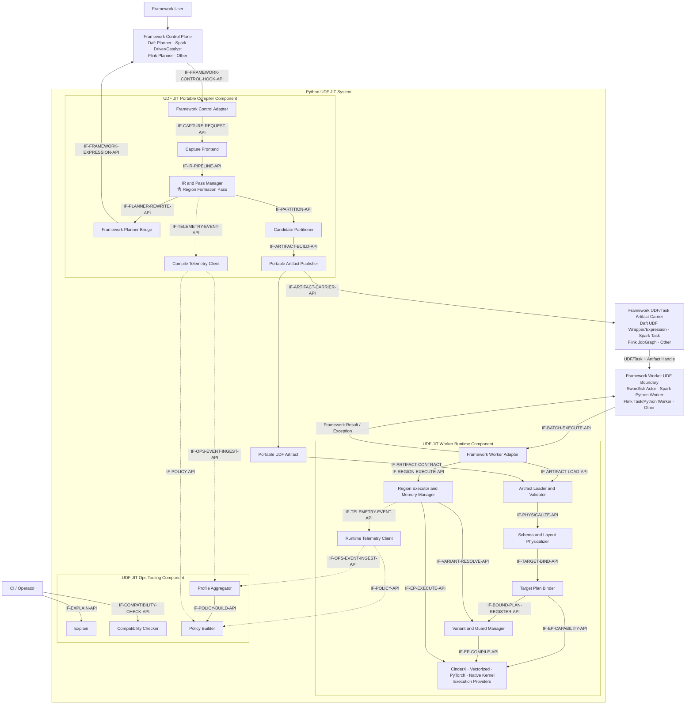

逻辑接口只在本上下文图中定义。`IF-...-API` 箭头由调用方指向提供方；`IF-ARTIFACT-CONTRACT` 箭头表示不可变产物从生产方流向消费方。Planner 回填包含两层边界：IR and Pass Manager 调用 Framework Planner Bridge，Bridge 再调用具体框架提供的 Expression API。

### 5.1.2 跨系统与跨组件逻辑接口

“提供方”拥有契约与兼容性，“调用方”发起请求。具体 Adapter 将同一逻辑接口绑定到 Daft、Spark、Flink 或其他框架机制。

| 逻辑接口 | 提供方 | 调用方 | 交互内容 |
|---|---|---|---|
| `IF-FRAMEWORK-CONTROL-HOOK-API` | Framework Control Adapter | Framework UDF/Expression/DataFrame API | UDF 候选事件、可见 Schema、Filter/Projection 用途和原始表达式引用；不要求框架预先提供 UDF Region |
| `IF-FRAMEWORK-EXPRESSION-API` | Framework Planner / Expression API | Framework Planner Bridge | 校验并创建框架 Native Expression，返回 Expression ID 或拒绝原因 |
| `IF-ARTIFACT-CARRIER-API` | Framework UDF/Task Artifact Carrier | Portable Artifact Publisher | 把 Artifact Handle、语义 Hash 和兼容要求装入框架既有可序列化载体；Daft 0.7.2 使用生成的 UDF Wrapper/Expression 闭包，不修改 Task Metadata |
| `IF-ARTIFACT-CONTRACT` | Portable Artifact Publisher | Artifact Loader | 不可变 Artifact Blob、格式版本、完整性 Hash 和 Fallback 引用 |
| `IF-BATCH-EXECUTE-API` | Framework Worker Adapter | Framework Worker UDF Boundary | UDF Wrapper 调用、Artifact Handle、`ScalarCallView`/`BatchView`、输出与异常 Contract；首次调用可懒建 Region Context |
| `IF-OPS-EVENT-INGEST-API` | Profile Aggregator | Compile/Runtime Telemetry Client | 异步事件批次和作用域信息 |
| `IF-POLICY-API` | Policy Builder | Compile/Runtime Telemetry Client | 版本化预算、灰度、Execution Provider 开关和熔断策略 |
| `IF-EXPLAIN-API` | Explain（Ops Tooling Component） | CI / Operator | Artifact/Variant/Source Map → 可读决策报告 |
| `IF-COMPATIBILITY-CHECK-API` | Compatibility Checker（Ops Tooling Component） | CI / Operator | 交付/Artifact/Runtime Manifest → 兼容或拒绝结果 |

### 5.1.3 组件内模块逻辑接口

| 逻辑接口 | 提供模块 | 调用模块 | 交互内容 |
|---|---|---|---|
| `IF-CAPTURE-REQUEST-API` | Capture Frontend | Framework Control Adapter | `CaptureRequest` → `CaptureIR`、初始 Guard、Graph Break；请求包含 Function/Expression 引用、可见 Schema、用途、输出和 Fallback Contract |
| `IF-IR-PIPELINE-API` | IR and Pass Manager | Capture Frontend | `CaptureIR` → Verified `CoreUdfModule`、`SemanticRegionGraph` 与 Analysis；Region Formation 是其中的后 Capture Pass |
| `IF-PLANNER-REWRITE-API` | Framework Planner Bridge | IR and Pass Manager | Native Expression + 语义证明 → 接受/拒绝 + Framework Expression ID |
| `IF-PARTITION-API` | Candidate Partitioner | IR and Pass Manager | Semantic Region Graph + Provider Capability Envelope → Candidate Region Plan |
| `IF-ARTIFACT-BUILD-API` | Portable Artifact Publisher | Candidate Partitioner | Candidate Plan + IR + Guard Template → Artifact Blob/Ref |
| `IF-ARTIFACT-LOAD-API` | Artifact Loader and Validator | Framework Worker Adapter | Artifact Ref + Worker ABI → Verified Artifact / 拒绝原因 |
| `IF-PHYSICALIZE-API` | Schema and Layout Physicalizer | Artifact Loader and Validator | Verified Artifact + Batch Layout → Physical Region + Descriptor |
| `IF-TARGET-BIND-API` | Target Plan Binder | Schema and Layout Physicalizer | Physical Region + Worker Capability → Bound Region Plan |
| `IF-BOUND-PLAN-REGISTER-API` | Variant and Guard Manager | Target Plan Binder | 注册 Bound Region Plan、Guard Template 与 Compatibility Key |
| `IF-REGION-EXECUTE-API` | Region Executor and Memory Manager | Framework Worker Adapter | Region Handle + BatchView + Output Contract → Framework Result / Exception |
| `IF-VARIANT-RESOLVE-API` | Variant and Guard Manager | Region Executor and Memory Manager | Runtime Context → Variant Hit、Compile Ticket 或 CinderX/CPython Fallback Continuation |
| `IF-EP-CAPABILITY-API` | CinderX/Vectorized/PyTorch/Native Kernel Provider | Target Plan Binder | 输入模式、操作、类型、Null、Effect、布局、Assumption、转换和成本能力 |
| `IF-EP-COMPILE-API` | CinderX/Vectorized/PyTorch/Native Kernel Provider | Variant and Guard Manager | CompileRequest → CompiledVariant/Reject + GuardCoverage；CinderX 解释 Region 可返回 Continuation Handle |
| `IF-EP-EXECUTE-API` | CinderX/Vectorized/PyTorch/Native Kernel Provider | Region Executor and Memory Manager | Variant + Value Contract → Region Result / Side Exit；Provider 内部 Guard/Deopt 由自身处理 |
| `IF-TELEMETRY-EVENT-API` | Compile/Runtime Telemetry Client | IR/Publisher/Variant/Executor | 非阻塞 Compile/Runtime Event |
| `IF-POLICY-BUILD-API` | Policy Builder | Profile Aggregator | Profile Summary + 管理员约束 → Policy Snapshot |

## 5.2 Daft + Ray 接入前后运行路径

### 5.2.1 接入前

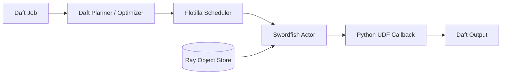

Python UDF 由 Daft 正常调度，但其内部逻辑仍作为 Python 回调执行，控制端与 Worker 之间没有可共享的 UDF 编译产物。

### 5.2.2 接入后

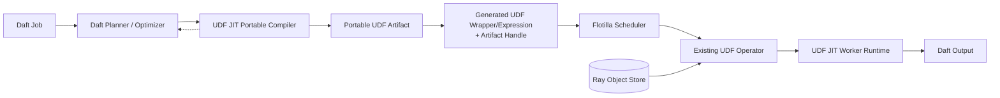

Daft 与 Ray 仍负责计划、Wrapper/闭包序列化、调度和数据传输；UDF JIT 只增加可移植编译和 Worker 目标特化，原始 Python UDF 始终保留为标量解释路径。

## 5.3 关键系统用例模型

### 5.3.1 需求编号：UC-01 透明启用 UDF JIT

#### 5.3.1.1 关键系统用例

平台在 Ray Runtime Environment 或集群镜像中安装插件，用户继续使用原有 Daft UDF API。系统自动发现可编译区域，无法编译的逻辑保持原路径。

#### 5.3.1.2 交互场景

1. `.pth` Bootstrap 在 Daft 导入后校验 0.7.2 版本/源码指纹，并幂等包装内存中的 `Func.__call__`、`DataFrame.where/select/with_columns`；Daft 源文件和二进制不变。
2. `Func.__call__` 只登记 UDF 候选；DataFrame 操作 Hook 取得 `self.schema()` 和 Filter/Projection 用途，形成 `CaptureRequest`。
3. Capture Frontend 生成 IR，Region Formation Pass 在 Core IR 上识别可联合优化的区域，Compiler 发布 Portable Artifact。
4. Adapter 生成携带 Artifact Handle 的标量或 Batch UDF Wrapper/Expression；Daft/Ray 按既有计划与闭包序列化链把它调度到 Worker，较大 Artifact 可由 Ray ObjectRef 间接承载。
5. Actor 命中 Guard 后执行优化版本；否则由 CinderX Provider 调用原始 UDF/解释续接。

### 5.3.2 需求编号：UC-02 混合执行域

#### 5.3.2.1 关键系统用例

同一 UDF Region 包含可列式表达式、Tensor 计算、Native 聚合、标量 Python 逻辑和无法编译的 Python 片段。系统在 CinderX、Vectorized、PyTorch 和 Native Kernel Provider 之间按能力和成本分区，并显式处理对象/Arrow/Tensor/Buffer 转换。

#### 5.3.2.2 交互场景

1. Semantic Pipeline 标注 Effect、类型、Null 和可批处理区域。
2. Partitioner 查询各 Execution Provider Capability。
3. 生成带 Value/Layout Contract 的 Candidate Region Plan；这是 UDF JIT 内部概念，不是 Daft 或 Ray 的既有计划类型。
4. Swordfish Actor 绑定实际布局并插入必要的 Materialize/Box/Unbox。
5. Region Executor 按依赖顺序执行并聚合输出。

### 5.3.3 需求编号：UC-03 Daft Optimizer 协同

#### 5.3.3.1 关键系统用例

系统从纯、确定、无异常语义变化的 UDF 中提取 Daft 原生表达式并回注 Daft Optimizer，以获得表达式融合、裁剪或原生执行收益。

#### 5.3.3.2 交互场景

如果无法证明纯度、总函数性、Null 等价性或异常顺序，则不回注，保留 UDF Region 执行。

### 5.3.4 需求编号：UC-04 Guard 失败与回退

#### 5.3.4.1 关键系统用例

运行时出现新 Schema、Layout、闭包值或对象类型时，系统选择已有 Variant、生成新 Variant 或回退 Python，且不导致作业失败。

#### 5.3.4.2 交互场景

1. Guard Dispatcher 检查兼容键。
2. 命中则执行；未命中则查询 Variant 预算。
3. 在预算内触发 Actor 本地特化；后台编译期间当前批次走标量解释路径。
4. 超过版本或编译预算时写入负缓存并持续走标量解释路径。

# 6 关键技术方案设计

## 6.1 Ray Job Driver/Swordfish Actor 两阶段编译方案

Ray Job Driver 已知 UDF、逻辑 Schema、调用关系和 Daft 计划，但通常不知道目标 Swordfish Actor 的真实 Arrow ABI、CPU Feature、运行库版本和 Batch 特征。因此系统采用：

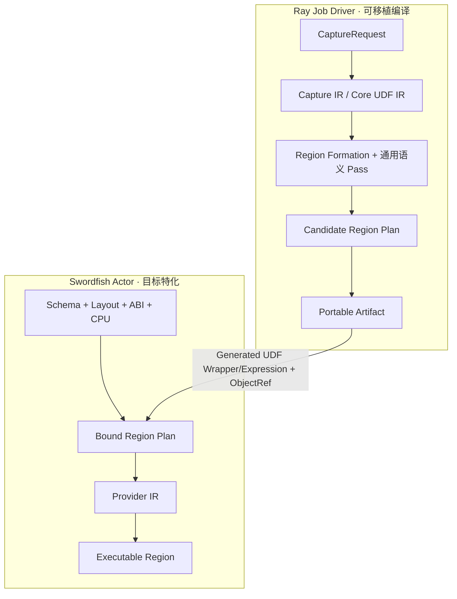

Portable Artifact 的 Handle 进入 Daft 生成的 UDF Wrapper/Expression，并随 Daft/Ray 既有计划与闭包序列化链跨节点分发；较大 Blob 使用 Ray Object Reference。该路径不要求修改 Flotilla Task Metadata，Worker 生成的机器码只在兼容目标键内复用。

## 6.2 多层 IR 与原子 Pass 方案

| 层次 | 核心语义 | 允许的信息 | 禁止的信息 | 主要 Pass |
|---|---|---|---|---|
| Capture IR | 忠实 Python 控制流和调用 | Bytecode、CFG、Effect、Source Map、Graph Break | UDF Region 结论、目标布局和机器指令 | CFG 构建、符号解释、Effect Normalize |
| Core UDF IR | 与具体框架物理执行解耦的数据计算 | LogicalType、Null Semantics、FieldRef、ExternalCall、PythonRegion | Arrow Buffer、字段偏移、CinderX HIR | Functionalize、Decompose、Region Formation、跨 UDF 分析、Framework Expression Extraction |
| Semantic Region Graph | Provider 中立的可联合优化边界 | Region ID、数据/控制/Effect 边、语义约束和 Source Map | Provider 指派和真实布局 | Region Merge/Split Verification、Region Simplification |
| Candidate Region Plan | 合法执行域候选与 Value Contract | Execution Provider 候选、转换边、Guard、成本包络 | 最终 Provider、真实 Buffer 地址 | Capability Partition、Cost Selection |
| Physical IR | Worker 内物理执行 | Buffer、Offset、Stride、Validity、Ownership、Batch、Materialize | 跨 Worker 可移植承诺 | Layout Binding、Copy/Box/Unbox、Lifetime Planning |
| Provider IR | 单一 Execution Provider 实现 | CinderX HIR、Arrow Expression、Native Loop、Library Call | 其他 Provider 内部状态 | Provider-specific Pass、Codegen |

Pass Manager 维护 Analysis 依赖和失效关系；规则改写与成本选择分离。Graph Optimizer 不再作为巨型组件，而是 Core UDF IR 上的 Semantic Pass Pipeline，其中 `RegionFormationPass` 在捕获完成后基于数据依赖、控制流、Effect、异常顺序和框架操作上下文形成 Semantic Region Graph。Data Layout Specializer 不与其并列竞争修改同一张图，而是 Candidate Region Plan 之后的 Worker Physicalization Pipeline。

这里的 `CandidateRegionPlan`、`BoundRegionPlan` 均为 UDF JIT 自有概念，不是 Daft/Ray 既有类型：前者表达可移植的合法 Provider 候选和转换约束，后者表达 Worker 已选择 Provider 并绑定实际 Layout 后的可执行 Region DAG。

Pass 顺序固定为：`Capture Normalize/Verify → Type/Schema/Effect Analysis → Region Formation → Provider-independent Semantic Passes → Planner Expression Extraction → Candidate Partition → Worker Layout Physicalization → Provider-specific Lowering/Codegen`。每一步由原子 Pass/Analysis 实现；Graph Optimizer 对应 Region Formation 后、Candidate Partition 前的语义 Pass 集合，Data Layout Specializer 对应 Worker 上 Candidate Plan 之后、Provider Lowering 之前的物理化 Pass 集合，二者不并行写同一层 IR。

分区前允许存在 `LayoutRequirementAnalysis`，但它只能返回约束和成本，不能写入具体 Offset/Buffer。

## 6.3 Capability 与成本驱动分区方案

Execution Provider 统一返回：

```text
CapabilityResult {
  provider_id
  accepted_input_modes
  supported_region
  type_null_effect_constraints
  required_input_layouts
  produced_output_layout
  required_assumptions
  side_exit_capabilities
  cost_envelope
  reject_reason
}
```

Capability 只声明待满足条件，不把 `required_assumptions` 当作已实现 Guard。Provider 编译结果必须返回 `GuardCoverage`；公共 Schema/Layout/Epoch Guard 由 Runtime Dispatcher 持有，Provider 代码依赖的类型、调用目标、Shape 或 Buffer 条件由对应 Provider 自己以 Guard/Watcher/Deopt 闭环。

分区分为两次决策：

1. Driver 侧根据通用能力生成合法 Region 候选、约束和成本包络，不固化目标 Execution Provider。
2. Swordfish Actor 侧 Target Plan Binder 结合实际 Execution Provider、Layout、ABI、CPU 和 Profile，选择最终 `BoundRegionPlan`。

Partitioner 的目标不是最大化单个 Execution Provider 覆盖率，而是最小化：

```text
总成本 = 执行成本
       + 布局转换成本
       + Python 对象物化成本
       + Region 切换成本
       + 编译成本摊销
       + Guard/Fallback 风险成本
```

首期采用规则 + 简化成本模型；后续只对热点 Region 引入有限候选测量和 Timing Cache，避免全局搜索放大编译延迟。

## 6.4 Schema 与 Data Layout 物理化方案

Core IR 使用稳定 Field ID，而不是属性名查找或物理偏移：

```text
%price = field.load field_id=42 : Nullable<Float64>
```

Worker 内的 Layout Binder 将 `field_id=42` 绑定到 Layout Descriptor：

```text
LayoutDescriptor[42] = {
  representation: ArrowColumn,
  column_index: 3,
  values_buffer: BufferRef(...),
  validity_buffer: BufferRef(...),
  physical_type: float64,
  nullable: true,
  ownership: BorrowedFromDaftBatch
}
```

因此 provider-neutral Physical Region 只携带稳定 `access_id` 和逻辑访问合同：

```text
access[17] = {
  field_id: 42,
  logical_type: Nullable<Float64>,
  mode: read,
  accepted_representation: scalar-or-column
}
```

`access_id` 不是裸字段编号。Worker Physicalizer 再生成 `17 -> {ArrowColumn, values_buffer, validity_buffer, offset, stride, ownership}` 的 Descriptor。Verifier 校验两者的类型、Null、读写权限和表示约束，Runtime Dispatcher Guard 保护 Descriptor ABI/Epoch。Vectorized、PyTorch 和 Native Kernel Provider 分别把同一合同绑定到自己的列、Tensor 或 Buffer 表示；CinderX callable 路径继续接收普通 Python 参数。若 external scalar Region 需要直接数据访问，只能由 CinderX Provider Plugin 通过版本绑定的私有 Descriptor bridge 实现，不能把专用 Bytecode/Intrinsic 写入 Portable Artifact 或 Provider SPI。

该设计把信息损失控制在显式 Lowering 边界：上层保留字段语义和合法布局约束，下层补充真实布局；任何不能由 Descriptor 和 Provider GuardCoverage 证明的属性都会导致 Capability 拒绝或进入原始语义路径，而不是猜测默认布局。

## 6.5 执行域划分与 CinderX 对接方案

Execution Provider 按可独立探测、编译、执行、失效和诊断的能力边界划分，而不是按业务算子名称划分：

| Execution Provider | 当前状态 | 执行模型 | 内部实现/执行方式 |
|---|---|---|---|
| CinderX | 已有穿刺 | Python callable/标量对象，保留 Frame、异常、副作用和 GIL 语义 | CinderX Bytecode/HIR/LIR/JIT；CPython Interpreter Continuation 为 Provider 内 fallback |
| Vectorized | 后续 | Micro-batch/Column-at-a-time，使用 Arrow/数组布局 | Arrow Compute、SIMD、批量库适配 |
| PyTorch | 后续 | Tensor Graph 与 CPU/GPU Device 执行 | Export/Compile、Shape/DType Guard、Device Runtime |
| Native Kernel | 后续 | 已验证 Region 到原生 Buffer/目标代码 | Native Loop、LLVM/MLIR、预注册 Kernel |

因此：

- CinderX 与 CPython 解释执行不是两个 Provider；后者是 CinderX Provider 的原始语义 fallback。
- Arrow、NumPy/Pandas、PyTorch 和 Native codegen 可以共享输入语义，但各自拥有数据表示、Guard、代码/图缓存和 Side Exit，因此不通过 CinderX 专属接口接入。
- 异步、生成器、有状态逻辑、副作用和对象身份是 Capability/Effect 约束，不形成 Provider。
- 稀疏 Side Exit、Graph Break、转换节点和混合 Region DAG 是 Provider 之间的控制/数据边，不形成新的 Provider。
- Ray 调度、Object Store 和存储 I/O 属于框架数据面，不是 Execution Provider。

### 6.5.1 CinderX callable-first 路径

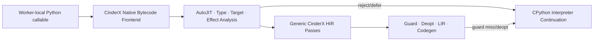

这条路径是普通 Python UDF 的首选。Bytecode、CFG、行为分类、exact type、closure/global、调用目标和代码 Guard 均由 CinderX 自行分析；UDF JIT 提供的同类内容至多作为可丢弃 Hint。generator lowering、失败负缓存、closure target inline、Unicode/lookup/builder 等能力若要进入 CinderX Core，必须能由该原生路径在零 UDF JIT 环境触发。

### 6.5.2 可选 external Semantic Region 路径

对跨 UDF/算子、已由框架融合或没有等价 Python bytecode 的 Region，CinderX Provider 可以选择接收 verified provider-neutral Semantic Region。该路径通过统一 `CompileRequest` 进入 Provider Plugin，由 Plugin 负责版本绑定、二次验证、HIR 构造、GuardCoverage 和 fallback；CinderX HIR/LIR 仍不进入 Portable Artifact。

当前 `compile_typed_region(function, semantic, plan)`、`__udf_jit_typed_region__`、`__udfjit_value_cache__` 和 `JITRT_Udf*` 仅视为穿刺期私有接口。除非出现多个非 UDF producer 并证明通用 external-region API 的必要性，否则不把这些接口原样上游到 CinderX。完整信息归属、Provider SPI 和上游门禁见[多后端信息归属与接入架构](2026-08-06-multi-provider-information-ownership-architecture.md)。

## 6.6 Guard、Graph Break、Fallback 与 Deopt 方案

- **Graph Break**：Capture 时把不支持操作切成显式 Python Region，而不是使整个 UDF 失败。
- **External Assumption（控制端）**：Capture/IR Pass 只记录 Provider 无法自行恢复、且有明确来源和失效方式的外部条件；Assumption 不是可执行 Guard。
- **Framework Guard（Worker）**：Physicalizer/Runtime Dispatcher 负责 Schema、Null、字段绑定、Layout、Descriptor Epoch 和任务 Epoch 等公共合同。
- **Provider Guard/Deopt**：CinderX exact type/closure/global、PyTorch Shape/DType、Native Bounds/Alias 等条件由对应 Provider 自行闭环，并在 Variant 中返回 GuardCoverage。
- **Interpreter Continuation/Fallback**：Python Region 是 Region DAG 的合法节点；CinderX Provider 复用框架 Adapter 保留的原始 UDF 调用路径，不注册独立 CPython Provider。
- **Deopt**：单函数标量 Region 优先复用 CinderX Frame/Deopt；跨 UDF 或批量 Region 使用 Region/Row/Batch Side Exit 和必要的重放机制。
- **异常语义**：只有 Effect 和 `may_raise` 顺序可证明等价时才能跨边界融合、重排或通过 Framework Planner Bridge 回填原框架。

## 6.7 Artifact 与缓存方案

本期采用两级本地缓存和 Ray 分发：

1. Swordfish Actor 进程内 Variant Cache：保存可执行代码和 Guard Table，是执行热路径唯一同步查询的缓存。
2. Worker 节点磁盘 Cache：可选保存目标绑定 Artifact，按 Daft/CPython/CinderX/CPU 兼容键复用。
3. Portable Artifact 由 Ray Job Driver 内容寻址，通过生成的 UDF Wrapper/Expression 闭包或 Ray Object Reference 分发，不建设独立集群 Registry。

同一 Key 编译使用 Singleflight，防止 Actor 内并发编译风暴；持续失败的 Key 进入负缓存。Actor 重启后可以从 Portable Artifact 重新特化或直接 Fallback。

## 6.8 AI架构技术方案

当前架构不依赖生成式 AI 或在线模型推理。未来可在 Cost Model 中引入学习型性能预测，但必须满足：

- 预测仅用于候选排序，不绕过 Capability 和正确性约束；
- 决策可回退到规则模型；
- 模型版本进入 Artifact/决策日志；
- 在线推理不得进入每行数据热路径。

# 7 逻辑架构

## 7.1 结构模型

### 7.1.1 架构模式

系统组合以下模式：

- **Ports and Adapters**：数据框架接入和执行后端通过稳定边界与 Portable Compiler/Worker Runtime 解耦。
- **Compiler Pipeline**：多层 IR、Analysis 和原子 Pass 分阶段 Lowering。
- **Control Plane / Data Plane Split**：编译、产物和策略不进入数据热路径。
- **AOT + JIT Hybrid**：框架控制端可移植编译 + Worker 本地特化；本期分别落在 Ray Job Driver 与 Swordfish Actor。
- **Guarded Multi-versioning**：针对不同 Schema/Layout/环境缓存多个版本。
- **Fallback-oriented Execution**：优化 Region 与 Python Region 混合执行。

### 7.1.2 组件协作边界

总体架构及模块从属关系以第 2.2 节为唯一结构图。本节只补充三类组件之间的协作边界，不重复绘制第二张架构图；逻辑接口统一在第 5.1 节上下文模型中定义。

| 协作边界 | 上游 | 下游 | 传递内容 | 禁止跨越的内容 |
|---|---|---|---|---|
| 可移植编译边界 | 数据框架控制面 | Portable Compiler | `CaptureRequest`：UDF/Expression 引用、可见逻辑 Schema、用途、Fallback 引用和框架算子上下文 | 预先形成的 UDF Region、业务 Batch、真实 Buffer 地址、Worker 机器码 |
| 产物分发边界 | Portable Compiler | Worker Runtime | Portable Artifact、完整性信息、兼容性要求 | Worker-local Descriptor、Runtime Variant、代码缓存 |
| Worker 执行边界 | 数据框架 Worker | Worker Runtime | Region Context、BatchView、输出与异常约定 | Planner 私有状态、其他 Worker 的可变状态 |
| 反馈治理边界 | Compiler/Runtime Telemetry | Ops Tooling | 异步事件、Profile、版本化策略 | 同步热路径依赖、绕过 Verifier/Guard 的控制指令 |

## 7.2 行为模型

### 7.2.1 用例设计1：注册、捕获与可移植编译

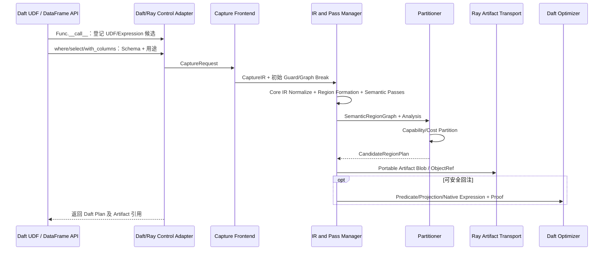

### 7.2.2 用例设计2：Swordfish Actor 特化与执行

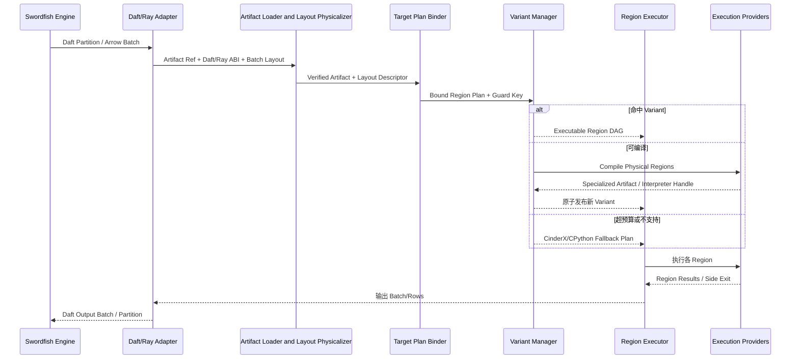

### 7.2.3 用例设计3：Guard Miss 与异步再编译

当前批次走已有泛化版本或 CinderX Provider 的 CPython fallback；Actor 内的后台编译线程池按新 Guard Key 生成 Variant。发布采用原子替换，UDF 执行线程不等待远端服务。超过版本、时间或内存预算时进入负缓存和熔断状态。

## 7.3 数据模型

### 7.3.1 架构模式

采用“可移植语义产物 + Worker 绑定产物”双层模型。上层对象使用稳定 Field/Value/Region ID 和逻辑约束；下层对象使用目标 ABI、Layout Descriptor 和机器码。

### 7.3.2 关键数据设计

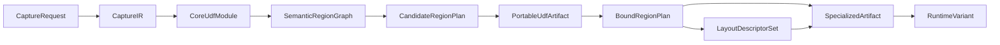

| 数据对象 | 是否跨节点 | 是否包含具体布局 | 是否包含机器码 |
|---|---:|---:|---:|
| `CaptureRequest` | 否；Driver-local | 否 | 否 |
| `CaptureIR` | 可选 | 否 | 否 |
| `CoreUdfModule` | 是；作为 Artifact Payload | 否 | 否 |
| `SemanticRegionGraph` | 是；作为 Artifact Payload | 否 | 否 |
| `CandidateRegionPlan` | 是；作为 Artifact Payload | 仅布局约束 | 否 |
| `PortableUdfArtifact` | 是 | 仅布局约束 | 否 |
| `BoundRegionPlan` | 通常否 | 是 | 否 |
| `LayoutDescriptorSet` | 否 | 是 | 否 |
| `SpecializedArtifact` | 仅兼容目标 | 是 | 是/可包含 |
| `RuntimeVariant` | 否 | 是 | 是/引用 |

### 7.3.3 静态数据结构模型

```text
CaptureRequest {
  framework_id, framework_version, adapter_abi,
  function_refs, expression_refs, visible_logical_schema,
  usage_context, output_contract, framework_operator_ids,
  fallback_payload, dependency_manifest
}

CoreUdfModule {
  functions, cfgs, values, logical_types,
  effects, source_map, graph_breaks
}

PortableUdfArtifact {
  format_version, semantic_hash, core_ir,
  effect_summary, source_map, guard_template,
  semantic_region_graph, candidate_region_plan,
  planner_expressions,
  fallback_payload_ref, compatibility_requirements
}

BoundRegionPlan {
  portable_hash, target_key, region_dag,
  value_contracts, layout_bindings,
  materialization_edges, execution_provider_assignments
}

RuntimeVariant {
  guard_key, guard_table, executable_regions,
  source_map, deopt_metadata, counters, lifecycle_state
}
```

`PortableUdfArtifact` 不等于 UDF IR。Core UDF IR 是其核心语义 Payload；Artifact 还封装 Region 候选、Guard Template、Source Map、Planner 表达式、Fallback 引用、依赖和兼容性清单。该 Artifact 是 Head/Driver 与 Worker 之间的信息交换边界，Worker 不接收控制端 Python 对象或已经绑定目标的机器码。

### 7.3.4 数据所有权模型

| 数据 | 所有者 | 使用方式 |
|---|---|---|
| Framework Input/Output Batch | 框架 Worker；本期为 Swordfish Actor | Worker Runtime 通过 BatchView 借用，必须持有框架提供的 Keepalive |
| UDF Function/Fallback Payload | Framework Adapter；本期为 Daft/Ray Adapter Extension | Portable Compiler 读取；CinderX Provider 的 CPython fallback 路径调用 |
| Core IR/Portable Artifact | 框架控制端；本期为 Ray Job Driver | 不可变、内容寻址；Handle 通过生成的 Daft UDF Wrapper/Expression 分发，大 Blob 可使用 Ray ObjectRef |
| Layout Descriptor | Worker Runtime | Worker-local，不跨不兼容 ABI |
| Native Temporary Buffer | Memory Manager | Region 生命周期内拥有，可池化 |
| Python Object | CPython/CinderX | 遵守引用计数、GC 和 GIL 约束 |
| JIT/Kernel/Graph Artifact | 对应 CinderX/Vectorized/PyTorch/Native Kernel Provider | Provider-local，按 Variant 生命周期和目标 ABI 释放 |

## 7.4 逻辑元素清单

| 组件 | 运行主体 | 内部模块 | 核心职责 |
|---|---|---|---|
| UDF JIT Portable Compiler Component | 框架控制端进程；本期为 Ray Job Driver | Framework Control Adapter、Capture Frontend、IR and Pass Manager、Framework Planner Bridge、Candidate Partitioner、Portable Artifact Publisher、Compile Telemetry Client | 从框架可见事件形成 CaptureRequest，在 Capture 后识别 Region，并生成可验证、可分发且不绑定 Worker 目标的 Portable Artifact |
| UDF JIT Worker Runtime Component | 框架 Worker 进程；本期为 Swordfish Ray Actor | Framework Worker Adapter、Artifact Loader and Validator、Schema and Layout Physicalizer、Target Plan Binder、Variant and Guard Manager、Region Executor and Memory Manager、CinderX/Vectorized/PyTorch/Native Kernel Provider、Runtime Telemetry Client | 使用真实 Schema/Layout/ABI/Target 绑定并执行 Region，管理多版本、转换、内存、异常与原始语义续接 |
| UDF JIT Ops Tooling Component | CI / 运维进程 | Explain、Compatibility Checker、Profile Aggregator、Policy Builder | 离线检查产物兼容性、解释编译决策并生成版本化运行策略；不进入批数据热路径 |

# 8 组件/模块设计与边界

本章按第 2.2 节的三个 UDF JIT 组件展开。组件拥有独立运行位置、生命周期和故障边界；模块随所属组件部署，不独立形成服务。逻辑接口名称和调用方向统一见第 5.1 节。

## 8.1 UDF JIT Portable Compiler Component

| 维度 | 定义 |
|---|---|
| 运行主体 | 框架控制端进程；本期为 Ray Job Driver |
| 核心职责 | 从框架可见的 UDF/Expression/DataFrame 事件形成 CaptureRequest，在 Capture 后识别 Region 并生成 Portable Artifact；满足证明条件时向框架 Planner 回填 Native Expression |
| 输入 | UDF/Expression 引用、可见 Logical Schema、用途/算子上下文、Fallback 引用、Policy Snapshot |
| 输出 | Portable Artifact、Planner Rewrite Result、Compile Event |
| 生命周期 | Job/Session 级；每个 Region 的 IR 与 Analysis 为请求级状态 |
| 明确边界 | 不读取业务 Batch，不绑定 Worker Offset/Buffer/CPU，不生成可跨 Worker 复用的机器码 |

### 8.1.1 内部模块

| 模块 | 职责 | 输入 → 输出 | 边界 |
|---|---|---|---|
| Framework Control Adapter | 通过自动引导、候选登记和规范操作 Hook 把框架可见信息规范化为编译入口 | UDF/Expression 事件 + Schema/用途 + Fallback → CaptureRequest | `.pth` 只负责启动引导；不假设完整 Planner SPI，不执行 UDF，不把框架私有对象写入 Core IR |
| Framework Planner Bridge | 把已证明等价的 Native Expression 转换为框架表达式 | Native Expression + 语义证明 → 接受/拒绝 + Expression ID | 不自行发起回填；必须重新校验 Effect、Null、异常和确定性证明 |
| Capture Frontend | 解析/符号执行 Python Bytecode，捕获 CFG、调用和控制流，并显式产生 Guard 与 Graph Break | CaptureRequest → CaptureIR | 不预先决定 UDF Region，不绑定具体 Buffer，不直接生成 CinderX HIR |
| IR and Pass Manager | 管理多层 IR、Analysis、Region Formation、原子 Semantic Pass、Verifier 与 Explain | CaptureIR → CoreUdfModule + SemanticRegionGraph + Analysis | Region Formation 必须在 Capture 后运行；不做目标机器特化；Pass 必须声明 Analysis 失效关系 |
| Candidate Partitioner | 基于通用 Provider Capability Envelope 生成合法执行域候选和转换边 | SemanticRegionGraph + Analysis → CandidateRegionPlan | 不选择 Worker 实际 Provider，不固化真实布局 |
| Portable Artifact Publisher | 组装、签名并把产物引用附着到框架任务 | Candidate Plan + IR + Guard Template → Artifact/Reference | 不传输业务 Batch，不发布 Worker 绑定机器码 |
| Compile Telemetry Client | 异步记录 Capture、Pass、分区和发布指标并读取策略 | Compile Event + Policy Snapshot → Metric/Event | 不参与正确性判定，失败不阻塞编译链 |

### 8.1.2 关键不变量

- 控制端不执行任意用户 UDF；必须动态执行的捕获延迟到 Worker 受控路径。
- Framework Control Adapter 只能使用当前框架暴露的信息；Daft 0.7.2 自动模式的 Hook 失配时恢复原方法，不能以猜测补齐 Schema、计划或调用边。
- UDF Region 是 Core IR 分析结果，不是 Framework Adapter 的输入，也不是 Daft/Ray 原生概念。
- Planner 回填必须经过 Framework Planner Bridge 的二次语义校验。
- Portable Artifact 只携带逻辑类型、布局约束、Guard Template 与候选计划，不携带 Worker 地址、真实 Buffer 或目标机器码。

## 8.2 UDF JIT Worker Runtime Component

| 维度 | 定义 |
|---|---|
| 运行主体 | 框架 Worker 进程；本期为 Swordfish Ray Actor |
| 核心职责 | 加载 Portable Artifact，绑定真实 Schema/Layout/ABI/CPU，编译并执行 Runtime Variant |
| 输入 | Artifact Reference、Worker/Region Context、BatchView、Policy Snapshot |
| 输出 | Framework Batch/Column、Python Object、Exception、Runtime Event |
| 生命周期 | Worker 进程级组件；Region Context、Variant 与 Batch 资源分别按其作用域管理 |
| 明确边界 | 不重写框架 LogicalPlan，不改变框架分区/重试语义，不建立独立业务数据通道 |

### 8.2.1 内部模块

| 模块 | 职责 | 输入 → 输出 | 边界 |
|---|---|---|---|
| Framework Worker Adapter | 把框架生命周期、Region 和批数据调用转换为 Runtime 请求 | Worker/Region Context、BatchView → Runtime Request/Framework Result | 不选择 Execution Provider，不持有控制端私有 IR |
| Artifact Loader and Validator | 获取并验证格式、Hash、签名、ABI 和依赖 | Artifact Ref + Worker ABI → Verified Artifact / Reject Reason | 验证前不反序列化可执行内容；失败转标量解释路径 |
| Schema and Layout Physicalizer | 把稳定 Field ID 绑定到框架/Arrow Descriptor | Verified Artifact + Batch Layout → Physical Region + Descriptor | 不选择最终 Execution Provider，不把 Descriptor 跨 Worker 持久化 |
| Target Plan Binder | 结合真实 Provider Capability 和成本选择最终 Region DAG | Physical Region + Worker Capability → Bound Region Plan | 不放宽 Effect、Null 或异常约束 |
| Variant and Guard Manager | 管理 Guard Key、Singleflight 编译、多版本、负缓存和原子发布 | Bound Plan + Runtime Context → Runtime Variant / Interpreter Continuation | 不在执行线程进行无上限同步编译 |
| Region Executor and Memory Manager | 调度 Region DAG 并管理 Buffer、Python Object、GIL、异常和 Side Exit | Runtime Variant + BatchView → Framework Result / Exception | 不绕过 Value/Layout Contract 共享内存 |
| CinderX Execution Provider | callable-first 承载 CinderX JIT Variant、Deopt/解释续接、原始 UDF 和普通 Python/C Extension 调用 | Python callable 或可选 Semantic Region → JIT Executable/Interpreter Continuation | CinderX 与 CPython fallback 不作为两个 Provider；类型/调用目标 Guard 由 CinderX 闭环 |
| Vectorized Execution Provider | 承载 Arrow、SIMD 与 NumPy/Pandas 批量适配 | Columnar/Batch Region → Vector Executable | 不声称任意 Python 对象、副作用、异常顺序或 Null 语义可向量化 |
| PyTorch Execution Provider | 承载 Tensor Graph、Shape/DType Guard 和 CPU/GPU Runtime | Tensor-compatible Region → Compiled Graph | Tensor 化、设备传输和 graph break 成本必须显式 |
| Native Kernel Execution Provider | 承载已验证 Buffer Region、LLVM/native codegen 或注册内核 | Semantic/Physical Region → Native Executable | Bounds、Alias、Ownership、target feature 和 Side Exit 由 Provider 闭环 |
| Runtime Telemetry Client | 异步记录 Guard、编译、转换、Provider 和解释续接指标 | Runtime Event + Policy Snapshot → Metric/Event | 不进入每行热路径，故障不影响批执行 |

### 8.2.2 Execution Provider 内部执行方式

| Provider / 执行方式 | 适用区域 | 关键约束 |
|---|---|---|
| CinderX / JIT | 类型和 Guard 可特化的 Python callable/标量 Region | 遵守 CPython ABI、GIL、引用计数、异常和 Deopt 语义 |
| CinderX / CPython fallback | 未捕获、不支持、Guard Miss、Deopt、编译失败或普通不透明 Python 调用 | 与 JIT 共享 CPython Runtime；保留原始调用约定、Frame 和异常行为 |
| Vectorized / Arrow-SIMD | 纯、批处理友好、列式区域 | 明确类型、Null、编码、溢出、Buffer Ownership 与 SIMD Capability |
| Vectorized / NumPy-Pandas | 已有 ndarray、ufunc、Series/DataFrame 或可批量科学计算调用 | Copy、Object Dtype、GIL 和库版本成本必须显式计入 |
| PyTorch / Tensor Graph | Tensor-compatible 区域 | Shape、DType、Device、Host/Device Transfer 与 graph break 显式计入 |
| Native Kernel / Codegen | 已验证、可绑定 Buffer 的区域 | Bounds、Alias、Ownership、ABI 和 CPU Feature 明确 |

GPU/异构设备作为 PyTorch 或 Native Kernel Provider 的 Target Capability 首先接入；只有未来出现独立内存、调度和生命周期且无法由现有 Provider 表达的执行域时，才新增 Provider 类型。

### 8.2.3 关键不变量

- Artifact、Layout Descriptor、Runtime Variant 分层校验后才能执行。
- 同一 Variant Key 采用 Singleflight；新 Variant 完整构建后原子发布。
- Worker 重启只丢失本地 Variant/Code Cache，可由 Portable Artifact 重建或直接走 CinderX Provider 的 CPython fallback。
- 所有跨 Region 的 Materialize、Copy、Box 与 Unbox 必须可计量、可解释。

## 8.3 UDF JIT Ops Tooling Component

| 维度 | 定义 |
|---|---|
| 运行主体 | CI、运维或性能分析进程 |
| 核心职责 | 离线解释 Artifact/Variant 决策、检查兼容性并构建版本化 Policy Snapshot |
| 输入 | Artifact、Compatibility Manifest、Compiler/Runtime Event、管理员配置 |
| 输出 | Explain Report、Compatibility Result、Policy Snapshot、发布校验结果 |
| 生命周期 | 按命令或流水线任务启动；不要求常驻服务 |
| 明确边界 | 不进入框架批数据路径，不直接修改正在执行的 Variant，不替代运行时 Guard |

### 8.3.1 内部模块

| 模块 | 职责 | 输入 → 输出 | 边界 |
|---|---|---|---|
| Explain | 解释 Capture、Pass、分区、Guard、物化和 Fallback 决策 | Artifact/Variant/Source Map → Explain Report | 只读，不修改 Artifact 或 Runtime State |
| Compatibility Checker | 校验交付件、Artifact 与运行环境兼容窗口 | Manifest + 环境指纹 → Compatibility Result | 不代替 Worker 加载时的强制校验 |
| Profile Aggregator | 接收并汇总 Compile/Runtime Event | Event Batch → Profile Summary | 异步、限流；不可进入 Compiler/Runtime 热路径 |
| Policy Builder | 生成不可变策略快照 | Profile Summary + 配置 → Policy Snapshot | 策略只能收紧资源/Provider 选择，不能绕过 Verifier 或 Guard |

Ops Tooling 产生只读策略快照；Portable Compiler 与 Worker Runtime 仅在安全点切换策略版本。事件上报或工具不可用时，两个运行组件继续使用本地默认策略。

# 9 实现架构

## 9.1 实现元素模型

### 9.1.1 模型设计

实现视图把三个逻辑组件拆成九个可独立链接或生成可执行文件/包的实现单元。本期不引入独立 Compile Service 或 Artifact Registry。

### 9.1.2 实现元素清单

| 实现元素 | 形态 | 对应逻辑组件/模块 | 核心职责 |
|---|---|---|---|
| Portable Compiler Library | CPython Native Extension | Portable Compiler 的 Capture、IR/Pass（含 Region Formation）、Candidate Partitioner、Publisher | 生成和校验 Portable Artifact |
| Artifact Protocol Library | CPython Native Extension | Portable Compiler 与 Worker Runtime 共用的 Artifact/Descriptor/Guard Contract | Schema、Codec、Hash、Version、Verifier |
| Daft/Ray Adapter Extension | CPython/Rust Boundary Extension | Framework Control Adapter、Framework Planner Bridge、Framework Worker Adapter 的 Daft/Ray 实现 | `.pth` 延迟引导、版本专用 Python Hook、生成 UDF Wrapper/Expression 与 Daft Scalar/Batch UDF 调用边界适配 |
| Worker Runtime Extension | CPython Native Extension | Worker Runtime 的 Loader、Physicalizer、Target Binder、Variant/Guard、Executor/Memory、Telemetry | Worker 内目标绑定、缓存、Region 调度、资源与解释续接编排 |
| CinderX Provider Plugin | Native Provider Shared Library | Worker Runtime 的 CinderX Execution Provider | callable-first CinderX JIT/Guard/Deopt、可选 external Semantic Region bridge 与 CPython Interpreter Continuation |
| Vectorized Provider Plugin | Native Provider Shared Library | Worker Runtime 的 Vectorized Execution Provider | Arrow/Fused Loop/SIMD 和 NumPy/Pandas 批量适配 |
| PyTorch Provider Plugin | Optional Provider Package | Worker Runtime 的 PyTorch Execution Provider | Tensor/Graph 捕获、Shape/DType Guard、CPU/GPU Runtime |
| Native Kernel Provider Plugin | Native Provider Shared Library | Worker Runtime 的 Native Kernel Execution Provider | verified Region、Buffer Contract、LLVM/Native Codegen 或注册 Kernel |
| Ops CLI | Native Executable | UDF JIT Ops Tooling Component | Explain、兼容检查、Profile 聚合、Policy 与发布校验 |

### 9.1.3 实现元素规格视图输出策略

后续按以下文档拆分：

- Daft/Ray Adapter 功能设计；
- Capture/Core IR 语言规范；
- Pass/Analysis 管理详细设计；
- Capability/Partitioner 详细设计；
- Layout Descriptor 与 Physical IR 规范；
- CinderX Bytecode/HIR 接入详细设计；
- Swordfish Actor Variant/Guard/Interpreter Continuation 详细设计；
- Ray Runtime Environment 与 Actor Bootstrap 部署设计；
- Artifact Format 与 Compatibility 规范。

## 9.2 技术模型

### 9.2.1 运行框架

- Ray Job Driver：Portable Compiler Library 与 Daft/Ray Adapter Extension 加载到提交脚本所在 Python 进程，形成 UDF JIT Portable Compiler Component。
- Ray Worker：Worker Runtime Extension、Daft/Ray Adapter Extension 和 Execution Provider Plugin 加载到 Daft 创建的 Swordfish Ray Actor 进程，形成 UDF JIT Worker Runtime Component；不新建第二个 Actor 或 Sidecar。
- 自动注入：集群镜像或 Ray Runtime Environment 安装 Daft/Ray Runtime Wheel；`.pth` 只导入轻量 Bootstrap，Bootstrap 安装延迟 Post-import Hook。Daft 导入并通过版本/源码指纹校验后，Adapter 才包装当前进程内的 Python 方法；Native Runtime 在实际需要时按需加载。
- Pure Native 扩展模式：后续允许整个无 Python Region 以内嵌 Native Operator 运行，但不是首期依赖。

### 9.2.2 通信框架

- Driver → Worker：Artifact Handle 随生成的 Daft UDF Wrapper/Expression 和既有闭包序列化链分发；较大 Blob 使用 Ray Object Reference。
- Partition/Batch：继续使用 Ray Object Store 和 Daft/Swordfish 数据路径，Artifact 不建立新的业务数据通道。
- Runtime → OM：异步 Metric/Event；必要时采样 Trace。

### 9.2.3 OM框架

必须提供以下指标维度：

- Capture 成功率、Graph Break 原因和 Source Location；
- 各 IR 节点数、Pass 时间、Verifier 失败；
- Execution Provider Region/节点覆盖率；
- Compile Queue、Compile Time、Cache Hit、Negative Cache；
- Guard Miss、Variant 数量、Deopt/Side Exit/Fallback；
- Copy/Materialize/Box/Unbox 字节数和耗时；
- 每 Execution Provider/执行方式的时间、端到端收益和收益置信度。

### 9.2.4 其他实现元素技术模型

- IR 序列化必须版本化并可验证；首期格式可采用自描述 Schema + 二进制 Payload。
- Source Map 覆盖 Function、Bytecode Offset、原算子 ID 和 Region Node。
- JIT Code Memory 使用 W^X；Runtime Variant 使用 Epoch/引用计数保护并发释放。
- Artifact/Variant Cache 支持容量、TTL、LRU/热点和 Job 隔离策略。

### 9.2.5 实现边界绑定

| 协作边界 | 首期实现 | 绑定机制 |
|---|---|---|
| Daft 控制面接入 | Daft/Ray Adapter Extension + Portable Compiler Library | `.pth`/Post-import Hook、`Func.__call__` 候选登记、`DataFrame.where/select/with_columns` 操作包装、Daft Expression API |
| Daft Worker 接入 | Daft/Ray Adapter Extension + Worker Runtime Extension | 生成的标量/Batch UDF Wrapper；首期列式路径使用 Daft `@daft.func.batch` 的 `Series[]` 调用边界和 `use_process=False` |
| 编译流水线 | Portable Compiler Library | 同进程 Native API；IR/Analysis 使用不可变 Handle 与显式 Verifier Result |
| Portable Artifact | Artifact Protocol Library | Content-addressed Blob + Ray Object Reference + 版本化 Schema/Hash |
| Worker 目标特化 | Worker Runtime Extension | 同 Actor 进程 Native API + Worker-local Descriptor/Handle |
| Execution Provider | CinderX/Vectorized/PyTorch/Native Kernel Provider Plugin | Provider-neutral SPI + Capability/Assumption/GuardCoverage + Value/Layout Contract；解释续接是 CinderX Provider 内部模式 |
| 反馈与策略 | Compiler/Runtime Telemetry + Ops CLI | 结构化异步 Event Batch + 版本化只读 Policy Snapshot；不要求热路径 RPC |
| 离线工具 | Ops CLI | CLI/JSON 输入输出 + 人类可读 Report/IR Dump |

### 9.2.6 技术选型

| 领域 | 首选 | 原因 |
|---|---|---|
| Python 标量 JIT | CinderX | 复用 Python ABI、HIR/LIR、Codegen 和 Deopt |
| 列式数据 | Daft/Arrow BatchView 与 Arrow C Data/Array 语义 | 复用 Swordfish 数据布局、零拷贝潜力和成熟 Kernel |
| 科学生态 | NumPy/Pandas Adapter | 兼容已有 UDF 与第三方库 |
| IR/Pass | 自有 Core UDF IR + 原子 Pass；预留 MLIR Bridge | 首期控制复杂度，长期保留生态接入 |
| 产物 | 版本化 Content-addressed Artifact | 去重、完整性和可复用 |
| 画像选择 | 规则 + 轻量成本模型，热点有限测量 | 控制编译延迟和系统复杂度 |

### 9.2.7 开源策略

- Daft/Ray Adapter Extension、Core IR 规范和 Execution Provider SPI 适合开源，以形成可复用的 UDF 编译生态。
- 与特定企业运行环境、成本模型和集群 OM 深度绑定的实现可独立维护。
- 引用 CinderX、Arrow、NumPy、Pandas 等项目时遵循其许可证和 ABI 约束。

## 9.3 数据模型

### 9.3.1 架构模式

不可变、内容寻址的可移植产物与可变、Worker-local 的 Runtime State 分离。

### 9.3.2 关键数据机制设计

- Stable ID：Function、Field、Value、Region、Operator 不以对象地址作为持久标识。
- Fingerprint：Schema/Layout/ABI/CPU/Library 分开计算，避免无关变化导致全量失效。
- Verifier：每层 IR、Artifact、Descriptor 和 Bound Plan 在进入下一阶段前验证。
- Compatibility Manifest：声明最小/最大格式版本、Adapter ABI、Runtime ABI 和依赖约束。

## 9.4 代码模型

### 9.4.1 模型设计

代码元素按可独立编译或链接的目标组织；Python Bootstrap、Manifest、Schema 资源和包装脚本随相关目标维护，不单独列为代码元素。

### 9.4.2 代码元素清单

| 代码元素 | 主代码根 | 构建目标 | 主要依赖 |
|---|---|---|---|
| Portable Compiler Library | `udf_jit/compiler/` | `_udf_jit_portable_compiler` | Artifact Protocol；不依赖具体 Framework Adapter 实现 |
| Artifact Protocol Library | `udf_jit/protocol/` | `_udf_jit_protocol` | 基础序列化、Hash、Schema 与 ABI 工具 |
| Daft/Ray Adapter Extension | `udf_jit/integration/daft_ray/` | `_udf_jit_daft_ray` | Daft Python/Rust API、Ray API、Protocol ABI |
| Worker Runtime Extension | `udf_jit/runtime/` | `_udf_jit_worker_runtime` | Protocol ABI、Execution Provider SPI、CPython ABI |
| CinderX Provider Plugin | `udf_jit/provider/cinderx/`（迁移期映射现有 `provider/scalar_python/`） | `udf_jit_provider_cinderx` | Worker Runtime EP SPI、CPython/CinderX HIR/LIR/Runtime |
| Vectorized Provider Plugin | `udf_jit/provider/vectorized/` | `udf_jit_provider_vectorized` | Worker Runtime EP SPI、Arrow、NumPy/Pandas C API、SIMD |
| PyTorch Provider Plugin | `udf_jit/provider/pytorch/` | `udf_jit_provider_pytorch` | Worker Runtime EP SPI、PyTorch Runtime/Compiler、Device ABI |
| Native Kernel Provider Plugin | `udf_jit/provider/native_kernel/` | `udf_jit_provider_native_kernel` | Worker Runtime EP SPI、LLVM/Native Runtime、Target ABI |
| Ops CLI | `udf_jit/tools/` | `udfjitctl` | 生成式 Artifact/Event Schema；内置只读 Decoder，不依赖运行时 Wheel |

`.pth`、Python Bootstrap、Wheel Metadata、SBOM 和签名清单属于交付包装资源，不是独立编译目标。

## 9.5 构建模型

### 9.5.1 模型设计

构建元素是编译器或链接器直接产生、可在 Build Tree 中执行符号、ABI 和单元测试的 `.so` 或 ELF 可执行文件。Wheel、容器镜像层和签名文件属于交付或发布资源。

### 9.5.2 构建元素清单

| 构建元素 | 源代码元素 | 构建目标 | 主要兼容约束 |
|---|---|---|---|
| `_udf_jit_portable_compiler.cpython-<pyabi>-<platform>.so` | Portable Compiler Library | `_udf_jit_portable_compiler` | CPython ABI、Compiler ABI、Portable IR Version |
| `_udf_jit_protocol.cpython-<pyabi>-<platform>.so` | Artifact Protocol Library | `_udf_jit_protocol` | CPython ABI、Artifact/Descriptor Format Version |
| `_udf_jit_daft_ray.cpython-<pyabi>-<platform>.so` | Daft/Ray Adapter Extension | `_udf_jit_daft_ray` | Daft/Ray、Python/Rust Extension ABI |
| `_udf_jit_worker_runtime.cpython-<pyabi>-<platform>.so` | Worker Runtime Extension | `_udf_jit_worker_runtime` | CPython、Runtime ABI、OS/Arch |
| `libudf_jit_provider_cinderx.so.<soversion>` | CinderX Provider Plugin | `udf_jit_provider_cinderx` | CPython/CinderX ABI、Runtime EP SPI、CPU Feature |
| `libudf_jit_provider_vectorized.so.<soversion>` | Vectorized Provider Plugin | `udf_jit_provider_vectorized` | Runtime EP SPI、Arrow、NumPy/Pandas ABI、CPU Feature |
| `python_udf_jit_provider_pytorch-<version>.whl` | PyTorch Provider Plugin | `udf_jit_provider_pytorch` | Runtime EP SPI、PyTorch/Device ABI |
| `libudf_jit_provider_native_kernel.so.<soversion>` | Native Kernel Provider Plugin | `udf_jit_provider_native_kernel` | Runtime EP SPI、LLVM/Native Runtime、Target ABI |
| `udfjitctl` | Ops CLI | `udfjitctl` | Artifact/Event Schema、OS/Arch |

本期全部代码运行在用户态，不包含 Linux Kernel Module，因此没有 `.ko` 构建产物；若后续引入内核模块或 eBPF Agent，应作为新的实现/代码/构建元素单独设计。

### 9.5.3 硬件模型

- 首期：Linux x86-64/aarch64 CPU Worker；
- CPU Feature 进入 Variant Key；
- SIMD 能力由 Vectorized/Native Kernel Provider Capability 声明；
- GPU/加速器不属于首期，但 EP SPI 和 Physical IR 不排除后续扩展 Accelerator Provider。

## 9.6 交付模型

### 9.6.1 模型设计

当前运行环境仍可由一个 Daft/Ray Runtime Wheel 覆盖控制端和 Worker 侧；Bootstrap 根据所在进程及框架 Hook 延迟加载 Core 与 CinderX Provider。目标态下 Vectorized、PyTorch、Native Kernel 作为可选 Provider Package 独立安装；缺失或 ABI 不满足时重新分区，最终由 CinderX JIT 或 CPython fallback 保留原始语义。运维工具是独立 ELF 二进制，不要求安装 Python 包。

### 9.6.2 交付元素清单

| 交付元素 | 交付文件 | 包含的构建元素 | 使用方式 |
|---|---|---|---|
| Daft/Ray UDF JIT Core Runtime | `python_udf_jit_daft_ray-<version>-<python>-<abi>-<platform>.whl` | `_udf_jit_portable_compiler.cpython-<pyabi>-<platform>.so`<br/>`_udf_jit_protocol.cpython-<pyabi>-<platform>.so`<br/>`_udf_jit_daft_ray.cpython-<pyabi>-<platform>.so`<br/>`_udf_jit_worker_runtime.cpython-<pyabi>-<platform>.so` | 在集群镜像或 Ray Runtime Environment 中安装；Driver 与 Worker 按进程角色自动加载，Provider Packages 独立声明依赖 |
| UDF JIT Operations CLI | `udfjitctl-<version>-<os>-<arch>` | `udfjitctl` ELF executable | 赋予执行权限后在 CI/运维节点直接运行；不进入作业运行环境 |

Wheel 还包含 `.pth`、Python Bootstrap、默认 Pass/Guard/Cache 策略、Compatibility Manifest 和必要的 Schema 资源。SBOM 与签名作为发布侧伴随文件，不构成新的运行交付元素。

### 9.6.3 用户安装与启用

```bash
pip install python_udf_jit_daft_ray-<version>-<python>-<abi>-<platform>.whl
```

平台通过集群镜像或 Ray `runtime_env` 保证 Job Driver 和 Worker 使用同一版本。安装后默认注册轻量 Hook；用户继续使用既有 Daft UDF API，通过运行模式配置选择关闭、观察或自动优化，不需要增加装饰器或显式导入运行时。

### 9.6.4 软件包命名格式

框架运行包采用 `python_udf_jit_<framework>-<version>-<python>-<abi>-<platform>.whl`。本期 `<framework>` 为 `daft_ray`；后续 PySpark、PyFlink Adapter 以各自框架运行包交付，使单个用户环境仍只需安装与所用框架对应的一个包。Ops CLI 采用 `udfjitctl-<version>-<os>-<arch>`。

## 9.7 部署模型

### 9.7.1 交付件部署位置

| 部署位置 | 安装的交付件 | 驻留的 UDF JIT 组件 |
|---|---|---|
| Ray Head / Job 节点 | Daft/Ray UDF JIT Runtime | Ray Job Driver 进程内的 UDF JIT Portable Compiler Component |
| Ray Worker 节点 | Daft/Ray UDF JIT Runtime | Swordfish Ray Actor 进程内的 UDF JIT Worker Runtime Component |
| CI / 运维节点 | UDF JIT Operations CLI | 独立进程中的 UDF JIT Ops Tooling Component |

同一 Runtime Wheel 安装到 Ray Job 与 Worker 环境；Bootstrap 先注册延迟 Hook，再根据实际调用按需加载控制端或 Worker Runtime 与可用 Execution Provider。Ray Control Plane、Raylet、Object Store 与 Flotilla/Swordfish 仍是现有承载环境，不产生新的 UDF JIT 服务进程。

### 9.7.2 部署拓扑

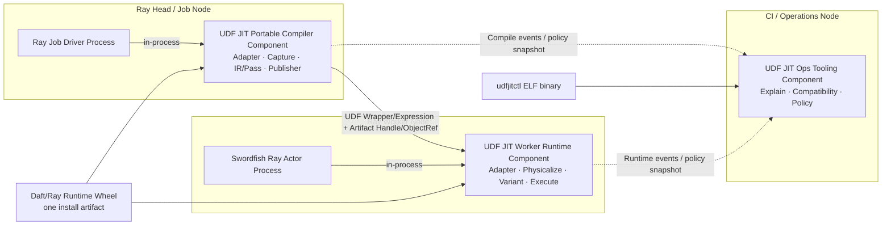

部署约束：

- Daft/Ray 仅提供进程宿主、UDF Wrapper/Expression 序列化、ObjectRef 和 Batch 数据路径；本系统的部署主体是 Portable Compiler、Worker Runtime 与 Ops Tooling 三个组件。
- 每个 Ray Job Driver 创建一个 Portable Compiler Component；每个 Swordfish Actor 创建一个 Worker Runtime Component 和独立 Variant/Code Cache。
- Portable Artifact Handle 复用 Daft UDF Wrapper/Expression 与 Ray Object Reference 分发，不部署独立 Artifact Registry；Actor/Worker 重启后从 Artifact 重建 Variant 或走标量解释路径。
- Ops Tooling 不进入批数据链路；图中虚线通过异步 Event Batch 和只读 Policy Snapshot 实现，不要求常驻 RPC 服务，失败不得阻塞 Driver 编译和 Actor 执行。

## 9.8 运行模型

### 9.8.1 逻辑元素与运行进程映射

本表直接复用第 7.4 节的三个逻辑组件名称。模块随所属组件进入同一进程，不独立部署，也不跨进程共享可变状态。

| 逻辑组件 | 运行进程与实例边界 |
|---|---|
| UDF JIT Portable Compiler Component | Ray Job Driver 进程；每个 Job/Session 一个实例 |
| UDF JIT Worker Runtime Component | Swordfish Ray Actor 进程；每个 Actor 一个实例 |
| UDF JIT Ops Tooling Component | CI / 运维进程；按命令或流水线任务启动 |

### 9.8.2 进程与线程模型

Daft UDF/DataFrame API 与 Worker UDF Wrapper 调用只是两个入口。下图只保留理解线程边界所需的宿主信息，主体是 Portable Compiler Component 与 Worker Runtime Component 的进程内执行路径。

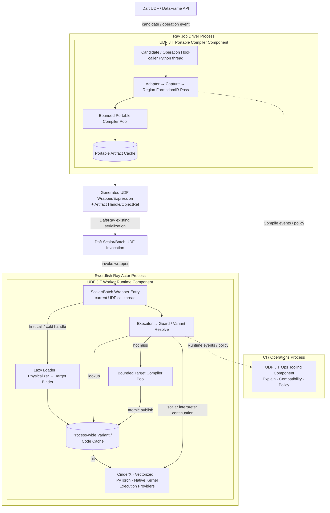

图中的线程归属边界如下：

- Candidate/Operation Hook 与 Scalar/Batch Wrapper Entry 分别运行在 Daft 调用它们的当前线程上，不创建常驻代理线程；Adapter 不假设固定 Worker 线程编号。
- Driver 的可移植编译和 Actor 的目标编译使用各自受限线程池；其队列、CPU 和内存预算归所属组件管理，不能占满 Daft/Swordfish 执行线程。
- Daft 0.7.2 不提供本系统可用的 Actor Attach/Detach SPI。Artifact Resolve、Layout Binding 和 Region Context 创建在 Wrapper 首次调用时懒执行；Loader、Guard、Executor 和 Execution Provider 是组件内调用路径，不代表额外进程。
- Variant/Code Cache 仅在单个 Actor 进程内共享；CinderX Provider 的 JIT/CPython fallback 共同遵守 GIL，Vectorized/Native Region 满足线程安全和对象隔离条件时可释放 GIL。

### 9.8.3 透明启用与 Worker 懒加载流程

可以做到与当前 CinderX 类似的用户侧透明启用，但透明的是 UDF 与业务代码，不是集群安装管理：

- 用户继续使用原有 Daft UDF 定义、注册和查询 API，不增加 `@jit`，也不改写成 Pandas UDF。
- 集群镜像或 Ray Runtime Environment 预装同一个 Daft/Ray Runtime Wheel 后，业务代码无需显式 `import python_udf_jit`。
- 平台仍须维护 Daft、Ray、CPython/CinderX 和各 Provider Package 的兼容矩阵；不受支持的 Region 保持原始 UDF 语义并由 CinderX Provider 的 CPython fallback 执行。

自动入口复用 CinderX 的成熟启动模式：[cinderx.pth](../../../cinderx/cinderx/PythonLib/cinderx.pth) 在 CPython `site` 初始化时导入 [`_cinderx_auto.py`](../../../cinderx/cinderx/PythonLib/_cinderx_auto.py)。UDF JIT 的 `.pth` 同样只导入轻量 Bootstrap；Bootstrap 安装 Post-import Hook，并不在进程启动时 Capture、编译或假设 Daft 已加载。

Daft 0.7.2 导入后，Post-import Hook 先校验版本和源码指纹，再保存原始方法并安装幂等包装器：`Func.__call__` 包装器登记候选，`DataFrame.where/select/with_columns` 包装器取得 `self.schema()` 与使用上下文、提交 `CaptureRequest`，随后调用原方法或传入已证明等价的替代表达式。版本/指纹/签名不匹配、Hook 异常或功能关闭时直接调用保存的原方法。这一层是普通 Python 进程内 Runtime Instrumentation，不是 Daft Native Plugin，也不修改 Daft 源码；真正属于 CPython Runtime Plugin 的是 CinderX Provider 内的 JIT 部分。

建议配置名为架构占位，最终名称由实现确定：

```text
UDFJIT_PLUGIN_ENABLE=1
UDFJIT_MODE=off | observe | auto
UDFJIT_DISABLE=1            # 紧急 Kill Switch
CINDERX_PLUGIN_ENABLE=1     # 启用 CinderX Provider 的 JIT tier
```

`observe` 只捕获、分析和采集成本，执行仍走原始标量解释路径；`auto` 允许编译和执行优化 Variant。

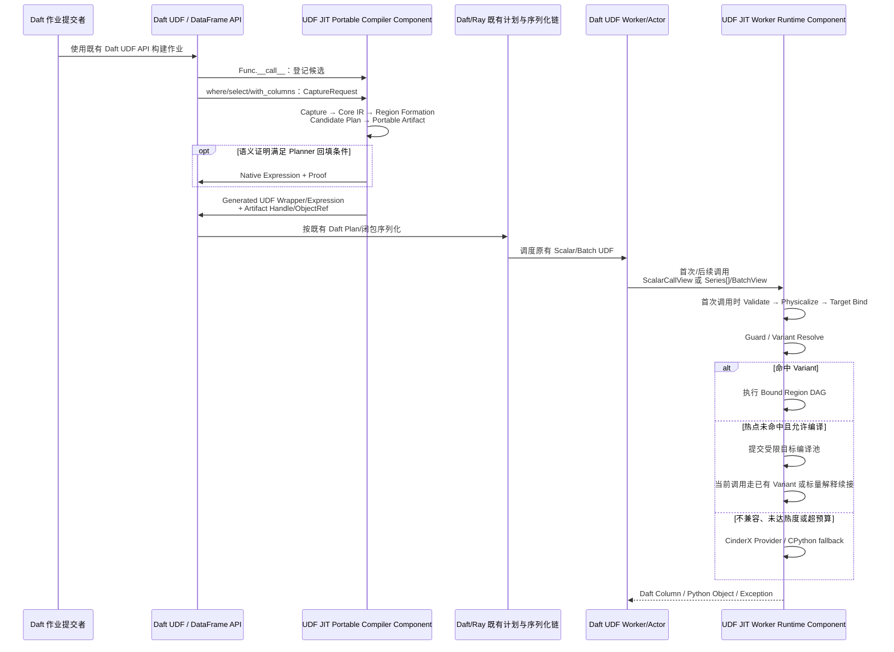

延迟到 Wrapper 首次调用初始化 Worker 目标状态是必要边界：进程启动时还没有具体 Artifact Handle、调用形态与真实 Batch Layout；Worker 又可能跨多个 Task/Stage 复用，Runtime 必须按 Artifact/Job Namespace 隔离 Region Context。`.pth` 只保证 Bootstrap 自动进入进程，Daft/Ray Adapter 分阶段取得控制面和 Worker 上下文，两者不能互相替代。首期列式 Wrapper 使用 Daft 0.7.2 既有 `@daft.func.batch`/`Series[]` 边界并固定 `use_process=False`，使 Native Runtime 在当前 UDF 执行进程内运行。

### 9.8.4 Worker Runtime Component 生命周期状态

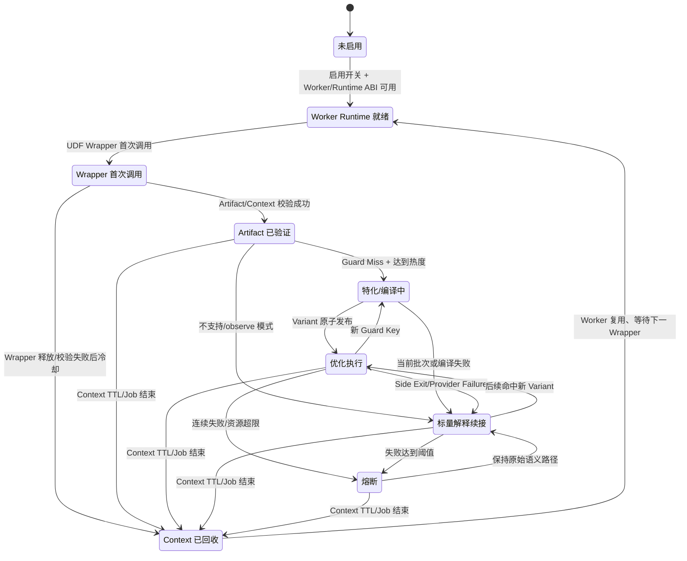

Daft 0.7.2 没有可依赖的显式 `detach_region()` 回调。每次调用结束必须立即释放 Batch 借用和临时 Buffer；Region/Job 级对象由 Wrapper/Context 引用生命周期、有界 TTL/LRU 和 Worker 进程退出共同回收。只有兼容键不包含任务敏感状态的 Portable Artifact、机器码和只读 Provider 资源，才允许保留在进程级 Cache；正确性不能依赖及时收到框架生命周期事件。

### 9.8.5 并发、并行设计

- 执行线程与编译线程池分离；首批数据可在异步编译期间走标量解释路径。
- 同一 Variant Key 采用 Singleflight，其他请求等待短期结果或走标量解释路径。
- Runtime Variant 构建完成后原子发布；执行线程使用只读快照。
- Native/Arrow Region 在语义允许时释放 GIL；CinderX Provider 的 JIT 与 CPython fallback 路径按同一 CPython 约束获取 GIL。
- Ray ObjectRef 获取、Profile 和 OM 操作异步、限流且不阻塞批执行。
- 代码与 Buffer 释放使用引用计数、Epoch 或等价机制，避免正在执行的 Variant 被回收。
- 受限编译池必须配置 Actor 级 CPU/内存预算，不能与 Swordfish Tokio Pool 无界竞争；Actor 停止时先拒绝新编译，再等待或取消在途任务。

### 9.8.6 运行交互分析

#### 9.8.6.1 用例设计1：正常命中优化 Variant

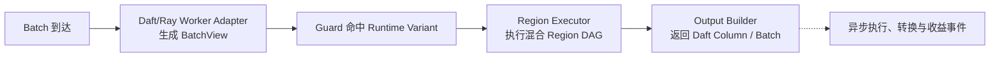

#### 9.8.6.2 用例设计2：编译失败/运行失配

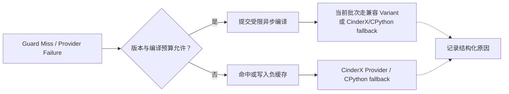

# 10 基于架构的安全/韧性/隐私/可靠/可用/Safety等属性分析

## 10.1 安全/韧性威胁分析

### 10.1.1 价值资产清单/列表

- 用户 UDF 源码、Bytecode、闭包和依赖信息；
- 业务 Schema 和可能包含敏感字段名的 Source Map；
- Portable/Specialized Artifact；
- JIT Native Code 和 Code Cache；
- Worker Batch Buffer 和 Python Object；
- Cost/Profile 数据和运行时诊断信息；
- Daft/Ray、Runtime 与 Execution Provider ABI 及配置。

### 10.1.2 暴露面清单/列表

- 不可信 UDF 和序列化 Fallback Payload；
- Artifact 反序列化、Ray ObjectRef 与 UDF Wrapper/闭包载体；
- Actor 内目标编译线程池；
- Native Execution Provider 和 JIT Code Memory；
- Daft/Ray Adapter 与 Actor Bootstrap Hook；
- Debug/IR Dump/Metric 输出；
- Actor 本地 Cache 和 Ray Object Store。

### 10.1.3 攻击路径模型

#### 10.1.3.1 UDF/Artifact 到 Native Code 攻击路径

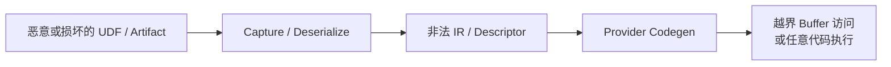

控制点：格式校验、IR Verifier、Descriptor Bounds Check、Capability 约束、W^X、进程权限隔离和安全回退。

#### 10.1.3.2 架构元素分类列表

| 类别 | 元素 |
|---|---|
| 不可信输入域 | 用户 UDF、闭包、Fallback Payload、Ray 分发的 Artifact |
| 受控编译域 | Capture、Verifier、Pass、Partitioner、Provider Compiler |
| 高权限执行域 | Swordfish Actor Runtime、CinderX、Native Execution Provider、JIT Code |
| 外部组件域 | Flotilla、Ray Object Store、OM Backend |

### 10.1.4 韧性控制点清单/列表

- Driver 不执行任意 UDF；
- 每层 IR 和 Artifact 强制验证；
- Artifact 内容 Hash/签名和兼容校验；
- 编译超时、内存限额、线程池隔离；
- Variant 数量/代码缓存/磁盘缓存配额；
- Negative Cache 和熔断；
- 所有失败可回退原始 Python；
- 指标后端故障不阻断 Actor 本地执行；Actor 重启后可重新绑定 Artifact 或直接回退；
- Explain/Log 默认脱敏且不记录业务值。

### 10.1.5 安全韧性威胁模型

| 威胁 | 影响 | 控制 |
|---|---|---|
| 恶意 Artifact | Native Crash/越界访问 | 签名/Hash、Verifier、Descriptor Bounds、拒绝后回退 |
| 编译风暴 | CPU/内存耗尽 | 热度阈值、Singleflight、预算、版本上限、负缓存 |
| Cache Poisoning | 错误代码复用 | 完整兼容键、内容寻址、租户/Job 隔离 |
| Source/Schema 泄露 | 隐私风险 | 脱敏、采样、访问控制、最小化 Source Map 上传 |
| Provider Crash | Worker 不稳定 | Provider 隔离边界、熔断、进程重启后标量解释续接 |
| Guard 漏检 | 错误结果 | Guard Verifier、差分测试、Shadow Sampling |

### 10.1.6 安全韧性逻辑模型


## 10.2 安全模型

### 10.2.1 0~n层安全设计框架

#### 10.2.1.1 初始化过程安全

- 校验 Adapter、Runtime、Execution Provider ABI；
- 校验 Artifact Format、Hash/签名和依赖；
- 初始化 Code Cache 时使用最小权限和 W^X；
- 不兼容时禁用对应 Provider，不影响 CinderX Provider 的 CPython fallback 路径。

#### 10.2.1.2 运行安全域

- Swordfish Actor 执行域继承 Ray Job 原有 UDF 权限，不额外扩大文件、网络或进程权限；
- Actor 内目标编译池使用独立线程、并发上限和 CPU/内存预算；
- Portable Artifact 使用 Ray Job Namespace、内容 Hash 和 ObjectRef 生命周期约束。

#### 10.2.1.3 防绕过

- Native Codegen 前必须经过 IR/Physical Verifier；
- Execution Provider 不能绕过 Layout Descriptor 直接猜测框架对象布局；
- Planner 回注必须经过 Effect/Null/Exception Proof；
- Guard 不满足时禁止进入 Specialized Artifact。

#### 10.2.1.4 自保护

- Crash/Timeout 计数触发 Provider/UDF/Job 级熔断；
- Code/Buffer/Variant Cache 有硬配额；
- Debug Dump 可关闭并默认不记录业务数据；
- Artifact/Variant 状态机禁止部分构建产物被执行。

### 10.2.2 1~n层子系统安全模型

| 子系统 | 安全边界 |
|---|---|
| Adapter | 只提取和传递最小必要框架信息 |
| Compiler | 处理不可信程序表示，输出前强制 Verify |
| Artifact Publisher/Loader | 只发布和加载经过格式校验、内容寻址的 Artifact |
| Swordfish Actor Runtime | Guard + Descriptor + Ownership 三重约束 |
| Execution Provider | 只接收已分区、已物理化、已验证 Region |
| OM | 指标脱敏、访问控制、采样和保留周期 |

## 10.3 安全/韧性部署模型

- 默认 In-process Runtime 不增加新的网络监听端口。
- Driver/Actor 依赖通过集群镜像或 Ray Runtime Environment 安装，不在作业运行时从未知源加载 Native Wheel。
- Actor Cache 目录按 Ray 服务用户和 Job Namespace 隔离，不信任其他租户写入。
- Native Runtime 与 Swordfish Actor 同生命周期；Actor 重启后从 Portable Artifact 重建或直接 Fallback。

## 10.4 关键质量属性分析模型

| 属性 | 设计措施 | 主要验收指标 |
|---|---|---|
| 正确性 | 原始标量解释 Oracle、Guard、Effect/Null/Exception Proof、差分/Shadow 测试 | 结果与异常语义一致率、Guard 漏检为 0 |
| 性能 | Region Fusion、对象消除、列式 Provider、成本模型、缓存 | 主线相对原始基线 `>=1.15x`；高阶最终 `>=1.30x`；Copy 字节、Provider 覆盖率用于归因 |
| 可用性 | 编译失败不影响作业、Actor 本地缓存、原始 UDF 始终可用 | Actor 重启、Artifact 未命中时仍可回退执行 |
| 可靠性 | 预算、负缓存、熔断、原子发布、资源配额 | 编译风暴/代码缓存失控为 0 |
| 可维护性 | Adapter/EP SPI、多层 IR、原子 Pass、Verifier | 新框架或 Execution Provider 不侵入 Portable Compiler/Worker Runtime 核心模块 |
| 可观测性 | Source Map、Explain、结构化 Event、分阶段指标 | Graph Break/Guard/Fallback 可定位率 |
| 可移植性 | Portable Artifact 与 Worker Specialization 分离 | 同 Portable Artifact 可在兼容异构 Worker 重特化 |

## 10.5 公共组件安全配置分析

| 公共组件 | 最低配置要求 |
|---|---|
| Ray Object Store | Job Namespace、ObjectRef 生命周期、内容 Hash、容量与 Spill 策略 |
| Actor 本地 Cache | 非共享可写、容量限制、原子 Rename、启动清理损坏项 |
| Ray Runtime Environment | 固定依赖版本、受信 Wheel 来源、工作目录与环境变量最小化 |
| Metrics/Trace | 禁止默认上传业务值，字段名和 Source 可配置脱敏 |
| Native Code Cache | W^X、不可从不可信路径直接映射执行、ABI 校验 |

# 11 组件化或服务化架构独立能力

| 独立能力 | 架构体现 |
|---|---|
| 独立开发 | Portable Compiler、Worker Runtime、Framework Adapter、Execution Provider 与 Ops 按稳定契约解耦开发 |
| 独立构建 | 九个代码目标分别生成七个 `.so`、一个可选 Provider Wheel 与一个 ELF 可执行文件 |
| 独立测试 | IR/Pass、Adapter Contract、EP Contract、Runtime 差分分别测试 |
| 独立发布 | Daft/Ray Runtime Wheel 与 Ops CLI 二进制分别版本化；核心格式和 ABI 明确兼容窗口 |
| 独立部署 | Runtime Wheel 统一进入 Job/Worker 环境并按角色加载；Ops CLI 仅部署在 CI/运维节点 |
| 独立演进/替换 | 可新增 MLIR Bridge、Provider 或 Target Capability，而不改变 Framework SPI 与 Portable 语义层 |

# 12 其他说明

## 12.1 推荐演进路线

1. **Phase 1：主线标量闭环（RFC-001～008）**。打通 `.pth`/Daft Hook、Capture、Core IR、Portable Artifact、Worker Layout 绑定、CinderX 标量 JIT、Guard/Cache、CPython 域内续接与运行治理，端到端门槛为原始基线 `1.15x`。
2. **Phase 2：Provider-neutral SPI 与 CinderX 归属收敛**。以中立 CompileRequest/GuardCoverage 包住当前 CinderX 穿刺，实现 callable-first，并删除 CinderX 可自给的必需元数据依赖。
3. **Phase 3：可选混合 Provider（RFC-009）**。接入 Vectorized、PyTorch、Native Kernel，建立 Capability、分区、成本和显式转换契约，不纳入首期强制门槛。
4. **Phase 4：高阶执行模型（RFC-010～012）**。实现列式执行、批内稀疏退出和等价语义回填；三项相对同一原始基线合计增加 `0.15`，最终达到 `1.30x`。
5. **Phase 5：跨 UDF/算子 Region 与覆盖扩展**。扩大字符串、时间、嵌套类型、科学计算库和 Planner 协同的安全覆盖面。
6. **Phase 6：PGO、有限 Tactic Search、纯 Native Operator 接入和 Ray 集群内 Artifact 复用**。

## 12.2 首期建议

- 首期只接入 Daft Ray Runner/Flotilla，固定一组 Daft、Ray、CPython/CinderX 版本建立可验证的兼容基线。
- CinderX 普通 callable 优先使用原生 Bytecode Frontend；穿刺期 external-region/Descriptor 接口隔离在版本绑定 Provider Plugin，不作为 CinderX 公共 API。
- 第一版 Partitioner 只做有限 Region 模式和确定性成本规则，不引入复杂搜索。
- 第一版 Daft Optimizer Bridge 默认关闭，仅对严格白名单的纯表达式启用。
- 首期基准覆盖 Actor 冷启动、首批编译、稳态命中、Guard Miss、Actor 重启恢复和 Ray Object Store 数据路径；其他框架在这些闭环稳定后再评估。

## 12.3 待后续设计决策

- Core UDF IR 是自有数据结构、MLIR Dialect，还是先自有后提供 MLIR Bridge。
- Capture Frontend 与具体 CPython 版本的兼容策略。
- 跨 UDF/批量 Region 的精确 Side Exit 与异常重放模型。
- 字符串、Decimal、时区、嵌套类型和用户自定义对象的统一语义规范。
- Artifact Format、Schema 演进与跨版本 Compatibility Window。
- Daft 0.7.2 Python Runtime Hook 的指纹、签名和失效策略，以及未来官方 UDF/Rewrite SPI 出现后的迁移路径。
- 新执行域独立于 PyTorch/Native Kernel Target Capability 的引入门槛、设备内存 Contract 和 Artifact Variant 边界。
- Ray Autoscaling、Actor Restart 与 Portable Artifact 所有权/重建策略。
- Daft + Ray 基准集向真实业务算子链扩展后的权重，以及生产灰度期的长期稳定性门槛。

# 13 参考资料清单

1. [Moko: Marrying Python with Big Data Systems](https://doi.org/10.1145/3689031.3696100)，EuroSys 2025；[本地论文](../../../cinderx/3689031.3696100.pdf)。
2. [CinderX JIT Guide](../../../cinderx/cinderx/Jit/guide.md)。
3. [CinderX Deoptimization](../../../cinderx/cinderx/Jit/deoptimization.md)。
4. [CinderX HIR Type](../../../cinderx/cinderx/Jit/hir/type.md)。
5. CinderX 自动注入实现：[cinderx.pth](../../../cinderx/cinderx/PythonLib/cinderx.pth)、[`_cinderx_auto.py`](../../../cinderx/cinderx/PythonLib/_cinderx_auto.py)。
6. [PyTorch `torch.compile`](https://docs.pytorch.org/docs/stable/generated/torch.compile.html)、[Core ATen IR](https://docs.pytorch.org/docs/2.9/torch.compiler_ir.html)、[ExecuTorch Export IR](https://docs.pytorch.org/executorch/stable/ir-exir.html)。
7. [TensorFlow Grappler](https://www.tensorflow.org/guide/graph_optimization)、[TensorFlow MLIR](https://www.tensorflow.org/mlir)、[OpenXLA Architecture](https://openxla.org/xla/architecture)。
8. [ONNX IR](https://onnx.ai/onnx/repo-docs/IR.html)、[ONNX Runtime Graph Optimization](https://onnxruntime.ai/docs/performance/model-optimizations/graph-optimizations.html)、[Execution Providers](https://onnxruntime.ai/docs/execution-providers/)。
9. [Apache TVM Architecture](https://tvm.apache.org/docs/arch/index.html)、[Pass Infrastructure](https://tvm.apache.org/docs/arch/pass_infra.html)、[MetaSchedule](https://tvm.apache.org/docs/deep_dive/tensor_ir/tutorials/meta_schedule.html)。
10. [IREE MLIR Dialects](https://iree.dev/reference/mlir-dialects/)、[Flow](https://iree.dev/reference/mlir-dialects/Flow/)、[Stream](https://iree.dev/reference/mlir-dialects/Stream/)。
11. [NVIDIA TensorRT Optimization](https://docs.nvidia.com/deeplearning/tensorrt/latest/performance/optimization.html)、[Dynamic Shapes](https://docs.nvidia.com/deeplearning/tensorrt/latest/inference-library/work-dynamic-shapes.html)。
12. [LLVM New Pass Manager](https://llvm.org/docs/NewPassManager.html)、[MLIR Pass Management](https://mlir.llvm.org/docs/PassManagement/)。
13. [Daft Architecture：Ray Runner / Flotilla / Swordfish](https://docs.daft.ai/en/stable/architecture/)。
14. [Daft Running on Ray：Ray Client、Ray Jobs 与 Runtime Environment](https://docs.daft.ai/en/stable/distributed/ray/)。
15. [Ray Cluster Key Concepts](https://docs.ray.io/en/latest/cluster/key-concepts.html)、[Ray Actors](https://docs.ray.io/en/latest/ray-core/actors.html)、[Ray Serialization and Object Store](https://docs.ray.io/en/latest/ray-core/objects/serialization.html)。
16. [Python UDF JIT 多后端信息归属与接入架构](2026-08-06-multi-provider-information-ownership-architecture.md)。
