# Python UDF JIT 标量主线与 Provider 接入功能设计说明书

## 产品版本&密级

| 项目 | 内容 |
| --- | --- |
| 产品/组件 | Python UDF JIT |
| 设计范围 | 标量主线八项核心能力（RFC-001～RFC-008）及 Provider-neutral 接入边界 |
| 密级 | 内部 |

## 拟制信息

| 项目 | 内容 |
| --- | --- |
| 拟制 | Python UDF JIT 项目组 |
| 拟制日期 | 2026-07-29 |
| 设计边界 | 透明接入、程序捕获、语义编译、工件传输、框架合同物理化、CinderX Provider、守卫/变体运行与诊断治理 |
| 上游输入 | 《Python UDF JIT 架构设计说明书》V0.9 与《多后端信息归属与接入架构设计说明书》V1.0 |
| 适用读者 | 架构、开发、测试、运维、安全与发布评审人员 |

## 修订记录

| 版本 | 日期 | 修订人 | 修订说明 |
| --- | --- | --- | --- |
| V1.0 | 2026-07-29 | Python UDF JIT 项目组 | 首次编制标量主线功能设计，覆盖八项核心能力、接口、规格与 DFX。 |
| V1.1 | 2026-07-29 | Python UDF JIT 项目组 | 按《功能设计说明书》模板重写：补齐元信息与前言，建立与架构设计组件/模块/逻辑接口的一一对应，新增功能域展开图。 |
| V1.2 | 2026-07-29 | Python UDF JIT 项目组 | 剥离验收结果、发布状态、已知偏差等实现/项目管理状态，功能设计只描述目标设计契约与规格。 |
| V1.3 | 2026-08-06 | Python UDF JIT 项目组 | 按多后端信息归属架构更新：引入 Semantic Facts/Framework Contract/External Assumption/Optimization Hint、Provider-neutral SPI 与 GuardCoverage；CinderX 改为 callable-first，external Semantic Region 为可选路径；诊断开关与执行模式正交。 |

## Keywords 关键词

Python UDF、Daft、Ray、CinderX JIT、Execution Provider、Semantic Facts、Framework Contract、External Assumption、GuardCoverage、语义 IR、可移植工件、运行时治理、诊断隔离、故障开放。

## Abstract 摘要

本文是《Python UDF JIT 架构设计说明书》与《多后端信息归属与接入架构设计说明书》的功能级展开，把 Framework Integration、Capture and Semantic Core、Planning、Runtime、Provider Integration 和 Diagnostics 在标量主线中落实为八个功能项。系统在不修改 Daft、Ray 源码的前提下识别候选 Python UDF：Framework Adapter 产生框架独有合同，Semantic Core 为跨算子或无 Python 前端的后端生成可选语义区域，Runtime 通过中立 SPI 调用 CinderX Provider。普通 Python callable 优先由 CinderX 原生前端自行完成 CFG、类型、调用目标、Guard、Deopt 和 codegen；只有没有等价 bytecode 的 external Region 才经过版本绑定的 Provider Plugin bridge。

标量主线覆盖 `bool`、`int32`、`int64`、`float32`、`float64` 及 exact `str` 的受支持子集，包括通用循环、Unicode 分类、不可变查表、有限状态机和序列构造。Vectorized、PyTorch、Native Kernel Provider 的具体实现不在本文范围，但它们必须能通过同一个 Provider SPI 接入，Core 不得出现 CinderX 专属字段。执行模式 `off/observe/auto` 与诊断策略 `off/full` 正交；正常运行默认不生成 HIR/LIR/机器码 Dump 或 perf 采样。本文只描述目标功能设计契约与规格，不涉及当前实现进度、测试计数、验收结果或发布状态。

## List of abbreviations 缩略语清单

| 缩略语 | 英文 | 含义 |
| --- | --- | --- |
| ABI | Application Binary Interface | 应用二进制接口 |
| CFG | Control-Flow Graph | 控制流图 |
| CLI | Command-Line Interface | 命令行接口 |
| DFX | Design for X | 可靠性、可服务性、安全、性能等设计属性 |
| FMEA | Failure Mode and Effects Analysis | 失效模式与影响分析 |
| EP | Execution Provider | 执行提供者/后端 |
| HIR | High-level Intermediate Representation | 高层中间表示 |
| IR | Intermediate Representation | 中间表示 |
| JIT | Just-In-Time Compilation | 即时编译 |
| LIR | Low-level Intermediate Representation | 低层中间表示 |
| LRU | Least Recently Used | 最近最少使用淘汰 |
| ROI | Return on Investment | 投入产出比 |
| SOABI | Shared Object ABI Tag | Python 扩展模块 ABI 标识 |
| SPI | Service Provider Interface | 服务提供者接口 |
| SSA | Static Single Assignment | 静态单赋值形式 |
| TTL | Time to Live | 生存时间 |
| UDF | User-Defined Function | 用户自定义函数 |
| W^X | Write XOR Execute | 内存页不可同时可写和可执行 |

## 前言

本文是两份上游架构的**功能级展开**：总体架构定义运行组件，信息归属专项架构进一步定义 Framework Integration、Semantic Core、Planning、Runtime、Provider Integration 和 Diagnostics 的边界。本文把这些模块“打开”，按标量主线描述实现思路、接口、规格与 DFX；所有新增对象均可在上游架构中找到来源。

本文遵守如下边界：

1. 本文只描述目标功能设计契约与规格，不记录当前实现进度、测试计数、验收结果或发布状态。
2. 本期实现对象是 CinderX 标量主线；Vectorized、PyTorch、Native Kernel 只保留中立 SPI、合同和扩展边界，不描述为已实现功能。
3. 功能正确性与性能资格分离，二者各自独立判定。
4. 任何优化路径都必须保持 Python 语义、异常顺序和副作用边界；不能证明安全时回到解释执行。
5. 本文中的接口为实现级逻辑接口，对应架构设计的 `IF-xxx`。除 Provider SDK/CLI 明确承诺的部分外，不形成稳定第三方公共 API；`compile_typed_region`、`__udf_jit_*` 和 `JITRT_Udf*` 仅是迁移期 CinderX Provider 私有接口。
6. 模板章节不可删除，不适用的章节填“不涉及”。
7. Assumption 不是可执行 Guard；Provider/Dispatcher 必须返回完整 `GuardCoverage` 才能发布 Variant。
8. Optimization Hint 只影响成本和准入，不得影响业务正确性。

### 功能项与架构组件/模块的对应关系

下表把八个功能项映射到架构设计的组件与模块，确保每一个功能项都能在架构设计的架构图（第 2.2 节）和逻辑元素清单（第 7.4 节）中找到来源。

| 功能项（本文） | 信息归属架构组件 | 主要模块 | 关键逻辑接口 |
| --- | --- | --- | --- |
| 一、透明接入 | Framework Integration | Framework Contract Adapter / Contract Physicalizer | `IF-FRAMEWORK-CONTRACT-API`、`IF-VARIANT-DISPATCH-API` |
| 二、动态图捕获 | Capture and Semantic Core | Capture Frontend / Provenance | `IF-SEMANTIC-CANDIDATE-API` |
| 三、语义 IR 编译 | Capture and Semantic Core + Planning | Provider-neutral Semantic IR / Candidate Partitioner | `IF-SEMANTIC-CANDIDATE-API`、`IF-PROVIDER-CAPABILITY-API` |
| 四、可移植工件 | Capture and Semantic Core + Runtime | Portable Artifact Publisher / Artifact Loader and Validator | `IF-ARTIFACT-BUILD-API`、`IF-ARTIFACT-CONTRACT`、`IF-ARTIFACT-LOAD-API` |
| 五、框架合同与标量物理化 | Framework Integration + Runtime | Framework Contract Adapter / Contract Physicalizer / Runtime Dispatcher | `IF-FRAMEWORK-CONTRACT-API`、`IF-VARIANT-DISPATCH-API` |
| 六、CinderX Provider | Provider Integration | Provider-neutral SPI / CinderX Provider Plugin | `IF-PROVIDER-CAPABILITY-API`、`IF-PROVIDER-COMPILE-API`、`IF-PROVIDER-EXECUTE-API`、`IF-PROVIDER-INVALIDATE-API` |
| 七、合同守卫与变体执行 | Runtime + Provider Integration | Runtime Dispatcher / Variant Cache / Fallback Manager | `IF-PROVIDER-COMPILE-API`、`IF-PROVIDER-EXECUTE-API`、`IF-VARIANT-DISPATCH-API` |
| 八、运行时治理与诊断 | Diagnostics + Runtime | Diagnostic Coordinator / Provider Diagnostics Adapter / Policy and Telemetry | `IF-PROVIDER-DIAGNOSTICS-API`、`IF-DIAGNOSTICS`、`IF-PROFILE-INGEST` |

> 说明：本文只展开 CinderX Provider 的标量实现。Vectorized、PyTorch、Native Kernel Provider 通过相同中立 SPI 接入，但其具体功能设计不在本文范围，不得描述为已实现能力。

# 功能域：透明标量 Python UDF JIT

## 功能域概述

### 功能域总述

本功能域为 Daft/Ray 上的 Python UDF 提供可选、可观察、可回退的标量 JIT 路径。一句话：**框架只补充后端无法从普通 Python callable 自行恢复的信息，Provider 自己完成分析、守卫和代码生成；任一证明链不闭合时回到原始 Python 语义。**

功能域横跨 Driver 与 Worker，但不再把“UDF JIT 编译器”设计成 CinderX 的上游前端：

- **Framework Integration** 产生 `FrameworkContract`，拥有 Schema、Null、字段到参数绑定、Batch/Layout、所有权和任务 Epoch 等框架事实。
- **Capture and Semantic Core** 产生 Provider-neutral `SemanticCandidate`。普通 Python callable 可以直接交给拥有成熟原生前端的 Provider；只有跨算子、融合区域或不存在等价 bytecode 的输入才需要可选 `SemanticRegion`。
- **Planning 与 Runtime** 通过中立 SPI 查询能力、比较端到端成本、验证 `GuardCoverage`、发布 Worker-local Variant，并管理转换、缓存、回退和生命周期。
- **Provider Integration** 封装具体后端。本文实现对象为 CinderX Provider；CinderX 自行拥有 bytecode/CFG、类型、行为分类、调用目标、Guard/Watcher、Deopt、HIR/LIR 和机器码。
- **Diagnostics** 只做跨层关联。`full` 模式可采集源码映射、Semantic IR、Provider-local IR、机器码和 perf；默认 `off` 不创建 Dump、Bundle 或采样进程。

系统价值不在于强制统一所有后端的前端，而在于用统一合同连接不同来源的信息，并让每个信息消费者承担验真和守卫责任。

下图为功能域架构图。图只表达组件包含关系和自上而下依赖，不标注接口名；模块后的 F1～F8 对应本文功能项。

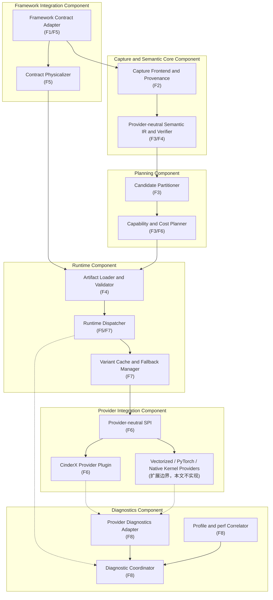

**层级与依赖**：Framework Integration 和 Capture/Semantic Core 产生独立输入；Planning 只形成候选分配，不生成后端 IR；Runtime 在 Worker 上完成合同绑定和 Variant 发布；Provider Integration 负责后端自有分析、Guard 与 codegen；Diagnostics 旁路消费各层证据。

**包含关系**：六个外层方框对应信息归属架构的六个组件。Vectorized、PyTorch、Native Kernel 只用于说明 SPI 扩展位置，不属于本文已实现功能。

### 功能域上下文视图

下图显示系统边界及聚合逻辑接口。接口名只出现在上下文视图与后续时序图中。

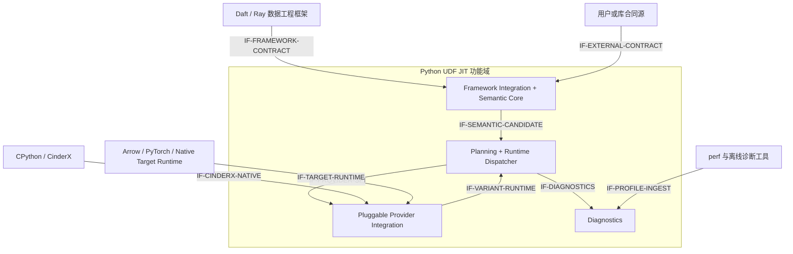

上下文接口遵循“来源方生产、消费方验真”的规则：框架合同由 Adapter/Physicalizer 产生，普通 callable 的代码事实由 CinderX 原生前端产生，外部 Semantic Region 由 Core 验证后仍需 Provider 二次验证，perf 只提供诊断样本而不参与正确性。

## 功能域总体方案

### 逻辑架构（承接架构设计 2.2 节）

本功能域不新增架构组件。结构图中的每个模块都来自两份上游架构，本设计只把标量主线和 CinderX Provider 展开为八个功能项。三条主链如下：

| 主链（架构设计 2.3） | 本功能域的端到端路径 |
| --- | --- |
| 候选与计划链 | F1 `FrameworkContract` + F2 callable/provenance + 可选 F3 `SemanticRegion` → Planner 查询 Provider `probe()` → F4 可移植语义/合同随计划下发 |
| Worker 数据执行链 | F4 Worker 重验 → F5 物理化 Framework Contract → F7 Dispatcher 公共 Guard → F6 CinderX 原生 callable 或 external Region 编译/执行 → 框架输出或 Python fallback |
| 反馈诊断链 | F8 低成本 Telemetry/Hint → 成本与退避；仅 `diagnostics=full` 时关联 Source→Semantic→Provider IR→Machine→perf，且不改变前两条链的正确性与选择结果 |

功能实现使用以下信息责任表，任何接口字段都必须归入其中一类：

| 信息对象 | 权威来源 | 消费方责任 | 执行期保障 | 可移植性 |
| --- | --- | --- | --- | --- |
| callable/bytecode/CFG/type/effect/call target | 普通 callable 路径由 CinderX 原生前端；external Region 由 Semantic Core | CinderX 重算、二次验证或保守拒绝 | CinderX Guard/Watcher/Deopt | callable 随框架原生机制；Provider IR 不可移植 |
| `FrameworkContract` | Framework Adapter/Physicalizer | Runtime 验证公共部分，Provider 验证自身布局能力 | Dispatcher Schema/Null/binding/Layout/Epoch Guard | 可移植逻辑合同；Bound Contract 不可移植 |
| `ExternalAssumption` | Framework/User Contract Source | Provider 或 Dispatcher 声明消费，并给出 coverage | `GuardCoverage` 指定 owner/mechanism/failure action | 可携带稳定 ID/来源/Epoch |
| `OptimizationHint` | Runtime Profile/Telemetry/UDF JIT 分析 | 只影响 probe、成本和退避；可忽略 | 无，不得补足 Guard | 可选，不进入语义 Hash |
| `ProviderCapability` | Provider Manifest + Target probe | Planner 保守比较 | 不等同于具体 Variant Guard | Worker/Target-local |
| `CompiledVariant`/Provider IR/机器码 | 对应 Provider | Runtime 只持 opaque handle 与统一元数据 | Provider Guard + Dispatcher Guard | 仅生成它的 Worker/ABI 内有效 |

### 部署视图（承接架构设计 9.7 节）

部署拓扑由一个 Head/Driver 与若干 Worker 构成；设计支持单物理主机多容器与真实物理多节点两种形态。Driver 不生成面向某一 Worker 的机器码；Worker 不信任 Driver 侧物理布局。可移植工件可小对象内联，也可通过 Ray ObjectRef 传递，但 Provider-local HIR/LIR/Torch Graph/LLVM IR、机器码、裸指针、业务值和进程本地描述符不得进入工件。

部署方案不依赖 Sidecar、中心注册表或远程控制面；各 Worker 在本进程内维护变体、负缓存、熔断和资源预算。

### 运行时主流程

1. 启动阶段通过 `.pth` 或显式 bootstrap 安装兼容性检查及 Daft 导入后 Hook。
2. UDF 表达式创建时登记 `source_callable` 与稳定身份；DataFrame 操作最终化时由 Framework Adapter 补齐 Schema、Null、字段绑定、Batch/Layout、所有权和任务 Epoch。
3. Driver 不执行用户函数。对普通 callable，Core 可只保留 provenance；对跨算子或无等价 bytecode 的候选，Core 才捕获并验证 Provider-neutral `SemanticRegion`。
4. Planner 调用 Provider `probe()` 获取保守 `SupportReport`，结合转换成本和运行 Hint 选择 CinderX 或原始 Python 路径。本功能设计不宣称其他 Provider 已实现。
5. Worker 重验可移植工件和 `FrameworkContract`，将 Layout/Epoch 物理化；Dispatcher 执行框架公共 Guard。
6. CinderX Provider 对普通 callable 运行自身 bytecode/CFG/类型/行为/调用目标分析；只有 external Region 走版本绑定的 Provider Plugin bridge，并由 CinderX 二次验证。
7. Provider 编译结果必须列出 consumed assumptions 及完整 `GuardCoverage`。Dispatcher 只有在公共和 Provider Guard 覆盖闭合后才原子发布 Variant。
8. 执行发生 Guard Miss、Deopt、编译拒绝或预算不足时，按 `FallbackContract` 回到原始 Python；提交点后只允许精确 Side Exit/Deopt 或显式失败。
9. 正常运行只输出有界计数和有限原因码；`diagnostics=full` 才额外生成跨层 Bundle、Provider Dump 与 perf 归因材料。

### 模式与策略

| 模式 | 行为 |
| --- | --- |
| `off` | 不进入捕获、编译或优化执行；保留原生 Daft/Ray 路径。 |
| `observe` | 执行兼容性、候选、捕获和可支持性判断并产生 Explain/遥测，但不执行 JIT 结果。 |
| `auto` | 仅在兼容、策略授权、预算允许、工件与守卫全部通过时执行优化区域，否则回退。 |

模式、策略哈希和发布授权在作业提交时冻结。设计优先级为紧急禁用、插件启用、显式模式、兼容性上限、策略上限；所有透明入口（启动引导、控制 Hook、执行包装）都必须经过统一模式解析器，不得直接读取 `UDFJIT_MODE` 绕过禁用、兼容性或 `rollout_authorized` 上限。

诊断策略与执行模式正交：

| `UDFJIT_DIAGNOSTICS` | 行为 |
| --- | --- |
| `off`（默认） | 不请求 Provider Dump，不创建 provenance bundle，不启动 perf；只保留生产必需的有界计数与原因码。 |
| `full` | 在不改变 Provider 选择、Guard、Fallback 和业务结果的前提下，采集各层中间产物、地址映射、阶段指标和 perf 样本。 |

`off/observe/auto` 的任一执行模式都可与 `diagnostics=off/full` 组合；诊断失败只能损失证据，不得改变执行结果。

## 功能域规格设计

### 支持范围

| 维度 | 本期规格 |
| --- | --- |
| 框架基线 | Daft 0.7.2、Ray 2.55、PyArrow 22、Lance 7；Daft 私有接缝必须通过签名与源码指纹校验。 |
| 支持的 Python 版本 | 每个 CPython 小版本须配备对应的字节码解码器、异常表与 SOABI 证据；不同小版本不得相互沿用假设。 |
| 数据类型 | `bool`、`int32`、`int64`、`float32`、`float64` 及可空形态；CinderX callable 路径另覆盖 exact `str` 的受支持子集。 |
| 语义能力 | 基础算术、比较、选择、分支，以及按类型与行为组合表达的通用循环、Unicode 属性分类、不可变查表、有限状态机、序列构造和解释器续接。 |
| 工件 | 正式格式 1.0，固定七个逻辑区段，严格校验。 |
| 执行后端 | 本文实现 CinderX Provider 与 CPython fallback；Provider-neutral SPI 同时为 Vectorized、PyTorch、Native Kernel 保留扩展合同。 |
| CinderX 输入 | 普通 callable 优先走 CinderX native frontend；verified external `SemanticRegion` 只用于跨算子或无等价 bytecode 的路径。 |
| 明确不支持/不承诺 | 本文不把 Vectorized/PyTorch/Native Kernel 描述为已实现，不承诺任意生成器/协程或反射语义；不安全子集回退。 |

### 功能分解与验证范围

| 功能项 | 主要实现组件 | 主要验证内容 |
| --- | --- | --- |
| 透明接入 | 启动引导、兼容性检查、Hook 控制、候选注册、计划载体、Worker 适配 | 兼容性、安装幂等、框架集成与故障开放 |
| 动态图捕获 | 字节码解码、CFG、抽象解释、身份、源码映射、捕获验证与缓存 | 解码、异常边、抽象状态、预算和负例 |
| 语义 IR 编译 | Core IR、分析管理、Pass 管理、区域形成、验证器和参考执行 | IR 验证、分析失效、区域边界与语义差分 |
| 可移植工件 | 工件模型、确定性编解码、清单、区段、装载与准入 | 格式、摘要、尺寸、依赖、ABI 与跨进程装载负例 |
| 框架合同与标量物理化 | Framework Contract、布局/所有权/Epoch 绑定、Dispatcher 公共 Guard | Schema/Null/binding/layout、五类标量、exact str 调用合同、所有权与 Epoch 失效 |
| CinderX Provider | 中立 SPI、callable-first 原生前端、可选 external Region bridge、Guard/Deopt 和代码资源 | Capability、二次验证、通用循环/类型特化、HIR/LIR、失败负缓存、强制编译与 fallback |
| 合同守卫与变体执行 | GuardCoverage 发布门禁、变体管理、编译池、负缓存、熔断、预算和解释器续接 | 覆盖完整性、Singleflight、预算、超时、淘汰、提交边界与 Side Exit |
| 运行时治理与诊断 | 模式/诊断正交开关、策略、遥测、Explain、Bundle、ProviderDiagnostics 和 perf 关联 | 正常/诊断隔离、策略冻结、无值遥测、跨层可定位性与诊断故障旁路 |

### 跨功能设计不变量

| 编号 | 不变量 |
| --- | --- |
| INV-001 | Driver 捕获不得执行用户函数，不得读取或固化业务数据值。 |
| INV-002 | Worker 必须重新验证工件与本地 ABI/能力，Driver 结论不能替代 Worker 校验。 |
| INV-003 | 可移植工件不得携带裸指针、机器码、CinderX HIR/LIR、Torch Graph、LLVM IR、业务值或进程本地资源句柄。 |
| INV-004 | 未知调用、未知副作用、异常顺序不明或证据不足时，默认进入 Python 区域或回退。 |
| INV-005 | 提交点后不得整函数重放；只能从精确状态 Side Exit/Deopt 或显式失败。 |
| INV-006 | 机器码缓存仅限 Worker 进程，键必须绑定 Provider ID/版本、Target ABI、callable/semantic identity、Framework Contract Hash、External Assumption Epoch、进程代、作业、租户与冻结策略。 |
| INV-007 | 遥测与 Explain 不记录业务值、源码正文、参数内容、凭据或可逆的数据载荷。 |
| INV-008 | `observe` 不得执行 JIT 结果；`off` 不得进入优化路径。 |
| INV-009 | `Semantic Facts`、`Framework Contract`、`External Assumption` 与 `Optimization Hint` 必须分层保存；Hint 不得补足正确性证据。 |
| INV-010 | Assumption 不是可执行 Guard；Variant 发布前，Dispatcher 与 Provider 必须联合给出完整 `GuardCoverage`。 |
| INV-011 | 普通 callable 的 bytecode/CFG、类型、调用目标、行为分类和代码 Guard 由 CinderX 自行分析；UDF JIT 同类信息最多是可验证 Hint。 |
| INV-012 | Provider-local IR、机器码和可执行句柄不得进入 Core Schema 或可移植语义 Hash。 |
| INV-013 | `diagnostics=off` 为默认值，不创建 Dump、Bundle 或采样进程；开启诊断不得改变准入、Guard、Fallback 和业务结果。 |

### 功能域级分配需求

| 需求编号 | 分配对象 | 需求 |
| --- | --- | --- |
| FD-SR-001 | Driver | 只在兼容性与治理许可范围内捕获候选 UDF，且不得执行用户函数。 |
| FD-SR-002 | Semantic Core | 为需要跨算子或无原生前端的候选生成可验证、Provider-neutral 的可选 Semantic Region，并保留异常、副作用和源码映射。 |
| FD-SR-003 | Protocol | 生成可移植、可散列、有限尺寸、无进程私有状态的正式工件。 |
| FD-SR-004 | Framework/Worker | 重新验证工件与 Framework Contract，并将 Schema、Null、binding、Layout、所有权和 Epoch 绑定到本地执行合同。 |
| FD-SR-005 | Provider | 通过中立 SPI 接入；CinderX 对 callable 自分析，对 external Region 二次验证，并拥有自身 Guard/Watcher/Deopt/codegen。 |
| FD-SR-006 | Runtime | 通过 GuardCoverage 门禁、变体键、预算、单飞、熔断、提交边界和精确续接控制执行。 |
| FD-SR-007 | Governance | 冻结模式与策略，隔离作业/租户，输出无值遥测和有限原因码。 |
| FD-SR-008 | Diagnostics | 以独立 `off/full` 开关控制跨层证据链；默认零 Dump/采样，诊断失败不影响业务执行。 |

## 功能项一：透明接入

### 功能概述

#### 功能项总述

**面向谁、解决什么问题**：面向使用 Daft 标准 API（`where`/`select`/`with_columns`）的普通用户。要解决的问题是“如何在不改任何代码的前提下，把 UDF 纳入 JIT 候选”。

**核心能力**：透明接入层在不修改 Daft/Ray 源码和用户 UDF 调用方式的前提下，将符合条件的 UDF 表达式登记为优化候选，并在 DataFrame 操作最终化时产生 `FrameworkContract`：Schema、Null、字段到参数绑定、Batch/Layout、设备/所有权要求和任务 Epoch。

**输入输出**：输入是用户的 UDF 表达式与框架可见上下文；输出是 Worker 可解析的候选身份、`FrameworkContract` 和可选工件句柄，或在不兼容时退回的原生表达式。`source_callable` 只以 Worker-local 引用进入 CompileRequest，不被序列化为可移植后端计划。

**约束**：接入层是可撤销的适配器，不拥有语义优化决策；兼容性不确定、Hook 失败或治理不允许时必须保持原生执行路径。

**收益与风险**：收益是零代码改动即可接入；主要风险是私有 API 漂移导致 Hook 错位，缓解手段是版本/签名/源码指纹三重校验。

### 实现思路

1. 通过 `.pth` 安装文件或显式调用启动函数，注册 Daft 导入后的安装 Hook。
2. 使用精确版本、函数签名、私有接缝和源码指纹校验 Daft 0.7.2。
3. 包装 `Func.__call__`，在构造 UDF 表达式时以弱引用或有界条目登记候选。
4. 包装 `DataFrame.where`、`select`、`with_columns`，在操作最终化时提取并版本化 `FrameworkContract`，明确每项信息的来源、稳定 ID 和失效 Epoch。
5. 小型工件内联进入表达式载体，大型工件使用 Ray ObjectRef；载体只携带工件标识和必要元数据。
6. 在任何语义提交前发生的异常均故障开放到原始对象和原始调用。

### 实现设计

#### 透明接入功能实现设计

对应架构设计的 **Framework Control Adapter / Framework Worker Adapter** 模块。

`bootstrap_from_environment()` 负责读取启动配置并发起安装；`install_post_import_hook()` 处理 Daft 尚未导入的时序；`validate_daft_compatibility()` 产生兼容或拒绝原因；`install_daft_control_hooks()` 在锁保护下幂等替换目标方法。原方法引用保存在进程内安装状态中，用于重复安装检查和撤销。

`CandidateRegistry` 以 Driver 本地、弱引用优先、有界生命周期的方式关联表达式、callable identity 与候选信息。候选登记不得包含业务参数值。`FrameworkContractBuilder` 从框架元数据构造 Schema/Null/binding/Batch/Layout/Ownership/Epoch 合同，不生成 CinderX 分类、HIR 计划或 Provider Guard。`ProductionCarrierState` 负责工件载体选择；`FallbackOnlyWrapper` 和 `WorkerScalarAdapter` 保证 Worker 无工件、工件非法或能力不足时仍可调用原始 UDF。

兼容性判断属于执行上限而非建议：版本、签名或源码指纹不匹配时，`auto` 也不得穿透到 JIT。该上限必须对所有透明入口统一接线，由统一模式解析器强制执行。

下图为透明接入 Driver 侧的时序图。参与者（生命线）即架构图中的模块，自左向右排列；消息自上而下表示时间顺序。任一步失败或兼容性不足，都故障开放回原生执行。

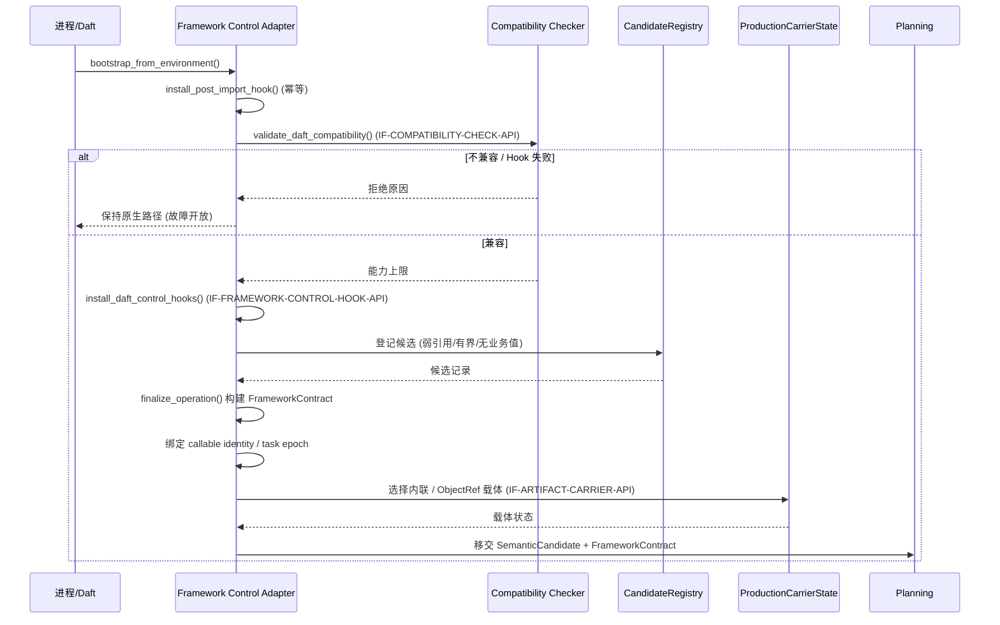

下图为 Worker 侧接入时序图。无工件、工件非法或能力不足时，`FallbackOnlyWrapper`/`WorkerScalarAdapter` 仍调用原始 UDF。

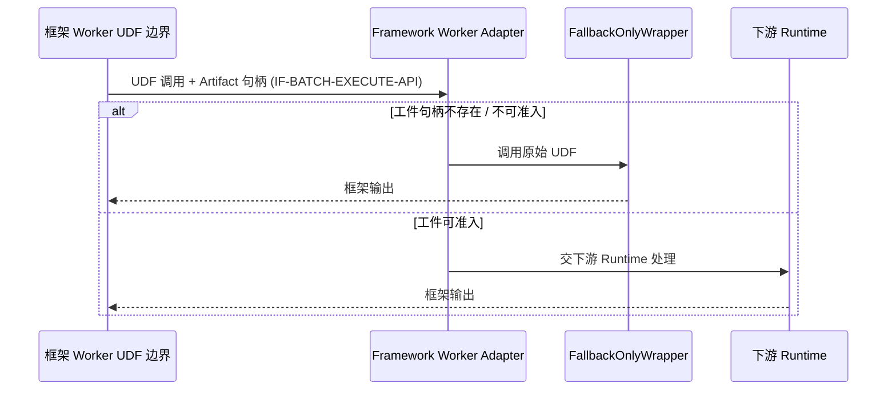

### 增量SR清单

| 需求编号 | 增量需求 |
| --- | --- |
| TI-SR-001 | 用户代码不得因启用插件而修改 UDF 定义、DataFrame API 或 Ray 部署方式。 |
| TI-SR-002 | Hook 安装必须线程安全、幂等、可检测重复包装并可撤销。 |
| TI-SR-003 | 私有接缝必须经过版本、签名和源码指纹联合校验。 |
| TI-SR-004 | 候选登记必须 Driver 本地、有界、无业务值，并能随对象回收。 |
| TI-SR-005 | 任一预提交接入失败必须返回原始对象或调用原始方法。 |
| TI-SR-006 | 工件载体必须同时支持小对象内联与大型对象引用，且不携带进程私有资源。 |
| TI-SR-007 | Framework Adapter 必须为 Schema、Null、binding、Layout、Ownership 和任务 Epoch 提供稳定来源、版本及失效条件。 |
| TI-SR-008 | 接入层不得产生 CinderX 行为分类、Provider Guard 或 Provider-local 编译计划。 |

### 实现接口设计

#### 实现接口设计

对接信息归属架构的 `IF-FRAMEWORK-CONTRACT-API`、`IF-SEMANTIC-CANDIDATE-API` 和 `IF-VARIANT-DISPATCH-API`，并兼容总体架构既有的 Hook/载体接口。接入层向 Planning/Runtime 分别传递 callable identity、`FrameworkContract` 和可选语义工件；同类 Provider 分析结论不得混入合同。接口调用必须可重复，且不得让 Explain、遥测或编译异常改变原始 Daft 返回值。

#### 实现接口定义

| 接口（对应架构逻辑接口） | 输入 | 输出 | 失败行为 |
| --- | --- | --- | --- |
| `bootstrap_from_environment()` | 进程环境与安装策略 | 安装/未安装状态及原因 | 记录有限原因码，保持原生路径 |
| `validate_daft_compatibility()` → `IF-COMPATIBILITY-CHECK-API` 输入 | Daft 模块及目标接缝 | 兼容性报告、能力上限 | 不兼容即拒绝安装优化 Hook |
| `install_daft_control_hooks()` → `IF-FRAMEWORK-CONTROL-HOOK-API` | 已校验模块、注册表、控制上下文 | 幂等安装句柄 | 撤回局部替换并恢复原方法 |
| `CandidateRegistry.register()/bind_expression()/finalize_operation()` | 函数、表达式、代码身份和无值操作上下文 | 候选记录及最终化结果 | 未命中按非候选处理 |
| `FrameworkContractBuilder.build()` → `IF-FRAMEWORK-CONTRACT-API` | Schema、Null、字段绑定、Batch/Layout、Ownership、Epoch | 版本化 `FrameworkContract` | 信息不完整则收紧能力或回退 |
| `ProductionCarrierState.placeholder()/finalize()` → `IF-ARTIFACT-CARRIER-API` | 候选身份、工件字节与大小策略 | 最终化载体状态 | 载体失败则使用原表达式 |

### 功能规格设计

| 场景 | 预期行为 |
| --- | --- |
| Daft 未导入 | 安装导入后 Hook，不主动导入或改变用户导入顺序。 |
| Daft 已导入且完全兼容 | 幂等安装控制 Hook。 |
| 版本/签名/指纹不匹配 | 禁止优化，输出兼容性原因，原生执行。 |
| 同一进程重复 bootstrap | 不重复包裹、不泄漏原方法引用。 |
| 候选对象被回收 | 注册表条目随之失效或按上限淘汰。 |
| 工件过大 | 使用 Ray ObjectRef，不将大字节串复制到每个计划节点。 |
| 框架 Schema/Layout/Epoch 变化 | 合同 Hash/Epoch 改变，旧 Bound Contract 与 Variant 失效。 |
| Provider 请求框架不可恢复的信息 | 由 `FrameworkContract` 显式提供；没有来源或失效机制时拒绝该优化。 |

### DFX分析

#### 可靠性分析

安装锁、安装状态机、原方法保留和局部失败回滚共同保证 Hook 的原子性。所有包装器先保存原始调用目标，编译与观测逻辑置于故障开放边界内。

##### FMEA分析

| 失效模式 | 影响 | 检测 | 缓解 |
| --- | --- | --- | --- |
| Daft 私有 API 漂移 | Hook 错位或行为改变 | 版本/签名/源码指纹 | 拒绝安装并使用原生路径 |
| 重复包装 | 重复编译、递归或额外开销 | 安装标记与原方法身份检查 | 锁内幂等安装 |
| 注册表泄漏 | Driver 内存增长 | 条目计数与上限遥测 | 弱引用、容量/TTL 淘汰 |
| 载体创建失败 | 候选无法下发 | 有限失败原因码 | 返回原表达式 |

#### 可服务性分析

Explain 应显示兼容性结果、Hook 状态、候选是否登记、载体类型和故障开放原因。日志不得输出 UDF 参数或数据内容。安装与撤销结果应可通过诊断 CLI 查询。

#### 安全设计检查

##### 安全设计确认

接入层不从网络下载代码，不修改 Daft/Ray 包文件，不执行候选 UDF，不把源码正文或闭包值写入遥测。所有反射只用于已知模块和目标接缝校验。

##### 敏感操作检查

涉及进程内方法替换与 `.pth` 启动入口，属于高影响操作；必须限定目标模块、验证指纹、保存原方法并支持撤销。不涉及凭据读取、远程命令或持久化业务数据。

#### 可用性/性能分析

禁用或不兼容时可用性应与未安装插件一致。Hook 热路径只做有界元数据查询；捕获与编译不得在 `off` 模式发生。候选登记和载体选择的开销需要在正式 A/B 中单独归因。

### 影响点列表

| 影响对象 | 影响 |
| --- | --- |
| Daft Driver API | 进程内包装四类私有/半私有调用接缝，不修改安装包。 |
| Ray 计划传输 | 增加可选工件句柄或 ObjectRef。 |
| 用户代码 | API 和 UDF 定义保持不变；新增环境变量和诊断入口。 |
| 测试 | 需覆盖导入前后、重复安装、版本漂移、局部失败和撤销。 |

### 分配需求

- 接入模块实现 TI-SR-001～TI-SR-008。
- 治理模块向接入层提供唯一的有效模式与策略解析结果。
- 协议模块提供无进程状态的工件句柄。
- 功能测试必须证明 `off` 不安装执行型路径、`observe` 不执行 JIT 结果。

## 功能项二：动态图捕获

### 功能概述

#### 功能项总述

**解决什么问题**：在确有跨算子分析、无原生前端后端或跨进程语义表达需要时，把 Python UDF 变成结构化、可验证的语义候选；同时保留普通 callable 直接进入 CinderX 原生前端的路径。

**核心能力**：动态图捕获可将 CPython 函数代码对象转换为带控制流、异常边、源码映射、代码身份和依赖身份的 `CaptureIR`，并输出 Provider-neutral `Semantic Facts` 与 provenance。该结果是可验证候选，不是 CinderX Guard，也不替代 CinderX 对 callable 的原生分析。

**约束**：捕获在 Driver 侧静态进行，**不通过样例数据执行用户函数**；无法安全建模的指令、调用或效果形成 Python Region/Graph Break，而不是被乐观内联。

**收益与风险**：收益是为编译提供可信输入；风险是字节码版本误判导致错误语义，缓解手段是按 CPython 小版本绑定解码器。

### 实现思路

1. 按 CPython 小版本选择字节码解码器，并验证指令边界、跳转目标、缓存指令、异常表和位置表。
2. 构建包含普通边与异常边的 CFG，验证栈深与合流一致性。
3. 使用抽象解释器传播类型形状、常量资格、栈/局部状态、别名和效果摘要，但不读取业务对象内容。
4. 为可建模调用应用白名单调用模型；未知调用标记为不透明、可能抛异常且可能有副作用。
5. 在安全边界形成 Graph Break，记录 Live-in、Live-out、Resume Identity 和源码位置。
6. 以代码身份、依赖身份、Python 版本与捕获策略构造有界缓存键；把事实、外部 Assumption 与性能 Hint 分开存储。
7. 对生成器只捕获非逃逸、无 `send/throw/close` 可观察语义且能闭合验证的通用循环子集；其余生成器形成 Graph Break 或拒绝，绝不依据业务函数名放行。

### 实现设计

#### 动态图捕获功能实现设计

对应 **Capture Frontend / Provenance** 模块，对外逻辑接口 `IF-SEMANTIC-CANDIDATE-API`，内部沿用 `IF-CAPTURE-REQUEST-API`。

`decode_code()` 将 CPython 3.14 代码对象转换为版本化指令序列；`build_control_flow_graph()` 生成基本块、普通边和异常处理边；`analyze_function()` 对操作数栈、局部变量和控制流合流进行抽象解释；`capture_identities()` 为代码、闭包结构和依赖建立稳定身份；`verify_captured_program()` 验证 CFG、状态、Graph Break 和源码映射的内部一致性。

`CaptureRequest` 只包含代码对象、无值上下文、目标 Python 版本、冻结策略和信息分类标签。捕获缓存是 Driver 进程本地、有界、按身份失效的辅助结构，缓存命中不能跳过验证。协程、动态 `eval/exec`、不可验证反射和未知 C 扩展调用默认留在 Python 区域；生成器只有满足通用的非逃逸/状态不可观察约束时才可形成候选。

普通 CinderX callable 路径允许只产生 `CallableCandidate`（稳定 callable identity + provenance），不要求先生成 CaptureIR。只有 Planner 需要 external Semantic Region，或目标 Provider Manifest 声明只支持 `semantic_region` 时，才把捕获结果提升为可执行语义输入。

下图为动态图捕获时序图。参与者为 Framework Control Adapter（调用方）与 Capture Frontend 的分层子步骤（自调用）；每层只接收上层已验证结构，任一层超预算或不通过验证都停止捕获并回退。

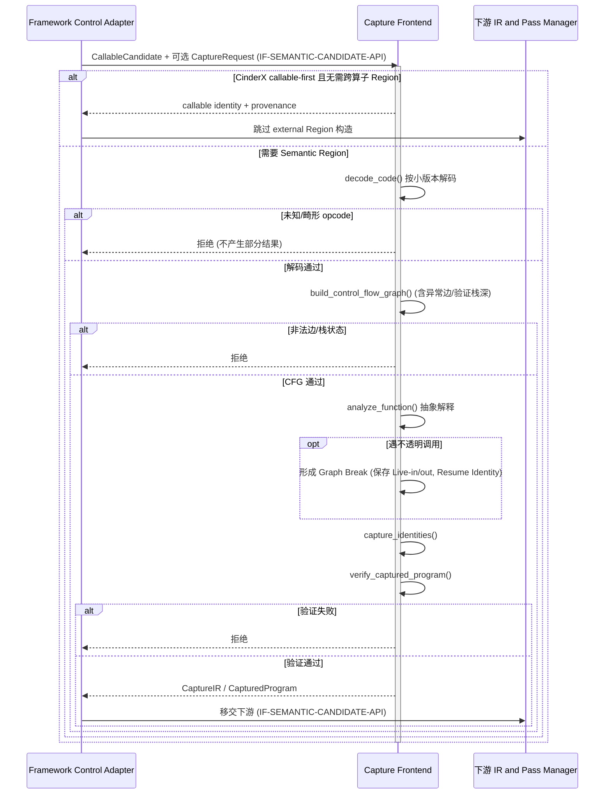

### 增量SR清单

| 需求编号 | 增量需求 |
| --- | --- |
| GC-SR-001 | 解码器必须绑定 CPython 小版本并拒绝未知 opcode 或结构异常。 |
| GC-SR-002 | CFG 必须包含异常边，且验证栈高、块边界和合流状态。 |
| GC-SR-003 | Driver 捕获不得调用用户函数或读取业务对象值。 |
| GC-SR-004 | 未知调用必须保守标记 `may_raise` 与 `side_effect`，不得跨越重排。 |
| GC-SR-005 | Graph Break 必须保存精确 Live-in、Live-out、异常上下文和 Resume Identity。 |
| GC-SR-006 | 捕获缓存必须有界并绑定代码、依赖、版本和策略身份。 |
| GC-SR-007 | 捕获输出必须区分 Semantic Fact、External Assumption 和 Optimization Hint，不得把任一项直接编码为可执行 Guard。 |
| GC-SR-008 | CinderX 普通 callable 路径不得被强制绕过其原生前端；CaptureIR 仅作为可选输入或 Hint。 |
| GC-SR-009 | 生成器准入必须依据非逃逸、状态可观察性、Effect 和异常合同等通用规则，不能依据 UDF 名称或业务算子分类。 |

### 实现接口设计

#### 实现接口设计

对接信息归属架构 `IF-SEMANTIC-CANDIDATE-API`，同时保留总体架构内部 `IF-CAPTURE-REQUEST-API`。捕获接口面向 Framework Adapter 接收 `CallableCandidate` 与可选 `CaptureRequest`，面向 Planning 返回 callable-only 候选、已验证捕获程序或有限拒绝原因。校验接口必须可独立运行，便于工件构建前和 Provider 二次复核。

#### 实现接口定义

| 接口（对应 `IF-CAPTURE-REQUEST-API`） | 输入 | 输出 | 失败行为 |
| --- | --- | --- | --- |
| `capture(request)` / `capture_program_request(request)` | 含冻结上下文的 `CaptureRequest` | `CaptureIR` / `CapturedProgram` | 不产生部分可执行结果 |
| `decode_code(code)` | 当前精确 Python 版本的代码对象 | 规范化指令和表信息 | 未知/畸形输入拒绝 |
| `build_control_flow_graph(decoded)` | 已解码指令、异常表 | CFG | 非法边或栈状态拒绝 |
| `analyze_function(cfg, models)` | CFG、受控调用模型 | 抽象状态和效果摘要 | 超预算或不确定处形成 Break |
| `verify_captured_program(program)` | 捕获程序 | 验证通过或异常 | 失败则整个捕获不可进入后续编译 |
| `classify_capture_information(program)` | 捕获程序、来源与失效元数据 | Facts/Assumptions/Hints 分层结果 | 分类不完整时只保留 callable/fallback |

### 功能规格设计

| 场景 | 预期行为 |
| --- | --- |
| 基础算术/比较/条件分支 | 形成结构化 CaptureIR 和源码映射。 |
| `try/except/finally` | 保留异常边与处理顺序；无法证明时形成 Python Region。 |
| 未知 Python/C 调用 | 标记不透明、可能异常/副作用，不跨调用形成优化区域。 |
| 非逃逸、无外部状态操作的生成器循环 | 验证 Effect/异常/状态合同后形成通用循环候选；不满足则 Graph Break 或回退。 |
| 协程或可观察生成器状态 | 拒绝 external Region，保留原生 Python/CinderX 自主处理路径。 |
| Python 3.11 代码 | 未安装独立 3.11 解码器并验证前拒绝沿用 3.14 路径。 |
| 超过指令/块/状态预算 | 以有限原因码停止捕获，不阻塞原生执行。 |

### DFX分析

#### 可靠性分析

解码、CFG、抽象解释和最终验证分层执行；每一层只接收上层已验证结构。所有循环与状态集合均有预算，避免恶意或极端字节码造成 Driver 不可用。

##### FMEA分析

| 失效模式 | 影响 | 检测 | 缓解 |
| --- | --- | --- | --- |
| Python 字节码版本误判 | 错误语义或崩溃 | `sys.version_info`、opcode/表版本检查 | 精确版本解码器，未知版本拒绝 |
| 异常边遗漏 | 异常顺序改变 | CFG 验证与异常用例 | 未通过验证不得编译 |
| 抽象状态爆炸 | Driver CPU/内存耗尽 | 指令、块、状态和迭代预算 | 停止捕获并回退 |
| 未知调用被误判为纯 | 副作用重排 | 调用模型白名单和效果验证 | 默认不透明且设置副作用屏障 |

#### 可服务性分析

Explain 应提供代码身份、Python 解码器版本、基本块数、Graph Break 位置、拒绝原因和预算命中项，但不展示源码正文、参数或闭包业务值。源码位置仅使用文件/行列标识并受日志策略约束。

#### 安全设计检查

##### 安全设计确认

捕获不执行用户代码，不做任意属性求值，不反序列化外部可执行对象。代码与依赖身份使用摘要或结构标识，不把闭包内容写入工件或遥测。

##### 敏感操作检查

不涉及网络、文件写入或凭据操作。对代码对象、异常表和位置表的反射读取属于受控进程内检查，必须遵守尺寸预算。

#### 可用性/性能分析

捕获失败不影响原生 UDF 可用性。缓存可减少重复分析，但命中必须绑定所有语义相关身份。捕获开销计入 Driver 提交延迟，不得隐藏在 Worker 执行收益中。

### 影响点列表

| 影响对象 | 影响 |
| --- | --- |
| CPython 版本 | 每个目标小版本需要独立解码与异常表验证。 |
| 编译流水线 | 提供唯一的 CaptureIR、效果与源码映射输入。 |
| Explain | 新增捕获阶段状态、Graph Break 和拒绝原因。 |
| 测试语料 | 需覆盖分支、循环、异常、闭包、未知调用、畸形表和预算。 |

### 分配需求

- 字节码子系统实现 GC-SR-001～GC-SR-002。
- 抽象解释与调用模型实现 GC-SR-003～GC-SR-005、GC-SR-009。
- 缓存与治理模块共同实现 GC-SR-006～GC-SR-008。
- 每个 CPython 小版本必须包含独立解码器的正负例矩阵，不得跨版本沿用。

## 功能项三：语义 IR 编译

### 功能概述

#### 功能项总述

**解决什么问题**：为跨算子融合或没有成熟 Python 前端的 Provider 提供一个与具体后端无关、可验证、可差分测试和可跨进程分发的语义层；它不是所有 Provider 的强制前端。

**核心能力**：将捕获结果转换为封闭、可验证、与具体执行 Provider 无关的 Semantic Core IR，并完成类型、空值、效果、异常、活跃性、别名与确定性分析。编译器只将不跨越副作用和异常屏障的语句组成可优化区域，其余部分保留为 Python Region。

**约束**：IR 只按“行为模式 × 数据类型”表达通用语义，例如循环/分支/计算/状态转移与 exact-str/数值/序列；不得出现 punctuation、whitespace、FineWeb、AD 或 CinderX HIR opcode 等业务/后端命名。

### 实现思路

1. 将堆栈式 CaptureIR 规范化为显式值、块参数和控制边的 Core IR。
2. 对每个值赋予类型与可空属性，对每个操作赋予异常、效果与确定性属性。
3. 使用 `AnalysisManager` 管理分析结果，并由 Pass 声明保留或失效集合。
4. 先按类型、控制流、效果屏障、异常顺序和活跃值形成合法语义区域，再通过 Planner 的 `probe()` 查询 Provider 能力；Core 不写死某个 Provider 的准入规则。
5. 在每个关键阶段运行 Verifier；最终模块可由参考解释器执行，用于差分测试。
6. 对 exact `str` 提供通用 Unicode 属性查询、不可变查表、有限状态机、序列构造和受控 builder 语义；对可变容器、未知对象或无法闭合异常/别名语义的操作保留 Python Region。

### 实现设计

#### 语义 IR 编译功能实现设计

对应 **Provider-neutral Semantic IR / Candidate Partitioner / Capability and Cost Planner** 模块，对外逻辑接口 `IF-SEMANTIC-CANDIDATE-API`、`IF-PROVIDER-CAPABILITY-API`，内部沿用 `IF-IR-PIPELINE-API`、`IF-PARTITION-API`。

`SemanticCoreModule` 表达函数、基本块、显式值、操作和终结指令。通用操作族包括控制流、循环迭代、数值计算、Unicode 属性、不可变映射查询、FSM 状态转移和序列 builder；具体业务算子只由这些操作组合表达。`AnalysisManager` 计算并缓存类型、空值、效果、异常、活跃性、别名和确定性信息；`PassManager` 按冻结序列执行规范化、简化和区域准备 Pass，并在变换后失效不再成立的分析。

`compile_semantic()` 负责端到端管线；`form_semantic_region_graph()` 只依据语义合法性和屏障划分候选区域与 Python Region，不选择 Provider；`verify_semantic_module()` 检查 SSA、支配、类型、终结边、异常和效果约束；`reference_execute_semantic()` 为测试提供不依赖 CinderX 的语义基准。Planning 随后把 verified Region 交给每个 Provider `probe()`，Provider 仍需按自身 ABI 和语义二次验证。

下图为语义 IR 编译时序图。Capture Frontend 调用 IR and Pass Manager 与 Candidate Partitioner；Verifier 是强制门禁，未通过的模块不得进入协议层。

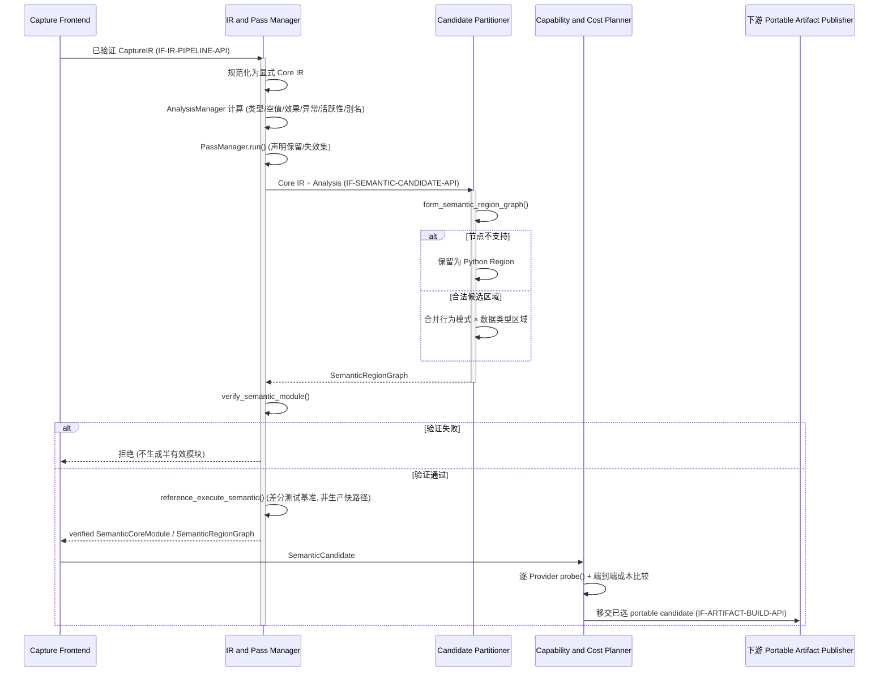

### 增量SR清单

| 需求编号 | 增量需求 |
| --- | --- |
| SI-SR-001 | Core IR 必须显式表示控制流、异常、空值和副作用。 |
| SI-SR-002 | 每次变换后必须按 Pass 声明正确保留或失效分析结果。 |
| SI-SR-003 | 优化不得跨越未知效果、异常顺序或别名屏障。 |
| SI-SR-004 | 区域形成必须与 Provider 解耦，仅依据语义能力合同。 |
| SI-SR-005 | 最终模块必须通过结构、SSA、类型、效果和区域验证。 |
| SI-SR-006 | 必须提供参考执行路径用于语义差分测试。 |
| SI-SR-007 | Core IR 必须按行为模式与数据类型表达通用语义，不得含业务 pipeline/UDF 名称或 Provider-local opcode。 |
| SI-SR-008 | Semantic Facts、External Assumptions 与 Optimization Hints 必须分层；Hint 不得进入语义 Hash 或正确性判定。 |
| SI-SR-009 | Provider 选择必须发生在合法区域形成之后，并通过中立 `probe()` 完成；每个 Provider 必须二次验证输入。 |

### 实现接口设计

#### 实现接口设计

对接 `IF-SEMANTIC-CANDIDATE-API` 与 `IF-PROVIDER-CAPABILITY-API`，内部沿用 `IF-IR-PIPELINE-API`、`IF-PARTITION-API`。编译接口接收已验证 CaptureIR 和冻结策略，返回可选语义模块、区域图、分类后的事实/Assumption/Hint 或明确拒绝原因。Provider 只能读取封闭语义合同，不得依赖捕获器内部对象；普通 CinderX callable 可绕过该语义输入。

#### 实现接口定义

| 接口（对应 `IF-IR-PIPELINE-API` / `IF-PARTITION-API`） | 输入 | 输出 | 失败行为 |
| --- | --- | --- | --- |
| `compile_semantic(capture_module, policy)` | 已验证捕获模块、冻结策略 | `SemanticCompileResult` | 返回拒绝原因，不生成半有效模块 |
| `PassManager.run(module)` | Core IR、Pass 序列 | 变换后模块与分析状态 | 任一验证失败则终止 |
| `form_semantic_region_graph(module)` | 语义模块、效果/异常/类型分析 | Provider-neutral 候选区域图 | 非法节点留在 Python Region |
| `probe_provider(candidate, contract, target)` → `IF-PROVIDER-CAPABILITY-API` | callable 或 verified Region、合同、目标 | `SupportReport` | Provider 保守拒绝，不修改候选 |
| `verify_semantic_module(module)` | Core IR | 验证报告 | 失败模块不得编码进工件 |
| `reference_execute_semantic(module, inputs)` | 测试输入 | 参考结果/异常 | 仅测试与诊断使用，不进入生产快路径 |

### 功能规格设计

| 场景 | 预期行为 |
| --- | --- |
| 五类标量算术和比较 | 生成带精确类型/可空属性的 Core IR。 |
| 条件分支与合流 | 使用显式块参数/值合流，验证支配关系。 |
| 可能抛异常的操作 | 保留异常属性和相对顺序，不跨屏障移动。 |
| 未知副作用调用 | 独立 Python Region，前后活跃值显式连接。 |
| exact-str Unicode 分类/不可变查表/FSM/builder | 由通用行为与类型操作组合表达；Provider 可声明支持子集。 |
| 可变列表/元组复杂语义 | 无法证明别名、异常或生命周期时留在 Python Region。 |
| Pass 变换后分析陈旧 | 失效并重新计算，不复用旧结论。 |

### DFX分析

#### 可靠性分析

IR 构造、分析、变换、区域形成和最终验证均有清晰阶段边界。Verifier 作为强制门禁，禁止结构不完整或分析不一致的模块进入协议层。

##### FMEA分析

| 失效模式 | 影响 | 检测 | 缓解 |
| --- | --- | --- | --- |
| SSA/支配关系错误 | 读取错误值 | Verifier、差分测试 | 拒绝模块并回退 |
| 分析结果未失效 | 错误优化 | Pass 保留集审计 | 默认全失效，显式声明保留 |
| 异常/效果被重排 | Python 语义变化 | 效果与异常验证 | 屏障阻止区域合并和移动 |
| 区域边界活跃值遗漏 | Side Exit 状态不完整 | 活跃性与区域图验证 | 不完整区域降级为 Python |

#### 可服务性分析

Explain 输出 Pass 列表、IR 摘要、分析状态、区域数量、拒绝操作及有限原因码。详细 IR Dump 仅在受控诊断环境开启，并应脱敏且不默认写入生产日志。

#### 安全设计检查

##### 安全设计确认

编译器只处理内部结构，不执行外部调用，不加载网络资源。常量仅允许策略认可的无敏感、可序列化字面量；业务输入值不得常量折叠进工件。

##### 敏感操作检查

不涉及外部敏感操作。诊断 IR Dump 可能暴露文件名、符号名或无值控制结构，必须受显式诊断开关和访问权限控制。

#### 可用性/性能分析

编译失败回退解释执行。Pass 数量、模块规模、分析迭代和区域数量均需预算。编译收益必须扣除 Driver 编译延迟和 Worker 重编译成本后评估。

### 影响点列表

| 影响对象 | 影响 |
| --- | --- |
| 捕获层 | 必须提供完整效果、异常和源码映射。 |
| 工件协议 | 承载 Semantic Core IR、区域图和验证摘要。 |
| Provider | 只依赖稳定的语义操作与区域合同。 |
| 测试 | 增加参考执行、Pass 失效、Verifier 负例和区域边界差分测试。 |

### 分配需求

- Core IR 与 Verifier 实现 SI-SR-001、SI-SR-005。
- 分析与 Pass 管理实现 SI-SR-002～SI-SR-003。
- 区域形成与 Planner 实现 SI-SR-004、SI-SR-007～SI-SR-009。
- 参考解释器与测试框架实现 SI-SR-006。

## 功能项四：可移植工件

### 功能概述

#### 功能项总述

**解决什么问题**：让 Driver 编译出的语义结果能跨进程、跨网络传到 Worker，且 Worker 不需要信任 Driver。

**核心能力**：把 Driver 侧已验证语义结果封装为 Worker 可独立重验的正式格式 1.0。工件描述“做什么”和“需要什么”，不包含“在某个进程里如何执行”的裸指针、机器码或物理资源，因此可通过 Daft/Ray 计划在进程间传递。

### 实现思路

1. 使用固定封套和七个逻辑区段：`manifest`、`target`、`physical_layout`、`semantic_core_ir`、`semantic_region_graph`、`guard`、`fallback`；其中 `guard` 只保存 portable Assumption/公共 Guard 模板，不保存 Provider 可执行 Guard。
2. 采用确定性编码，绑定格式版本、字段顺序、区段摘要、总摘要和尺寸上限。
3. Driver 在构建前验证 IR、布局合同、后备路径和依赖身份。
4. Worker 解码时重新检查封套、版本、未知字段、重复字段、尺寸、摘要、依赖、Python/SOABI、CPU/Provider 能力和内部 IR。
5. 小工件内联，大工件通过 Ray ObjectRef；二者使用相同逻辑字节与摘要。
6. 对确定性非法工件写入短期负缓存，避免每次调用重复解析。

### 实现设计

#### 可移植工件功能实现设计

对应架构设计的 **Portable Artifact Publisher**（Driver 侧）与 **Artifact Loader and Validator**（Worker 侧）模块，逻辑接口 `IF-ARTIFACT-BUILD-API`、`IF-ARTIFACT-CONTRACT`、`IF-ARTIFACT-LOAD-API`。

`PortableUdfArtifact` 是内存模型；`build_artifact()` 从可选语义模块、Framework Contract 摘要、目标要求、portable Assumption/公共 Guard 模板和后备信息构建封闭对象；`encode_artifact()` 产生确定性字节；`decode_artifact()` 先做封套/尺寸检查，再逐区段解码；`ArtifactLoader` 在 Worker 上完成依赖、ABI、IR 与合同复核；`admit_driver_worker()` 汇总 Driver/Worker 兼容结论。

格式 1.0 是首个正式格式，本期不承诺早期实验格式兼容或迁移。`source_callable`、Provider-local Guard/Watcher、`GuardCoverage`、HIR/LIR、机器码和运行时 Hint 不进入工件：callable 由 Worker 原生加载，GuardCoverage 随 Worker-local Variant 产生，Hint 只作为可丢弃的运行画像。未知必需字段、未知版本、摘要不一致或资源超限均应拒绝，不进行容错猜测。工件不提供签名/MAC，可信边界仍依赖受控部署和 Ray 作业权限。

下图为可移植工件 Driver 构建/发布时序图。Portable Artifact Publisher 只输出封闭语义与逻辑合同，不携带 Worker 地址、机器码或业务值。

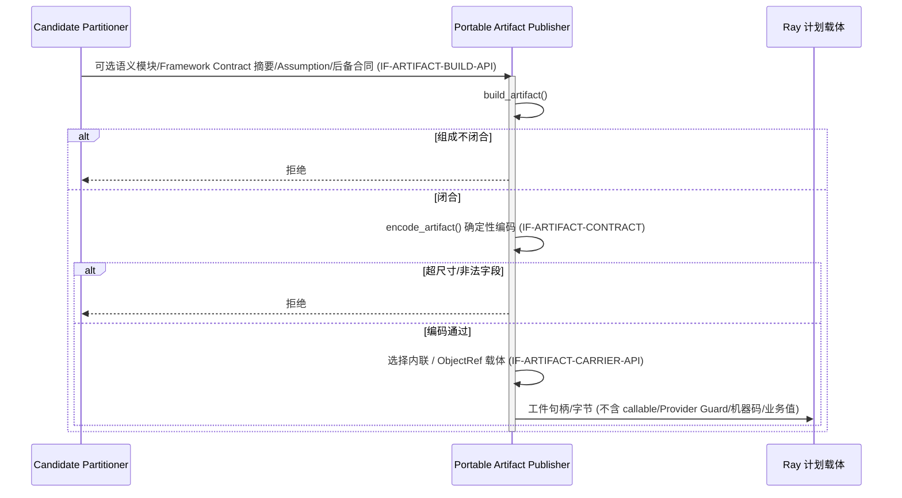

下图为 Worker 装载/准入时序图。Worker 必须独立复核，Driver 结论不能替代；非法工件进入有界负缓存并回退。

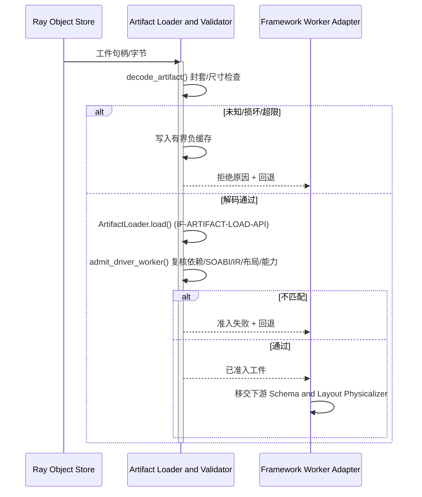

### 增量SR清单

| 需求编号 | 增量需求 |
| --- | --- |
| PA-SR-001 | 正式工件必须包含固定七区段并使用确定性编码。 |
| PA-SR-002 | 解码必须先校验封套、版本、尺寸、字段集合、顺序和摘要。 |
| PA-SR-003 | Worker 必须独立复核依赖、Python/SOABI、IR、布局和能力。 |
| PA-SR-004 | 工件不得包含业务值、裸指针、机器码、HIR/LIR 或进程资源。 |
| PA-SR-005 | 内联和 ObjectRef 载体必须具有相同内容摘要与语义。 |
| PA-SR-006 | 确定性非法工件应进入有界负缓存并输出有限原因码。 |
| PA-SR-007 | `guard` 区段只允许 portable Assumption 与 Dispatcher 公共 Guard 模板，不得承载 Provider 可执行 Guard 或伪装成 `GuardCoverage`。 |
| PA-SR-008 | `source_callable`、运行时 Hint、GuardCoverage、Provider-local IR/图/机器码与 executable handle 不得进入正式工件。 |

### 实现接口设计

#### 实现接口设计

对接架构设计 `IF-ARTIFACT-BUILD-API`、`IF-ARTIFACT-CONTRACT`、`IF-ARTIFACT-LOAD-API`。协议接口分为构建、编码、解码和装载四层。编码/解码仅处理格式；装载层负责环境与能力准入。调用者不得绕过装载验证直接把解码对象交给 Provider。

#### 实现接口定义

| 接口（对应架构逻辑接口） | 输入 | 输出 | 失败行为 |
| --- | --- | --- | --- |
| `build_artifact(...)` → `IF-ARTIFACT-BUILD-API` | 可选语义模块/区域图、Framework Contract 摘要、目标/portable Assumption/后备合同 | `PortableUdfArtifact` | 任一组成不闭合则拒绝 |
| `encode_artifact(artifact)` → `IF-ARTIFACT-CONTRACT` | 已验证工件对象 | 确定性字节和摘要 | 超尺寸或非法字段拒绝 |
| `decode_artifact(bytes)` → `IF-ARTIFACT-CONTRACT` | 不可信工件字节 | 结构化工件 | 严格拒绝未知/重复/损坏输入 |
| `ArtifactLoader.load(handle, worker_env)` → `IF-ARTIFACT-LOAD-API` | 内联/ObjectRef 句柄、Worker 环境 | 已准入工件或原因码 | 负缓存并回退 |
| `admit_driver_worker(...)` → `IF-ARTIFACT-LOAD-API` | Driver 目标、Worker 能力 | 准入报告 | 不匹配时禁止物理化 |

### 功能规格设计

| 场景 | 预期行为 |
| --- | --- |
| 合法格式 1.0 | 确定性往返，摘要稳定，Worker 重验通过。 |
| 未知格式版本 | 明确拒绝，不尝试兼容。 |
| 摘要、区段长度或字段顺序错误 | 解码失败并给出有限原因码。 |
| 依赖/SOABI/能力不一致 | 解码可成功但 Worker 准入失败，回退解释执行。 |
| 小/大工件 | 分别内联/ObjectRef，内容摘要一致。 |
| 含裸指针或机器码字段 | 构建或解码阶段拒绝。 |
| 只有普通 callable、无 external Region | 工件只携带 callable identity/provenance 与合同，不伪造空 Semantic IR。 |
| Assumption 没有来源或失效方式 | 构建拒绝；不得把它编码成“已守卫”。 |

### DFX分析

#### 可靠性分析

解析器按“先边界、后结构、再语义”的顺序处理不可信字节，所有长度、容器数量和递归深度均有硬上限。Worker 准入与协议解码分离，可明确区分格式损坏和环境不兼容。

##### FMEA分析

| 失效模式 | 影响 | 检测 | 缓解 |
| --- | --- | --- | --- |
| 工件截断/篡改 | 错误解析或执行 | 长度与分区摘要 | 严格拒绝并负缓存 |
| Driver/Worker ABI 漂移 | 崩溃或错误机器码 | Python/SOABI/依赖准入 | 禁止物理化 |
| 超大/深层工件 | Worker 资源耗尽 | 总量、区段、元素、深度上限 | 解码前拒绝 |
| ObjectRef 内容替换 | 摘要不一致 | 句柄预期摘要与内容重算 | 拒绝并记录原因 |

#### 可服务性分析

诊断输出格式版本、总摘要前缀、区段尺寸、准入阶段和原因码，不输出 IR 全文或业务内容。CLI 可验证已有工件/报告，但不得把“验证命令通过”解释为执行了性能基准。

#### 安全设计检查

##### 安全设计确认

工件解码不使用 `pickle` 或任意代码反序列化，不解析可执行指针，不信任长度字段。当前无签名/MAC，因此不得跨越未受信任的作业边界传播。

##### 敏感操作检查

涉及从 Ray Object Store 读取字节和分配解析对象；必须先校验引用类型、字节上限与摘要。不涉及外部凭据、远程下载或持久化业务数据。

#### 可用性/性能分析

工件损坏或环境不兼容时，Worker 仍可使用后备路径。确定性编码便于去重和缓存；ObjectRef 降低大工件复制，但装载、哈希和重验开销必须计入冷启动指标。

### 影响点列表

| 影响对象 | 影响 |
| --- | --- |
| Driver 编译器 | 只可输出协议允许的封闭语义与逻辑合同。 |
| Ray 传输 | 增加内联/ObjectRef 两种载体。 |
| Worker | 必须在任何物理化或编译前运行装载准入。 |
| 兼容策略 | 格式 1.0 严格拒绝未知版本，不提供历史格式迁移。 |

### 分配需求

- 协议模型与 Codec 实现 PA-SR-001～PA-SR-002、PA-SR-004、PA-SR-007～PA-SR-008。
- Worker Loader 与 Admission 实现 PA-SR-003、PA-SR-006。
- Daft/Ray 载体实现 PA-SR-005。
- 安全评审须确认受信任作业边界足以覆盖工件无签名/MAC 的限制。

## 功能项五：框架合同与标量物理化

### 功能概述

#### 功能项总述

**解决什么问题**：普通 Python callable 无法恢复数据框架的 Schema、Null、字段绑定、Batch/Layout、Ownership 和任务 Epoch。本功能把这些框架独有信息绑定成 Worker-local 合同，并由 Dispatcher 承担公共 Guard。

**核心能力**：在 Worker 进程内把 portable `FrameworkContract` 绑定为 `BoundFrameworkContract`，验证 Schema/Null/binding/Layout/Ownership/Epoch，并按 Provider 输入模式产生普通 Python 参数或受控标量描述符。

**约束**：本文只实现 CinderX 标量绑定：五种数值/布尔类型、exact `str` 受支持子集及可空形态。普通 callable 直接接收标准 Python 参数，不要求 CinderX 专用描述符；external Region 才可使用 `ScalarSlotDescriptor`。Arrow/Tensor/Native Buffer 仅保留中立扩展合同。

### 实现思路

1. Driver 侧 Framework Adapter 为每个合同字段记录来源、版本、稳定 ID 和失效 Epoch，不把 Provider 推断写回合同。
2. Worker 侧 `ContractPhysicalizer` 将逻辑合同与当前 Worker 环境重绑定，生成 `BoundFrameworkContract`。
3. `RuntimeDispatcher` 检查 Schema、field binding、Null convention、Layout、任务 Epoch 和 Ownership 等公共 Guard。
4. CinderX callable-first 路径按 binding 构造普通 Python 参数；CinderX 自行守卫 exact type、closure/global/call target 和代码依赖。
5. external Region 路径可创建绑定进程代、类型、边界、所有权与 Keepalive 的 `ScalarSlotDescriptor`。
6. 输出先写入临时槽，只有区域成功完成后才通过 `AtomicOutputPublication` 一次性发布。
7. Framework Contract 变化使 Bound Contract 和关联 Variant 失效；不得让 Provider 猜测框架缺失信息。

### 实现设计

#### 框架合同与标量物理化功能实现设计

对应 **Framework Contract Adapter / Contract Physicalizer / Runtime Dispatcher** 模块，逻辑接口 `IF-FRAMEWORK-CONTRACT-API`、`IF-VARIANT-DISPATCH-API`；内部复用总体架构的 `IF-PHYSICALIZE-API`、`IF-TARGET-BIND-API`。

`FrameworkContract` 保存可移植 Schema/Null/binding/Layout requirement/Ownership/Epoch；`BoundFrameworkContract` 保存 Worker-local 实际布局、对象生命周期和公共 Guard 表。`AccessSpec` 只在 external Region 需要显式槽位访问时出现。`DescriptorSet` 统一持有槽位及 Keepalive；`AtomicOutputPublication` 管理临时输出到用户可见结果的提交。

普通 callable 路径不暴露描述符给 CinderX Core。描述符可以内部包含地址或对象引用，但只能存在于创建它的 Worker 进程，不得进入工件、Ray Object Store、遥测或跨作业缓存。进程代、Framework Epoch、对象释放、槽位代或能力撤销会使旧 Bound Contract/描述符及相关 Variant 失效。

下图为框架合同物理化时序图。公共 Guard 由 Dispatcher 所有；Provider 仍需对自身代码假设给出独立 GuardCoverage。

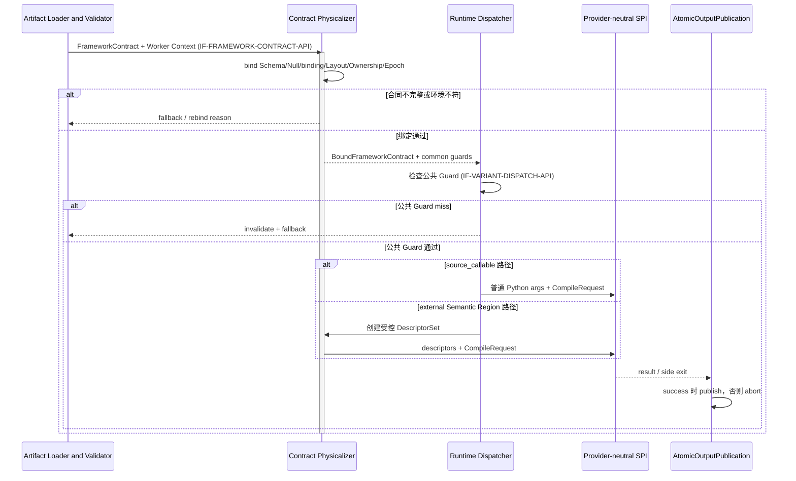

### 增量SR清单

| 需求编号 | 增量需求 |
| --- | --- |
| DL-SR-001 | 本文实现 `bool`、`int32`、`int64`、`float32`、`float64`、exact `str` 受支持子集及其框架可空合同。 |
| DL-SR-002 | 工件中的 Framework Contract/`AccessSpec` 必须保持逻辑化，不得包含 Worker 地址或对象引用。 |
| DL-SR-003 | external Region 描述符必须绑定进程代、描述符代、类型、边界、所有权和 Keepalive。 |
| DL-SR-004 | 描述符访问必须通过能力、代际、类型、槽位和边界守卫。 |
| DL-SR-005 | 输出必须先暂存，区域成功后原子发布；失败不得泄漏部分结果。 |
| DL-SR-006 | 本文不得对外宣称 Vectorized、PyTorch、Native Kernel 或零拷贝实现。 |
| DL-SR-007 | Framework Contract 必须覆盖 Schema、Null、字段绑定、Batch/Layout、Ownership 和任务 Epoch，并为每项提供来源与失效条件。 |
| DL-SR-008 | Dispatcher 拥有框架公共 Guard；Provider 拥有代码、类型、调用目标等 Provider-local Guard。 |
| DL-SR-009 | callable-first 路径必须允许标准 Python 参数直接进入 CinderX；CinderX 专用描述符不得成为中立 SPI 必填项。 |
| DL-SR-010 | Bound Contract 失效必须使关联 Variant 失效或重新物理化。 |

### 实现接口设计

#### 实现接口设计

物理化接口位于协议装载与 Provider 之间，返回 Worker-local `BoundFrameworkContract` 和 Dispatcher Guard 表。Provider 通过中立 `CompileRequest` 消费合同；仅 external Region 使用能力句柄访问描述符，Provider 不能直接接受工件中的任意偏移或地址。

#### 实现接口定义

| 接口 | 输入 | 输出 | 失败行为 |
| --- | --- | --- | --- |
| `FrameworkContractBuilder.build()` → `IF-FRAMEWORK-CONTRACT-API` | 框架 Schema/Null/binding/Layout/Ownership/Epoch | 可移植 `FrameworkContract` | 来源或失效合同不完整则回退 |
| `ContractPhysicalizer.bind()` → `IF-FRAMEWORK-CONTRACT-API` | `FrameworkContract`、Worker 上下文 | `BoundFrameworkContract`、公共 Guard 表 | 环境不符则重绑定或回退 |
| `RuntimeDispatcher.check_common_guards()` → `IF-VARIANT-DISPATCH-API` | Bound Contract、当前调用 | 公共 Guard 结果 | miss 时失效/fallback，不进入 Provider |
| `ScalarPhysicalizer.open_call()` | external Region 的 `AccessSpec`、当前值与 Keepalive | `ScalarCallFrame`、`DescriptorSet` | 类型/所有权/布局不符则回退 |
| `AtomicOutputPublication.stage()/publish()/abort()` | 临时输出或中止信号 | 原子发布结果/中止状态 | 未暂存、重复发布或已中止时拒绝 |

### 功能规格设计

| 场景 | 预期行为 |
| --- | --- |
| 非空五类标量 callable | 按字段绑定产生标准 Python 参数，公共 Guard 通过后进入 CinderX Provider。 |
| exact `str` callable | 保留 Python exact-type/Unicode 语义；CinderX 自行完成类型 Guard 与 lowering。 |
| 可空值为 Null | 按 Framework Contract 传播 Null，不读取未定义数据槽。 |
| Schema/Layout/任务 Epoch 改变 | 公共 Guard miss，Bound Contract 和相关 Variant 失效或重新物理化。 |
| external Region 描述符越界/过期 | 进入机器码前拒绝，记录有限原因码。 |
| 区域中途 Side Exit | 临时输出不发布，由续接状态决定后续结果。 |
| Arrow/Tensor/Native Buffer | 本文不实现对应物理化，Planner 收到 unavailable 或保持原生路径。 |

### DFX分析

#### 可靠性分析

框架合同的来源/Epoch、公共 Guard 与 Worker-local 生命周期共同防止跨 Schema/Layout 错用；描述符生命周期由 `DescriptorSet` 与 Keepalive 包围；输出提交与区域提交边界保持一致。

##### FMEA分析

| 失效模式 | 影响 | 检测 | 缓解 |
| --- | --- | --- | --- |
| Framework Epoch 漂移 | 旧合同或旧代码被复用 | 公共 Epoch Guard、Variant Key | 失效并重新物理化 |
| 字段绑定/Null 合同错误 | 参数错位或结果错误 | Adapter/Worker 双侧验证 | 拒绝 Bound Contract 并 fallback |
| 描述符悬空/越界 | 崩溃或错误数据 | Keepalive、代际、边界 Guard | 进入 Provider 前拒绝 |
| 公共 Guard 被当作代码 Guard | closure/global 变化未发现 | GuardCoverage 责任审计 | Provider 必须独立覆盖代码假设 |
| 部分输出可见 | 语义重复或脏结果 | 发布状态机 | 临时缓冲，成功后原子提交 |

#### 可服务性分析

Explain 输出合同 Hash、Schema/Null/binding/Layout/Epoch 摘要、公共 Guard 所有者及失败原因，不输出地址、对象表示或业务值。诊断可关联 Bound Contract 与 Variant，但二者生命周期独立。

#### 安全设计检查

##### 安全设计确认

所有物理地址均局限于 Worker 本进程，并通过能力和边界 Guard 访问。工件和遥测中禁止地址、对象 ID、业务值与可逆内存内容。

##### 敏感操作检查

涉及本地内存读写、对象生命周期固定和字段绑定，是安全敏感操作。机器码入口前必须完成来源、类型、代际、所有权、边界和可空性检查；不涉及远程内存或跨进程共享地址。

#### 可用性/性能分析

合同绑定失败不影响解释执行。公共 Guard 应在发布时预编译成有界 Guard 表，避免重复解释合同；callable-first 路径避免为普通 Python 调用强制构造 CinderX 专用描述符。物理化和 Guard 成本必须计入端到端 A/B。

### 影响点列表

| 影响对象 | 影响 |
| --- | --- |
| Framework Adapter | 新增统一 `FrameworkContract`，替代散落的 Schema/Layout 元数据。 |
| Runtime Dispatcher | 拥有公共 Guard、Bound Contract 失效与 Provider 调用边界。 |
| Provider | 通过中立 CompileRequest 消费合同；只有 external Region 使用受控描述符。 |
| 测试 | 覆盖五类数值、exact str、Null、binding、Layout/Epoch、边界、Side Exit 和原子发布。 |

### 分配需求

- Framework Adapter/Physicalizer 实现 DL-SR-001～DL-SR-004、DL-SR-007、DL-SR-009～DL-SR-010。
- 输出发布模块实现 DL-SR-005。
- 产品说明、CLI 和 Explain 共同执行 DL-SR-006 的能力边界。
- Runtime Dispatcher 与 Provider 共同实现 DL-SR-008；重复检查必须说明覆盖层次，不能掩盖责任不清。

## 功能项六：CinderX Provider

### 功能概述

#### 功能项总述

**解决什么问题**：在不把 UDF JIT 变成 CinderX 专属前端的前提下，让 CinderX 对普通 Python callable 使用自身成熟的 bytecode→HIR→LIR→机器码链路，并为确无等价 bytecode 的 external Semantic Region 提供受控桥接。

**核心能力**：CinderX Provider 实现统一 `manifest/probe/compile/execute/invalidate/diagnostics` SPI。普通 callable 路径由 CinderX 自行分析 CFG、类型、行为模式、调用目标、Effect、Guard/Watcher、Deopt 和 codegen；external Region 路径由版本绑定 Plugin 转换并二次验证。Provider 返回 Worker-local `CompiledVariant`、consumed assumptions 和 `GuardCoverage`。

**约束**：UDF JIT 提供的同类类型/行为结论最多是 Hint，不能替代 CinderX 验真。当前 `compile_typed_region`、`__udf_jit_typed_region__`、`__udfjit_value_cache__` 和 `JITRT_Udf*` 只允许封装在迁移期 Provider Plugin 内，不是中立 SPI 或 CinderX 上游公共 API。

### 实现思路

1. `provider_manifest()` 声明 SPI/Provider/runtime ABI、`source_callable`/`semantic_region` 输入模式、类型/Effect/Guard/Side Exit 和诊断能力。
2. `probe()` 只做保守、无业务副作用的支持判断，返回约束和成本包络；Hint 缺失不能放宽正确性检查。
3. callable-first 路径调用 CinderX native frontend，自行发现 exact type、closure/global/call target、循环、generator 形状与 Unicode/容器语义。
4. external Region 路径只接收 verified、版本化语义；Provider Plugin 再验证类型、Effect、异常、fallback 和 ABI 后才映射到通用 HIR。
5. 通用后端优化覆盖：稳定调用目标内联/去 VectorCall、非逃逸 generator/迭代器 lowering、确定性失败负缓存、Unicode 属性分类、不可变查表、FSM 状态传播、序列 builder 与冗余分配消除。优化按行为模式和类型准入，不按业务 UDF 名称准入。
6. CinderX 为 callable 自可见依赖生成原生 Guard/Watcher/Deopt；Framework/Dispatcher 条件通过外部 assumption ID 对账。覆盖不完整时 `compile()` 返回 Reject。
7. 机器码只在 Worker 进程生成并满足 W^X；确定性 HIR→LIR 失败按完整失败身份进入负缓存，避免同一 generator 连续重复编译。
8. `diagnostic_policy=off` 不请求 HIR/LIR/assembly/address map；`full` 才由 `diagnostics()` 返回 ProviderDiagnostics。
9. value cache 只有在 CinderX 自身 Effect/依赖分析闭合，或引入中立 Memoization Contract 后才可发布；穿刺期 `__udfjit_value_cache__` 元数据不能作为 soundness 依据。

### 实现设计

#### CinderX Provider 功能实现设计

对应 **Provider-neutral SPI / CinderX Provider Plugin** 模块，逻辑接口 `IF-PROVIDER-CAPABILITY-API`、`IF-PROVIDER-COMPILE-API`、`IF-PROVIDER-EXECUTE-API`、`IF-PROVIDER-INVALIDATE-API`、`IF-PROVIDER-DIAGNOSTICS-API`。

`CompileRequest` 包含二选一或同时存在的 `source_callable`、`semantic_region`，以及 `FrameworkContract`、`ExternalAssumption[]`、Target Context、可选 Runtime Profile 和 Diagnostic Policy。CinderX Manifest 优先 `source_callable`；Provider 自己生成 Provider-local HIR/LIR、Guard 和 executable handle。Core 只保存 opaque handle、统一 Variant 元数据与生命周期回调。

callable 路径的关键闭环是“编译真实工作函数，而不只编译外层 wrapper”：CinderX 根据 `GuardIs`、dict/type/code watcher 等证明稳定 call target 后，在 HIR 中内联或专门化调用；无法证明时保留动态调用或拒绝对应收益计划，不能把 wrapper 已 JIT 当作内部工作已优化。generator 路径先分类可 lowering/unsupported/transient failure；确定性 unsupported 与确定性 lowering failure 使用含 code identity、CinderX version、target ABI 和 failure stage 的负缓存键。

external Region bridge 只解决没有等价 bytecode 的语义输入，不向 CinderX 注入业务分类。`compile_typed_region`、`JITRT_Udf*` 等迁移期接口由 Plugin 私有调用，并须在 ProviderDiagnostics 中标记 bridge/version；Core 不 import 这些名称。

下图为 CinderX Provider 编译、发布与执行时序图。

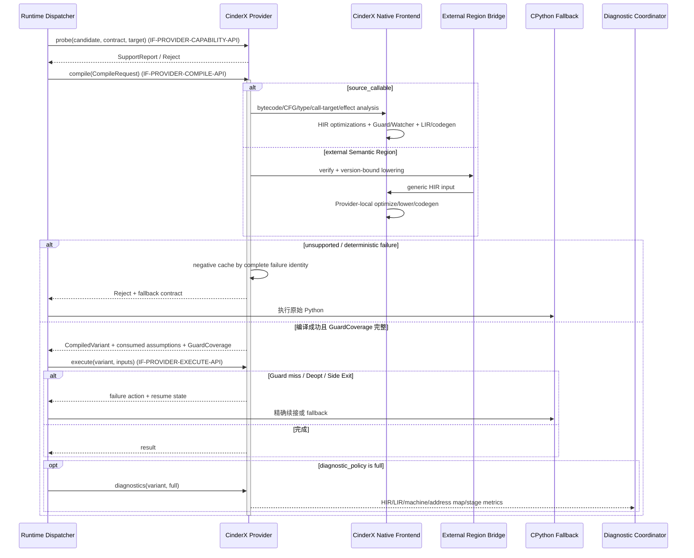

### 增量SR清单

| 需求编号 | 增量需求 |
| --- | --- |
| CJ-SR-001 | Provider 必须通过 Manifest 声明版本、输入模式、Target ABI、类型/Effect/Guard/Side Exit 和诊断能力。 |
| CJ-SR-002 | 普通 callable 必须优先走 CinderX native frontend；UDF JIT 不得替代其 CFG、类型、行为分类、调用目标和代码 Guard 分析。 |
| CJ-SR-003 | external Semantic Region 必须由 Provider Plugin 二次验证并版本绑定；验证失败不得进入 HIR。 |
| CJ-SR-004 | Provider 优化必须按行为模式与数据类型准入，覆盖数值和 exact-str 的通用循环、Unicode 分类、不可变查表、FSM 与序列构造，不得识别业务 UDF 名称。 |
| CJ-SR-005 | 稳定调用目标只有在 CinderX 原生 Guard/Watcher 覆盖后才能内联或专门化；仅编译 wrapper 不算完成优化。 |
| CJ-SR-006 | generator/迭代器 lowering 的确定性失败必须进入完整身份负缓存，避免重复 HIR→LIR 编译；暂态失败使用短退避。 |
| CJ-SR-007 | `CompiledVariant` 必须列出 consumed assumptions 和完整 GuardCoverage；未覆盖项导致 Reject。 |
| CJ-SR-008 | 机器码和代码句柄只允许存在于生成它们的 Worker 进程，代码内存必须满足 W^X。 |
| CJ-SR-009 | Provider Guard Miss/Deopt/Side Exit 必须携带明确 failure action 与精确续接状态。 |
| CJ-SR-010 | 迁移期 CinderX 专用入口只存在于 Provider Plugin；Core SPI/Artifact Schema 不得出现 `cinderx`、HIR opcode 或 `JITRT_Udf*` 字段。 |
| CJ-SR-011 | value cache 在 CinderX 自身证明 Effect/依赖或中立 Memoization Contract 落地前只能保持实验性，不得进入默认正确性路径。 |
| CJ-SR-012 | `diagnostic_policy=off` 时 Provider 不生成 HIR/LIR/机器码 Dump 或地址映射。 |

### 实现接口设计

#### 实现接口设计

Provider SPI 将能力、编译、执行、失效和诊断分离。所有后端共享中立请求/响应类型，具体 IR 和 executable handle 为 opaque provider-local 对象。CinderX Provider 可使用 callable 或 external Region，但不能自行放宽 Framework Contract，也不能把 Optimization Hint 当作事实或 Guard。

#### 实现接口定义

| 接口 | 输入 | 输出 | 失败行为 |
| --- | --- | --- | --- |
| `provider_manifest()` | 无 | `ProviderManifest` | 不兼容 SPI/ABI 时 Provider unavailable |
| `probe(candidate, contract, target)` → `IF-PROVIDER-CAPABILITY-API` | callable/verified Region、Framework Contract、Target | `SupportReport` | 保守 Reject，无业务副作用 |
| `compile(request)` → `IF-PROVIDER-COMPILE-API` | `CompileRequest` | `CompiledVariant` + GuardCoverage 或 Reject | 确定性失败负缓存，fallback 可用 |
| `execute(variant, inputs)` → `IF-PROVIDER-EXECUTE-API` | opaque Variant、Bound Contract、输入 | result/GuardMiss/Deopt/SideExit | 返回明确 failure action，不伪造 Python 业务异常 |
| `invalidate(variant, reason)` → `IF-PROVIDER-INVALIDATE-API` | Variant、代码/合同/ABI 失效原因 | 撤销结果 | 撤销入口并幂等释放资源 |
| `diagnostics(variant, policy)` → `IF-PROVIDER-DIAGNOSTICS-API` | Variant、`off/full` | `ProviderDiagnostics` | `off` 返回空；诊断失败不影响 Variant |

### 功能规格设计

| 场景 | 预期行为 |
| --- | --- |
| 普通数值/布尔 callable | CinderX 原生前端分析、Guard、HIR/LIR 和 codegen；UDF JIT 仅提供框架合同/外部 Assumption。 |
| exact-str 通用循环 | 按 exact type、Unicode 属性、不可变 lookup、FSM/builder 能力组合优化；不依赖业务名称。 |
| wrapper 调用稳定内部函数 | CinderX 证明 call target 后内联/专门化；不能证明则保留动态调用并如实报告收益限制。 |
| 非逃逸、状态不可观察 generator | CinderX 可 lower 为通用循环；Effect/异常/状态合同不闭合则 Reject 或保留 Python。 |
| 同一 generator 确定性 HIR→LIR 失败 | 首次记录负缓存，后续命中不重复编译；身份/版本/Target 变化后重新评估。 |
| external Semantic Region | Plugin 二次验证后 lowering；桥接版本不匹配时 Reject。 |
| CinderX 未初始化或 API/ABI 不符 | Provider unavailable，原始 Python 可执行。 |
| 强制编译与 HIR/LIR/assembly | 仅 `diagnostics=full` 的证据能力，不绕过正常准入和预算。 |

### DFX分析

#### 可靠性分析

CinderX 自有前端、Guard/Watcher/Deopt、Provider 二次验证、完整 GuardCoverage、失败负缓存、W^X 和 fallback 共同限制 JIT 故障影响。Provider 初始化或诊断失败不得影响原生 Python 运行时。

##### FMEA分析

| 失效模式 | 影响 | 检测 | 缓解 |
| --- | --- | --- | --- |
| UDF Hint 被当作已验证类型/行为 | 错误 lowering | 输入分类与 GuardCoverage 审计 | CinderX 重算/验证或 Reject |
| wrapper 已编译但内部仍 VectorCall | 收益虚高或不足 | HIR/LIR/调用目标诊断 | 原生 Guard 后内联；报告未消除调用 |
| generator 确定性失败重复编译 | 编译风暴和冷启动浪费 | failure stage/key 计数 | 完整身份负缓存 |
| external Region bridge 漂移 | 错误 HIR 语义 | bridge/codec/ABI 版本校验 | 二次验证并 Reject |
| 代码页权限或生命周期错误 | 安全风险或崩溃 | W^X、引用和撤销检查 | 不发布/撤销入口并释放 |
| value cache 依赖不完整 | 返回陈旧结果 | Effect/依赖证明门禁 | 默认关闭实验能力 |

#### 可服务性分析

Explain 输出输入模式、SupportReport、Provider 版本、编译阶段、GuardCoverage 摘要、是否消除动态调用、generator lowering/负缓存状态及 Reject/Deopt 原因。`full` 模式可输出 HIR/LIR/反汇编和地址映射；默认日志只保留有限原因码。

#### 安全设计检查

##### 安全设计确认

Provider 只接受已加载 callable 或已验证 external Region；禁止把任意地址、函数指针或外部符号作为 portable 输入。代码页从可写切换到可执行，不允许同时具备写和执行权限。

##### 敏感操作检查

涉及 Provider Plugin 加载、原生代码生成、可执行内存和进程内函数入口。必须受 ABI 校验、GuardCoverage、运行模式、预算、W^X 和资源释放约束；机器码不跨网络分发。

#### 可用性/性能分析

Provider 不可用或 Reject 时仍可解释执行。收益必须来自 CinderX 通用 HIR/LIR 优化，并在同环境 A/B 中扣除 probe、编译、Guard 和 fallback 成本。诊断应分别证明实际工作函数进入 JIT、动态调用是否消除、generator 是否 lowering/负缓存，以及热点是否落在预期机器码区间。

### 影响点列表

| 影响对象 | 影响 |
| --- | --- |
| CinderX Core | 仅通用 callable 优化、Guard/Watcher/Deopt、generator lowering/负缓存等适合上游的能力进入 Core。 |
| CinderX Provider Plugin | 封装 UDF JIT 中立 SPI、external Region bridge 和迁移期私有入口。 |
| UDF JIT Core | 只依赖 Provider API，不 import CinderX 专用模块或字段。 |
| Worker 镜像 | 按目标任务安装版本匹配的 CinderX Provider package。 |
| 验证 | 证明工作函数 JIT、HIR/LIR/机器码、GuardCoverage、动态调用消除、失败负缓存和精确 fallback。 |

### 分配需求

- Provider API/Plugin 实现 CJ-SR-001～CJ-SR-003、CJ-SR-007、CJ-SR-009～CJ-SR-010、CJ-SR-012。
- CinderX 通用 HIR/LIR 优化实现 CJ-SR-004～CJ-SR-006；其上游准入独立于 UDF JIT。
- 执行器与代码资源管理实现 CJ-SR-008～CJ-SR-009。
- CinderX Effect/依赖分析或未来 Memoization Contract 实现 CJ-SR-011。
- 每个 CPython/CinderX 目标环境必须独立完成 ABI、HIR/LIR、机器码、Guard/Deopt 与功能证据，不得沿用其他版本结论。

## 功能项七：合同守卫与变体执行

### 功能概述

#### 功能项总述

**解决什么问题**：跨 Framework、Core 和 Provider 的 Assumption 只有在运行时被明确 Guard/Watcher/Deopt 覆盖后才可安全执行；同时 JIT 编译、缓存和失败具有不确定性。本功能把覆盖证明与资源状态机闭合在 Worker 内。

**核心能力**：Runtime Dispatcher 执行框架公共 Guard，收集 Provider GuardCoverage，验证每个 consumed assumption 都有所有者、机制、检查阶段和失败动作，然后原子发布、执行、失效和淘汰 Variant。

**约束**：Assumption 不是 Guard，UDF JIT Guard 也不替代 CinderX Guard。覆盖不完整的 Variant 不可见；正确性门禁先于热度、成本或缓存命中。

### 实现思路

1. `VariantKey` 绑定 Provider ID/版本、Target ABI、callable/semantic identity、Framework Contract Hash、external assumption Epoch、进程代、作业/租户和冻结策略；Provider 私有子键可追加 CinderX 内部身份。
2. `GuardCoverageValidator` 对账所有 consumed assumptions：Framework/Dispatcher 覆盖 Schema/Layout/Epoch，CinderX 覆盖 exact type/closure/global/call target/code dependency。
3. `CompiledVariant` 只有在覆盖完整、Fallback Contract 有效和生命周期回调齐全时才从 Staging 原子发布为 Active。
4. 状态机按 `Unseen → Interpreting → Compiling → Staging → Active/Negative → Evicted` 演进；编译队列有界，同一键 Singleflight。
5. 确定性失败按 Provider/阶段/身份进入负缓存；暂态资源失败短退避；连续运行失败触发按作业/租户/Provider/原因隔离的熔断。
6. 公共 Guard miss 在进入 Provider 前 fallback/重绑定；Provider Guard miss/Deopt 按其 failure action 失效、重编译或精确续接。
7. 提交前失败可整函数解释；提交后只从显式 `SideExit` 状态续接，不得重放副作用。
8. LRU 淘汰只处理无活动引用 Variant，并调用 Provider `invalidate()`/close 回调。

### 实现设计

#### 合同守卫与变体执行功能实现设计

对应 **Runtime Dispatcher / Variant Cache / Fallback Manager** 与 Provider Integration，逻辑接口 `IF-PROVIDER-COMPILE-API`、`IF-PROVIDER-EXECUTE-API`、`IF-PROVIDER-INVALIDATE-API`、`IF-VARIANT-DISPATCH-API`。

`VariantManager` 协调活动表、`CompilePool`、`NegativeCache`、`CircuitBreaker` 和 `ProcessVariantGovernor`。`GuardCoverageValidator` 使用稳定 assumption ID 对账 Dispatcher 与 Provider 覆盖；同一条件可被双方覆盖不同层次，但必须分别声明。`CommitBoundary` 和 `InterpreterContinuation` 保证回退不重放已发生副作用。

Core Key Schema 不包含 CinderX module hash、HIR opcode、Torch graph ID 或 LLVM target detail；这些只能进入 Provider 私有子键。活动引用在调用结束前固定 opaque handle，诊断 Bundle 与 Variant cache 生命周期独立。

下图为 Variant 编译与发布时序图。GuardCoverage 不完整时不会发布半成品。

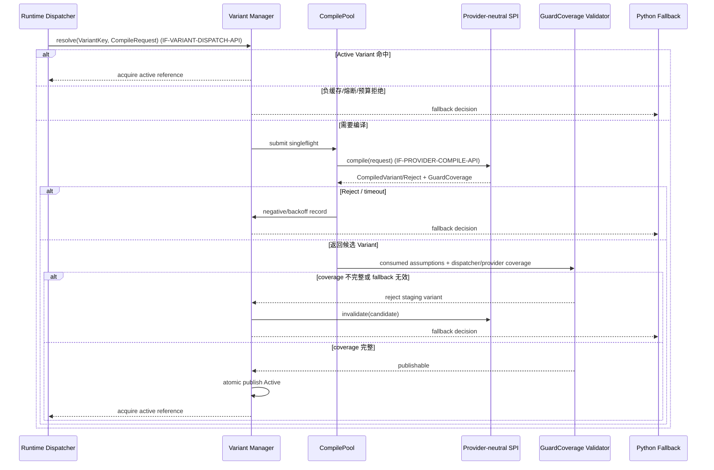

下图为 Guard 与执行结果时序图。

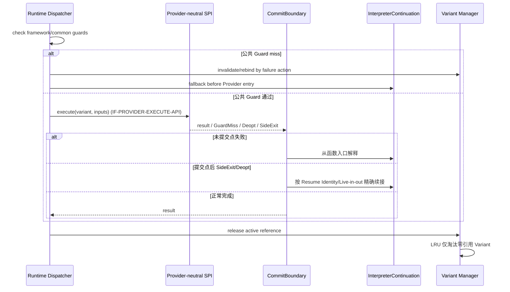

### 增量SR清单

| 需求编号 | 增量需求 |
| --- | --- |
| GE-SR-001 | Variant Key 必须绑定 Provider ID/版本、Target ABI、callable/semantic identity、Framework Contract Hash、external assumption Epoch、进程/作业/租户/策略身份。 |
| GE-SR-002 | 每个 consumed assumption 必须在 GuardCoverage 中记录 `assumption_id`、owner、mechanism、check phase 和 failure action。 |
| GE-SR-003 | 覆盖不完整、fallback 无效或生命周期回调不完整的 Variant 不得从 Staging 发布。 |
| GE-SR-004 | Dispatcher 负责框架公共 Guard；Provider 负责代码/类型/调用目标等 Provider-local Guard。 |
| GE-SR-005 | 编译队列、并发、等待、代码字节和 Variant 数必须使用硬上限，同键只允许一个编译任务。 |
| GE-SR-006 | 确定性失败、有界负缓存、暂态退避和运行熔断必须使用不同状态及失效条件。 |
| GE-SR-007 | 提交点后禁止整函数重放，只允许精确 Side Exit/Deopt 或显式失败。 |
| GE-SR-008 | 淘汰不得释放有活动引用的 Provider handle，失效与资源关闭必须幂等。 |
| GE-SR-009 | Core Key Schema 不得固化任何 Provider-local IR/模块 ID；Provider 只能追加私有子键。 |

### 实现接口设计

#### 实现接口设计

运行时接口把“候选编译”“发布门禁”“公共 Guard”“Provider 执行”和“续接”分开。调用者不能绕过 GuardCoverageValidator 直接缓存 Provider handle；执行结果必须显式携带提交状态、failure action 和续接信息。

#### 实现接口定义

| 接口 | 输入 | 输出 | 失败行为 |
| --- | --- | --- | --- |
| `VariantManager.resolve(key, request)` → `IF-VARIANT-DISPATCH-API` | 完整 Key、CompileRequest | Active/compile/fallback decision | 预算、负缓存或熔断时 fallback |
| `GuardCoverageValidator.validate(...)` | consumed assumptions、Dispatcher/Provider coverage、fallback | publishable/reject report | 任一未覆盖项拒绝发布 |
| `CompilePool.submit(key, compile_fn)` | 变体键、Provider 编译闭包 | Singleflight Future | 队列满/超时即 fallback 或短退避 |
| `RuntimeDispatcher.dispatch(...)` → `IF-VARIANT-DISPATCH-API` | Bound Contract、Variant、当前输入 | result/fallback | 公共 Guard miss 不进入 Provider |
| `provider.execute(...)` → `IF-PROVIDER-EXECUTE-API` | opaque Variant、输入 | result/GuardMiss/Deopt/SideExit | 返回明确 failure action |
| `InterpreterContinuation.resume(side_exit)` | Resume Identity、活跃值、异常/提交状态 | Python 结果 | 状态不可验证则显式失败 |
| `VariantManager.invalidate()/close()` → `IF-PROVIDER-INVALIDATE-API` | Variant、失效原因 | 撤销与释放结果 | 活动引用延迟回收，关闭幂等 |

### 功能规格设计

| 场景 | 预期行为 |
| --- | --- |
| Assumption 已声明但无 Guard | Variant 停留 Staging 并 Reject，执行原始 Python。 |
| Framework Layout/Epoch miss | Dispatcher 在 Provider 入口前重绑定/失效/fallback。 |
| closure/global/call target 变化 | CinderX Guard/Watcher 触发 Deopt/失效，不依赖 UDF JIT 类型 Guard。 |
| 同键并发冷调用 | 只有一个编译任务，其余调用解释或等待受限 Future。 |
| generator 确定性编译失败 | 命中 Provider+stage 负缓存，不重复编译。 |
| 暂态资源失败 | 短退避后可重试，不永久标记 unsupported。 |
| 提交点后 Guard miss/Deopt | 从精确 Side Exit 续接，禁止整函数重放。 |
| 代码预算超限 | 淘汰零引用 LRU Variant；仍不足则拒绝新编译。 |
| Provider/ABI/Contract Epoch 变化 | Key 不命中并失效旧 Variant。 |

### DFX分析

#### 可靠性分析

GuardCoverage 发布门禁、显式状态机、硬预算、Singleflight、活动引用和提交边界共同防止错误假设、半成品可见、编译风暴、资源悬空与副作用重复。

##### FMEA分析

| 失效模式 | 影响 | 检测 | 缓解 |
| --- | --- | --- | --- |
| Assumption 被误当 Guard | 未检查条件进入机器码 | coverage completeness check | Staging 阶段拒绝发布 |
| 公共/Provider Guard 责任混淆 | 缺失代码或框架检查 | owner/mechanism 审计 | 分层 coverage，重复项注明层次 |
| 编译惊群 | CPU/内存耗尽 | 同键在途计数 | Singleflight 与有界队列 |
| 负缓存永久化 | 修复后仍不编译 | failure class、TTL、身份变化 | 区分 deterministic/transient |
| 活动代码被淘汰 | 崩溃 | 活动引用计数 | 仅淘汰零引用 Variant |
| 提交后整函数回退 | 副作用重复 | CommitBoundary 断言 | 只接受精确 Side Exit/Deopt |

#### 可服务性分析

Explain 输出 Variant Key 摘要、consumed assumptions、GuardCoverage owner/mechanism、Staging 拒绝原因、负缓存类型、熔断范围、Side Exit/Deopt 和淘汰计数。指标区分公共 Guard miss 与 Provider Guard miss。

#### 安全设计检查

##### 安全设计确认

作业、租户、合同和 Provider 身份进入 Key，防止跨边界复用机器码或策略结论。未完整覆盖的 Variant 不可见；队列、缓存和代码内存均有硬上限。

##### 敏感操作检查

涉及线程池、超时取消、Provider handle 失效、代码资源关闭和熔断状态；必须保证发布原子、关闭幂等、活动引用安全和锁顺序稳定。

#### 可用性/性能分析

覆盖或预算不满足时优先保持 Python fallback。GuardCoverage 在发布时验证一次，热路径只运行已编译 Guard 表。缓存命中率、Guard miss、排队/编译时间、Deopt、Side Exit 和代码内存必须纳入正式性能分析。

### 影响点列表

| 影响对象 | 影响 |
| --- | --- |
| Runtime Dispatcher | 新增公共 Guard、GuardCoverage 发布门禁和 failure action 执行。 |
| Provider | 必须返回 consumed assumptions、coverage、opaque handle 和失效回调。 |
| Variant Cache | 使用中立 Core Key + Provider 私有子键，支持 Staging 状态。 |
| 解释器续接 | 需要精确 Resume Identity、提交状态和 Provider failure action。 |
| 多租户 | 缓存、负缓存、熔断和预算均按作业/租户/Provider 隔离。 |

### 分配需求

- GuardCoverageValidator 与 Dispatcher 实现 GE-SR-001～GE-SR-004、GE-SR-007、GE-SR-009。
- 编译池与 Governor 实现 GE-SR-005。
- 负缓存与熔断实现 GE-SR-006。
- Variant Cache 与 Provider 生命周期共同实现 GE-SR-008。

## 功能项八：运行时治理与诊断

### 功能概述

#### 功能项总述

**解决谁的问题**：面向运维、开发和性能工程人员，解决“如何限制优化权限、如何解释每次决策，以及如何从 Python UDF 一直定位到机器码和 perf 热点，同时不污染正常运行”的问题。

**核心能力**：提供执行模式、冻结策略、授权/预算、作业/租户隔离、Explain、低成本 Telemetry，以及独立 `off/full` 诊断策略。`full` 串联 Source→Capture/Semantic→Partition→Provider Input/GuardCoverage→Provider-local IR→机器码/图→perf/Provider Profile。

**约束**：治理只能收紧执行权限；诊断只观察，不参与正确性、Provider 选择或业务结果。默认 `UDFJIT_DIAGNOSTICS=off`，不创建 Dump、Bundle 或 perf 进程。本期无远程策略更新、中心控制服务或运行中 Kill Switch。

### 实现思路

1. 将环境、插件开关、显式 `UDFJIT_MODE`、兼容性、策略上限和授权解析为唯一有效执行模式。
2. 作业提交时生成不可变 `PolicySnapshot` 和 Hash，随工件/Variant identity 传播。
3. 独立解析 `UDFJIT_DIAGNOSTICS=off|full`，产生 `DiagnosticPolicy`；它不进入语义 Hash，也不改变 Variant 命中。
4. `off` 路径只保留生产需要的有限原因码和低成本计数，不调用 Provider diagnostics、不生成中间产物文件、不启动 perf。
5. `full` 路径为每层分配稳定 provenance ID，由 `DiagnosticCoordinator` 关联源码位置、Semantic Region、Provider assignment、CompileRequest、GuardCoverage、Provider IR、代码地址和 Profile 样本。
6. 每个 Provider 通过统一 `ProviderDiagnostics` 返回编译决策、阶段耗时、代码/图大小、Guard/Deopt/Side Exit、文件引用及地址/节点映射；Coordinator 不解释或修改 Provider IR。
7. CinderX/native 可由 perf 直接采样机器码地址；Vectorized/PyTorch 等未来 Provider 需额外提供 kernel/node 事件和地址映射，才能向上归因。
8. Explain 与 Telemetry 使用同一决策事实；队列满、文件写失败、Provider dump 失败或 perf 无权限只标记诊断缺口，不影响执行。
9. CLI 明确区分“校验已有材料”和“实际运行 A/B/采样”，不得用配置校验制造性能证据。

### 实现设计

#### 运行时治理与诊断功能实现设计

对应 **Policy and Telemetry / Diagnostic Coordinator / Provider Diagnostics Adapter / Profile and perf Correlator**，逻辑接口包括 `IF-POLICY-API`、`IF-PROVIDER-DIAGNOSTICS-API`、`IF-DIAGNOSTICS`、`IF-PROFILE-INGEST`。

执行模式优先级依次为紧急禁用 `UDFJIT_DISABLE`、插件启用 `UDFJIT_PLUGIN_ENABLE`、显式 `UDFJIT_MODE`、兼容性上限、冻结策略和 `rollout_authorized`。任何透明入口都必须消费统一 `ModeDecision`。

`DiagnosticPolicy` 与 `ModeDecision` 分开保存。`DiagnosticCoordinator` 创建 `DiagnosticBundleManifest`，只记录稳定 ID、阶段、摘要、文件引用和缺口；Provider-local HIR/LIR/Torch Graph/LLVM IR/机器码只进入受权限保护的 Bundle。Bundle 生命周期独立于 Artifact 和 Variant cache，关闭或清理诊断材料不会使 Variant 失效。

下图为执行模式与诊断策略的正交解析时序图。

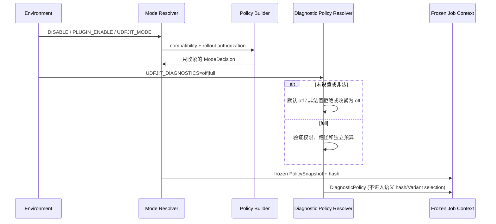

下图为 `full` 模式的跨层证据链；`off` 分支明确不触发任何重诊断动作。

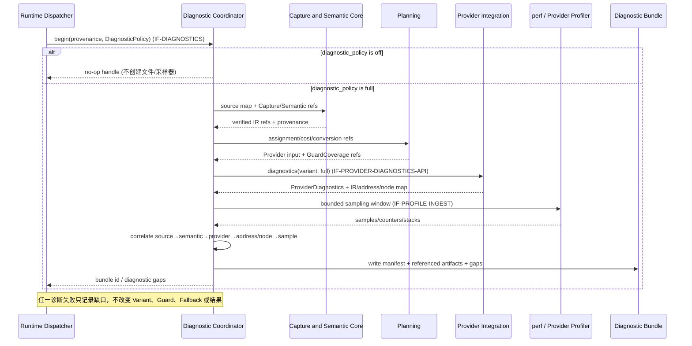

### 增量SR清单

| 需求编号 | 增量需求 |
| --- | --- |
| RG-SR-001 | 所有入口必须使用同一执行模式解析器，并执行禁用、启用、兼容性、策略与授权优先级。 |
| RG-SR-002 | 执行策略必须在作业提交时冻结、散列并进入 Artifact/Variant identity。 |
| RG-SR-003 | 未知执行模式、策略字段或解析失败必须 Fail Closed 到更保守模式。 |
| RG-SR-004 | `DiagnosticPolicy` 必须与执行模式正交；诊断不得进入语义 Hash、Provider 选择或 Variant 命中条件。 |
| RG-SR-005 | 默认 `diagnostics=off` 不调用 Provider diagnostics，不写 Dump/Bundle，不启动 perf 或额外采样线程。 |
| RG-SR-006 | `full` 必须以稳定 provenance ID 贯通 Source、Semantic、Partition、Provider Input/GuardCoverage、Provider IR、Machine/Graph 和 Profile。 |
| RG-SR-007 | ProviderDiagnostics 必须采用中立摘要合同，Provider 私有文件只以受控引用进入 Bundle。 |
| RG-SR-008 | 诊断失败、队列满、文件写失败或 perf 无权限不得阻塞或改变 UDF 结果。 |
| RG-SR-009 | 遥测必须异步、有界、低基数、无业务值；Explain 使用稳定有限原因码。 |
| RG-SR-010 | CLI 必须区分校验已有材料与执行 A/B/采样，不得制造性能证据。 |
| RG-SR-011 | 功能、环境、拓扑和性能结论必须分别报告，互不替代。 |
| RG-SR-012 | 回滚只作用于新作业/新部署，不承诺即时中断已进入 Variant 的任务。 |

### 实现接口设计

#### 实现接口设计

治理结果作为不可变输入传给接入、Planning 和 Runtime；下游只能收紧。诊断接口是旁路 pull 模型：Coordinator 根据 `DiagnosticPolicy` 请求 ProviderDiagnostics 和 Profile，不允许 Provider 在 `off` 时主动写重型产物。所有文件引用必须位于受控诊断根目录并受大小/生命周期预算。

#### 实现接口定义

| 接口 | 输入 | 输出 | 失败行为 |
| --- | --- | --- | --- |
| `resolve_environment_mode(...)` → `IF-POLICY-API` | 环境、兼容性、冻结策略 | `ModeDecision` | 非法/未授权收紧为 observe/off |
| `create_policy_snapshot()/tighten_policy()` | 主线策略 | 不可变快照及 Hash | 未知字段拒绝，只允许收紧 |
| `resolve_diagnostic_policy()` → `IF-DIAGNOSTICS` | `UDFJIT_DIAGNOSTICS`、权限、预算 | `DiagnosticPolicy` | 默认/失败为 off |
| `begin_bundle()/record_stage()/finalize_bundle()` → `IF-DIAGNOSTICS` | provenance、阶段引用、缺口 | Bundle manifest/ID | 写入失败记录缺口，不影响执行 |
| `provider.diagnostics(variant, policy)` → `IF-PROVIDER-DIAGNOSTICS-API` | Variant、off/full | `ProviderDiagnostics` | off 为空；失败仅诊断缺口 |
| `ingest_profile(profile, maps)` → `IF-PROFILE-INGEST` | perf/Provider Profile、地址/节点映射 | 跨层热点归因 | 无映射时保留未归因样本，不猜测 |
| `try_emit_telemetry()/build_explain()` | 同源决策事实 | 有界事件/结构化 Explain | 队列满丢弃，缺失标记 unknown |
| `validate_bundle()/validate_profile()` | 已有材料 | 校验报告 | 只校验，不隐式启动采样或基准 |

### 功能规格设计

| 场景 | 预期行为 |
| --- | --- |
| 未设置 `UDFJIT_DIAGNOSTICS` | 使用 `off`，无 Dump、Bundle、perf 进程。 |
| `mode=auto, diagnostics=off` | 正常优化执行，只保留有界生产计数。 |
| `mode=auto, diagnostics=full` | 执行选择与 off 一致，额外旁路采集证据。 |
| `mode=observe, diagnostics=full` | 不执行 JIT 结果，但可采集候选、probe/compile 诊断；不得伪造执行热点。 |
| Provider 不支持 diagnostics | 业务照常，Bundle 标记 provider diagnostics unavailable。 |
| perf 无权限或样本为空 | 业务照常，Bundle 标记 profile gap，不把静态地址图当作热点证据。 |
| CinderX 机器码热点 | 通过 code address map 关联到 LIR/HIR、callable/source location。 |
| 未来 Vectorized/PyTorch 热点 | 必须有 Provider node/kernel event + 地址/节点映射后才向上归因。 |
| Bundle 写盘超限 | 停止重型产物，保留 manifest/缺口，业务不阻塞。 |
| CLI 校验 Profile 通过 | 只证明材料格式合法，不证明 A/B 已运行或收益合格。 |

### DFX分析

#### 可靠性分析

执行/诊断策略分离、no-op off handle、独立预算、结构化缺口和故障旁路保证诊断不会成为正确性依赖。Bundle manifest 先落摘要再引用重型文件，允许部分采集失败仍保留可解释状态。

##### FMEA分析

| 失效模式 | 影响 | 检测 | 缓解 |
| --- | --- | --- | --- |
| 入口绕过统一模式解析 | 未授权 JIT | 入口调用图/系统测试 | 所有入口强制消费 ModeDecision |
| off 仍写 Dump/启动 perf | 正常运行开销与信息泄露 | 文件/进程/调用计数断言 | no-op diagnostic handle、Provider contract test |
| 诊断开关改变 Variant Key | A/B 路径不等价 | Key/selection diff | DiagnosticPolicy 排除出语义 Key |
| Provider 地址映射漂移 | 热点误归因 | Provider/version/code-range 校验 | 未通过则保持 unassigned |
| perf/文件系统失败阻塞业务 | 延迟或死锁 | 超时、独立队列/预算 | 取消诊断并记录 gap |
| Bundle 含业务值或路径越界 | 数据泄露 | schema/redaction/path validation | 拒绝字段，限定诊断根目录 |
| Explain 与执行事实不一致 | 错误运维结论 | 同源事件一致性测试 | 禁止二次推断成功状态 |

#### 可服务性分析

Explain 应回答有效执行模式、诊断策略、策略 Hash、Provider 输入模式、SupportReport、GuardCoverage、编译/负缓存/Deopt 状态和 fallback 原因。Bundle 进一步提供逐层索引、地址/节点映射、热点表和明确缺口；默认日志不输出 IR、源码正文、业务值或机器码。

#### 安全设计检查

##### 安全设计确认

未知配置默认收紧；诊断 Bundle 受显式开关、路径、权限、大小、TTL 和脱敏策略控制。Provider-local executable/IR 不进入可移植 Artifact，perf 采样只在受控 Worker/诊断节点启动。

##### 敏感操作检查

`full` 涉及 Provider dump、反汇编、进程地址、perf 权限和文件写入，属于敏感操作；必须使用独立预算和受控根目录，禁止凭诊断输入加载外部代码。执行模式和回滚仍由部署权限控制。

#### 可用性/性能分析

`off` 路径仅保留常数级分支和生产计数，不分配重型诊断对象。`full` 的 CPU、磁盘、采样与队列成本单独计量，不进入正式生产收益；A/B 比较必须固定执行模式、数据、CPU/NUMA 和 Provider 版本，并明确诊断是否关闭。

### 影响点列表

| 影响对象 | 影响 |
| --- | --- |
| 所有入口 | 消费统一 ModeDecision；不得直接读取环境绕过上限。 |
| Provider SPI | 新增统一 ProviderDiagnostics，`off` 必须为无重型副作用。 |
| Runtime/Variant | DiagnosticPolicy 不进入语义 Key，Bundle 生命周期与 cache 解耦。 |
| CinderX Provider | `full` 返回 HIR/LIR/machine/address map；正常路径不主动 Dump。 |
| 性能工具 | perf 样本必须通过 Provider code map 和 provenance 向上归因。 |
| 运维 | 回滚基于新作业/新部署；诊断材料受权限、大小和 TTL 管理。 |

### 分配需求

- 模式与策略模块实现 RG-SR-001～RG-SR-004、RG-SR-012。
- Diagnostic Coordinator 与 Provider Adapter 实现 RG-SR-005～RG-SR-008。
- Telemetry/Explain 实现 RG-SR-009。
- CLI/Profile 工具实现 RG-SR-010～RG-SR-011。
- 每个 Provider 的 Contract Tests 必须验证 `off` 无重型副作用、`full` 产物可关联且诊断失败不影响执行。
