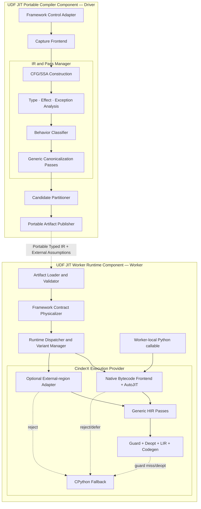
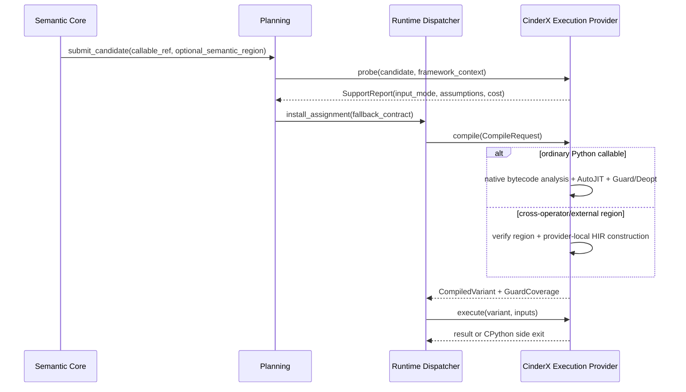

# Python UDF JIT 通用循环与类型特化 RFC

## 0.1 产品版本与密级

| 项目 | 内容 |
| --- | --- |
| 产品/组件 | Python UDF JIT / Scalar Python Execution Provider |
| 设计范围 | 通用循环/类型特化语义、Provider-neutral 分析、CinderX HIR/LIR 能力与迁移期 Lowering |
| 目标版本 | Semantic Core IR v2（P0 已实现） |
| 密级 | 内部 |

## 0.2 RFC 元信息

| 项目 | 内容 |
| --- | --- |
| 状态 (Status) | Implemented prototype；Provider 信息归属按 2026-08-06 专项架构迁移 |
| 作者 (Authors) | Python UDF JIT 项目组 |
| 创建日期 (Created) | 2026-08-03 |
| 更新日期 (Updated) | 2026-08-06 |
| 相关 Issue/PR | TBD；进入 Reviewing 前必须创建并回填 |
| 上游设计 | `docs/design/2026-07-13-python-udf-jit-architecture.md` |
| 信息归属设计 | `docs/design/2026-08-06-multi-provider-information-ownership-architecture.md` |
| 证据输入 | `docs/reports/2026-08-03-fineweb-udfjit-cinderx-backend-opportunity.md`、`docs/reports/2026-08-03-generic-loop-type-specialization-validation.md` |

## 0.3 修订记录

| 版本 | 日期 | 修订人 | 修订说明 |
| --- | --- | --- | --- |
| V0.1 | 2026-08-03 | Python UDF JIT 项目组 | 首次提出“行为分类 × 类型系统 × 通用 Pass”设计，废弃业务语义 opcode 方案。 |
| V0.2 | 2026-08-03 | Python UDF JIT 项目组 | 完成 P0 typed CFG/SSA、循环/归约分析、Unicode property backend、全链路诊断和穿刺 A/B；P1 builder/FSM/full-pipeline 仍开放。 |
| V0.3 | 2026-08-04 | Python UDF JIT 项目组 | 删除 whole-loop helper 路径，完成 CinderX generic HIR/LIR、immutable lookup、bool-class FSM、sequence builder、closure devirtualization、generator failure cache、全链诊断和 FineWeb 200K A/B。 |
| V0.4 | 2026-08-06 | Python UDF JIT 项目组 | 按多后端信息归属架构修正 CinderX 对接：普通 callable 由 CinderX 自行分析、Guard 和 Deopt；Typed Region 改为可选 external-region 输入，当前专用入口仅属穿刺期 Provider Plugin。 |

## 0.4 Keywords 关键词

Python UDF、Typed SSA、CFG、Loop、Iterator、Type Specialization、CinderX、AutoJIT、HIR、LIR、Deopt、Unicode。

## 0.5 Abstract 摘要

本文重新定义 UDF JIT 与 CinderX JIT 的组合优化边界：Semantic IR 不引入
`text.alnum_ratio_ge`、`text.translate_frozen`、`text.collapse_whitespace` 等业务复合操作，而以
带类型的 CFG/SSA 表达循环、分支、迭代、计算、调用、聚合构造和异常边。独立的 Behavior Profile
参考 CinderX AutoJIT，把程序按 Compute、Control、Object、Dispatch、Suspend、Dynamic 等行为维度
分类，用于准入、Pass 选择和成本控制，但不参与定义程序语义。

通用能力有两条触发路径：普通 Python callable 优先由 CinderX 原生 Bytecode Frontend 自行恢复 CFG、类型、
闭包/调用目标、行为分类和 Guard，再执行调用去虚拟化、generator inline、typed iterator、reduction、
immutable lookup 和 sequence builder 等 Pass；跨算子或没有等价 bytecode 的 Region 才由 Provider Plugin
重新验证 provider-neutral Typed Semantic IR 后构造 CinderX HIR。FineWeb 的 alphanumeric、punctuation、
whitespace 仅作为三类通用能力的验证 workload，不成为 IR 或后端中的函数名、算子名或专用 opcode。

## 0.6 缩略语清单

| 缩略语 | 英文全称 | 中文名 |
| --- | --- | --- |
| ABI | Application Binary Interface | 应用二进制接口 |
| CFG | Control-Flow Graph | 控制流图 |
| HIR | High-level Intermediate Representation | 高层中间表示 |
| IR | Intermediate Representation | 中间表示 |
| LIR | Low-level Intermediate Representation | 低层中间表示 |
| ROI | Return on Investment | 编译投入产出比 |
| SSA | Static Single Assignment | 静态单赋值 |
| UDF | User-Defined Function | 用户自定义函数 |

# 1 概述

## 1.1 简介

本提案建设一条不依赖业务函数名的组合优化链。UDF JIT Semantic Core 为跨算子和无 Python 前端的
Provider 提供通用 Typed Semantic IR；对普通 callable，CinderX 自己负责从 Python 程序恢复类型、
控制流、调用目标和 Guard，并完成动态准入、HIR 优化、Deopt 与机器码生成。UDF JIT 的同类分析只能
作为候选、诊断或可验证 external-region 输入，不能成为 CinderX 原生路径的隐含正确性依赖。

“通用”在本文中的定义是：来自不同框架、不同业务、不同源码写法的 UDF，只要拥有相同的控制结构、
基础操作和类型条件，就能由同一组编译 Pass 优化；改变类型、Effect、异常顺序或动态调用条件时，必须
生成不同特化或安全回退。

## 1.2 动机

现有 FineWeb 诊断揭示了三个事实：

1. Daft wrapper 的 CinderX HIR 停留在 `LoadCellItem + VectorCall`，精确 closure target 没有传播到
   后端；
2. `sum(genexpr)` 的父函数虽进入 JIT，循环仍在 generator 边界外，genexpr 又在 HIR→LIR 阶段以
   `std::get: wrong index for variant` 失败并重复编译；
3. 等价 native scan 对三个热点分别得到约 10.03x、13.21x、16.07x 的 stage-level 趋势，说明消除
   Python 逐元素 dispatch、boxing 和中间分配很有价值，但不能据此引入三个业务 intrinsic。

当前仓的正式 `SemanticOperation` 已有 `argument`、`constant`、`binary.*`、`compare.*`、`select`、
`modeled.call`、`branch`、`jump`、`return` 等通用基础，类型枚举也包含 `STRING` 和 `BOOL`。主要缺口是
优化 Lowering 仍以 float64 直线程序为主，尚无通用 loop/phi/typed iterator/sequence builder 表达，
因而字符串候选在 Driver schema gate 前终止。

若把三个 FineWeb 算子直接固化成 Semantic IR opcode，会带来以下问题：

- IR 被 Data-Juicer 当前实现形状污染；
- 等价但写法不同的程序仍需不断增加 matcher；
- 业务语义、语言语义、运行时 ABI 和机器实现混在同一层；
- 无法自然复用到数值循环、容器扫描、校验器、编码转换等其他 UDF；
- CinderX 的通用类型推断、Guard、Deopt 和 ROI 治理被绕过。

## 1.3 目标

### 1.3.1 目标

1. 定义 Behavior Profile、Typed Semantic IR、Optimization Analysis 三者的独立职责。
2. 为直线、分支、循环、迭代、归约、查表转换和可变长序列构造提供通用表示。
3. 让类型成为独立维度，至少表达 exact Python type、逻辑元素类型、nullability、boxed/unboxed 和
   运行时 Guard 要求。
4. 普通 callable 复用 CinderX AutoJIT 的行为分类、动态阈值、Guard、Deopt 与负 ROI backoff，不在
   UDF JIT 中复制第二套 CinderX JIT 生命周期。
5. 仅对跨算子或无 bytecode Region，通过 Worker-local CinderX Provider Plugin 保留循环和类型事实；
   不把 CinderX HIR/LIR 写入可移植 Artifact，也不把该入口变成 UDF JIT Core 专属 SPI。
6. 任何优化 Pass 不得读取业务模块名、函数名、pipeline 名或 Data-Juicer 算子名。
7. 以多个业务域、多个源码写法验证同一通用 Pass，并在 diagnostics=off 的独立进程完成性能资格。
8. 组合优化的正式 full-pipeline 目标明显高于单独 CinderX 约 10% 的预期收益。

### 1.3.2 非目标

1. 不承诺优化任意 Python 循环、任意正则、任意容器协议或带未知副作用的函数。
2. 不把 AutoJIT `StructureKey` 当作 Semantic IR，也不以行为分类证明程序等价。
3. 不在 Portable Artifact 中传输 CinderX HIR、LIR、机器码、裸指针或 Worker-local type feedback。
4. 不在本 RFC 中设计算子重排、跨 UDF fusion、Daft LogicalPlan 重写或批量 Arrow SIMD 主线。
5. 不将诊断运行的耗时用于性能发布结论。
6. 不在第一阶段完整实现通用正则引擎；常量正则 automaton lowering 单独分期。

# 2 用例分析

## 2.1 用例一：不同写法的归约循环

以下程序应经过不同 Source/Bytecode/Capture 节点，最终形成同构的 typed loop/reduction：

- generator expression + `sum`；
- 显式 `for` + accumulator；
- comprehension 后聚合，但仅在中间容器可证明不被观察时消除分配；
- 数值数组求和、字符类别计数、满足谓词的记录计数。

验收重点是 `IteratorLoop + Predicate + Reduction`，而不是某个字符函数。

## 2.2 用例二：不可变查表转换

以下程序共享 `IteratorLoop + ImmutableLookup + SequenceBuilder`：

- `str.translate` 与冻结 mapping；
- 枚举值重编码；
- 小型字符映射；
- 对 tuple/list 中有限值进行映射。

mapping 可作为 module constant、closure constant 或字面量构造，但只有 identity/content/version 可冻结、
查找与异常语义可建模时才允许特化。

## 2.3 用例三：循环状态机

连续空白压缩只是 `IteratorLoop + BranchFSM + SequenceBuilder` 的一个实例。同一能力还可覆盖 run-length
处理、转义、简单 tokenizer 和协议扫描。常量正则只有在能编译为受限 finite-state automaton 且替换语义
完全可证明时才进入此路径，否则保留 `modeled.call` 或 `python.region`。

## 2.4 用例四：必须拒绝或回退的程序

- 自定义 iterator、`str` subclass 或可覆写特殊方法；
- 循环体包含 IO、全局写、反射、未知 C Extension 或不可排序异常；
- closure/global 在编译后可变且无版本 Guard；
- generator 的 `send/throw/close`、外部可观察 frame 或一般协程语义；
- 动态 regex、动态 replacement、动态 mapping；
- 类型反馈变化、Deopt 频繁或编译成本高于收益。

## 2.5 性能、可靠性与可测试性要求

| 属性 | 要求 |
| --- | --- |
| 功能正确性 | 与 CPython 结果、异常类型、异常顺序、副作用和可观察对象行为一致 |
| 通用性 | 每个核心 Pass 至少由 3 种源码形态、2 种业务场景触发；实现中无业务标识匹配 |
| 性能 | diagnostics=off 的 full-pipeline A/B 明显高于 10%；编译、Deopt、fallback 成本闭账 |
| 可靠性 | Gate/Verifier/Lowering/Codegen 任一失败均不改变原 UDF 业务结果 |
| 可诊断性 | Source→Bytecode→Capture→Behavior→Typed IR→HIR→LIR→Machine 可追踪 |
| 兼容性 | CPython/CinderX 小版本、Unicode 数据版本、Artifact IR 版本严格绑定 |
| 安全性 | 不执行控制端用户代码，不把源码正文或业务值默认写入诊断 Bundle |

# 3 方案设计

## 3.1 总体方案

设计采用三个互相正交的模型：

1. **Behavior Profile**：描述代码形态与风险，用于准入、Pass 调度和 ROI；
2. **Typed Semantic IR**：描述程序语义，采用 CFG/SSA、通用操作和独立类型系统；
3. **Derived Analyses**：识别 IteratorLoop、Reduction、BranchFSM、ImmutableLookup、BuilderLoop 等优化
   机会，结果可失效、可重算，不成为业务 opcode。

### 3.1.1 架构图

下图只展开现有架构中的 Semantic Core、Planning 与 CinderX Provider。普通 callable 与可选 external
Semantic Region 是两条并存输入，不引入 CinderX 专属 Core 接口。



### 3.1.2 上下文与逻辑接口

| 逻辑接口 | 来源模块 | 目标模块 | 本 RFC 的变化 |
| --- | --- | --- | --- |
| `IF-CAPTURE-REQUEST-API` | Framework Control Adapter | Capture Frontend | 形成 callable/Semantic Candidate 和 provenance，不增加业务算子 |
| `IF-IR-PIPELINE-API` | Capture Frontend | IR and Pass Manager | 输出 Semantic Core IR v2 与可重算分析 |
| `IF-PARTITION-API` | IR and Pass Manager | Candidate Partitioner | Capability 以 pattern、type、effect 表达 |
| `IF-ARTIFACT-CONTRACT` | Publisher | Worker Loader | 可选携带 v2 Typed IR、External Assumption 和兼容要求 |
| `IF-EP-CAPABILITY-API` | CinderX Provider | Target Binder | 声明 callable/external-region 输入能力、类型、Assumption 与 Side Exit |
| `IF-EP-COMPILE-API` | Variant Manager | CinderX Provider | 中立 CompileRequest；返回 Variant + GuardCoverage，不输入业务 opcode |

### 3.1.3 编译流程



## 3.2 Behavior Profile 设计

Behavior Profile 是 provider-neutral 的候选分析，可由 UDF JIT verified IR 重算，供没有 Python 前端的
Provider 和跨 Provider Partitioner 使用；CinderX callable 路径继续使用自己的 `StructureKey`/AutoJIT，
不把 UDF JIT Profile 当作正确性或准入必需输入。建议中立模型：

```text
BehaviorProfile {
  family: NumericLoop | BranchFSM | ObjectManipulator |
          CallDispatcher | AsyncStateMachine | ReflectionMeta |
          Trivial | Mixed,
  work_dimension_counts: {
    compute, control, object, dispatch, suspend, dynamic
  },
  active_dimension_mask,
  loop_count,
  loop_nesting_depth,
  backedge_count,
  code_size_bucket,
  risk_reason: suspend | dynamic | exception | huge_code,
  estimated_boxing_edges,
  estimated_dynamic_dispatches
}
```

约束：

- Profile 是 Analysis，不是 Semantic Operation；
- Driver 的 Profile 只是候选提示；接收 external Region 的 Provider 必须从验证后的 IR 重算，拥有 callable
  原生前端的 Provider 可以忽略；
- Profile 不进入 semantic hash；若随 Artifact 携带，只能作为有版本、可校验、可丢弃的 hint；
- CinderX 最终编译阈值还必须结合真实 call count、deopt count、compile time 和 negative ROI backoff；
- wrapper 与解析后的 closure target 分别分类，不能用 wrapper 的 `CallDispatcher` 形态覆盖真实循环。

## 3.3 Typed Semantic IR v2 设计

### 3.3.1 行为与类型正交

IR 使用基本块、block argument（或等价 Phi）和控制边表达行为；每个 Value 独立携带 Type。相同循环
结构可以作用于不同类型，类型改变不需要复制 loop opcode。编译能力由三个正交条件的交集决定：

```text
可优化区域 = 结构 Pattern × Type Specialization × Effect/Exception 合法性
```

| 结构 Pattern | int64/float64 | exact `str` | exact `list<T>` | unknown object |
| --- | --- | --- | --- | --- |
| iterator loop | unboxed index/value | Unicode storage iterator | element-layout iterator | Python iterator protocol |
| reduction | typed accumulator | property/count accumulator | typed element accumulator | boxed update 或回退 |
| branch/FSM | typed compare | Unicode property/compare | typed element compare | dynamic dispatch 或回退 |
| lookup + builder | typed table/buffer | Unicode table/string builder | typed table/list builder | modeled call 或回退 |

表中的行是从 CFG 推导的 Analysis，不是业务 opcode；列是 Value/容器的类型事实，不是行为分类。具体
Lowering 只有在 Effect、异常顺序和 Deopt 续接也能证明时才成立。因此“字符计数”和“整数条件计数”可
共用 loop/reduction Pass，只在 typed iterator、谓词 primitive 和 accumulator lowering 上不同。

### 3.3.2 通用操作族

| 操作族 | 最小操作 | 说明 |
| --- | --- | --- |
| 数据流 | `argument`、`constant`、`phi/block_arg` | 不绑定业务字段名 |
| 控制流 | `branch`、`jump`、`return`、`raise` | 显式异常/退出边 |
| 计算 | `binary.*`、`compare.*`、`cast`、`select` | 类型决定整数、浮点、Unicode 实现 |
| 迭代 | `iter.begin`、`iter.next`、`sequence.length` | iterator protocol 与 exact fast path 分离 |
| 调用 | `call.direct`、`modeled.call`、`python.region` | direct target 必须绑定 dependency/version Guard |
| 访问 | `sequence.get`、`mapping.lookup`、`field.load` | 物理布局在 Worker 绑定 |
| 构造 | `sequence.builder.create/append/finish` | 泛化到字符串、bytes、list 等可变长输出 |
| Unicode | `unicode.read`、`unicode.property` | 语言/数据类型 primitive，不表达业务复合算子 |

`unicode.property` 的参数来自 CPython/Unicode 语言合同，例如 alphabetic、decimal、digit、numeric、
whitespace；`str.isalnum` 的 call model 可以展开为这些 primitive 的组合。它不携带 FineWeb 阈值或
Data-Juicer 名称。

### 3.3.3 类型模型

现有平坦 `LogicalType` 扩展为可参数化类型描述：

```text
ScalarType  = bool | int64 | float64 | unicode.scalar | ...
PythonType  = exact_unicode | unicode_subclass | exact_list<T> | object
IRType      = ScalarType |
              iterator<T> |
              sequence<T, representation> |
              mapping<K, V, mutability> |
              builder<T, output_type> |
              python_object<exactness>
```

每个 Value 同时记录：

- nullability；
- boxed/unboxed representation；
- exact/subclass/unknown；
- ownership/borrowed 状态仅在 Provider IR 补充，Portable IR 不携带裸地址；
- Guard requirement 与来源；
- 类型证据是静态 Schema、closure 常量、CPython specialization feedback 或 runtime guard 中的哪一种。

### 3.3.4 Effect、异常与 Deopt

现有 `effect`、`may_raise`、`exception_order` 继续作为每个 Operation 的正式语义。Loop transformation 必须
证明：

- 迭代顺序不变；
- 可观察调用次数不变；
- 异常顺序和 traceback 续接点可恢复；
- 未知调用不跨越或被复制；
- fast path guard 在产生外部副作用之前完成；
- 提交点后只允许精确 Deopt/Side Exit，不允许整函数重放。

## 3.4 通用 Analysis 与 Pass 设计

Pass 不识别业务函数，而识别 IR 结构、标准语言 call model 和类型条件。

| Pass/Analysis | 输入条件 | 输出或作用 | 可复用场景 |
| --- | --- | --- | --- |
| `ClosureTargetPropagation` | closure cell identity/version 可冻结 | `call.direct` + dependency guard | 所有 wrapper/高阶函数 |
| `GeneratorInline` | generator 不逃逸，无 send/throw/close 观察 | 把 generator CFG 内联到调用者 | generator reduction、comprehension |
| `TypedIteratorSpecialization` | exact built-in sequence/iterator | 去协议 dispatch，形成 typed loop | str/list/tuple/range 等 |
| `LoopCanonicalization` | reducible CFG、合法 exception edges | 统一 preheader/header/latch/exit | 所有循环优化 |
| `ReductionRecognition` | loop-carried value + associative/ordered update | unboxed accumulator | count/sum/min/max 等 |
| `ImmutableLookupSpecialization` | mapping 内容与版本冻结 | 小表 switch/查表或 runtime helper | translate、枚举重编码 |
| `SequenceBuilderLowering` | builder 不逃逸、输出类型确定 | 预分配/增长策略、消除中间对象 | str/bytes/list 构造 |
| `ConstantRegexAutomaton` | pattern/replacement/flags 常量且语义受支持 | 通用 automaton region | 多种常量正则替换/扫描 |
| `BoxingAndRefcountElimination` | value 生命周期与 deopt state 可证明 | 移除每迭代对象分配/refcount | 数值和字符扫描 |

Pass 必须声明依赖的 Analysis 与失效集合。Pattern 识别结果作为 `LoopAnalysis`、`ReductionAnalysis`、
`BuilderAnalysis` 等派生对象存在，不进入 IR opcode 或业务 Artifact 字段。

## 3.5 CinderX 对接设计

### 3.5.1 选定方案

采用“双路径、同一 CinderX 后端能力”方案：

1. 普通 Python callable 优先走 CinderX 原生 Bytecode Frontend，由 CinderX 自行分析 CFG、类型、
   closure/global、调用目标、Behavior、Guard 和 Deopt；
2. 只有跨 UDF/算子、框架融合后没有等价 bytecode 的 Region，才由 CinderX Provider Plugin 接收
   verified provider-neutral Typed IR，并在 Worker 内构造 HIR。

理由：

- 保持 CinderX 随 CPython 单独使用时仍能触发同一套通用优化；
- 避免把 UDF JIT 的 Behavior、类型或 dependency hash 变成 CinderX 原生路径的正确性依赖；
- 避免用业务专用 bytecode 重新编码结构化循环；
- 避免把 CinderX HIR 变成跨版本协议；
- external Region 仍可保留 loop-carried value、Effect、异常和 provenance；
- 可直接复用 CinderX `GuardType`、`TUnicodeExact`、HIR CFG、Phi、simplify、LIR 和 codegen；
- external-region 版本耦合被限制在 Worker Provider Plugin，与现有 ABI pinning 一致。

当前 `compile_typed_region` 是第二条路径的穿刺入口，不是目标 Provider SPI，也不代表普通 callable 必须
先经过 UDF JIT Typed IR。目标中立接口见[多后端信息归属与接入架构](2026-08-06-multi-provider-information-ownership-architecture.md)。

### 3.5.2 CinderX 适配范围

CinderX Core 侧允许增加可由普通 callable 触发的通用能力：

1. exact closure target Guard/inline、generator HIR→LIR 修复和确定性编译失败负缓存；
2. exact built-in iterator、Unicode storage/classification、immutable lookup 和 sequence builder 的通用
   HIR/LIR lowering；
3. 从普通 CallMethod/VectorCall/loop 形态触发上述能力的原生 HIR Pass；
4. CinderX 自有 Behavior Profile/StructureKey、runtime ROI、Guard/Watcher/Deopt；
5. 通用 HIR/LIR/machine provenance、Pass 统计和诊断导出。

CinderX Provider Plugin 可以保留受版本控制的 external-region HIR construction adapter、Framework
Descriptor bridge 和迁移期属性；在没有多个非 UDF producer 之前，不把它们提升为 CinderX 公共 API。

CinderX 侧禁止出现：

- `dj_alphanumeric_ok` 等函数名；
- Data-Juicer、FineWeb、Daft pipeline 标识；
- 固定的六字符业务映射；
- `collapse_whitespace` 等业务复合 HIR opcode。
- 以 `__udf_jit_*`、`JITRT_Udf*` 命名的公共上游接口。

### 3.5.3 准入与版本选择

普通 callable 的编译准入由 CinderX 自己闭环：

```text
CinderX_verified_python_semantics
AND supported_type_specialization
AND dynamic_ROI_gate
AND CinderX_guard_deopt_coverage
```

- `CinderX_verified_python_semantics`：CinderX Bytecode/HIR、Effect/Exception 与调用语义；
- `supported_type_specialization`：CinderX runtime exact type/ABI capability；
- `dynamic_ROI_gate`：CinderX call threshold、Behavior family、risk、compile/deopt feedback 和 backoff。
- `CinderX_guard_deopt_coverage`：CinderX 自有 Guard/Watcher/Deopt 覆盖所有代码依赖。

external Region 还必须经过 UDF JIT Verifier、Provider 二次验证和 Runtime `GuardCoverage` 发布门禁。UDF JIT
Behavior Profile、`runtime_dependency_hashes` 和 plan 字段不能补足缺失的 CinderX Guard。

任何一项失败都选择 CPython continuation 或已有泛化 Variant，不造成作业失败。

## 3.6 FineWeb workload 的通用 Lowering 示例

### 3.6.1 Alphanumeric

```text
GeneratorInline
→ TypedIteratorSpecialization<exact_unicode>
→ Unicode property modeled call
→ LoopCanonicalization
→ ReductionRecognition<int64>
→ BoxingAndRefcountElimination
```

### 3.6.2 Punctuation

```text
Closure/Constant Propagation
→ modeled str.maketrans/str.translate
→ TypedIteratorSpecialization<exact_unicode>
→ ImmutableLookupSpecialization
→ SequenceBuilderLowering<exact_unicode>
```

### 3.6.3 Whitespace

```text
Constant pattern/replacement validation
→ ConstantRegexAutomaton（后续阶段）
→ BranchFSM loop
→ TypedIteratorSpecialization<exact_unicode>
→ SequenceBuilderLowering<exact_unicode>
```

这三个序列只出现在设计示例和测试配置中；实现注册表按通用 Pass 与 CPython call model 注册。

## 3.7 诊断设计

`full` 模式为每一层增加可读产物：

| 层 | 产物 |
| --- | --- |
| Source/Bytecode | source range/text policy、original bytecode/disassembly |
| Capture | Capture IR、CFG、closure/dependency identity |
| Behavior | `analysis/behavior-profile.json`，含 family/dim/loop/risk 与推导证据 |
| Type | `analysis/type-evidence.json`，含 value→type、exactness、guard source |
| Semantic | Typed Core IR v2、block/edge/value、Effect/Exception |
| Pattern Analysis | loop/reduction/builder 等派生分析及 pass 前后差异 |
| CinderX | HIR pre/post、deopt/guard、pass timings、compile stats |
| Backend | LIR pre/post、machine range、normalized perf samples |
| Provenance | Source↔Bytecode↔IR↔HIR↔LIR↔Machine 映射 |

诊断运行必须使用专属 Worker，`off` 路径不构造上述对象、不写 Bundle、不启用 HIR/LIR dump。正式 A/B
固定 `UDFJIT_DIAGNOSTICS=off` 与 `PYTHONJITUDFDIAGNOSTICS` unset/off。

## 3.8 分阶段实施与性能设计

| 阶段 | 交付 | 代表验证 | 性能目的 |
| --- | --- | --- | --- |
| P0-A | Core IR v2：block arg/phi、loop、typed iterator、参数化类型、参考解释器 | 数值循环、显式字符计数 | 建立通用语义基线 |
| P0-B | ClosureTargetPropagation、GeneratorInline、LoopCanonicalization、ReductionRecognition | alphanumeric + 非文本 reduction | 消除 generator/boxing/dispatch |
| P0-C | Worker HIR Builder、exact type guard、AutoJIT/ROI 接入、失败负缓存 | 多类型 iterator loop | 形成真实 UDF JIT→CinderX 链 |
| P1-A | ImmutableLookupSpecialization、SequenceBuilderLowering | punctuation + 无关标量映射 | 已完成 exact-str / Unicode scalar subset |
| P1-B | Bool-class FSM + SequenceBuilderLowering | whitespace + 无关 run collapse | 已完成；更一般分类类型仍分期扩展 |
| P2 | 更多容器、复杂异常边、OSR/loop versioning | 跨业务 corpus | 扩展覆盖率 |

历史 stage share 下，alphanumeric 与 punctuation 两项原型合计对应约 20.07% 的 E2E 时间下降投影
（约 1.251x）；加入 whitespace 后为约 25.97%（约 1.351x）。这些数字只用于排序阶段，不是 RFC
验收值。正式验收以 real-model full-pipeline diagnostics-off A/B 为准。

## 3.9 技术选型

| 方案 | 结论 | 原因 |
| --- | --- | --- |
| 三个业务 Semantic opcode | 拒绝 | 抽象层过高、业务耦合、无法复用 |
| 按函数名/source hash 匹配 | 拒绝 | 不安全，不支持等价写法 |
| 固定 bytecode 序列 matcher | 拒绝 | CPython 版本和源码形态敏感 |
| 仅使用 AutoJIT StructureKey | 拒绝 | 适合准入，不足以表达程序语义和类型 |
| Portable Artifact 携带 CinderX HIR | 拒绝 | 破坏 provider/版本边界 |
| 大量业务专用 bytecode | 拒绝为主路径 | 难以表达 CFG/SSA/Deopt，信息损失大 |
| Generic Typed IR + Worker HIR Builder | 采用 | 保留语义和类型，复用 CinderX 后端，版本耦合局部化 |
| 立即引入 MLIR/LLVM 新栈 | 本期拒绝 | 构建、ABI、Deopt 和维护成本过高 |

## 3.10 功能与性能设计

功能交付以“IR 能表达、Verifier 能拒绝、Reference Executor 能执行、CinderX 能 Lower、诊断能追踪”五个
门禁推进。任何只完成 matcher、没有 generic IR 和 reference semantics 的实现不得进入 CinderX
codegen。

性能测试分三层：

1. Pass microbench：编译时间、IR node/dispatch/boxing/allocation 变化；
2. stage A/B：同输入、同语义、独立进程、diagnostics off；
3. full pipeline A/B：框架、模型、数据和资源绑定一致，输出 schema/order/value/exception 一致。

## 3.11 安全隐私与 DFX 设计

### 3.11.1 可靠性

- Driver 不执行用户 UDF；Worker 重新验证 Artifact、Profile 和类型合同；
- HIR Builder 失败进入负缓存，不逐行重复编译；
- CinderX compile/deopt failure 不替换业务异常；
- fast path 发布前完成代码、Guard 和 deopt metadata 的原子校验。

### 3.11.2 安全与隐私

- closure 常量只保存类型、稳定摘要和必要的安全编码；默认不记录明文业务值；
- source text 仍由显式诊断策略授权；
- Artifact Verifier 对节点数、边数、类型递归深度、常量大小和 builder 上限设硬限制；
- HIR/LIR/机器码永不作为可信输入重新执行。

### 3.11.3 兼容性

- Semantic Core IR 升级为 v2；v1 Artifact 保持可读并继续走原标量路径；
- Worker capability 不支持 v2 时 fail closed 到 CPython，不把 v2 降级解释成 v1；
- CPython/CinderX SOABI、Unicode 数据版本和内部 HIR adapter version 进入 Variant Key；
- CinderX 升级必须运行 IR→HIR snapshot、deopt 和 RuntimeTests。

### 3.11.4 可维护性与可测试性

- 每个 Pass 只依赖 IR 接口，不依赖 Daft/Data-Juicer 模块；
- call model 按 CPython 稳定语言/内建语义组织并独立版本化；
- positive corpus 要求跨业务，negative corpus 覆盖 effect/type/exception/dynamic 边界；
- 代码审查门禁扫描禁止的业务标识进入 compiler/provider 目录。

## 3.12 编程与调用设计

本特性不提供面向普通 UDF 作者的新 API；用户继续编写普通 Python 函数。以下接口是项目内部 SPI。

### 3.12.1 编程模型基本设计

- **开发环境设计：** CPython 3.14、与其 ABI 对齐的 CinderX、Python UDF JIT RuntimeTests、IR
  snapshot/differential harness 和受控 AArch64 实验环境。
- **开发约束：** 新 IR 节点必须同时具备 verifier、canonical codec、reference executor、diagnostics
  printer、negative tests；新 CinderX lowering 必须具备 guard/deopt 和 HIR/LIR 证据。
- **可验收设计：** 先通过 IR 差分与跨业务 corpus，再运行 stage/full-pipeline A/B；性能测试关闭诊断。

### 3.12.2 接口定义与设计

#### 3.12.2.1 Behavior Analysis SPI

接口描述：从 verified Semantic Core IR v2 重算行为分类，供 Partitioner、Explain 和 Worker Admission
使用。

接口原型：

```text
analyze_behavior(module: VerifiedSemanticCoreModuleV2) -> BehaviorProfile
```

输入/输出参数：

| 参数名称 | 输入/输出 | 类型 | 描述 | 取值范围 |
| --- | --- | --- | --- | --- |
| `module` | 输入 | VerifiedSemanticCoreModuleV2 | 已完成结构、类型、Effect 校验的模块 | Semantic IR v2 |
| `profile` | 输出 | BehaviorProfile | 可重算行为与风险摘要 | 不含业务标识 |

返回参数：

| 参数名称 | 类型 | 描述 | 取值范围 |
| --- | --- | --- | --- |
| result | BehaviorProfile | family、维度计数、循环和风险 | 版本化结构 |

- 异常处理：IR 未验证或含未知节点时返回有限 reject code，不生成猜测分类。
- 约束说明：Worker 必须重算；不得直接信任 Driver hint。
- 变更说明：新增内部 SPI，不形成第三方 API。
- 调用参考代码：`profile = analyze_behavior(verify_semantic_v2(module))`。

#### 3.12.2.2 Provider-neutral Compile SPI

接口描述：Runtime 以中立请求调用 CinderX Provider；Provider 自行选择 callable 原生前端或 external-region
adapter，并返回 GuardCoverage。当前 `cinderx.jit.compile_typed_region` 只由 Provider Plugin 内部调用。

接口原型：

```text
provider.probe(candidate, context) -> SupportReport
provider.compile(request: CompileRequest)
  -> CompiledVariant | Deferred | Unsupported | CompileFailure
```

输入/输出参数：

| 参数名称 | 输入/输出 | 类型 | 描述 | 取值范围 |
| --- | --- | --- | --- | --- |
| `request.source_callable` | 输入 | WorkerLocalCallable? | CinderX 普通函数首选输入 | Worker-local |
| `request.semantic_region` | 输入 | VerifiedTypedRegion? | 跨算子/无 bytecode 的可选输入 | Semantic IR v2 subset |
| `request.framework_contract` | 输入 | FrameworkContract | schema、null、binding、layout/epoch | Worker 物理化 |
| `request.external_assumptions` | 输入 | ExternalAssumption[] | Provider 无法自行恢复的外部条件 | 有来源和失效方式 |
| `request.profile` | 输入 | RuntimeProfile? | call/deopt/ROI/转换成本 Hint | 可省略 |
| result | 输出 | CompileDecision | variant + GuardCoverage 或有限原因码 | 不抛业务异常 |

返回参数：

| 参数名称 | 类型 | 描述 | 取值范围 |
| --- | --- | --- | --- |
| result | CompileDecision | 编译、延迟、不支持或失败 | 有限状态集合 |

- 异常处理：内部错误转换为 compile failure 并写负缓存；业务执行继续 CPython 路径。
- 约束说明：两种输入至少一个有效；不得跨 Worker 复用 HIR/机器码；不得接受未验证 external Region；
  Hint 缺失不得改变正确性。
- 变更说明：替代 CinderX 专属 Core SPI；穿刺期 typed-region 入口下沉为 Provider 私有实现。
- 调用参考代码：`decision = provider.compile(compile_request)`。

### 3.12.3 编程手册设计

更新 `docs/USERGUIDE.md` 的诊断章节，增加 Behavior/Type/Pattern Analysis 产物说明；新增开发者文档
“Semantic Core IR v2 节点与 Pass 编写规则”。普通 UDF 用户手册不暴露内部 IR 或 CinderX SPI。

## 3.13 实现状态

| 设计项 | 状态 | 实现位置 |
| --- | --- | --- |
| Typed CFG/SSA、block argument、类型和 canonical codec | 已实现 | `compiler/typed_ir.py`、`typed_verifier.py`、`typed_reference.py` |
| Behavior / Type / Pattern 独立分析 | 已实现 | `compiler/typed_analysis.py` |
| generator/显式循环的通用 capture | 已实现 P0 subset | `compiler/typed_frontend.py` |
| Worker ROI、重分析、正/负缓存、规范 lowering | 已实现 | `provider/scalar_python/typed_loop.py` |
| 默认值/closure/global/builtin 运行时依赖 Guard | 已实现 UDF JIT 外围 Guard；未对接 CinderX 原生 Guard/Deopt | `compiler/typed_frontend.py`、`provider/scalar_python/typed_loop.py` |
| exact Unicode property 标量访问和归约 | 已实现，覆盖 6 种 property | CinderX `UnicodeData/Kind/Read/Classify` + 普通 CFG/HIR |
| Source→Bytecode→IR→HIR→LIR→Machine provenance | 已实现 | `diagnostics/worker_runtime.py` + CinderX startup-gated provenance |
| SequenceBuilder、ImmutableLookup、bool-class FSM | 已实现 exact-str subset | CinderX `PrimitiveTable*`、branch、`SequenceBuilder*` |
| closure wrapper 去虚拟化/内联 | 已实现 | exact closure target `GuardIs` + generic inliner |
| generator 编译稳定性和确定性失败负缓存 | 已实现 | 普通 generator lowering + bounded negative cache |
| FineWeb 200K 简单 A/B | 已完成 | 执行耗时下降 18.36%，端到端下降 18.19% |
| Provider-neutral SPI、GuardCoverage、CinderX callable-first | 待迁移 | 目标边界见 2026-08-06 多后端信息归属架构 |

当前实现不含 `UnicodeCountProperty` 等整段循环 HIR。后端必须从已验证的 CFG、类型、表和 builder
数据流构造普通 CinderX HIR；任一事实不成立即返回 unsupported。实现与最终验证证据见
`docs/reports/2026-08-04-generic-sequence-patterns-validation.md`。

上述 FineWeb 收益来自当前 external typed-region 穿刺路径，只证明通用 HIR/LIR 机制有优化潜力。它不证明
UDF JIT 的 Guard、Behavior 或 plan 字段是 CinderX 必需输入，也不等价于 callable-first 目标路径已经完成。

# 4 缺点和风险

| 风险 | 影响 | 应对措施 |
| --- | --- | --- |
| Core IR v2 范围明显扩大 | 实现和验证成本上升 | 分 P0/P1；所有节点先有 reference semantics |
| CinderX HIR 内部 API 不稳定 | 升级维护成本 | adapter version + ABI pinning + snapshot/RuntimeTests |
| generator/exception Deopt 很复杂 | 错误续接或重复副作用 | 首期只内联不逃逸、低风险 generator expression |
| 参数化类型增加 verifier 复杂度 | 恶意或损坏 Artifact 风险 | 递归/节点/常量硬限制，Worker 重验 |
| 通用 Pass 仍可能隐含 workload 假设 | 伪通用、后续不可维护 | 跨业务 corpus + 禁止业务标识扫描 + reviewer gate |
| 编译时间抵消收益 | full pipeline 退化 | AutoJIT threshold、Behavior risk、negative ROI backoff |
| Unicode/regex 语义复杂 | 边界错误 | exact type/version Guard；regex 延后并限制语义子集 |
| external-region HIR Builder 耦合 CinderX | 双仓协调成本 | 只存在版本绑定 CinderX Provider Plugin；普通 callable 优先原生前端 |
| Breaking Change：IR v2 | 旧 Worker 无法加载 | 显式版本拒绝并回退，v1/v2 双读过渡 |

# 5 现有技术

1. CinderX AutoJIT `behavior_classifier` 已提供 Family、WorkDim、loop score、risk、code size 与动态阈值，
   本提案复用其准入思想，但不把 StructureKey 当作 IR。
2. CinderX HIR 已具备 CFG、Phi、GuardType、exact built-in type、Unicode compare/subscript、Deopt 和
   LIR/codegen 基础；目标优先补普通 callable 的 iterator/Unicode/lookup/builder 识别与 lowering，
   external typed-region construction 只是可选 Provider 输入。
3. 当前 Python UDF JIT Semantic Core IR 已有通用 operation、type/effect/exception 字段、canonical codec、
   verifier、region graph 和 provenance，可演进为 v2，而无需引入全新编译框架。
4. 编译器领域的 CFG/SSA、loop canonicalization、reduction、escape analysis、automaton lowering 是成熟
   模式；本项目重点是保持 CPython 对象、异常、Deopt 与框架边界。

# 6 未解决问题

1. Core IR v2 使用显式 `phi` 还是 block argument？建议在详细设计中选择一种，不能并存。
2. 是否存在除 UDF JIT 外第二个 external Semantic Region producer；若没有，adapter 固定留在 provider plugin。
3. Behavior Profile 若进入 Artifact，只能作为可忽略 Hint；是否值得为此升级 Artifact format？
4. 第一阶段 exact container 范围是仅 `str/range/tuple/list`，还是先限制为 `str/range`？
5. generator expression 的最小合法子集和精确 Deopt 位置如何定义？
6. Unicode property primitive 直接调用 CPython runtime table，还是复制稳定数据表？
7. `sequence.builder` 的 Portable 语义如何描述 allocation failure 和对象身份？
8. ConstantRegexAutomaton 是否属于本 RFC 的 P1，还是独立 RFC？
9. full-pipeline 正式性能门槛、样本数、CPU 隔离和噪声阈值需在验证计划中冻结。
10. RFC 进入 Reviewing 前必须创建并关联 Issue/PR。

# 7 附录

## 7.1 参考资料

- `docs/design/2026-07-13-python-udf-jit-architecture.md`
- `docs/design/2026-08-06-multi-provider-information-ownership-architecture.md`
- `docs/reports/2026-08-03-fineweb-udfjit-cinderx-backend-opportunity.md`
- `docs/reports/evidence/2026-08-03-fineweb-backend-diagnostics-summary.json`
- CinderX repository: `cinderx/Jit/behavior_classifier.h`
- CinderX repository: `cinderx/Jit/behavior_classifier.cpp`
- CinderX repository: `cinderx/Jit/hir/hir.h`
- `src/python_udf_jit/compiler/core_ir.py`
- `src/python_udf_jit/compiler/pipeline.py`
- `src/python_udf_jit/compiler/verifier.py`

## 7.2 术语表

| 术语 | 定义 |
| --- | --- |
| Behavior Profile | 从 verified IR 推导的程序形态、循环、风险和成本摘要，不定义程序语义 |
| Typed Semantic IR | 带 CFG/SSA、类型、Effect、异常和 fallback 信息的 provider-neutral IR |
| Pattern Analysis | 从 IR 派生的循环、归约、状态机、查表、builder 等可失效分析结果 |
| Call Model | 对 CPython/标准库稳定调用语义的版本化模型，不包含业务函数知识 |
| Typed Region | Candidate Partitioner 选择出的、由某 Provider 声明支持的 Typed IR 子图 |
| HIR Builder Adapter | CinderX Provider Plugin 内把可选 verified external Region 转换为当前 CinderX HIR 的版本化私有接口 |
| GuardCoverage | Provider/Dispatcher 对 consumed assumption 的机制、所有者、检查阶段和失败动作报告 |

## 7.3 文档更新计划

1. 已更新 `2026-07-13-python-udf-jit-architecture.md`，用 callable-first + Provider-neutral SPI 取代专用 Bytecode 主路径。
2. 新增 Semantic Core IR v2 详细设计，冻结节点、类型、Verifier 和 canonical codec。
3. 新增 CinderX callable 原生识别/优化功能设计；external-region HIR Builder 只做 Provider Plugin 详细设计。
4. 更新标量主线功能设计的支持范围、接口与 DFX；不直接修改历史版本而无修订记录。
5. 更新 USERGUIDE 和诊断 schema 文档。
