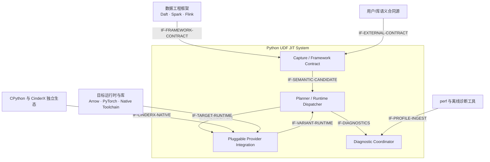
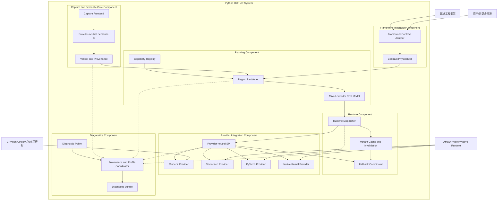
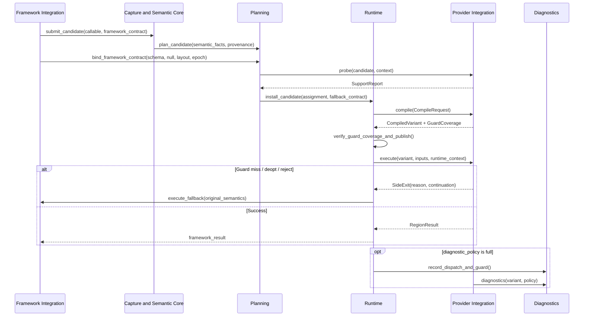
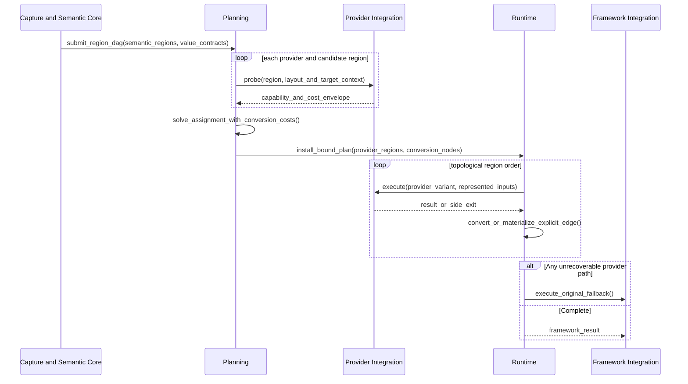

# Python UDF JIT 多后端信息归属与接入架构设计说明书

## 0.1 产品版本与密级

| 项目 | 内容 |
| --- | --- |
| 产品/方案 | Python UDF JIT / Pluggable Execution Providers |
| 文档版本 | 1.0 |
| 方案阶段 | 架构基线，待按阶段实现 |
| 密级 | 内部技术设计 |
| 适用范围 | UDF JIT Core、Framework Adapter、Runtime Dispatcher、CinderX/Vectorized/PyTorch/Native Kernel Provider |
| 上游架构 | [Python UDF JIT 架构设计说明书](2026-07-13-python-udf-jit-architecture.md) |

## 0.2 拟制信息

| 项目 | 内容 |
| --- | --- |
| 拟制日期 | 2026-08-06 |
| 拟制方式 | 基于 FineWeb、AD 穿刺实现、UDF JIT/CinderX Guard 与元数据消费审计，以及多后端演进需求形成 |
| 文档状态 | 方案已对齐；实现与 CinderX 上游评审尚未完成 |

## 0.3 修订记录

| 版本 | 日期 | 修订人 | 修订内容 |
| --- | --- | --- | --- |
| 1.0 | 2026-08-06 | Python UDF JIT 项目组 | 首版：冻结信息来源与归属、Provider-neutral SPI、Guard 责任、多后端混合分发、CinderX 补丁归属和迁移路径 |

## 0.4 Keywords 关键词

Python UDF、Execution Provider、Semantic IR、Framework Contract、CinderX、Vectorization、PyTorch、Native Kernel、Guard、Deopt、Capability、Mixed Dispatch、Diagnostics。

## 0.5 Abstract 摘要

本文解决 UDF JIT 与多个执行后端之间“信息由谁产生、正确性由谁负责、接口如何保持中立”的架构问题。核心结论是：UDF JIT 不应把 CinderX 能从 Python 程序和运行时自行得到的类型、控制流、调用目标、行为分类或 Guard 结论作为 CinderX 的正确性依赖；CinderX 仍须能够随 CPython 独立完成分析、Guard、Deopt 和优化。UDF JIT 的不可替代输入主要是数据工程框架合同、跨算子区域、外部语义合同和成本画像。

系统把跨边界信息分为 `Semantic Facts`、`External Assumptions` 和 `Optimization Hints`。Assumption 不是可直接执行的 Guard；Provider 必须声明是否支持，并以自身 Guard、Watcher、Deopt 或拒绝编译完成闭环。框架 Schema、Null、字段绑定、Layout 和任务 Epoch 等公共前置条件由 Runtime Dispatcher 守卫。Provider-local HIR/LIR、Torch Graph、LLVM IR 和机器码不进入可移植 Artifact。

UDF JIT 通过统一 Provider SPI 接入 CinderX、向量化、PyTorch 和 Native Kernel 后端，并允许按能力、转换成本和运行画像混合分区。CinderX Provider 优先接收原始 Python callable，复用 CinderX 原生前端；只有跨算子或已脱离 Python bytecode 的区域才考虑可选的 provider-neutral Semantic Region 输入。当前 `compile_typed_region`、`__udf_jit_typed_region__`、`__udfjit_value_cache__` 和 `JITRT_Udf*` 被定义为穿刺期内部接口，不直接视为 CinderX 上游公共 API。

## 0.6 List of abbreviations 缩略语清单

| 缩略语 | 英文全称 | 中文名 |
| --- | --- | --- |
| ABI | Application Binary Interface | 应用二进制接口 |
| CFG | Control Flow Graph | 控制流图 |
| EP | Execution Provider | 执行提供者/后端 |
| FSM | Finite State Machine | 有限状态机 |
| HIR | High-level Intermediate Representation | 高层中间表示 |
| IR | Intermediate Representation | 中间表示 |
| JIT | Just-in-Time Compilation | 即时编译 |
| LIR | Low-level Intermediate Representation | 低层中间表示 |
| ROI | Return on Investment | 投入产出比 |
| SPI | Service Provider Interface | 服务提供者接口 |
| SSA | Static Single Assignment | 静态单赋值 |
| UDF | User-Defined Function | 用户自定义函数 |

## 0.7 前言

FineWeb 和 AD 穿刺证明，逐字符循环、不可变查表、序列构造、闭包去虚拟化和重复编译抑制具有明确优化价值；但性能收益只能证明机制值得建设，不能证明穿刺接口的归属正确。若把 UDF JIT 已知的分析结论直接塞入 CinderX 并由 CinderX 无条件信任，会同时破坏 CinderX 的独立通用性和 UDF JIT 的多后端能力。

本文是总架构的专项细化，并取代通用循环 RFC 中“CinderX 必须消费 UDF JIT Guard、Behavior 分类和完整 Typed Region 才能优化”的宽泛表述。通用循环和类型特化能力仍然成立，但其触发信息、验真和优化实施必须按本文重新归属。

# 1 简介

## 1.1 目的

本文目的如下：

1. 冻结 UDF JIT、数据框架、Runtime Dispatcher 和各 Provider 的信息所有权。
2. 区分“信息可用”与“正确性依赖”，避免把提示误当作可信事实。
3. 定义不绑定 CinderX 的 Provider SPI、输入合同、输出 Variant 和诊断合同。
4. 定义 CinderX 原生 callable 路径与可选 Semantic Region 路径的边界。
5. 定义向量化、PyTorch、Native Kernel 与 CinderX 的混合分发和转换记账方式。
6. 给出当前 CinderX 补丁的保留、泛化、隔离或上游准入标准。
7. 为后续代码迁移、CinderX 上游评审和多后端实现提供统一验收基线。

## 1.2 范围

本文覆盖：

- Python callable、provider-neutral Semantic Region、框架 Schema/Layout 和运行画像的来源与消费规则；
- Capability 探测、编译、执行、失效、回退与诊断 SPI；
- Provider 自有 Guard/Watcher/Deopt 与 Dispatcher 公共 Guard 的责任划分；
- CinderX、向量化、PyTorch、Native Kernel 四类 Provider 的接入方式；
- 跨 Provider Region 分区、数据转换、缓存键和生命周期；
- 诊断模式下 Source→Semantic→Partition→Provider IR→Machine 的证据链；
- 当前穿刺实现到目标架构的迁移与 CinderX 上游门禁。

本文不覆盖：

- 每个 Provider 内部具体优化 Pass 的详细算法；
- GPU Stream、分布式编译服务或跨集群机器码缓存的详细设计；
- 对 CinderX、PyTorch 或 Native 编译器内部 IR 建立跨版本稳定协议；
- 以 UDF JIT 替代 CinderX AutoJIT、类型反馈、Guard、Deopt 或失败缓存；
- 立即删除当前穿刺接口；迁移期间允许其在 CinderX Provider Plugin 内版本绑定存在。

## 1.3 文档结构

- 第 2～4 章定义概念、目标、约束和架构原则。
- 第 5～7 章给出用例、关键方案、逻辑架构、接口和数据所有权。
- 第 8 章给出实现、构建、交付、部署与运行模型。
- 第 9～10 章给出安全、可靠性、性能和独立演进分析。
- 第 11～12 章给出迁移顺序、上游门禁、开放问题与参考资料。

## 1.4 利益相关人

| 角色 | 关注点 |
| --- | --- |
| UDF JIT Core 开发者 | Semantic IR 是否中立、Provider 是否可替换、信息是否重复 |
| Framework Adapter 开发者 | Schema/Null/字段/批次合同如何产生和失效 |
| CinderX 开发者 | 补丁是否对独立 CPython+CinderX 用户通用、正确性是否由 CinderX 自己闭环 |
| Provider 开发者 | 能力探测、输入表示、Guard、回退、诊断和 ABI 约束 |
| Runtime 开发者 | 混合 Variant、公共 Guard、缓存、转换和生命周期 |
| 性能工程师 | 收益属于哪个 Provider 优化、转换成本是否闭账、诊断开销是否隔离 |
| 数据框架用户 | 无需改写 UDF、结果语义一致、失败可回退、默认无诊断开销 |

## 1.5 对已有架构的借鉴与反思

| 来源 | 借鉴 | 本文反思 |
| --- | --- | --- |
| CinderX | Python 前端、AutoJIT、HIR/LIR、Guard、Deopt、代码缓存 | UDF JIT 不应复制分类和 Guard，也不能要求 CinderX 依赖未经原生验真的外部结论 |
| ONNX Runtime | Capability Query、Provider 分区、Provider-local 优化 | Python 的 Effect、异常、对象身份、GIL 和回退合同必须额外建模 |
| PyTorch Compile | 捕获、Guard、Graph Break、多后端 | Tensor/Shape Guard 不能替代框架 Schema/Null/字段合同 |
| LLVM/MLIR | Provider-neutral IR、分层 Lowering、验证器 | Portable IR 只表达语义，不冻结某个后端的优化计划或机器 ABI |
| 当前穿刺 | Typed CFG/SSA、CinderX generic HIR、端到端诊断和 A/B 证据 | `__udf_jit_*` 元数据和 `JITRT_Udf*` 命名暴露了业务来源；穿刺可验证机制但不能直接成为上游接口 |

# 2 概念模型

## 2.1 核心概念

| 概念 | 定义 |
| --- | --- |
| Semantic Fact | 可验证的程序语义，例如 CFG、SSA、Effect、异常边和类型约束；消费方可以重算或验证 |
| Framework Contract | 数据框架独有且普通 Python 代码无法恢复的合同，例如逻辑 Schema、Null、字段到参数映射、批次/Layout/设备/所有权 |
| External Assumption | 优化正确性依赖、但 Provider 不能从当前输入自行完整证明的外部条件；必须有稳定 ID、来源和失效方式 |
| Optimization Hint | 只影响收益选择、不影响结果正确性的画像，例如调用次数、基数、批次大小、转换成本和预计生命周期 |
| Provider Capability | Provider 对输入表示、操作、类型、Effect、Layout、Guard 和 Side Exit 的保守支持声明 |
| Guard Coverage | Provider 或 Dispatcher 对每个 Assumption 的执行时保障报告；包含机制、所有者和失效动作 |
| Compiled Variant | 某个 Provider 针对确定 Target/Contract 产生的可执行版本及其 Guard、缓存和回退元数据 |

## 2.2 信息分类与正确性规则

| 信息类别 | 典型内容 | 主要生产方 | 消费规则 | 能否决定正确性 |
| --- | --- | --- | --- | --- |
| Semantic Facts | callable、bytecode、CFG/SSA、Effect、异常边、可选 Semantic Region | Python/CinderX 前端或 UDF JIT Semantic Core | Provider 重算、验证或保守拒绝 | 可以，但消费方必须验真 |
| Framework Contract | Schema、Null、字段绑定、Batch、Layout、Device、Ownership | Framework Adapter/Physicalizer | Dispatcher 验证公共部分，Provider 验证自身布局能力 | 可以 |
| External Assumptions | 外部 Epoch、用户显式纯度合同、不可从代码恢复的绑定 | Framework/User Contract Source | Provider 覆盖、Dispatcher 覆盖或拒绝；不能直接当 Guard | 可以 |
| Optimization Hints | call count、热度、重复率、基数、batch size、转换/编译成本 | Runtime/Profile/Framework | 可忽略、可校准、不可绕过语义与 Guard | 不可以 |
| Provider-local Artifacts | CinderX HIR/LIR、Torch Graph、LLVM IR、机器码 | 对应 Provider | 仅在 Provider 版本和目标 ABI 内使用 | 由 Provider 负责 |

不变量：

1. 任何 Hint 缺失、错误或过期，只允许影响性能选择，不允许改变业务结果。
2. Assumption 只是待保障条件；只有 `GuardCoverage` 完整后 Variant 才可发布。
3. 同一事实可被多层观察，但只能有明确的正确性责任人，不能用“双方都检查了一部分”代替闭环。
4. Provider 不能验证的 Semantic Fact 必须拒绝，不能因为来源是 UDF JIT 就默认可信。

## 2.3 信息来源与归属

### 2.3.1 CinderX 可自给的信息

当输入是原始 Python callable 时，下列信息属于 CinderX 原生能力，不应成为 UDF JIT→CinderX 的必需接口：

- bytecode、CFG、SSA、循环、分支、generator 和 reduction 形态；
- AutoJIT 行为分类、代码大小、风险和编译阈值；
- 参数与运行对象 exact type、类型反馈和 `GuardType`；
- globals、builtins、defaults、closure cell、直接调用目标和 `GuardIs`/Watcher；
- CPython builtin/Unicode 语义、Effect、异常、Safepoint 和 Deopt state；
- 常量、不可变映射、序列构造机会和 Provider 内部缓存策略。

UDF JIT 可以把其中部分内容作为诊断或候选 Hint 传入，但 CinderX 的正确性不能依赖这些 Hint。

### 2.3.2 UDF JIT Semantic Core 的信息

Semantic Core 的价值不是给 CinderX 再造一套 AutoJIT，而是：

- 为没有 Python 前端的 Vectorized、PyTorch、Native Kernel Provider 提供统一程序表示；
- 表达跨 UDF/跨算子、框架已融合或已脱离原始 bytecode 的 Region；
- 提供跨层 Source/Operation Provenance；
- 统一表达 Effect、异常、fallback 和转换边，供 Partitioner 比较多个 Provider；
- 在 Provider 接收外部 Region 时提供 canonical codec、Verifier 和版本边界。

### 2.3.3 数据框架不可替代的信息

以下信息通常不能仅从 Python callable 恢复，归 Framework Contract 所有：

- 逻辑 Schema、Null 合同、字段 ID 到 UDF 参数的绑定；
- 行/列/Arrow/Tensor Layout、Buffer 所有权、有效位和生命周期；
- Partition、Batch、Device、任务/Actor Epoch；
- 跨算子数据依赖、物化边界和框架已证明的过滤/投影条件；
- 框架或用户显式声明的纯度、外部状态和 Side Effect 合同。

### 2.3.4 画像信息

调用次数、热点、重复率、值基数、Guard Miss、Deopt、Batch Size、编译时间、数据转换字节数和 Provider 生命周期都属于 Hint。它们进入成本模型和负收益退避，但不进入语义 Hash，也不能补足缺失 Guard。

## 2.4 当前路径与目标路径

| 主题 | 当前穿刺路径 | 目标路径 |
| --- | --- | --- |
| Typed Guard | `TypedRuntimeGuard` 在 UDF Runtime 调用前检查；CinderX 只校验 dependency hash 形状 | CinderX 对 callable 自可见依赖使用原生 Guard/Watcher；框架外部条件由 Dispatcher 守卫；外部 Region 由 Provider 返回 GuardCoverage |
| Entry Guard | `TypedEntryGuard` 在 Daft Worker Adapter 检查 | 归 Framework/Dispatcher；若 Provider 内代码还依赖同一条件，则 Provider 另行声明覆盖 |
| Behavior/Pattern | UDF JIT 生成 plan；CinderX typed-region builder 使用定制入口 | callable 路径由 CinderX 自行分类；Semantic Region 路径只传语义，Provider 自行分析 |
| Unicode 分类 | UDF JIT 传 property 名，CinderX 自有枚举、表和 slow path | Unicode 语义和 lowering 归 CinderX；UDF JIT 只在 Semantic Region 中表达标准语言 primitive |
| Value Cache | UDF JIT 枚举 dependency/watcher，CinderX 校验 descriptor 形状后执行缓存 | CinderX 自行完成 Effect/依赖证明，或采用有明确来源和覆盖责任的中立 Memoization Contract；否则保留实验性 |
| 编译接口 | `compile_typed_region(function, semantic, plan)` | 统一 Provider SPI；CinderX 优先 `source_callable`，可选接收 `semantic_region` |
| 诊断 | UDF JIT 拼接 CinderX 专用 dump | Provider 输出中立 `ProviderDiagnostics`，UDF JIT 负责跨层 Bundle 和开关隔离 |

# 3 架构和关键质量属性目标

## 3.1 架构目标

1. **CinderX 独立通用**：不安装 UDF JIT 时，CinderX 仍可从普通 Python callable 触发通用优化。
2. **后端中立**：UDF JIT Core 不出现 CinderX HIR opcode、Torch 私有节点或特定 Native ABI。
3. **正确性单一归属**：每个 Assumption 有明确 Guard/Watcher/Deopt 所有者和失效动作。
4. **混合分发**：一个任务或 Region DAG 可同时使用多个 Provider，并完整计入转换成本。
5. **可退化**：Provider 缺失、拒绝、编译失败、Guard Miss 或 Deopt 均能回到原始语义路径。
6. **可诊断**：诊断模式可贯通源码、Semantic IR、分区、Provider IR、机器码和 perf 热点。
7. **零默认诊断负担**：正常运行不创建 dump、provenance bundle 或 perf 采样器。

## 3.2 关键架构需求

| 编号 | 需求 | 验收口径 |
| --- | --- | --- |
| AR-01 | Provider 接口中立 | Core SPI 和 Artifact Schema 无 `cinderx`、`hir`、`torch`、业务 pipeline 字段 |
| AR-02 | 双输入模式 | Provider 可声明支持 `source_callable`、`semantic_region` 或两者；至少一个有效 |
| AR-03 | Guard 闭环 | 每个 consumed assumption 都出现在 GuardCoverage，未覆盖即拒绝发布 Variant |
| AR-04 | Hint 隔离 | 删除或篡改 Hint 不改变正确性测试结果，只允许改变选择和性能 |
| AR-05 | 混合成本闭账 | Explain 包含编译、转换、物化、设备传输、dispatch 和 fallback 风险成本 |
| AR-06 | Provider-local IR 隔离 | Portable Artifact 不含 HIR/LIR/Torch/LLVM/机器码 |
| AR-07 | CinderX 零 UDF 验证 | 拟上游能力必须在未安装 UDF JIT 的普通 callable 上有功能与 A/B 证据 |
| AR-08 | 诊断开关 | `off` 与 `full` 路径行为一致；`off` 不产生诊断文件和采样进程 |

## 3.3 假设和约束

- 当前 Python UDF JIT 与 CinderX 已有穿刺补丁，不要求一次性重写；迁移必须保持功能和 A/B 可对照。
- Python callable 是进程内对象，不能作为跨 Driver/Worker 的可移植 Artifact；只能在 Worker-local CompileRequest 中使用。
- Semantic Region 是版本化、可验证的可移植表示，但 Provider 可以不支持或只支持子集。
- CinderX HIR/LIR 和 PyTorch/Native 后端内部 IR 均不承诺跨版本稳定。
- 框架 Contract 的可见程度因 Daft、Spark、Flink 而异；缺失信息必须缩小 Region 或 fallback，不得猜测。
- 多 Provider 选择必须受编译预算、内存预算和候选上限约束。

### 3.3.1 生命周期约束

- Portable Semantic Artifact 可跨 Worker 传递；`source_callable`、Layout Descriptor、Compiled Variant 和机器码只在兼容 Worker 生命周期内有效。
- Variant Key 必须包含 Provider ID/版本、Target ABI、Semantic/Callable Identity、Framework Contract Hash 和外部 Assumption Epoch。
- Provider Plugin 卸载、Framework Epoch 变化、代码/closure/global 变化或 ABI 变化必须失效关联 Variant。
- 诊断 Bundle 的生命周期独立于代码缓存；关闭诊断不得影响 Variant 命中。

# 4 架构原则

1. **可获得不等于应依赖**：UDF JIT 能传的信息，只有在后端无法自行得到且有稳定语义时才进入必需合同。
2. **生产者提供证据，消费者承担验真**：Provider 对自己生成的机器码负责，不能把正确性外包给未验证 Hint。
3. **Assumption 不是 Guard**：跨边界先传可描述条件，再由执行层生成 Guard/Watcher/Deopt 或拒绝。
4. **Capture once, validate per Provider**：Semantic Core 可统一捕获，但每个 Provider 按自身语义和 ABI 重验。
5. **CinderX 原生前端优先**：普通 callable 优先走 Bytecode→HIR；外部 Semantic Region 只解决原生前端不可见的问题。
6. **可移植语义与 Provider IR 分离**：Portable Artifact 不携带后端计划、HIR/LIR 或机器码。
7. **Provider 按执行能力而非业务命名**：接口中不出现 FineWeb、AD、Data-Juicer 或具体 UDF 名称。
8. **公共 Guard 归 Dispatcher，代码 Guard 归 Provider**：框架 Layout/Epoch 与 Provider 内类型/调用目标分别闭环。
9. **能力与成本共同分区**：支持不代表选用，转换和设备边界必须显式计价。
10. **诊断旁路、默认关闭**：诊断只观察，不参与编译准入和业务结果。

# 5 系统用例模型

## 5.1 上下文模型

### 5.1.1 上下文图



### 5.1.2 外部接口描述

| 聚合接口 | 外部方 | 内容 | 所有权边界 |
| --- | --- | --- | --- |
| `IF-FRAMEWORK-CONTRACT` | 数据工程框架 | UDF 候选、Schema、Null、字段绑定、Batch/Layout、任务 Epoch | 框架生产，UDF JIT 验证与版本化 |
| `IF-EXTERNAL-CONTRACT` | 用户/库合同源 | 显式纯度、外部状态、语义版本 | 必须有来源和失效方式，不能默认为真 |
| `IF-CINDERX-NATIVE` | CPython/CinderX | callable、AutoJIT、Guard/Deopt、HIR/LIR/codegen | CinderX 独立闭环 |
| `IF-TARGET-RUNTIME` | Arrow/PyTorch/Native | dtype/layout/device/ABI/runtime capability | 对应 Provider 验证 |
| `IF-PROFILE-INGEST` | perf/离线工具 | 地址样本、符号、调用栈、计数器 | 仅诊断 Hint，不参与正确性 |

## 5.2 关键系统用例模型

### 5.2.1 需求编号：UC-01 单 Provider 编译与执行

#### 5.2.1.1 关键系统用例

Planner 为一个 Candidate 查询 Provider 能力。Provider 选择原始 callable 或 Semantic Region，验证输入和 Assumption，生成带 GuardCoverage 的 Variant。Dispatcher 检查公共 Guard 后执行；Provider Guard Miss、Deopt 或失败时回到 Fallback Contract。

#### 5.2.1.2 交互场景

见第 7.2.1 节“Provider 编译、发布与执行”。

### 5.2.2 需求编号：UC-02 多 Provider 混合分发

#### 5.2.2.1 关键系统用例

同一逻辑链可以包含 Vectorized 字符串/过滤 Region、PyTorch Tensor Region、Native 聚合 Region 和 CinderX 标量 Python Region。Planner 比较端到端总成本并插入显式转换节点；任何局部 Provider 不可用时重新求解或回到原始 Python。

#### 5.2.2.2 交互场景

见第 7.2.2 节“混合 Provider 分区与执行”。

### 5.2.3 需求编号：UC-03 CinderX 通用能力上游评估

#### 5.2.3.1 关键系统用例

CinderX 开发者在不安装 UDF JIT 的环境中，以普通 Python callable 验证 generator lowering、失败负缓存、closure target inline、Unicode/lookup/builder 等能力。只有 CinderX 原生前端可触发、Guard/Deopt 自闭环且有独立收益时，才进入上游候选。

#### 5.2.3.2 交互场景

见第 11.2 节 CinderX 上游准入门禁。

# 6 关键技术方案设计

## 6.1 总体架构



架构只规定中立边界。各 Provider 可以复用第三方 JIT 或自行 codegen；Provider 内部节点不成为 UDF JIT Core 节点。

## 6.2 Provider 输入模型

### 6.2.1 CompileRequest

```text
CompileRequest {
  candidate_id,
  source_callable?,
  semantic_region?,
  framework_contract,
  external_assumptions[],
  runtime_profile?,
  fallback_contract,
  target_context,
  diagnostic_policy
}
```

约束：

- `source_callable` 与 `semantic_region` 至少有一个，Provider Manifest 声明支持的组合；
- `source_callable` 只在 Worker 进程内有效，不进入 Portable Artifact；
- `semantic_region` 必须经过 canonical decode、资源限制和 Verifier；
- `runtime_profile` 可完全省略；Provider 不得因 Hint 缺失而放宽正确性检查；
- `diagnostic_policy=off` 时不请求 Provider dump、地址映射或 perf 辅助信息。

### 6.2.2 Provider 输入选择

| Provider | 首选输入 | 可选输入 | 自行负责的分析 |
| --- | --- | --- | --- |
| CinderX | `source_callable` | 跨算子/无 bytecode 的 `semantic_region` | Bytecode/CFG/HIR、AutoJIT、类型、closure/global、Guard/Deopt、codegen |
| Vectorized | `semantic_region` + Framework Contract | 框架 Native Expression | 向量化合法性、Null/布局、SIMD/Arrow kernel、尾部与异常合同 |
| PyTorch | Tensor-compatible `semantic_region` + dtype/shape/device | 可导出的框架 Tensor Graph | Graph capture/export、Shape/DType Guard、设备和编译后端 |
| Native Kernel | `semantic_region` + Physical Contract | 预注册 Kernel ID | Effect/alias、buffer bounds、target feature、LLVM/native codegen |

## 6.3 Provider SPI

```text
provider_manifest() -> ProviderManifest
probe(candidate, context) -> SupportReport
compile(request) -> CompiledVariant | Reject
execute(variant, inputs, runtime_context) -> RegionResult | SideExit
invalidate(variant, reason) -> None
diagnostics(variant, policy) -> ProviderDiagnostics
```

关键返回对象：

```text
SupportReport {
  provider_id,
  accepted_input_modes,
  supported_region,
  required_contracts[],
  required_assumptions[],
  input_output_representations,
  side_exit_capability,
  cost_envelope,
  reject_reason?
}

CompiledVariant {
  provider_id,
  variant_key,
  consumed_assumptions[],
  guard_coverage[],
  executable_handle,
  input_output_contract,
  fallback_contract,
  code_lifetime,
  provider_local_artifact_refs[]
}
```

`probe` 必须保守、无业务副作用；`compile` 只有在 GuardCoverage 完整后才能返回可发布 Variant；`execute` 不得把 Provider 内部异常伪装成 Python 业务异常。

## 6.4 Guard、Watcher 与 Deopt 归属

| 条件 | 观察者 | 执行保障所有者 | 机制示例 | 失败动作 |
| --- | --- | --- | --- | --- |
| CinderX 参数 exact type | CinderX | CinderX Provider | `GuardType` + Deopt | 解释续接/新 Variant |
| closure/global/call target | CinderX 可从 callable 观察 | CinderX Provider | `GuardIs`、dict/type/code watcher | Deopt/失效 |
| Framework Schema/Null/field binding | Framework Adapter | Runtime Dispatcher | Contract hash + descriptor/epoch guard | 重绑定或 fallback |
| Batch Layout/Device | Physicalizer | Dispatcher + 对应 Provider | Layout/device guard | 重分区或 fallback |
| 外部 Epoch | Framework/User Contract Source | 声明的 Dispatcher 或 Provider | Epoch guard + Variant key | 失效/重编译 |
| PyTorch shape/dtype | PyTorch Runtime | PyTorch Provider | Shape/DType Guard | graph break/recompile |
| Native buffer bounds/alias | Physicalizer/Native analysis | Native Provider | bounds/alias guard | Side Exit |
| 热度、基数、重复率 | Runtime Profile | 无正确性所有者 | Cost hint | 只调整选择 |

`GuardCoverage` 至少记录 `assumption_id`、`owner`、`mechanism`、`check_phase` 和 `failure_action`。若一个条件由 Dispatcher 与 Provider 同时检查，必须说明两者覆盖不同层次；不得用重复检查掩盖责任不清。

当前 `TypedRuntimeGuard` 和 `TypedEntryGuard` 属于过渡实现。它们没有自动变成 CinderX HIR Guard，因此文档和性能归因不得再表述为“CinderX 依赖 UDF JIT Guard”。

## 6.5 混合 Provider 分区与成本

Planner 先按语义、Effect、异常和数据表示形成合法 Region，再查询 Provider。总成本至少包含：

```text
total_cost = provider_compute
           + compile_cost_amortized
           + dispatch_cost
           + object_arrow_tensor_conversion
           + host_device_transfer
           + materialization_and_copy
           + guard_and_side_exit_risk
           + fallback_recovery
```

示例目标路径：

```text
Python/Framework Candidate
  -> Vectorized string/filter region
  -> PyTorch tensor inference region
  -> Native aggregation region
  -> CinderX scalar Python region or fallback
```

如果转换成本高于局部收益，Planner 可以选择单一 Provider 或全部留在 Scalar Python。混合分发不是覆盖率最大化，而是端到端成本最小化。

## 6.6 缓存与失效

中立 Variant Key 至少包含：

```text
semantic_or_callable_identity
+ framework_contract_hash
+ provider_id/provider_version
+ target_abi_and_features
+ consumed_external_assumption_epochs
+ input_output_representation
```

不得把 CinderX `module_hash`、HIR opcode 或 PyTorch 私有图 ID 固化在 Core Key Schema 中；Provider 可在自己的子键中追加。确定性编译失败进入有界负缓存，暂态资源失败使用短退避，不与永久 unsupported 混淆。

## 6.7 端到端诊断

诊断链保持 Provider 中立：

```text
Source/Callable
  -> Capture/Semantic Facts
  -> Candidate/Partition Decision
  -> Provider Input + GuardCoverage
  -> Provider-local IR
  -> Machine/Kernel/Graph Artifact
  -> Address/Symbol Map
  -> perf or Provider Profile
  -> Source/Region/Operation Hotspot
```

诊断要求：

- `diagnostic_policy=off` 为默认值，Provider 不生成 dump，Runtime 不启动采样器；
- `full` 模式可请求 CinderX HIR/LIR/机器码、Torch Graph、Native IR/assembly，但这些产物只进入诊断 Bundle；
- 每个 Provider 返回统一摘要：compile decision、阶段耗时、代码/图大小、Guard/Deopt/Side Exit、地址或节点映射；
- UDF JIT Diagnostic Coordinator 只做跨层关联，不解释或修改 Provider 内部语义；
- perf 能直接采样 CinderX/native 机器码；Vectorized/PyTorch 还需 Provider 节点/Kernel 事件与地址映射向上归因。

## 6.8 CinderX 补丁归属与上游策略

| 当前能力/接口 | 目标归属 | 上游判断 | 迁移动作 |
| --- | --- | --- | --- |
| generator HIR→LIR 修复 | CinderX Core | 通用缺陷修复，优先上游 | 增加独立 generator RuntimeTests |
| 确定性编译失败负缓存 | CinderX Core | 通用编译治理，优先上游 | 与 AutoJIT key、内存上限、失效策略对齐 |
| exact closure target `GuardIs`/inline | CinderX Core | 通用调用优化，优先上游 | 用普通 closure wrapper 触发和验证 |
| Unicode direct read/classify | CinderX HIR/LIR | 可通用，但须有原生 callable trigger | 补 `CallMethod/VectorCall`→Unicode primitive pass 和独立 A/B |
| Immutable lookup / sequence builder / FSM | CinderX HIR/LIR 或通用 optimizer | 可通用，但不能只由 UDF 外部入口触发 | 建立业务无关匹配、Guard/Deopt 和多 workload 测试 |
| `compile_typed_region` | CinderX Provider Plugin；条件成熟后再评估通用 external-region API | 当前不作为公共上游 API | 优先让 callable 走原生前端；只有多个非 UDF producer 需要时才泛化 |
| `__udf_jit_typed_region__` | 穿刺期 CinderX Provider 私有协议 | 不接受原样上游 | 移出 CinderX 公共语义或重构为通用、版本化 external-region identity |
| `__udfjit_value_cache__` / `JITRT_UdfValue*` | 实验性 Provider 能力 | 当前依赖完整性由 UDF 分析器提供，尚不满足上游 soundness | CinderX 自行做 Effect/依赖分析，或引入中立 Memoization Contract |
| `JITRT_UdfData*` | Framework/Provider 边界 | 名称和 ABI 不通用 | 留在 Provider Plugin，或按通用 external data descriptor 重新设计 |
| HIR/LIR/machine provenance export | CinderX Diagnostics | 通用可观测能力，可评估上游 | CinderX 导出自身映射，UDF JIT 仅拼接 Bundle |

FineWeb `1.292x`、AD `1.322x` 等结果用于证明候选机制有效，不等于证明 CinderX 上游通用性。上游结论必须基于零 UDF JIT 环境和普通 Python callable 重新验证。

## 6.9 AI架构技术方案

当前方案不依赖生成式 AI。未来学习型成本模型只能消费 Optimization Hint，并必须满足：可关闭、可回退到规则模型、版本可追踪、不得绕过 Capability/Guard、不得进入逐行热路径。

# 7 逻辑架构

## 7.1 结构模型

### 7.1.1 架构模式

- **Ports and Adapters**：Framework 与 Provider 都通过稳定端口接入 Core。
- **Capability-based Partitioning**：先验证能力，再按总成本分区。
- **Guarded Multi-versioning**：不同 Contract/Target/Assumption 形成独立 Variant。
- **Native Frontend First**：拥有成熟原生前端的 Provider 优先自分析。
- **Fallback-oriented Execution**：任何优化路径都保留可执行 fallback。
- **Observability Sidecar Pattern（进程内逻辑旁路）**：诊断逻辑不参与正确性与准入。

### 7.1.2 1层-3层逻辑模型

第 6.1 节架构图是唯一结构基线：系统包含 Capture and Semantic Core、Framework Integration、Planning、Runtime、Provider Integration 和 Diagnostics 六个组件；Provider Integration 下包含 CinderX、Vectorized、PyTorch、Native Kernel 四个 Provider 模块。

### 7.1.3 逻辑接口设计

| 接口 | 提供方 | 使用方 | 核心对象 |
| --- | --- | --- | --- |
| `IF-SEMANTIC-CANDIDATE-API` | Capture/Semantic Core | Planning | callable ref、verified Semantic Region、provenance |
| `IF-FRAMEWORK-CONTRACT-API` | Framework Integration | Planning/Runtime | Schema、Null、binding、Layout、Epoch |
| `IF-PROVIDER-CAPABILITY-API` | Provider Integration | Planning | `SupportReport` |
| `IF-PROVIDER-COMPILE-API` | Provider Integration | Runtime | `CompileRequest`→`CompiledVariant/Reject` |
| `IF-PROVIDER-EXECUTE-API` | Provider Integration | Runtime | Variant + inputs→result/side exit |
| `IF-PROVIDER-INVALIDATE-API` | Provider Integration | Runtime | Variant + reason |
| `IF-PROVIDER-DIAGNOSTICS-API` | Provider Integration | Diagnostics | `ProviderDiagnostics` |
| `IF-VARIANT-DISPATCH-API` | Runtime | Framework Integration | input contract→result/fallback |

## 7.2 行为模型

### 7.2.1 用例设计1：Provider 编译、发布与执行



### 7.2.2 用例设计2：混合 Provider 分区与执行



## 7.3 数据模型

### 7.3.1 架构模式

数据模型采用“可移植语义、Worker 物理合同、Provider-local Variant”三层分离：Portable 层不含地址和后端 IR；Worker 层绑定真实 Layout/Epoch；Provider 层持有代码、图和 Guard。

### 7.3.2 关键数据设计

| 数据对象 | 可移植 | 正确性责任 | 主要内容 |
| --- | --- | --- | --- |
| `SemanticCandidate` | 是，除 callable 本体 | Semantic Core + Provider 重验 | region、effect、exception、provenance |
| `FrameworkContract` | 是/Worker 补全 | Framework Integration/Dispatcher | schema、null、binding、layout requirement、epoch |
| `ExternalAssumption` | 是 | 声明的 Guard owner | stable ID、source、expected value/version、invalidation |
| `RuntimeProfile` | 可选 | 无 | counts、cost、cardinality、lifetime |
| `SupportReport` | 否，目标相关 | Provider | capability、constraints、cost envelope |
| `CompiledVariant` | 否 | Provider + Dispatcher 发布校验 | executable、coverage、contract、fallback、lifetime |
| `ProviderDiagnostics` | 否 | Provider | IR refs、address map、stage metrics、guard/deopt events |

### 7.3.3 静态数据结构模型

```text
Candidate
  ├─ SemanticFacts
  ├─ FrameworkContract
  ├─ ExternalAssumption[]
  ├─ RuntimeProfile?
  └─ FallbackContract
       ↓ probe/partition
BoundPlan
  ├─ ProviderAssignment[]
  ├─ ConversionNode[]
  └─ TotalCost
       ↓ compile
CompiledVariant
  ├─ GuardCoverage[]
  ├─ ExecutableHandle
  ├─ ProviderLocalArtifact[]
  └─ Lifetime/Invalidation
```

### 7.3.4 数据所有权模型

| 数据 | 创建 | 修改 | 失效 | 禁止行为 |
| --- | --- | --- | --- | --- |
| Semantic Region | Semantic Core | 不可变；新版本重建 | code/format 变化 | Provider 原地修改 Portable Region |
| Framework Contract | Adapter/Physicalizer | 版本化重绑定 | schema/layout/task epoch 变化 | Provider 猜测缺失字段 |
| External Assumption | 合同源 | 新 epoch/版本 | 声明的 observer | 把 Hint 伪装成 Assumption |
| GuardCoverage | Provider/Dispatcher | 不可变 | Variant 失效 | Runtime 发布覆盖不完整 Variant |
| Provider Artifact | Provider | Provider 私有 | ABI/target/provider/version 变化 | 跨 Provider 或跨不兼容版本复用 |

## 7.4 逻辑元素清单

| 组件 | 模块 | 职责 |
| --- | --- | --- |
| Capture and Semantic Core | Capture Frontend | 获取 callable/框架表达式并形成候选 |
| Capture and Semantic Core | Provider-neutral Semantic IR | 为跨算子与无 Python 前端 Provider 表达语义 |
| Capture and Semantic Core | Verifier and Provenance | 验证可移植表示并维护 Source Map |
| Framework Integration | Framework Contract Adapter | 产生框架独有合同 |
| Framework Integration | Contract Physicalizer | Worker 侧绑定真实 Layout/Epoch |
| Planning | Capability Registry | 注册版本化 Provider 能力 |
| Planning | Region Partitioner | 形成合法 Region 与候选分配 |
| Planning | Mixed-provider Cost Model | 计算执行与转换总成本 |
| Runtime | Runtime Dispatcher | 公共 Guard、选择、执行与 fallback |
| Runtime | Variant Cache and Invalidation | 正/负缓存、生命周期与失效 |
| Runtime | Fallback Coordinator | 原始 Python/框架语义续接 |
| Provider Integration | Provider-neutral SPI | 统一 probe/compile/execute/invalidate/diagnostics |
| Provider Integration | 四类 Provider | 后端自有分析、Guard、IR、codegen 和执行 |
| Diagnostics | Diagnostic Policy | 隔离 off/full 模式和采集范围 |
| Diagnostics | Provenance/Profile Coordinator | 跨层映射和热点归因 |
| Diagnostics | Diagnostic Bundle | 保存可读证据，不进入执行合同 |

# 8 实现架构

## 8.1 实现元素模型

### 8.1.1 模型设计

实现采用 Core + Provider Plugin。Core 只链接中立 ABI；Provider Plugin 可以链接 CinderX、Arrow、PyTorch、LLVM 或其他运行库。CinderX 穿刺入口在迁移期由 CinderX Provider Plugin 封装，Core 不直接调用 `cinderx.jit.compile_typed_region`。

### 8.1.2 实现元素清单

| 实现元素 | 当前映射/目标路径 | 状态 |
| --- | --- | --- |
| Semantic Core | `src/python_udf_jit/compiler/typed_ir.py`、`typed_verifier.py`、`typed_analysis.py` | 已有基础，需去除对单一 Provider 的计划假设 |
| CinderX Provider | `src/python_udf_jit/provider/scalar_python/typed_loop.py`、`invariant_calls.py` | 已有穿刺，需包进中立 SPI |
| Framework Contract | `src/python_udf_jit/integration/daft_ray/` | 已有 Daft 绑定，需抽取公共 Contract |
| Runtime Dispatcher | `src/python_udf_jit/runtime/` 与 Daft Worker Adapter | 部分存在，需统一 GuardCoverage/Variant |
| Diagnostics | `src/python_udf_jit/diagnostics/` | 已有 CinderX 链路，需引入 ProviderDiagnostics |
| Vectorized Provider | `src/python_udf_jit/provider/vectorized/` | 待实现 |
| PyTorch Provider | `src/python_udf_jit/provider/pytorch/` | 待实现 |
| Native Kernel Provider | `src/python_udf_jit/provider/native_kernel/` | 待实现 |

### 8.1.3 实现元素规格视图输出策略

每个 Provider 单独输出 Manifest、Capability Schema、Compile/Execute Contract、GuardCoverage Schema、诊断 Schema、兼容矩阵和 Contract Tests。Provider 内部 IR 只输出诊断格式，不成为 SPI 规范。

## 8.2 技术模型

### 8.2.1 运行框架

Runtime 继续嵌入框架 Worker 进程，不新增常驻服务。Provider 可懒加载；未安装 Provider 不影响其他 Provider 和原始 Python 路径。

### 8.2.2 通信框架

Driver/Worker 只传 Portable Artifact 与 Framework Contract；CompileRequest、callable、Layout Descriptor、Variant 和机器码均为 Worker-local。跨进程格式使用显式版本、大小限制和 canonical hash。

### 8.2.3 OM框架

OM 记录 Provider probe/compile/execute、Reject、Guard Miss、Deopt、Side Exit、转换字节和阶段耗时。默认指标低基数、不含业务值；full diagnostics 单独输出 Bundle。

### 8.2.4 其他实现元素技术模型

- CinderX Provider 复用 CinderX AutoJIT、HIR/LIR、Guard、Deopt 和 code cache。
- Vectorized Provider 复用 Arrow compute/自有 SIMD loop，必须声明 Null 和 exception 语义。
- PyTorch Provider 复用 export/compile 生态，必须显式建模 Tensor 化与设备传输。
- Native Kernel Provider 可复用 LLVM/MLIR 或注册内核，但不得绕过 bounds/ownership 验证。

### 8.2.5 接口实现机制清单

| 接口 | 建议机制 |
| --- | --- |
| Provider Manifest/Capability | 版本化 schema + 进程内注册表 |
| Compile/Execute | 进程内函数表或 C ABI vtable；Python 原型可先用 Protocol |
| Variant Handle | Provider 私有 opaque handle + Core 元数据 |
| GuardCoverage | Core 定义的封闭枚举与稳定 assumption ID |
| Diagnostics | 按 Policy 拉取的结构化摘要 + Provider 私有文件引用 |

### 8.2.6 技术选型

| 选项 | 结论 | 理由 |
| --- | --- | --- |
| 单一 CinderX Typed Region API 作为所有后端入口 | 不采用 | 绑定后端，无法表达 Tensor/Arrow/Native 生命周期 |
| 所有 Provider 必须消费同一 Semantic IR | 不采用 | CinderX/PyTorch 等已有成熟原生前端，应允许最合适输入 |
| 中立 CompileRequest + Provider 自声明输入模式 | 采用 | 保持 Core 中立并允许原生前端自分析 |
| UDF JIT 统一生成所有执行 Guard | 不采用 | 复制后端 Guard，且无法保证 Deopt/Watcher soundness |
| Assumption + GuardCoverage | 采用 | 把跨边界条件与执行机制解耦，同时明确责任 |

### 8.2.7 开源策略

Provider SPI、Semantic/Framework Contract、GuardCoverage 和 Contract Tests 适合随 UDF JIT 开源。CinderX 通用缺陷修复与独立优化按第 11.2 节门禁上游；UDF/框架专用桥接留在 Provider Plugin，不进入 CinderX Core。

## 8.3 数据模型

### 8.3.1 架构模式

使用 immutable request/result、opaque provider handle、content-addressed portable data 和 epoch-based invalidation。

### 8.3.2 关键数据机制设计

- Semantic/Contract/Assumption 分别 Hash，避免某类 Hint 变化污染语义缓存。
- GuardCoverage 在 Variant 发布时一次性验证，执行热路径只调用已编译 Guard 表。
- Provider-local Artifact 由 Provider Cache 管理，Core 只持 opaque handle 和生命周期回调。
- Conversion Node 作为一等 Variant，记录时间、字节、所有权和失败路径。

## 8.4 代码模型

### 8.4.1 模型设计

目标代码依赖方向为：Framework Adapter/Provider Plugin → 中立 Core SPI；中立 Core 不反向 import 具体 Provider。Provider 注册通过入口点或显式 Bootstrap 完成。

### 8.4.2 代码元素清单

| 代码元素 | 目标职责 |
| --- | --- |
| `compiler/semantic/` | provider-neutral capture、IR、verification、provenance |
| `framework/contracts/` | framework-neutral contract types |
| `planner/providers/` | capability registry、partition、cost |
| `runtime/dispatch/` | GuardCoverage、variant、conversion、fallback |
| `provider/api/` | Provider SPI 与 Contract Tests |
| `provider/cinderx/` | callable-first CinderX adapter 和迁移期 typed-region bridge |
| `provider/vectorized/` | Arrow/SIMD vectorized implementation |
| `provider/pytorch/` | tensor/export/compile implementation |
| `provider/native_kernel/` | native/LLVM kernel implementation |
| `diagnostics/providers/` | ProviderDiagnostics 聚合和跨层映射 |

## 8.5 构建模型

### 8.5.1 模型设计

Core wheel 不强依赖 PyTorch、CinderX 或 LLVM。Provider 使用 optional extra/独立 wheel 或共享库构建，并通过 Manifest 声明 ABI 与能力。

### 8.5.2 构建元素清单

| 构建元素 | 输入代码元素 | 产物 |
| --- | --- | --- |
| UDF JIT Core | semantic/framework/planner/runtime/provider API/diagnostics core | Core wheel |
| CinderX Provider | provider API + CinderX adapter | version-bound provider wheel/shared library |
| Vectorized Provider | provider API + Arrow/SIMD | optional provider wheel/shared library |
| PyTorch Provider | provider API + PyTorch bridge | optional provider wheel |
| Native Kernel Provider | provider API + target toolchain | optional provider wheel/shared library |
| Provider Contract Tests | provider API test kit | test package/CI job |

### 8.5.3 硬件模型

CPU Feature、NUMA、SIMD、GPU Device 和内存容量进入 Target Context，不进入 Portable Semantic IR。Provider 根据 Manifest 与运行探测决定是否支持。

## 8.6 交付模型

### 8.6.1 模型设计

Core 与 Provider 可独立版本化。生产镜像按任务选择 Provider 集合；缺失可选 Provider 时 Planner 收到明确 unavailable，不影响任务 fallback。

### 8.6.2 交付元素清单

| 交付元素 | 内容 |
| --- | --- |
| Core Runtime Package | Capture、Contract、Planner、Dispatcher、Diagnostics Core |
| CinderX Provider Package | CinderX 版本绑定适配、迁移期私有入口 |
| Vectorized Provider Package | Arrow/SIMD 依赖与实现 |
| PyTorch Provider Package | PyTorch 依赖与 graph/tensor bridge |
| Native Kernel Provider Package | Native codegen/runtime 与 target support |
| Provider SDK | SPI、schema、示例、Contract Tests |

### 8.6.3 软件包命名格式

建议采用 `python_udf_jit_core-<version>` 与 `python_udf_jit_provider_<provider>-<version>`；Provider Manifest 单独声明 `spi_version`、`provider_version`、`runtime_abi` 和 `target_capabilities`。

## 8.7 部署模型

### 8.7.1 部署节点及规格定义

| 节点 | 部署内容 |
| --- | --- |
| Driver/控制端 | Core Capture、Semantic Core、候选分区、Portable Artifact |
| Worker/Actor | Core Runtime、Framework Physicalizer、选定 Provider Packages |
| 诊断节点/Worker | 仅 full 模式附加 perf 和 Provider dump 能力 |

### 8.7.2 模型设计

不增加中心编译服务。Provider 编译和机器码缓存默认位于 Worker；跨 Worker 只分发可移植语义与合同。PyTorch/GPU Provider 若未来需要远程编译，必须另行设计安全和生命周期协议。

## 8.8 运行模型

### 8.8.1 并发、并行设计

- 同 Variant Key 使用 singleflight，避免重复编译；不同 Provider/Region 可在预算内并行 probe/compile。
- Variant 发布为原子操作；GuardCoverage 未完成的半成品不可见。
- Provider Cache 独立配额，Core 维护全局编译与内存预算。
- 失效回调幂等；执行中的 Variant 使用引用计数/epoch 延迟回收。
- full diagnostics 的采集线程和 perf 进程受独立预算，不阻塞业务线程。

### 8.8.2 运行交互分析

#### 8.8.2.1 用例设计1：正常运行

按第 7.2.1 节执行。诊断策略为 `off`，只保留低成本计数；Provider 编译失败写负缓存并立即 fallback。

#### 8.8.2.2 用例设计2：诊断运行

执行路径与正常运行相同，但 Diagnostic Coordinator 请求 ProviderDiagnostics、地址映射和阶段产物，并在受控窗口采样 perf。任何诊断异常被吞并并记录，不改变 Provider 选择、Guard 或业务结果。

# 9 基于架构的安全/韧性/隐私/可靠/可用/Safety等属性分析

## 9.1 安全/韧性威胁分析

### 9.1.1 价值资产清单/列表

- UDF 业务结果、异常顺序和副作用语义；
- Framework Schema、字段绑定、Buffer 与任务隔离；
- Native executable memory、Provider Plugin 和代码缓存；
- 可能包含源码结构、符号和路径的诊断 Bundle。

### 9.1.2 暴露面清单/列表

- Portable Semantic/Contract 解码；
- Provider Plugin 注册和动态加载；
- CompileRequest 中的 callable、Assumption 和 Descriptor；
- Native/PyTorch/CinderX codegen；
- full diagnostics 文件和 perf 权限。

### 9.1.3 攻击路径模型

#### 9.1.3.1 不可信 Semantic Region 到 Native Code

恶意或损坏 Artifact → Verifier 绕过 → Provider 错误 lowering → 越界/错误代码。控制点是 Core 资源限制、Provider 二次验证、Bounds/Ownership Guard、W^X 和 fallback。

#### 9.1.3.2 架构元素分类列表

| 元素 | 信任级别 |
| --- | --- |
| Portable Artifact/External Assumption | 不可信输入，必须验证 |
| Framework Contract Adapter | 受信集成边界，但输出仍版本校验 |
| Core Planner/Runtime | 受信控制层 |
| Provider Plugin/Native Runtime | 高权限执行域 |
| Diagnostic Bundle | 敏感内部证据，受访问和保留策略控制 |

### 9.1.4 韧性控制点清单/列表

- verifier、能力保守拒绝、GuardCoverage 完整性门禁；
- compile timeout、singleflight、负缓存、代码/内存配额；
- Provider/Region/Job 级熔断和原始语义 fallback；
- Plugin allowlist、ABI pinning、Artifact hash 和 W^X；
- 诊断采样限时、限量、脱敏和失败隔离。

### 9.1.5 安全韧性威胁模型

主要威胁是错误 Assumption、过度 Capability 声明、失效未传播、跨 Provider Ownership 错误和不可信 codegen。通过责任单一化、双层验证、显式转换合同和 Provider 隔离降低风险。

### 9.1.6 安全韧性逻辑模型

`Untrusted Candidate → Core Verify → Framework Contract Bind → Provider Verify → GuardCoverage Gate → Atomic Variant Publish → Guarded Execute → Fallback`。

## 9.2 安全模型

### 9.2.1 0~n层安全设计框架

#### 9.2.1.1 初始化过程安全

校验 Core/Provider SPI、Provider Manifest、Runtime ABI、Plugin 来源和诊断目录权限；不兼容 Provider 标为 unavailable。

#### 9.2.1.2 运行安全域

Provider 与 Worker 同进程时视为高权限；只接收最小 CompileRequest 和 opaque handles。未来需要强隔离时另行评估子进程 Provider，不在本期范围。

#### 9.2.1.3 防绕过

Provider 无法直接发布 Variant；必须经过 Runtime 的 GuardCoverage、Contract 和缓存键校验。Framework Adapter 不能直接调用 Provider 私有 executable。

#### 9.2.1.4 自保护

Crash、timeout、重复 failure、Deopt storm 或内存超限触发负缓存/熔断；原始 Python fallback 始终保留。

### 9.2.2 1~n层子系统安全模型

| 子系统 | 安全边界 |
| --- | --- |
| Semantic Core | 不执行控制端用户代码；资源受限 decode/verify |
| Framework Integration | 最小化提取，绑定时校验 schema/layout/epoch |
| Planning | Hint 不可绕过 Capability/Effect/Guard |
| Runtime | 覆盖完整性、原子发布、配额和 fallback |
| Provider | 自己的 IR、Guard、codegen、ABI 和异常隔离 |
| Diagnostics | 默认关闭、脱敏、限时限量、不可参与正确性 |

## 9.3 安全/韧性部署模型

Provider Packages 来自固定镜像/受信仓库；不从用户可写路径动态加载。机器码缓存按用户/作业/ABI 隔离。full diagnostics 仅在显式授权节点启用 perf 权限。

## 9.4 可靠性与性能属性分析模型

| 属性 | 设计措施 | 验收指标 |
| --- | --- | --- |
| 正确性 | Provider 二次验证、GuardCoverage、原始 Oracle、差分测试 | Guard 漏检为 0；结果/异常/副作用一致 |
| 可靠性 | 负缓存、timeout、熔断、原子发布、fallback | Provider failure 不导致业务任务错误 |
| 性能 | capability + conversion-aware cost、缓存、profile hint | 每个组合优化报告端到端 A/B 和转换闭账 |
| 通用性 | CinderX 零 UDF 测试、多 Provider Contract Tests | Core 无 Provider/业务专用字段；通用补丁有独立 workload |
| 可维护性 | Core/Plugin 分离、opaque artifact、版本化 SPI | 新 Provider 不修改 Semantic IR 核心语义即可接入 |
| 可观测性 | ProviderDiagnostics + provenance + perf mapping | 热点可回溯到 Source/Region/Provider op |
| 默认开销 | diagnostics off fast path | 不生成 dump/采样器；相对关闭前基线在噪声范围内 |

## 9.5 公共组件安全配置分析

| 组件 | 最低配置 |
| --- | --- |
| Provider Registry | allowlist、Manifest 签名/来源、SPI/ABI 精确匹配 |
| Variant Cache | 作业隔离、容量上限、原子发布、epoch 失效 |
| Native Code Memory | W^X、不可从不可信缓存直接执行 |
| Diagnostic Storage | 访问控制、保留周期、路径/源码/业务值脱敏 |
| perf | 显式诊断开关、最小权限、采样窗口与输出目录限制 |

# 10 组件化或服务化架构6独立能力

| 独立能力 | 架构体现 |
| --- | --- |
| 独立开发 | Core、Framework Adapter、四类 Provider、Diagnostics 按 SPI 并行演进 |
| 独立构建 | Core 与 Provider 分离构建，避免强依赖所有后端运行库 |
| 独立测试 | Provider Contract Tests、CinderX 零 UDF 测试、Framework Contract 测试、混合 A/B |
| 独立发布 | Provider Package 独立版本化并声明 SPI/ABI |
| 独立部署 | Worker 按任务安装所需 Provider；缺失 Provider 可 fallback |
| 独立演进/替换 | 新 Provider 只实现中立 SPI；Provider-local IR 和 Guard 不泄漏到 Core |

# 11 其他说明

## 11.1 迁移路线

1. **Phase 0：冻结边界。** 以本文修正文档口径；把现有 UDF Guard、分类和 CinderX 消费事实标为当前实现，而非目标依赖。
2. **Phase 1：引入中立 SPI。** 用 `CompileRequest/SupportReport/CompiledVariant/GuardCoverage` 包住当前 CinderX Backend，保持功能和 A/B 不变。
3. **Phase 2：CinderX callable-first。** 逐项把类型、closure/global、行为分类、Unicode pattern 等触发移到 CinderX 原生前端；保留 external Semantic Region 作为可选路径。
4. **Phase 3：清理冗余元数据。** 对每个字段执行“删除字段 A/B”；CinderX 自给或未消费的字段从必需合同移除。
5. **Phase 4：多 Provider。** 先接 Vectorized/Native，再接 PyTorch；实现显式 conversion node、混合成本和 Contract Tests。
6. **Phase 5：上游与收敛。** 通用 CinderX 能力按门禁提交上游；UDF/Framework 私有桥接留在 Provider Plugin，淘汰穿刺属性和 `JITRT_Udf*` 公共暴露。

## 11.2 CinderX 上游准入门禁

每项拟合入 CinderX Core 的能力必须同时满足：

1. 在未安装 UDF JIT 的 CPython+CinderX 环境中可触发并有价值；
2. Core API、HIR opcode、runtime helper 和测试不含 UDF/业务 pipeline 术语；
3. CinderX 自己拥有 soundness 所需的类型、Effect、Guard、Watcher、Deopt 与失效逻辑；
4. UDF JIT 元数据至多是可忽略 Hint，或是有版本、有来源、有覆盖的通用 External Contract；
5. 至少覆盖普通 Python、非数据 pipeline 的功能测试和独立 A/B；
6. 通过异常、递归、free-threading、线程安全、内存上限、失败缓存和 fallback 验证。

## 11.3 当前代码审计结论

| 代码证据 | 结论 |
| --- | --- |
| `TypedEntryGuard` 由 `integration/daft_ray/typed_loop_worker.py` 保存和执行 | 它是 Framework/Runtime Guard，不是 CinderX Guard |
| `CompiledTypedRegion.__call__` 调用 `runtime_guard.matches()` | `TypedRuntimeGuard` 在 UDF JIT 外围执行，未对接 CinderX HIR Deopt |
| CinderX `typed_region.cpp` 只校验 `runtime_dependency_hashes` 的 digest 形状 | dependency hash 当前不是 CinderX correctness guard |
| CinderX typed-region parser 不消费 `pattern_kind/required_guards/backend_requirements` 作为执行 Guard | 这些字段不能称为 CinderX 必需信息 |
| CinderX `UnicodeClassify` 有自有枚举、runtime table 和 LIR lowering | Unicode 分类实现归 CinderX；缺口是原生前端识别与通用触发 |
| `__udfjit_value_cache__` descriptor 由 UDF JIT 枚举 watcher，CinderX 校验形状后信任完整性 | 当前 value cache 尚未满足 CinderX 独立 soundness |

## 11.4 待后续决策

- 是否存在除 UDF JIT 外的第二个 external Semantic Region producer；若没有，不推动 CinderX 公共 external-region API。
- CinderX 原生 Unicode/lookup/builder pattern 的最小通用触发范围与编译成本。
- Framework/User External Contract 的签发、撤销和跨框架统一 schema。
- PyTorch Provider 是接收 Semantic Region、ExportedProgram，还是两种模式并存。
- Native Kernel Provider 的第一版 codegen 基础设施和可审计 ABI。
- 混合分区第一阶段先支持算子级还是 UDF 内 Region 级；应以转换成本和 Side Exit 可实现性决定。

# 12 参考资料清单

1. [Python UDF JIT 架构设计说明书](2026-07-13-python-udf-jit-architecture.md)。
2. [通用循环与类型特化 RFC](2026-08-03-generic-loop-type-specialization-rfc.md)。
3. [RFC-009：混合 Execution Provider](../rfcs/RFC-009-mixed-execution-providers.md)。
4. [端到端性能诊断 RFC](../rfcs/RFC-013-end-to-end-performance-diagnostics.md)。
5. [FineWeb 通用序列 Pattern 验证](../reports/2026-08-04-generic-sequence-patterns-validation.md)。
6. `src/python_udf_jit/compiler/typed_frontend.py`、`src/python_udf_jit/provider/scalar_python/typed_loop.py`、`src/python_udf_jit/provider/scalar_python/invariant_calls.py`。
7. CinderX `cinderx/Jit/hir/typed_region.cpp`、`cinderx/Jit/hir/builder.cpp`、`cinderx/Jit/jit_rt.cpp`、`cinderx/Jit/pyjit.cpp`。
