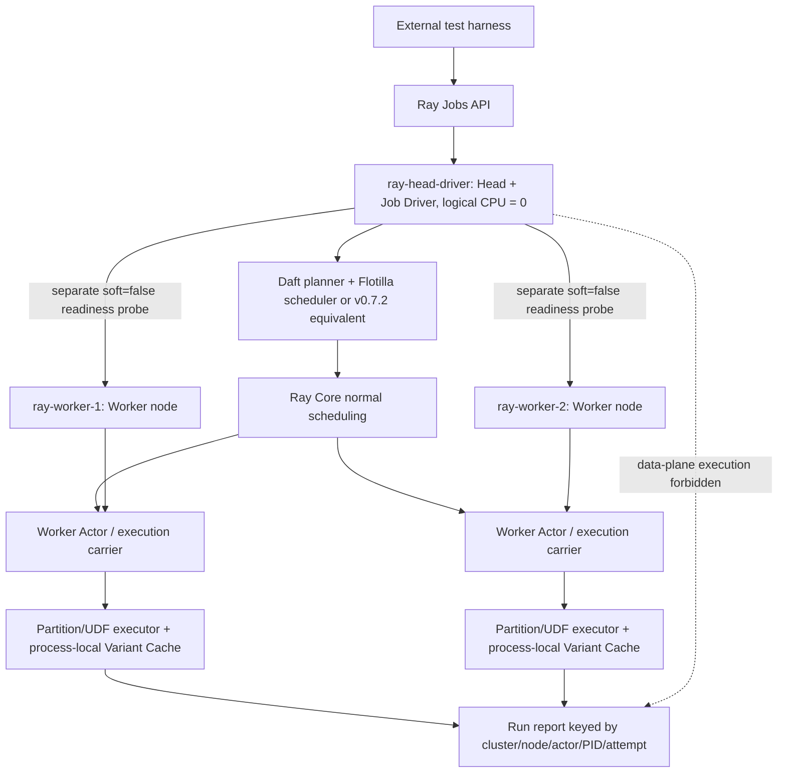
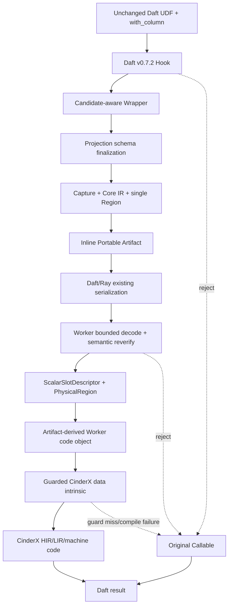
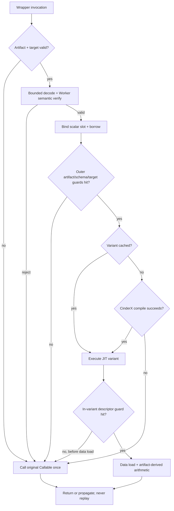
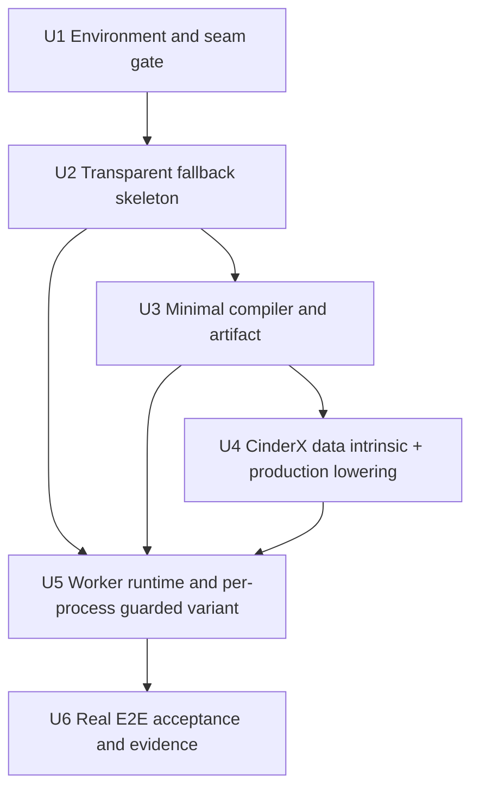

# 标量主线最小端到端穿刺 - Plan

## Goal Capsule

- **Objective:** 在固定版本、三容器 Ray 集群中，用一个非空 `float64 -> float64` 的 Daft Row-wise Projection UDF，跑通透明接入、受限 Capture/Core IR、内联 Portable Artifact、Worker 晚绑定、Data-aware CinderX JIT、Guard 和原始 Callable 回退；集群固定为一个 Head/Driver 节点与两个 Worker 节点，UDF 计算不得落到 Driver。
- **Authority:** 用户确认的穿刺边界优先；`README.md` 和 `docs/rfcs/README.md` 定义标量主线；架构文档中与其冲突的 Host Columnar “本期”表述不进入本计划。
- **Target repositories:** `python-udf-jit` 承载 Adapter、Compiler、Protocol、Runtime 与验收；`cinderx` 承载一个最小 Data-aware Intrinsic/HIR 接缝。Daft、Ray、Lance 均不修改源码。
- **Execution profile:** 先启动三节点容器拓扑并完成环境/Carrier 与基础 CinderX Readiness；随后依次建立 U2 可回退 Walking Skeleton 和 U3 Compiler/Artifact，并在各自候选镜像中通过真实 Worker Gate；U4 再完成生产 Lowering、Scalar Slot/Capability 与两个 Worker 的定向 CinderX Smoke，U5/U6 最后接入完整 Runtime 并让真实 Daft 作业由 Ray 正常调度到任一可用 Worker。功能与语义证据先于性能数据。
- **Stop conditions:** Docker 后端不可用、三个 Ray 节点未全部注册、Head/Driver 仍可承接或实际产生 UDF 数据面执行、Daft `v0.7.2` 与 Ray `2.55.0` 无法运行基线、Worker 不是预期进程内调用、原始 Callable 不能可靠序列化、Artifact 无法在 Daft 序列化前于 `with_columns` 定稿、或 `ScalarSlotDescriptor` 不能映射真实 Row-wise Worker 入参时，停止后续实现并重新确认环境、版本、Carrier 或布局方案。
- **Tail ownership:** 穿刺验收同时产出可复现环境清单、结构化证据和首份 `docs/solutions/` 学习记录；本计划不自动晋级正式性能发布。

---

## Product Contract

### Summary

本计划交付 RFC-001～RFC-008 的一条纵向切片，而不是宣称八个 RFC 完成。唯一支持路径是用户脚本无改动的 Daft Projection：Ray Jobs 在 Head 容器启动 Driver，Driver 将一个受限数值 UDF 编译为单 Region 制品，Ray 将它送入两个 Worker 组成的正常调度池，实际承接分区的 Worker 建立唯一布局描述并让 CinderX 机器码消费该描述；不支持、失配或提交点前失败回到原始 Callable，首个语义 Data Load/算术后的失败只原样传播，绝不重放。

### Problem Frame

当前仓库只有 Draft 架构与 RFC，没有实现、构建清单、测试或历史复盘。文档把主线描述为 48 人周的完整 RFC-001～008，如果直接按 RFC 宽度启动，会同时引入动态图、通用 IR、Artifact 演进、两种布局、CinderX 扩展、多版本缓存和治理，导致最关键的 Daft→Ray→CinderX 接缝长期得不到真实验证。

环境声明也存在已查证冲突：Daft `v0.7.2` 的 `pyproject.toml` 约束 `ray<2.53.0`，设计基线却写 Ray `2.55.0`；本地 CPython 是 `3.16.0a0`，当前 CinderX 要求 Python `>=3.14,<3.16`。因此环境兼容性不是准备工作，而是穿刺的第一道产品 Gate。

真实 Ray 集群由一个 Head 和若干 Worker 组成，Ray Jobs 默认在 Head 运行 Driver，但 Head 默认也可以调度 Task/Actor。只证明 Driver 与 Worker PID 不同，仍可能把数据任务落在 Head；本计划因此用三个容器模拟三个 Ray 节点，将 Head 的逻辑 CPU 设为零，并以 Node/Actor/PID 代际和数据面阶段事件证明控制面与数据面分离。该拓扑复现跨节点序列化、独立 Worker 运行时和进程本地 JIT Cache，不把同一物理宿主上的 Docker Compose 宣称为多机容灾或生产容量验证。

### Requirements

**Environment and integration boundary**

- R1. 每个跨容器 Gate 的实验 Manifest 必须锁定容器镜像摘要、CPython 3.14.x、CinderX commit/SOABI、Daft `v0.7.2`、Ray `2.55.0`、PyArrow `22.x` 和 UDF JIT Wheel hash，Head/Driver 与两个 Worker 指纹一致才允许验证；U1 的 Baseline Manifest 与后续 Candidate Manifest 分开记录，任何 CinderX/UDF JIT 代码变化都必须重建三节点候选镜像并重新通过 L0，不得把不同构建的证据拼接。Lance `7.0.0` 只记录为非阻断环境元数据，直到验收路径实际使用 Lance。
- R2. 未修改的 Daft 用户脚本必须在插件 `off` 时跑通三节点 Ray 集群中的真实 Worker；若 Daft `v0.7.2` 与 Ray `2.55.0` 基线不成立，计划停止且不得静默切换到 Ray `2.52.1`。
- R3. 用户不增加导入、装饰器或显式 `compile()`，且不得修改 Daft、Ray 或 Lance 源码。
- R14. 穿刺拓扑必须恰好注册一个 Head/Driver 容器和两个 Worker 容器；Head 以 `num-cpus=0` 启动，Job Driver 留在 Head，U1 必须识别 Daft `v0.7.2` 的真实 UDF Execution Carrier 并证明其创建资源请求含逻辑 CPU，所有数据面执行事件的 Node ID 必须属于 Worker 集合。
- R15. 两个 Worker 必须各完成一次 `soft=False` 的节点定向 Readiness Smoke，以证明其镜像、CinderX 和 UDF JIT 可用；正常 Daft E2E 不使用节点亲和，允许由任一非空 Worker 子集实际承接任务，不要求两个 Worker 每次都执行。
- R16. Readiness、Worker 资格测试与 E2E 必须绑定同一 Cluster Epoch、三个 Container Boot ID、Node/角色映射和 Candidate Manifest；Actor/Worker ID、PID 与 Process Generation 只要求在各自阶段的事件链和 Compile→Hit 关联中自洽，不要求三个独立阶段使用同一进程。阶段内 Execution Carrier 重启、节点/容器替换、Manifest 漂移或 Ray Task Retry 使 Attempt 证据不唯一时，本 Run 结论为 Inconclusive 并停止；操作者最多可干净重建后另起一个完整 Run，同一原因签名连续第二次出现即转为 STOP，两轮证据不得合并。
- R17. Ray Jobs/Dashboard 只允许从宿主回环地址访问，其他 Ray 端口不得发布到宿主；每次运行使用独立的 Ray 内建认证令牌，经只读临时 Secret 注入所有容器，令牌不得进入镜像、仓库、命令输出、事件或 Run Report。
- R18. 每个 Run 的 Worker 原始事件必须写入独立 `0700` 临时目录，原始事件与最终报告创建为 `0600`；成功、失败和 Inconclusive 聚合后都删除原始事件，只保留白名单最终报告。
- R19. U5 完成后，两个 Worker 必须各通过一次节点定向的生产 `Artifact → semantic reverify → Scalar Slot → production lowering → CinderX Compile/Execute` 资格测试；测试必须经 U1 识别的真实 Daft Execution Carrier 或同一生产工厂/配置创建的等价 Carrier，不能用普通 Ray Task 代替。该测试证明整个 Worker Pool 可执行但不计入自然业务调度覆盖率。
- R20. U1 产出插件已安装但 `mode=off` 的 Baseline Image；U2、U3、U4 和 U5 每个单元的本地测试通过后，都必须构建包含截至该单元产物的独立 Candidate Wheel/Image，以新 Cluster Epoch 重建三容器并重跑 Docker、拓扑、环境与 Carrier L0 Gate，再执行该单元的分布式 Exit Gate。U4 Candidate 首次包含新 Intrinsic，U5 Candidate 是最终 E2E Image；跨 Manifest、跨镜像或跨 Epoch 的证据无效。

**Supported vertical slice**

- R4. 穿刺仅支持普通 `@daft.func`、`with_column`/`with_columns` Projection、单参数非空 `float64`、单基本块以及 `float64` 常量与 `+/-/*` 组成的单 Semantic Region；除法、比较、调用和其他可能引入未建模 Python 异常语义的操作整 UDF 拒绝。
- R5. Driver 必须产出可验证的 `CaptureRequest → CaptureIR → CoreUdfModule → SemanticRegion → PortableUdfArtifact` 链，未知 Opcode、调用、分支、Null 或动态语义整 UDF 拒绝。
- R6. Artifact 必须确定性编码、内容寻址、版本化，并在分配前执行固定资源上限：总编码不超过 64 KiB、Section 不超过 16、Core IR 节点与常量各不超过 256、单字符串/字节字段不超过 4 KiB、嵌套深度不超过 16；它通过生成 Wrapper 内联跨进程传递，其中不得出现 Worker 地址、Layout Descriptor、CinderX HIR/LIR 或机器码。

**Worker execution and safety**

- R7. Worker 必须在 Wrapper 首次调用时校验 Artifact，并把真实 Row-wise 入参绑定为 Worker-local `ScalarSlotDescriptor` 和 `PhysicalRegion`；任何地址/句柄不得跨进程序列化，Slot/Keepalive 的寿命必须覆盖完整 Guard 与 JIT Execute 区间。
- R8. CinderX 必须编译由 Verified Semantic Region 唯一 Lower 得到的 Worker-local code object，并通过受 Descriptor Guard 支配的 `float64` Data-aware Load Intrinsic/HIR 路径消费 Physical Region；仅对原函数或与 Artifact 无关的手写函数调用 `cinderx.jit.auto()`/`force_compile()` 不满足本要求。
- R9. 每个参与 Worker 进程内的单一 `RuntimeVariant` 外层 Guard 必须覆盖 Artifact、Schema、Callable/Code 和 CPython/CinderX Target，并在机器码入口前 Miss；函数内 Descriptor Guard 再校验 capability handle、Layout Epoch/ABI、类型、Ownership 与借用期，只有命中分支才能执行 Data Load。任一 Guard Miss 都必须发生在语义 Load/算术与用户可见副作用之前，让本次非空行 Wrapper 调用执行原始 Callable 恰好一次；作业级调用与副作用总数必须等于 `off`。
- R10. Capture 拒绝、Artifact/ABI/语义校验失败、外层 Guard Miss、函数内 Data Load 前 Guard Miss 和 CinderX 编译失败必须 Fail Open。进入首个语义 Data Load/算术后的异常或内部失败不得重跑原始 Callable，必须原样传播；两类路径都要保持行序、异常类型和副作用次数，不允许 post-entry replay。

**Evidence and validation**

- R11. `off/auto` 两种模式和结构化阶段事件必须可由测试断言：Head/Driver 允许 Bootstrap、Capture、Artifact Finalize 和 Unsupported Decision；只有 Worker 数据面允许 Wrapper Invoke、Artifact Load、Layout Bind、JIT Compile/Hit、Guard Miss/Fallback 和 Semantic Execute。事件主键必须包含 Run ID、Cluster Epoch、Node ID、Actor/Worker ID、PID、Process Generation、Partition ID、Task Attempt 和 Variant Key；插件 `off` 的位置证据由独立 Fixture Probe 采集。
- R12. JIT Hit 必须由 CinderX 编译状态、HIR/LIR 或等价结构化证据证明，不能用耗时下降推断。
- R13. 穿刺完成门槛是语义正确和路径证据闭环；冷启动、编译时间和稳态耗时只记录基线，不以 `1.15x` 作为本轮通过条件。

### Acceptance Examples

- AE1. **Supported JIT Hit:** 给定未修改的 `float64` Projection UDF，当以 `auto` 运行真实 Daft/Ray 作业时，Driver 产生受限 IR/Artifact，Worker 产生 Scalar Slot Descriptor，CinderX 产生 Compile 与 Hit 证据，输出逐值等于 `off` 基线。
- AE2. **Pre-semantics Guard Miss:** 给定可控的 Layout Epoch、Schema 或 Callable 指纹失配，当 Worker 解析或进入 Variant 的 Data Load 前 Guard 时，语义 Execute 计数保持为零；每次非空行 Wrapper 调用执行原始 Callable 恰好一次，作业级调用与副作用总数、输出和异常等于 `off` 基线。
- AE3. **Unsupported UDF:** 给定含 Opaque Call 或未支持 Opcode 的 UDF，当 Driver Capture 时，系统记录结构化拒绝并让原始 Daft UDF 正常执行，副作用不预执行、不重放。
- AE4. **Fail-open bootstrap:** 给定插件 `off`、Daft 指纹失配或损坏 Artifact，当作业执行时，Hook/Loader 不使作业失败，且事件明确说明回退阶段和原因。
- AE5. **Empty input:** 给定相同 Schema 的零行 DataFrame，当以 `off` 与 `auto` 运行时，两者均返回同 Schema 的零行结果；不要求产生 Compile/Hit，但不得调用原始 Callable、构造悬空 Scalar Slot 或伪造 JIT Hit。
- AE6. **Three-node topology:** 给定一个 Head/Driver 与两个 Worker 全部 Ready，当分别对两个 Worker 运行定向 Readiness Smoke 时，两者都返回一致 Manifest 和 CinderX 编译证据；随后正常调度的分区化 Daft 作业至少在一个 Worker 执行且从不在 Head 执行，不以两个 Worker 都命中作为单次 E2E 通过条件。
- AE7. **Evidence invalidation:** 给定已通过 Readiness 的三节点集群，当跨阶段 Cluster Epoch、Container Boot ID、Node/角色映射或 Manifest 变化，或任一阶段内部的 Execution Carrier 重启/Task Retry 使事件与副作用 Attempt 无法唯一归因时，Harness 将本 Run 标为 Inconclusive 并停止，不复用旧 Compile/Hit，也不把环境变化报告为 JIT Fallback；不同阶段本来使用不同 Actor/PID 不构成失效。
- AE8. **Worker-pool qualification:** 给定同一个已验证生产 Artifact，当分别定向到两个 Worker 执行完整 Worker 侧验证、绑定、生产 Lowering 与 CinderX Execute 时，两者都产生正确结果和各自进程代际的 Compile 证据；随后自然调度 E2E 仍不要求两个 Worker 都参与。

### Success Criteria

- 三类真实 Daft→Ray 作业分别证明 Supported Hit、Guard Miss 和 Unsupported Fallback，另有三节点拓扑、`off`/版本失配契约测试与零行输入测试。
- Head/Driver 与两个 Worker 的 Manifest、Node ID、Hostname、PID、Artifact Hash、Descriptor ABI/Epoch 和 CinderX 编译状态被同一 Run ID 串联。
- 两个 Worker 各通过一次定向 Readiness Smoke；正常 E2E 由 Ray 默认调度，所有 UDF 事件都来自 Worker，至少一个 Worker 产生事件即可，不强制两个 Worker 在同一次作业中都执行。
- 两个 Worker 在 U5 后各通过一次完整生产 Artifact 资格测试；这证明 Worker Pool 可执行，和自然业务覆盖率分别报告。
- Readiness、Worker 资格测试和 E2E 使用同一 Cluster Epoch、Container Boot ID、Node/角色映射与 Candidate Manifest；Actor/PID 只在各自阶段内部保持可归因，环境重启或 Task Retry 不混入正确性/副作用结论。
- Supported Hit 使用多个 Parquet 输入形成至少两个远程 Partition Task 的数值校准/特征派生数据集（`result = x * scale + offset`），使调度和序列化形态接近实际 ETL Projection，而不以数据量、Worker 均匀分布或吞吐作为通过条件。
- 同一 Run ID 能把 Artifact semantic hash、Worker-local code object hash、HIR/LIR `LOAD_DATA_F64` 和 Variant Key 串联；改变 Artifact 常量或运算符必须改变 code object/Variant 证据和运行结果。
- 所有支持与回退场景的返回值、行序、异常和副作用次数与插件关闭时一致。
- U6 必须给出架构处置结论：Carrier、Scalar Slot、Artifact Lowering 和 CinderX Load 四个承重接缝全部成立才建议继续 Arrow/Unboxed 后续；任一接缝失败则明确重构或停止，且不得把本轮结果外推为数据路径性能成立。
- 没有代码或文档声称 RFC-001～008 已完成，也没有把初始耗时数据宣传为 `1.15x` 发布结论。

### Feature Assessment

| RFC | 穿刺必须做 | 允许的最小实现 | 本轮可以不做 |
|---|---|---|---|
| RFC-001 透明接入 | `.pth`、Daft `v0.7.2` 指纹、`Func.__call__` Candidate、一个 Projection 定稿点、Worker Wrapper、`off`/Fail Open、三节点部署一致性 | 只 Hook `Func.__call__` 与 `with_columns`；`with_column` 复用其委托；Job-local Registry；Inline Artifact；Head/Driver `num-cpus=0`；两个 Worker Readiness Smoke | `select/where` 全覆盖、跨版本 Adapter、复杂 TTL、Ray ObjectRef、大制品、其他框架、KubeRay/Autoscaler/多机部署 |
| RFC-002 动态捕获 | 精确 CPython 版本 Decoder、编译/回退双 Code Identity、Verifier、Unsupported 拒绝 | 只接受普通 `@daft.func` 可验证解包出的用户函数和单基本块 `LOAD_FAST/LOAD_CONST/BINARY_OP(+/-/*)/RETURN` 白名单 | Source Map、除法/比较/调用、CFG 分支、异常边、短路、Graph Break live-in/out、局部 Continuation、内联调用、生成器/协程 |
| RFC-003 语义 IR | 最小 Core IR、类型/纯度约束、单 Region 和 Verifier | `arg.load`、`const.f64`、`add/sub/mul.f64`、`return`；整函数即 Region | 通用 Pass Manager、NullFlow、Alias、MayRaise 排序、跨 UDF Region、成本模型、Planner Rewrite |
| RFC-004 Portable Artifact | 版本、确定性且有资源上限的 Codec、Hash、兼容 Manifest、IR/Region/Guard 摘要、Fallback Identity | 一个不可变 Envelope 和 Inline Handle | Source 摘要、Section 演进体系、签名服务、ObjectRef、Registry、跨 Job Cache、Provider Optional Sections |
| RFC-005 布局特化 | 真实 Worker 晚绑定、稳定 `access_id`、类型/ABI/Epoch/Ownership Guard | 只实现 `ScalarSlotDescriptor<float64>` 和只读输入；结果在 Provider 边界装箱 | Arrow Column、Validity、Slice/Chunk、复杂类型、Output Column、Copy/Materialize 计价、Unboxed Lane |
| RFC-006 Scalar CinderX | Capability/Compile/Execute、一条 Data-aware HIR/LIR 路径、Compile/Hit 证据 | 一个 Guarded `LOAD_DATA_F64` 语义和既有算术/返回装箱 | 全类型矩阵、分支/Null Intrinsic、Arrow Lane、直接 HIR API、精确 Region Deopt、任意对象协议 |
| RFC-007 Guarded Execution | 完整最小 Variant Key、单 Variant Cache、外层入口前 Guard、函数内 Data Load 前 Descriptor Guard、提交点前整 UDF Fallback | 首次调用同步编译；单进程单 Variant；无副作用 bailout sentinel；测试故障注入 | 多版本、异步编译、Singleflight、Negative Cache、LRU/TTL、熔断、提交点后 Side Exit、Deopt 重放 |
| RFC-008 Governance | `off/auto`、可断言的阶段事件和 Run Report | 进程本地结构化事件，按 Run ID 汇总 | `observe`、`udfjitctl`、异步遥测队列、Policy Builder、Tenant 隔离、完整 Explain、发布报告与 `1.15x` Gate |

### Scope Boundaries

#### Deferred to Follow-Up Work

- Arrow Primitive Descriptor、Unboxed Lane Scalar、`int32/int64/float32/bool` 和 Nullable。
- 分支、异常边、Graph Break 的局部续接、CinderX/Region 精确 Deopt。
- 多版本、异步编译、Singleflight、负缓存、熔断、Actor 重启和跨 Worker 缓存。
- KubeRay、Autoscaler、Worker 弹性扩缩容、节点丢失恢复、网络分区与多物理主机故障注入；三容器只验证固定拓扑和调度隔离。
- RFC-008 完整治理、正式性能 Harness、TPC-H SF10/一亿行数据以及 `speedup >= 1.15` 发布门槛。
- `select/where`、Filter 语义和更多 Daft UDF 配置。

#### Outside This Plan

- RFC-009～RFC-012：混合 Provider、Host Columnar/Vector、稀疏 Batch Side Exit、等价语义回填。
- PySpark、PyFlink、GPU/Accelerator 或其他 Framework/Execution Provider。
- Daft、Ray、Lance 源码分叉，中心编译/治理服务，全局 Artifact Registry。
- 多租户生产安全加固、多架构正式发布和跨集群兼容承诺。

---

## Planning Contract

### Key Technical Decisions

- KTD1. **以真实纵向链路定义穿刺。** 每个层必须对下游产物产生实际影响；装饰性生成 IR 后仍直接 auto-JIT 原函数不算完成。
- KTD2. **只做一个 `float64` Projection。** 窄类型和单基本块让项目先验证跨进程和 JIT 接缝，覆盖广度在链路可信后扩展。
- KTD3. **Candidate-aware Wrapper 先进入 Daft Expression，Artifact 后定稿。** `Func.__call__` 创建携带 Candidate ID 和原始 Callable 的可序列化 Wrapper；`with_columns` 补齐 Schema 后生成 Artifact，Wrapper 序列化时只接受已定稿 Inline Handle，否则回退原始 Callable。
- KTD3a. **编译身份与回退载体分离。** 普通 `@daft.func` 只在 `Func._method` 存在单层、身份一致的 `__wrapped__` 时，以解包出的用户函数建立 Capture/Code Identity；Daft 原始 `_method` 保留为序列化与 Fallback 载体。缺失、多层包装或身份不一致整 UDF 拒绝。
- KTD4. **Artifact 和 Fallback 分离且 Codec 预算固定。** Artifact 只携带受控 IR/Manifest/Fallback Identity；原始 Callable 沿 Daft 既有序列化载体保留，不进入 Artifact Codec。64 KiB 总量、16 Section、256 IR 节点、256 常量、4 KiB 单字段与 16 层嵌套作为 `v1` 协议常量写入 Manifest，超限在大对象分配前整 UDF 拒绝。
- KTD5. **首穿使用 Scalar Slot，而非 Arrow Unboxed Lane。** Daft Row-wise UDF 的真实 Python 标量绑定为 `ScalarSlotDescriptor`；若 U1 证明该边界不成立，停止并重新评估，不同时实现第二套布局。
- KTD6. **新增一个 CinderX Data-aware Load 接缝。** 采用具备解释语义的受控 Intrinsic/Runtime Helper，由 HIR Builder 识别并 Lower 为 `float64` Load；它必须由 Descriptor Guard 支配，并复用现有算术、LIR、Codegen 和返回装箱。
- KTD6a. **Descriptor 只传 Worker-local capability handle。** Artifact/Wrapper 不携带原生地址；Runtime Registry 签发进程绑定、不可跨进程序列化且带 generation/borrow token 的 capability，在调用期间持有 Slot/Keepalive。Guard 每次访问先校验 Registry 所有权、access ID、ABI、类型、Epoch、generation 与活跃借用期，JIT 只在借用期内解引用。空输入不创建 Slot，也不伪造 Hit。
- KTD6b. **Artifact-to-executable 只有一条 Lowering。** Scalar Provider 用有限模板从 Verified Core IR/Region 生成 Worker-local Python code object：capability handle 入参、函数内 Descriptor Guard、`LOAD_DATA_F64`、Artifact 常量/`+/-/*` 和返回装箱均由 Region 决定；code object hash 绑定 semantic hash，并作为 `force_compile`、`is_jit_compiled` 与 Variant Cache 的对象。禁止用与 Artifact 无关的手写函数替代。
- KTD7. **只在语义执行前 whole-UDF fallback。** 外层 Guard 或机器码内 Data Load 前 Guard Miss 可安全返回无副作用 bailout sentinel，再由 Wrapper 调用原始 Callable；一旦执行首个语义 Load/算术，任何异常或内部失败只原样传播，禁止 post-entry fallback/replay。局部语义 Side Exit 和 Deopt 留待后续。
- KTD8. **首次编译可同步。** 每个参与 Worker 进程允许首次调用同步编译一个 Variant 并在本进程缓存；异步、Singleflight、跨 Worker 缓存与预算不影响当前正确性证明。
- KTD9. **结构化事件属于验收接口。** 事件不记录业务值，但必须让测试跨 Driver/Worker 证明每一阶段发生或被拒绝。
- KTD10. **环境冲突采用停止式 Gate。** Ray `2.55.0` 不因 Daft 依赖声明而自动降级；CinderX 工作只能在干净 CPython 3.14.x/CinderX 实验线进行，不能复用当前污染工作树。
- KTD11. **三容器模拟生产角色，不模拟生产规模。** 外部 Harness 通过 Ray Jobs API 把 Driver 启动在 `ray-head-driver`，Head 以 `num-cpus=0` 保留为控制面，`ray-worker-1` 与 `ray-worker-2` 组成数据面。零 CPU 只阻止声明 CPU 请求的 Task/Actor，因此 U1 先从锁定源码与 Ray State 识别 Flotilla/Swordfish 或 `v0.7.2` 的等价真实 UDF Execution Carrier，并证明其创建请求包含逻辑 CPU且落在 Worker；载体为零 CPU 或角色无法判定时触发 Stop Condition。Jobs/Dashboard 仅通过宿主回环端口和每 Run Ray 内建令牌开放，内部 Ray 端口不发布。
- KTD12. **Variant 与证据按进程代际本地化。** Artifact 可相同，但 code object、Capability Registry、Descriptor 和 Variant Cache 只属于一个 `(Cluster Epoch, Node ID, Actor/Worker ID, PID, Process Generation)`；同一节点的不同 PID 或重启代际允许各自首次 Compile，只有同一进程代际与 Variant Key 的后续调用才可计为 Hit，Node ID 只用于拓扑聚合。
- KTD13. **用真实多分区数值校准代表 Row-wise Projection。** 验收 Fixture 生成多个小型 Parquet 输入文件，模拟 ETL 中的测量值校准或特征派生，以有限 `float64` 值、`scale` 和 `offset` 形成至少两个远程 Partition Task；主链不人为延时、不使用节点亲和，也不要求两个 Worker 同时命中。
- KTD14. **环境证据有 Cluster Epoch、阶段内进程身份和有限人工重跑。** Readiness、Worker 资格测试与 E2E 共享当前容器启动标识、Node/角色映射和 Manifest，但独立路径可合法产生不同 Actor/PID；每个阶段只按本阶段 Actor/PID/Process Generation 证明 Compile→Hit。阶段内 Carrier 重启、容器替换或 Retry 破坏 Attempt 唯一性时，本 Run 为 Inconclusive 并立即停止；Harness 不自动重建，操作者最多另起一个干净完整 Run，同一原因签名再现即 STOP，旧证据绝不拼接。
- KTD15. **Worker Pool 资格与自然覆盖分开。** U5 结束后用同一生产 Artifact 分别定向两个 Worker，并经 U1 Characterization 得到的真实 Daft Execution Carrier 或同工厂/同配置的等价 Carrier 执行 semantic reverify、Descriptor Bind、production lowering 和 CinderX Execute；普通 Ray Task 不能替代该资格测试。两次都必须过，但不计入 `natural_worker_coverage`。这是固定两节点、每节点一次的有限部署资格验证，不扩展到负载均衡、弹性、故障恢复或持续治理；业务 E2E 仍走正常调度，因此可以诚实区分“两个 Worker 的生产载体都能执行”与“本次业务自然用了几个 Worker”。
- KTD16. **镜像对 Gate 不变，对实现阶段可演进。** U1 Baseline 之后，U2 Adapter、U3 Compiler/Artifact、U4 Intrinsic/Scalar Runtime 和 U5 Final Runtime 各有独立 Candidate Manifest；同一 Gate 内三容器必须同摘要，每个单元先过本地测试，再重建镜像和 Cluster Epoch、重跑 L0，最后执行本单元真实 Worker Gate。只有 U5 Final Candidate 的 L0/L1/L2 证据可进入验收报告。

### High-Level Technical Design

#### Three-node Ray topology and proof layers



拓扑验收分两层：Readiness 支路必须分别命中两个 Worker，证明节点不是装饰性注册；业务 E2E 走 Daft Scheduler 和 Ray Core 的自然路径，只要求数据面执行进程属于 Worker 集合的非空子集且不属于 Head。Artifact 跨进程证据必须落到实际 Partition/UDF Executor，Readiness Probe 不计入 Artifact 主链或业务 Worker Coverage。

#### Cross-process data flow



#### Runtime decision flow



#### Implementation dependency graph



### Output Structure

```text
python-udf-jit/
├── pyproject.toml
├── docker/scalar-piercing/
│   ├── Dockerfile
│   ├── compose.yaml
│   └── entrypoint.sh
├── config/
│   ├── scalar-piercing-manifest.json
│   └── ray-three-node-topology.json
├── constraints/
│   └── scalar-piercing.txt
├── src/python_udf_jit/
│   ├── bootstrap.py
│   ├── compiler/
│   ├── diagnostics/
│   ├── integration/daft_ray/
│   ├── protocol/
│   ├── provider/scalar_python/
│   └── runtime/
├── tests/
│   ├── unit/
│   ├── integration/
│   │   ├── test_ray_three_node_topology.py
│   │   └── test_driver_worker_isolation.py
│   ├── e2e/
│   └── fixtures/
├── benchmarks/scalar_piercing/
└── docs/solutions/architecture-patterns/

cinderx/
├── cinderx/Jit/hir/
├── cinderx/Jit/lir/
├── cinderx/Jit/jit_rt.{h,cpp}
├── cinderx/RuntimeTests/
└── cinderx/PythonLib/test_cinderx/
```

### Assumptions

- CPython 3.14.x/CinderX 的具体 clean commit 和构建标识在 U1 固化；当前本地 CPython 3.16 与 dirty CinderX checkout 仅用于静态研究，不作为实验环境。
- 2026-07-22 的环境审计表明当前会话运行在 WSL2/Codex `bwrap` 沙箱而非 Docker 容器，Docker CLI/Compose 可见但 `/var/run/docker.sock` 不存在；环境状态为 `needs_bootstrap`，U1 必须先连接或启动可用 Docker 后端，当前不能声称三容器集群已经运行。
- Docker Compose 的三个容器共享一个物理宿主和专用网络，只代表三个独立 Ray 节点/文件系统/进程命名空间；它验证部署一致性、序列化和调度角色，不验证多机网络、容量、Autoscaler 或故障域隔离。
- Ray/Daft `latest`/`stable` 文档只说明真实生产角色；U1 必须以 Ray `2.55.0`、Daft `v0.7.2` 的锁定源码与运行时 State 结果确认 Execution Carrier、资源请求、Actor/PID 模型和 Partition 行为。
- `with_column` 在 Daft `v0.7.2` 中委托 `with_columns`，因此只包装后者即可覆盖验收脚本。
- Daft Row-wise Worker 最终把 Python 标量传给 Callable；U1 必须用真实 Worker 证据确认，不能仅从源码推断。
- Run Report 使用进程本地结构化事件和测试聚合，不建立远程治理服务。
- 本轮运行在可信、单租户实验 Job 边界内：用户本就能提交任意 Python UDF，Artifact Hash 只提供完整性/身份而非来源认证。Worker 仍必须做有界解码与完整语义重验；不可信多租户的签名/MAC 和密钥分发属于生产安全后续。

### System-Wide Impact

- Head/Driver 和两个 Ray Worker 必须由同一不可变镜像构建并安装完全相同的 UDF JIT/CinderX Wheel；“用户透明”不等于免部署。
- Head 的零逻辑 CPU 是调度准入控制，不是物理 CPU 隔离；测试必须继续用 Node/Actor/PID 代际证明没有 UDF 数据面执行落到 Head。
- Worker Node、Daft Execution Carrier 与 Python Worker Process 是三层身份；监控、Cache 和 Failure 归因不得只按 Hostname 或 Node ID 聚合。
- Python UDF JIT 的 Artifact ABI、Descriptor ABI 与 CinderX Intrinsic ABI 形成新的跨仓库兼容链，Manifest 变化必须使 Guard 失效。
- Daft 私有 Hook 是唯一框架耦合点；通用 Compiler、Protocol 和 Runtime 不得导入 Daft 私有对象。
- CinderX 改动影响其通用 HIR/LIR switch 完备性和多 Python 版本维护，U4 必须遵循 `cinderx/AGENTS.md` 的新 HIR 指令检查清单。
- 不可变镜像是单个 Gate 的证据边界，不是整个开发周期只构建一次；U2～U5 每个单元进入真实 Worker Gate 前都必须重建候选 Wheel/Image 和三节点 Cluster Epoch，再重新认证环境。

### Risks and Mitigations

| Risk | Impact | Mitigation |
|---|---|---|
| Daft `v0.7.2` 声明 `ray<2.53`，与 Ray `2.55.0` 目标冲突 | 基线无法安装或运行 | U1 先做独立兼容 Gate；失败即停止，不把 Adapter/JIT 问题混入环境问题 |
| 当前 Docker CLI 无可用 daemon/socket | 三容器拓扑无法启动 | 将环境标记为 `needs_bootstrap`；U1 先完成 Docker 后端 Preflight，失败即停止，不回退到本地单进程 Ray |
| 修改 CinderX/UDF JIT 后仍复用 U1 Baseline 容器 | Worker 不含新 Intrinsic，或不同镜像证据被错误合并 | 每次跨容器 Gate 前重建三节点候选镜像、生成新 Manifest/Cluster Epoch并重跑完整 L0；只有最终 Candidate 证据进入报告 |
| Ray Head 默认也能调度 Task/Actor | UDF 数据面落在 Driver，形成伪分布式证据 | Head 以 `num-cpus=0` 启动；拓扑测试断言其 CPU 资源为零，Run Report 断言数据面 Actor/PID 集合不含 Head |
| Daft `v0.7.2` 的真实 Execution Carrier 是零 CPU Actor/Task 或与当前文档模型不同 | `num-cpus=0` 无法保证 Driver 隔离 | U1 从锁定源码和 Ray State 双重确认 Carrier 类型、Actor ID、创建资源、Node ID 与 PID；零 CPU或无法归因即停止 |
| 两个 Worker 都注册但其中一个环境漂移或从未可执行 | 第二个 Worker 只是装饰性节点 | 对每个 Worker 使用 `soft=False` Node Affinity 运行一次 Manifest/CinderX/Scalar Slot Readiness Smoke；任一失败都阻断 E2E |
| 把单次 E2E 未覆盖两个 Worker 误判为失败 | 为追求均匀命中而引入延时、亲和或非真实调度 | 主链路保持 Ray 默认调度；只要求 Worker 集合非空且 Head 为零，参与 Worker 的 Compile/Hit 按进程代际计数 |
| 把 Driver 的 Capture/Finalize 事件当成 UDF 落 Head，或依赖插件事件证明 `off` 位置 | 产生拓扑误报或无法验证基线 | 固定事件角色白名单；只有数据面事件禁止出现在 Head，`off` 用独立 Fixture Probe 记录执行身份 |
| 只按 Node ID 统计 Cache | 同节点多 PID、Actor 重启或进程替换产生伪 Hit | Compile/Hit 以 Cluster Epoch、Actor/Worker ID、PID、Process Generation 和 Variant Key 关联；Node ID 只做拓扑聚合 |
| Readiness 后 Worker 重启或镜像漂移 | 旧 Smoke 与新 E2E 被错误拼接 | 跨阶段只比较 Cluster Epoch、Container Boot ID、Node/角色映射和 Manifest；Actor/PID/Process Generation 仅在各阶段内部检查连续性，阶段内 Carrier 重启则停止本 Run，Harness 不自动重建 |
| Ray Task Retry 造成多个 Attempt | 副作用重复被误判为 JIT Replay，或反之 | 事件记录 Partition/Task Attempt；出现无法唯一归因的 Retry 时本轮 Inconclusive，不进入 exactly-once 结论 |
| Ray Jobs/Dashboard 暴露到非可信网络或令牌泄漏 | 获得 Job 提交权限等同于获得集群任意代码执行能力 | 只绑定宿主 `127.0.0.1`，其他 Ray 端口不发布；每 Run 生成独立 Ray 内建令牌并以只读临时 Secret 注入，负向测试覆盖无令牌/错令牌/日志泄漏 |
| Worker 原始事件或失败日志长期保留 | 业务值、异常细节或运行身份在聚合边界外泄漏 | 每 Run 使用 `0700` 独立临时目录和 `0600` 文件；只聚合白名单字段，成功、失败和 Inconclusive 都清理原始事件，只保留 `0600` 最终报告 |
| 单宿主三容器被误解为生产集群验证 | 对网络、容量或容灾能力作出过度结论 | 文档和报告固定标记为 fixed-topology simulation；KubeRay、多机、Autoscaler 和节点故障另列后续 |
| Artifact 在 `with_columns` 定稿前已被 Daft 序列化 | Wrapper 收不到制品 | U1 先证明 Expression 对象/状态关联和 Driver/Worker hash 一致，U2 再固化 fallback-only Carrier；时序不成立则停止并重新设计 |
| Worker 实际边界不是 Python Scalar | Scalar Slot 设计失效 | U1 捕获真实调用形态和进程；不同时实现 Arrow 备用路径 |
| `float64` 运算直接 Lower 后偏离 Python 异常/特殊值语义 | 结果差分或漏抛异常 | 白名单限定为 `+/-/*`；用 NaN、±Inf、±0.0 和极值做 Oracle 差分，除法与其他操作先拒绝 |
| CinderX Intrinsic/HIR 触及多处 switch 和 Codegen | Crash、Verifier 缺口或维护面扩大 | 单一 `float64` Load 语义；RuntimeTests、HIR Golden、Python unittest 同时通过后才接入 Worker |
| Worker-local Slot/Keepalive 提前释放或地址被带入 Artifact | UAF、跨进程无效地址或 Crash | Artifact 静态检查禁止地址；Registry 借用期覆盖 Guard/Execute；空输入、过期 handle 和释放后访问均有负向测试 |
| Guard Miss 发生在首个语义 Load/算术之后 | 重复副作用或异常错序 | 外层 Guard 在机器码入口前完成，函数内 Descriptor Guard 支配首个 Data Load；只允许语义提交点前 bailout，本轮禁止 post-entry 重放 |
| Worker 只验 Hash/Manifest、未重验自洽但非法的 IR | 非法节点进入原生 Lowering，可能 Crash | Worker 在 Descriptor 绑定前执行有界 Envelope 解码和完整 Core IR/Region Verifier；哈希自洽的非法 IR 也拒绝 |
| 机器码开始语义执行后内部失败仍走 Fallback | 重复运算、副作用或异常错序 | 以首个语义 Data Load 为提交点；提交前可 bailout，提交后只传播，故障注入分别断言两类计数 |
| Worker 内部事件无法可靠回收到测试进程 | 无法证明真实路径 | 使用 Run ID、进程 ID 和阶段计数的结构化落盘/日志聚合；没有事件链即验收失败 |
| 当前 CinderX 工作树已有大量无关改动 | 计划实现污染用户工作 | 新建干净隔离工作树；不在现有 checkout 上落穿刺修改 |

---

## Implementation Units

### U1. Establish the clean environment and seam gate

- **Goal:** 建立一个 Head/Driver 加两个 Worker 的三容器 Ray 集群，证明目标版本能运行未修改的 Daft/Ray 基线，并确认调度隔离、真实 Worker 调用形态、序列化时序和 CinderX 可用性。
- **Requirements:** R1, R2, R3, R14, R15, R17, R20 and AE6
- **Dependencies:** None
- **Files:**
  - `pyproject.toml`
  - `constraints/scalar-piercing.txt`
  - `config/scalar-piercing-manifest.json`
  - `config/ray-three-node-topology.json`
  - `docker/scalar-piercing/Dockerfile`
  - `docker/scalar-piercing/compose.yaml`
  - `docker/scalar-piercing/entrypoint.sh`
  - `src/python_udf_jit/integration/daft_ray/carrier.py`
  - `tests/fixtures/scalar_projection.py`
  - `tests/fixtures/scalar_partitioned_projection.py`
  - `tests/integration/test_environment_contract.py`
  - `tests/integration/test_ray_three_node_topology.py`
  - `tests/integration/test_driver_worker_isolation.py`
  - `tests/integration/test_driver_worker_carrier_probe.py`
  - `tests/integration/test_daft_ray_baseline.py`
- **Approach:** 用插件已安装但 `mode=off` 的 Baseline Image 启动 `ray-head-driver`、`ray-worker-1` 和 `ray-worker-2`；Head 同时承载 Ray 控制进程与 Ray Jobs Driver，但以零逻辑 CPU 启动，两个 Worker 各声明可调度 CPU。Compose 只把 Jobs/Dashboard 映射到宿主回环地址；三容器和 Harness 设置 `RAY_AUTH_MODE=token`，每 Run 令牌由 Harness 写入只读临时文件并通过 `RAY_AUTH_TOKEN_PATH` 注入，内部端口保持在专用网络。先从锁定源码识别 Flotilla/Swordfish 或 `v0.7.2` 的等价 Carrier，再用 Ray State 采集其 Actor/Worker ID、创建资源、Node ID、PID 和 Process Generation；只有 Carrier 请求逻辑 CPU且位于 Worker 才接受 `num-cpus=0` 隔离。U1 同时落地后续原样复用的最小生产 Carrier 状态容器，以确定性占位 Handle 证明 `with_columns` 定稿和完整 Daft Plan 序列化前后的 Driver/Worker hash 一致，U2/U3 只为该容器接入 Hook 和真实 Artifact。随后运行双 Worker Readiness 与 `mode=off` 的多 Parquet 分区作业；快照记录 Cluster Epoch、Container Boot ID、Node/角色映射、阶段内 Actor/PID 代际、模块版本、镜像/Wheel hash、SOABI、Callable 入参形态和序列化阶段。Ray `2.55.0` 只允许在显式记录依赖覆盖的实验环境中验证，API/运行不兼容即触发 Stop Condition。
- **Execution note:** 这是环境与调用边界的 Smoke-first Characterization；Docker 后端、三节点注册、双 Worker Readiness 或 Driver 隔离任一失败时，不开始 Hook、IR 或 CinderX 修改，也不回退到单机 `ray.init()` 伪造通过。
- **Patterns to follow:** `README.md` 的版本边界；`docs/rfcs/RFC-001-transparent-integration.md` 的 Driver/Worker 同 Wheel 要求；CinderX `cinderx/PythonLib/cinderx/jit.py` 的 `force_compile/is_jit_compiled` 证据接口。
- **Test scenarios:**
  1. Docker 后端不可用时 Preflight 明确返回 `needs_bootstrap` 并阻断；不得静默在当前 WSL2/bwrap 会话中启动本地单节点 Ray 替代。
  2. Ray 只注册三个 Alive Node：一个 `ray-head-driver` 和两个唯一 Node ID/Hostname 的 Worker；Head 报告零逻辑 CPU，两个 Worker 报告预期 CPU，额外/缺失/重复节点都失败。
  3. 镜像摘要、CPython、CinderX、Daft、Ray、PyArrow 和 UDF JIT Wheel 指纹完全匹配时，Head/Driver 与两个 Worker 都报告同一阻断 Manifest；Lance 版本只作为非阻断元数据记录，任一 Worker 漂移即阻断。
  4. Jobs/Dashboard 只可从宿主 `127.0.0.1` 和携带本 Run 令牌的 Harness 访问；无令牌、错误令牌、非回环宿主入口和其他 Ray 宿主端口连接均失败，令牌不出现在镜像、仓库、容器日志或 Run Report。
  5. 对 `ray-worker-1` 与 `ray-worker-2` 分别使用 `soft=False` Node Affinity 执行 Readiness Probe；每个 Probe 都在目标 Node ID 上 import CinderX、强制编译独立数值函数并由 `is_jit_compiled` 识别，Readiness 记录其 Cluster/Boot/Node/Process 代际但不计入业务 Artifact 或 Worker Coverage。
  6. 锁定源码与 Ray State 对同一个真实 UDF Execution Carrier 给出一致角色：Carrier 创建资源含逻辑 CPU，Actor/Worker ID、Node ID 与 PID 可追踪且位于 Worker。载体为零 CPU、落 Head 或无法归因时触发 Stop Condition。
  7. 最小生产 Carrier 以确定性占位 Handle 经过 Expression 创建、`with_columns` 定稿和完整 Daft Plan 序列化后，Driver 定稿 hash 与实际参与 Worker 读取 hash 一致；对象复制、冻结或提前序列化触发 Stop Condition，该 Carrier 类型随后由 U2/U3 原样复用。
  8. Ray Jobs Driver 运行在 Head；Driver 上的 Bootstrap/Capture/Artifact Finalize 合法，插件 `off` 的多 Parquet 分区 Projection 通过独立 Fixture Probe 证明数据面只在 Worker 执行并返回预期值。Head 出现 Wrapper/Execute/Fallback 等数据面事件即失败，Ray 只使用一个 Worker则不失败。
  9. Daft `v0.7.2` + Ray `2.55.0` 的未修改 Projection 作业返回预期值；若安装约束或运行 API 不兼容，测试明确失败并阻止 U2～U6。
  10. 每个实际参与的 Execution Carrier 使用独立 Ray Worker 进程；Row-wise UDF 收到 Python `float` 标量而非 Series/Batch，若不满足则记录真实类型并触发重新规划。
  11. 普通 `@daft.func` 的 `_method.__wrapped__` 与用户函数身份一致；缺失、多层包装或身份漂移可稳定拒绝，且 Daft `_method` 仍可作为原始回退载体序列化。
  12. U1 只固化 Baseline Cluster Epoch、Container Boot ID、Node/角色映射、Manifest 与各 Probe 自身 Actor/PID 事件链，不预先要求未来资格测试/E2E 复用同一 Actor/PID；后续 U2～U5 每次候选镜像重建都必须另起 Cluster Epoch 并重跑本单元 L0 Gate。
- **Verification:** 只有 Docker Preflight、三节点注册、Head 零数据面执行、双 Worker Readiness、Execution Carrier 资源/角色、未改脚本基线和 Scalar 调用边界同时通过，后续单元才可开始。

### U2. Build the transparent fallback-only adapter skeleton

- **Goal:** 在不改变用户脚本的前提下，让 Candidate-aware Wrapper 穿过真实 Daft/Ray 链，但始终执行原始 Callable。
- **Requirements:** R3, R10, R11 and AE4
- **Dependencies:** U1
- **Files:**
  - `src/python_udf_jit/bootstrap.py`
  - `src/python_udf_jit/integration/daft_ray/control.py`
  - `src/python_udf_jit/integration/daft_ray/registry.py`
  - `src/python_udf_jit/integration/daft_ray/wrapper.py`
  - `src/python_udf_jit/integration/daft_ray/compatibility.py`
  - `src/python_udf_jit/diagnostics/events.py`
  - `tests/unit/integration/daft_ray/test_control_hook.py`
  - `tests/unit/integration/daft_ray/test_wrapper_serialization.py`
  - `tests/integration/test_driver_worker_artifact_roundtrip.py`
- **Approach:** `.pth` 只加载轻量 Bootstrap；Post-import Hook 精确校验 Daft 版本、签名与指纹后包装 `Func.__call__` 和 `DataFrame.with_columns`。`Func.__call__` 创建含 Candidate ID 与原始 Callable 的 Wrapper，`with_columns` 补齐 Schema/用途；这一单元不优化，任何状态不完整都执行保存的原方法或原始 Callable。
- **Execution note:** 先固定 Fail Open 与序列化行为，再让 U3/U5 向 Wrapper 注入可选快路径。
- **Candidate image note:** 本地 Adapter/序列化测试通过后构建 U2 Adapter Candidate，以新 Cluster Epoch 重建三容器并重跑 L0，再执行本单元的真实 Worker Verification；U3 不复用 U1 Baseline 的分布式证据。
- **Patterns to follow:** Daft `v0.7.2` 的 `daft/udf/udf_v2.py` 与 `daft/dataframe/dataframe.py`；RFC-001 的两阶段 Candidate/Operation 模式。
- **Test scenarios:**
  1. 三节点 Candidate 的 `off` 和兼容指纹失配均不安装有效 Hook，结果/异常等于原 Daft；“插件未安装”只做独立 Packaging 测试，使用单独环境标识，不与三节点 Manifest 或位置证据合并。
  2. 重复 import 和重复 Bootstrap 不形成 Wrapper 链，Candidate 只登记一次。
  3. `with_column` 经 `with_columns` 只定稿一次；其他 DataFrame API 不进入本轮路径。
  4. Wrapper 在定稿前、Artifact 缺失、序列化失败和 Worker 初始化失败时只调用一次原始 Callable。
  5. 原始 Callable 抛出的异常类型和 Daft `on_error` 行为不被内部错误替换。
- **Verification:** 真实 Worker 中出现 Adapter/Wrapper 事件，但 JIT 事件为零，所有作业仍与 `off` 基线一致。

### U3. Implement the restricted compiler and inline artifact

- **Goal:** 从固定 CPython 3.14 Bytecode 生成受限 Capture/Core IR、单 Region 和可跨进程验证的 Inline Artifact。
- **Requirements:** R4, R5, R6, R10, R11 and AE3
- **Dependencies:** U2
- **Files:**
  - `src/python_udf_jit/compiler/capture.py`
  - `src/python_udf_jit/compiler/core_ir.py`
  - `src/python_udf_jit/compiler/verifier.py`
  - `src/python_udf_jit/compiler/region.py`
  - `src/python_udf_jit/protocol/artifact.py`
  - `src/python_udf_jit/protocol/codec.py`
  - `src/python_udf_jit/protocol/manifest.py`
  - `tests/unit/compiler/test_capture.py`
  - `tests/unit/compiler/test_core_ir.py`
  - `tests/unit/compiler/test_verifier.py`
  - `tests/unit/protocol/test_artifact_codec.py`
- **Approach:** 对普通 `@daft.func`，先验证 Daft `_method` 与其单层 `__wrapped__` 用户函数身份，再仅解码用户函数的单基本块 Opcode，并将其规范化为固定 `float64` Operation；Verifier 证明类型、纯度和入口/出口。Artifact 使用确定性、资源有界的 Envelope，包含 Core IR、单 Scalar Region、Guard Template、Manifest 和 Fallback Identity；Wrapper 仍持有 Daft 原始 `_method`。
- **Execution note:** 对 Unsupported 先写拒绝与副作用不执行的差分测试，再增加白名单。
- **Candidate image note:** 本地 Compiler/Codec 测试通过后构建 U3 Compiler Candidate，以新 Cluster Epoch 重建三容器并重跑 L0，再执行 Artifact round-trip 与 Unsupported 真实作业；U4 只在该 Exit Gate 通过后开始。
- **Patterns to follow:** RFC-002 的 Bytecode 权威与 Driver 不执行用户代码原则；RFC-003 的语义/物理分层；RFC-004 的不可变 Artifact 边界。
- **Test scenarios:**
  1. `x * constant + constant` 的 Capture/Core Reference 结果与 CPython Oracle 在普通值、NaN、±Inf、±0.0 和极值输入上一致。
  2. 除法、比较、Opaque Call、分支、Null、未知 Opcode、闭包依赖或非 `float64` Schema 返回稳定拒绝，不执行用户函数。
  3. 相同输入生成字节级确定的 Artifact 与相同 content hash。
  4. 截断、Hash 篡改、版本过新、缺必填字段和 Manifest 不兼容均在解析后、执行前拒绝。
  5. Artifact 总字节数、Section/IR 节点数、常量/字符串长度、嵌套深度或重复字段越界时，在大对象分配和语义 Lowering 前拒绝。
  6. Artifact 跨独立 Python 进程 round-trip 后语义不变，且静态检查无地址、Descriptor、HIR/LIR、Source 摘要或机器码字段。
- **Verification:** Compiler 单测、CPython Oracle 差分和跨进程 Codec 测试通过；Unsupported 真实作业经 U2 Wrapper 成功回退。

### U4. Add one guarded CinderX data-load intrinsic

- **Goal:** 让 CinderX 机器码真正消费 Worker Descriptor 中的 `float64` 输入，并产生可验证的 HIR/LIR/Compile 证据。
- **Requirements:** R1, R7, R8, R12, R20
- **Dependencies:** U1, U3
- **Files:**
  - **CinderX repo:** `cinderx/Jit/hir/builder.cpp`
  - **CinderX repo:** `cinderx/Jit/hir/builder.h`
  - **CinderX repo:** `cinderx/Jit/hir/hir_ops.h`
  - **CinderX repo:** `cinderx/Jit/hir/hir.h`
  - **CinderX repo:** `cinderx/Jit/hir/hir.cpp`
  - **CinderX repo:** `cinderx/Jit/hir/instr_effects.cpp`
  - **CinderX repo:** `cinderx/Jit/hir/printer.cpp`
  - **CinderX repo:** `cinderx/Jit/hir/parser.cpp`
  - **CinderX repo:** `cinderx/Jit/hir/pass.cpp`
  - **CinderX repo:** `cinderx/Jit/lir/generator.cpp`
  - **CinderX repo:** `cinderx/Jit/jit_rt.h`
  - **CinderX repo:** `cinderx/Jit/jit_rt.cpp`
  - **CinderX repo:** `cinderx/RuntimeTests/udf_data_intrinsic_test.cpp`
  - **CinderX repo:** `cinderx/RuntimeTests/hir_tests/udf_data_intrinsic_test.txt`
  - **CinderX repo:** `cinderx/PythonLib/test_cinderx/test_udf_data_intrinsic.py`
  - `src/python_udf_jit/runtime/layout.py`
  - `src/python_udf_jit/runtime/guards.py`
  - `src/python_udf_jit/provider/scalar_python/capability.py`
  - `src/python_udf_jit/provider/scalar_python/compiler.py`
  - `src/python_udf_jit/provider/scalar_python/executor.py`
  - `tests/unit/runtime/test_layout.py`
  - `tests/unit/runtime/test_descriptor_guards.py`
  - `tests/unit/provider/scalar_python/test_capability.py`
  - `tests/unit/provider/scalar_python/test_compiler_template.py`
  - `tests/unit/provider/scalar_python/test_executor.py`
  - `tests/integration/test_ray_cinderx_scalar_slot_smoke.py`
- **Approach:** 先实现后续 U5 原样复用的最小生产 Scalar Runtime：`ScalarSlotDescriptor`、进程本地 Capability Registry、generation/borrow token、Descriptor Guard、Keepalive 和同步 Executor；这些组件只处理一个 `float64` Slot，不含 Daft Worker Adapter、Variant Cache 或 Fail Open 编排。再增加一个具有解释语义的受控 Runtime Intrinsic，由 HIR Builder 识别并 Lower 为新的 `float64` Data Load HIR 节点；节点只能在 Descriptor Guard 支配下生成，LIR/Codegen 读取已验证 Scalar Slot。算术、返回装箱、Frame、异常和 GIL 继续复用 CinderX 现有路径，不新增通用 HIR Frontend。U4 同时实现 KTD6b 的生产 Lowering 模板：先以手工构造、通过同一 Verifier 的最小 `VerifiedRegion` 驱动模板生成 code object，再分别定向到两个 Ray Worker，让 Worker-local test slot 经该生产 Runtime 和 code object 触发 Guarded Data Load。与 Region 无关的手写 code object 只能作为更早的 CinderX 单元测试辅助，不能满足 U4 Exit Gate，也不计为 Artifact 纵链验收。
- **Execution note:** 遵循 CinderX Feature-driven workflow：先补 RuntimeTests/HIR/Python unittest 和生产 Lowering 模板测试；本地通过后构建包含 U1～U4 产物的新 Candidate Wheel/Image，以新 Cluster Epoch 重建三容器并重跑全部 L0，再在两个 Worker 各运行一次定向 Scalar Slot Smoke。任一 Smoke 未通过前不开始 U5，也不讨论性能。
- **Patterns to follow:** CinderX `cinderx/AGENTS.md` 的新 HIR 指令完整性清单；既有 `LoadField/LoadArrayItem` 的 effects、printer、parser、output type 和 LIR lowering 模式。
- **Test scenarios:**
  1. Runtime Helper 的解释结果与直接 Python `float` 读取一致。
  2. HIR Builder 只在合法 Guard/Descriptor ABI 下产生 Data Load；缺 Guard 或类型不匹配时拒绝编译。
  3. HIR Printer/Parser round-trip、effects、replayability 和 output type 完整覆盖新节点。
  4. LIR/机器码从 Scalar Slot 读取正确 `float64`，边界值与 CPython Oracle 一致。
  5. `force_compile` 返回成功，`is_jit_compiled` 为真；失效 Descriptor 不进入机器码。
  6. 分别定向到两个 Worker 的 test slot 经 capability handle 被机器码读取；每次都在目标 Node ID 上形成 `LOAD_DATA_F64` 证据，伪造、猜测、跨进程、释放后重分配（ABA）或借用期外 handle 均在 Data Load 前拒绝。
  7. 每个定向 Smoke 的 Slot 创建、Capability 注册、Compile、Execute 和释放发生在同一 Actor/Worker ID、PID 与 Process Generation；Node Affinity 命中同一节点但跨 Task/PID 传递 handle 时，必须在 Data Load 前拒绝。
  8. 两个只改变最小 `VerifiedRegion` 常量或运算符的输入生成不同 code object hash、HIR/LIR 算术与结果；固定手写 Wrapper 无法通过该测试。
- **Verification:** 最小 Descriptor/Capability/Executor 单测、相关 CinderX RuntimeTests、HIR Golden、Python `unittest`、生产 Lowering 模板测试和两个 Worker 各一次定向 Scalar Slot Smoke 全部通过；输出中能按 Node ID 定位由 Region 驱动的新 HIR/LIR 节点。

### U5. Bind the Worker runtime, guards, and per-worker scalar variant

- **Goal:** 将 Verified Artifact 绑定为 Scalar Slot Physical Region，在每个参与 Worker 内编译/缓存一个 CinderX Variant，并在所有 Miss/Failure 上整 UDF 回退。
- **Requirements:** R1, R7, R8, R9, R10, R11, R12, R20 and AE1, AE2
- **Dependencies:** U2, U3, U4
- **Files:**
  - `src/python_udf_jit/integration/daft_ray/worker.py`
  - `src/python_udf_jit/runtime/layout.py`
  - `src/python_udf_jit/runtime/guards.py`
  - `src/python_udf_jit/runtime/variant.py`
  - `src/python_udf_jit/provider/scalar_python/capability.py`
  - `src/python_udf_jit/provider/scalar_python/executor.py`
  - `src/python_udf_jit/diagnostics/report.py`
  - `tests/unit/runtime/test_layout.py`
  - `tests/unit/runtime/test_guards.py`
  - `tests/unit/runtime/test_variant.py`
  - `tests/unit/provider/scalar_python/test_provider.py`
  - `tests/integration/test_driver_worker_artifact_roundtrip.py`
- **Approach:** 复用并扩展 U4 已通过双 Worker Smoke 的 Scalar Slot、Capability Registry、Descriptor Guard、production lowering 和 Executor；本单元新增真实 Daft Worker Adapter、完整 Variant Key/Cache、Artifact/Schema/Target 外层 Guard 与 Fail Open 编排。Worker 首次调用先做有界 Artifact 解码并重新运行完整 Core IR/Region Verifier，再把唯一 Python `float` 输入写入 Worker-local Scalar Slot。Provider 只能从 Verified Region 生成绑定 semantic hash 的 Worker-local code object，并同步交给 CinderX 编译。外层 Guard 在入口前完成；U4 的函数内 Descriptor Guard 支配首个 Data Load。提交点前拒绝、Miss 或编译失败调用 Wrapper 保存的原始 Callable，提交点后的异常/内部失败原样传播且不得回退。
- **Execution note:** 先写 Guard Miss 与编译失败测试，确保快路径接入不能削弱 fallback。
- **Candidate image note:** U5 单元/跨进程测试通过后构建最终 E2E Candidate Wheel/Image，以新 Cluster Epoch 重建三个容器并重新执行全部 L0 与 U4 Worker→CinderX Gate；U6 不得复用较早 Baseline/Intrinsic Candidate 的运行证据。
- **Patterns to follow:** RFC-005 的晚绑定与 Ownership/Epoch；RFC-006 的 Scalar Provider 契约；RFC-007 的 Variant Key 与同 Runtime fallback。
- **Test scenarios:**
  1. 完整 Key 命中时，每个实际参与进程代际首次调用各自 Compile、同一 `(Cluster Epoch, Actor/Worker ID, PID, Process Generation, Variant Key)` 后续调用才计为 Hit，数值结果与原始 Callable 一致；同节点新 PID 的首次 Compile 是冷缓存，不是 Cache Miss 回归。
  2. 分别改变 semantic hash、Schema、Callable code hash、SOABI/CPU feature，均在机器码入口前 Miss；改变 Descriptor Epoch/ABI/type/handle 时，函数内 Guard 在首个 Data Load 前 bailout；两类 Miss 的语义 Execute 计数均为零并逐调用回退一次。
  3. 错误 access ID、错误 Python 类型、过期 Descriptor、伪造/释放后的 capability handle 和无 Keepalive 均拒绝物理化；Artifact/Wrapper 静态检查不含原生地址。
  4. CinderX 编译拒绝或提交点前内部异常时记录 Pre-semantics Failure 并安全回退；首个 Data Load/算术后的故障注入记录 Post-entry Failure、原样传播且原始 Callable 调用计数为零。
  5. Guard Miss 与 Unsupported UDF 的每次非空行 Wrapper 调用至多执行一次原始 Callable，作业级调用与副作用总数与 `off` 相同，不出现预执行或重放；零行输入不调用原始 Callable、不构造 Slot，也不记录伪 Hit。
  6. Variant Cache 只按完整 Key 在同一 Worker 进程代际内复用，不跨 PID、Actor 重启、Worker 进程或不兼容 Manifest 复用。
  7. 两个只改变 Artifact 常量或运算符的 Region 生成不同 code object/Variant hash；HIR/LIR 和结果证明机器码算术来自各自 Artifact，而不是固定手写 Wrapper。
  8. Hash 自洽但含非法 Opcode、类型或控制流的 Artifact 在 Worker 语义重验阶段拒绝，Descriptor Bind、Compile 和语义 Execute 计数均为零。
- **Verification:** 单元与跨进程集成测试证明 Compile/Hit/Miss/Fallback 计数、结果和异常；任何场景都不能通过耗时推断路径。

### U6. Prove the real end-to-end slice and capture the learning

- **Goal:** 用三节点集群中的真实 Daft→Ray 作业完成验收，生成路径证据、初始性能记录和可复用复盘。
- **Requirements:** R2, R3, R11, R12, R13, R14, R15, R16, R17, R18, R19, R20 and AE1–AE8
- **Dependencies:** U5
- **Files:**
  - `tests/e2e/test_scalar_mainline_piercing.py`
  - `tests/fixtures/scalar_projection.py`
  - `tests/fixtures/scalar_partitioned_projection.py`
  - `tests/fixtures/unsupported_projection.py`
  - `tests/integration/test_per_worker_artifact_qualification.py`
  - `benchmarks/scalar_piercing/run.py`
  - `benchmarks/scalar_piercing/report_schema.json`
  - `docs/solutions/architecture-patterns/scalar-mainline-vertical-slice.md`
  - `README.md`
  - `docs/rfcs/README.md`
- **Approach:** 先把 U5 生成的同一生产 Artifact 分别以 `soft=False` 将 U1 识别的真实 Daft Execution Carrier（或同一生产工厂/配置创建的等价 Carrier）放置到两个 Worker，各执行一次 `bounded decode → semantic reverify → Scalar Slot bind → production lowering → CinderX compile/execute` 资格测试；普通 Ray Task 不能替代，它只证明 Worker Pool 的生产载体完整可执行，不计入自然覆盖。随后通过 Ray Jobs 在 Head 启动同一固定用户脚本，从多个小型 Parquet 输入文件形成至少两个远程 Partition Task，并以 `off` 与 `auto` 运行数值校准/特征派生 `result = x * scale + offset`；Daft/Ray 正常选择 Worker，不使用 Node Affinity、人为延时或屏障控制分布。验收 Harness 在每 Run `0700` 临时目录收集 `0600` 原始事件，只聚合白名单字段：固定枚举事件/拒绝码、Cluster/Container/Node/Actor/PID/Process Generation、Partition/Task Attempt、截断 Artifact/code object/Variant hash 和结果摘要，禁止 Source、常量、Callable repr、异常消息与业务值；无论成功、失败还是 Inconclusive，聚合完成后都删除原始事件并只保留 `0600` 最终报告。通过受控测试故障注入制造提交点前 Guard Miss 和提交点后失败；Unsupported UDF 使用真实 Opaque Call。只记录冷启动、编译时间和稳态时间，不做正式收益声明。
- **Execution note:** 端到端测试只在 U1～U5 的 L1 证据通过后运行；正式大数据和全量性能验证另行授权。
- **Patterns to follow:** RFC-008 的同环境 A/B 原则和业务值不进入遥测；`validation-strategy` 的 L0→L1→L2 晋级规则。
- **Test scenarios:**
  1. AE1 Supported Hit 作业形成至少两个远程 Partition Task 的完整事件链，输出逐值等于 `off`；实际参与 Worker 集合非空且不包含 Head，每个参与进程代际先有 Compile，只有同一进程代际与 Variant Key 的后续调用才产生 Hit。
  2. AE2 Guard Miss 作业的 Execute 计数为零；每次非空行 Wrapper 调用恰好回退一次，作业级 Fallback、Callable 调用与副作用总数等于 `off`，输出/异常等于 `off`。
  3. AE3 Unsupported 作业在 Driver 拒绝，Worker 不加载 JIT Variant，副作用次数等于 `off`。
  4. AE4 `off`、Daft 指纹失配和损坏 Artifact 均完成原始作业，并给出稳定拒绝原因。
  5. AE5 零行作业返回同 Schema 零行结果，不调用 Callable、不产生悬空 Descriptor，Compile/Hit 可以为零但不得伪造。
  6. Canary secret 出现在 Source、常量、Callable repr、异常或业务值中时，任何结构化事件与 Run Report 均不得泄漏它。
  7. Run Report 缺任一 Manifest、阶段事件或结果差分时，验收失败而非降级为警告。
  8. AE6 的双 Worker 定向 Readiness 证据与正常调度 E2E 分开计数；E2E 只使用一个 Worker 仍可通过并记录 `natural_worker_coverage=1/2`，自然使用两个 Worker 记录 `2/2`。Head 出现数据面事件、任一 Worker Readiness 缺失或报告把未参与进程记为 Hit 都失败。
  9. AE7 跨阶段比较 Cluster Epoch、Container Boot ID、Node/角色映射和 Candidate Manifest；各阶段的 Actor/PID 可以不同，但本阶段事件链必须在其 Actor/PID/Process Generation 内自洽。跨阶段基础身份变化或阶段内 Carrier 重启将本 Run 标为 Inconclusive 并停止，不与旧事件拼接；Harness 不自动重建，操作者另起的 Run 使用全新 Run ID。
  10. 每个逻辑 Partition 只有一个可纳入副作用断言的有效 Task Attempt；发生 Ray Retry 或 Attempt 证据无法唯一归因时，本轮标为 Inconclusive，不把 Ray 重试算作 JIT Replay。
  11. AE8 使用同一 Artifact 依次定向两个 Worker；每台都必须经真实 Daft Execution Carrier 或同工厂/同配置等价 Carrier，从生产 Decoder/Verifier 经 Scalar Slot 与 KTD6b Lowering 进入 CinderX Execute，得到相同正确结果和该进程代际的独立 Compile 证据；普通 Ray Task 冒充 Carrier、任一 Worker 失败或 Carrier 身份/配置不一致都即刻 STOP，且两次事件不计入 `natural_worker_coverage`。
  12. 原始事件目录创建时即为 `0700`，事件与最终报告创建时即为 `0600`；在成功、测试失败和人为制造的 Inconclusive 三条路径上，聚合后原始文件均不存在，最终报告只包含白名单字段。
- **Verification:** E2E suite 通过并生成可复现报告；报告明确区分 Head/Driver、已就绪 Worker、实际参与 Worker、实际参与进程代际和每进程 Compile/Hit；README/RFC 索引明确“fixed-topology vertical slice 已证明”和仍延期的 RFC 能力；学习文档记录真实失败方案、诊断信号、四个承重接缝的架构处置结论与后续扩展次序。

---

## Verification Contract

| Gate | Scope | Command or evidence | Pass condition |
|---|---|---|---|
| L0 Docker backend | U1 | `docker compose -f docker/scalar-piercing/compose.yaml config` 与环境 Preflight 报告 | Docker daemon 可达、Compose 配置有效；否则保持 `needs_bootstrap` 并停止，不回退到本地 Ray |
| L0 three-node topology | U1 | 启动 `docker/scalar-piercing/compose.yaml` 后，在 Head 运行 `python -m unittest tests.integration.test_ray_three_node_topology tests.integration.test_driver_worker_isolation` | 恰好一个 Head/Driver 与两个 Worker Alive；Head 零逻辑 CPU且零数据面事件；两个 Worker 各通过定向 Readiness，真实 Execution Carrier 的创建资源含逻辑 CPU且位于 Worker |
| L0 environment | U1 | 在三节点集群运行 `python -m unittest tests.integration.test_environment_contract tests.integration.test_daft_ray_baseline` | 三个容器镜像/Wheel/版本/SOABI 指纹一致；Daft `v0.7.2` + Ray `2.55.0` 的多 Parquet 分区基线在至少一个 Worker 真实运行，Cluster/Boot/Node/角色映射在本 Gate 前后不变，各 Probe 的进程身份可归因 |
| L0 candidate requalification | U2–U5 | 每个单元本地测试通过后重建候选镜像和三容器 Cluster Epoch，再重跑上述 Docker/topology/environment Gate，最后执行本单元真实 Worker Gate | 三容器使用同一新镜像摘要/Manifest；U2 Adapter、U3 Compiler、U4 Intrinsic 和 U5 Final Candidate 依次认证，最终 Candidate 重新通过 Carrier、Head 隔离、双 Worker Readiness 和版本指纹，旧 Epoch 证据被排除 |
| L1 Python units | U2, U3, U5 | `python -m unittest discover -s tests/unit -p 'test_*.py'` | Adapter、Compiler、Codec、Layout、Guard、Variant 和 Provider 场景全部通过 |
| L1 cross-process | U2, U3, U5 | `python -m unittest tests.integration.test_driver_worker_artifact_roundtrip` | Wrapper/Artifact/Manifest 经真实独立进程 round-trip，所有拒绝路径 Fail Open |
| L1 CinderX Runtime | U4 | `cmake --build build --target RuntimeTests`，再运行 UDF Data Intrinsic 的 gtest 过滤集 | 新 HIR 节点的 Builder、Verifier、effects、parser/printer、LIR 和 Runtime 行为通过 |
| L1 CinderX Python | U4 | 在已构建 CinderX 环境运行 `python -m unittest cinderx.PythonLib.test_cinderx.test_udf_data_intrinsic` | `force_compile/is_jit_compiled` 和解释/JIT 等价场景通过 |
| L1 Worker→CinderX seam | U4 | `python -m unittest tests.integration.test_ray_cinderx_scalar_slot_smoke` | 两个 Worker 各一次定向 Smoke 的 capability handle/Scalar Slot 被新 HIR/LIR Load 消费；生命周期留在同一 Actor/PID 代际，伪造、ABA、跨进程与借用期外访问在 Data Load 前拒绝 |
| L1 Worker-pool production qualification | U5, U6 | `python -m unittest tests.integration.test_per_worker_artifact_qualification` | 同一生产 Artifact 经真实 Daft Execution Carrier 或同工厂/同配置等价 Carrier，分别在两个 Worker 完成重验、绑定、生产 Lowering、Compile/Execute并返回正确结果；普通 Ray Task 不得替代，证据按各自进程代际记录且不计自然业务覆盖 |
| L2 E2E | U6 | `python -m unittest tests.e2e.test_scalar_mainline_piercing` | AE1～AE8 的结果、异常、副作用、拓扑身份、事件生命周期和事件链同时通过；至少两个远程 Partition Task、至少一个 Worker、零 Head 数据面执行，Compile/Hit 按进程代际关联 |
| L2 measurement | U6 | `python -m benchmarks.scalar_piercing.run` | 记录环境、样本、冷启动、编译与稳态时间；不设置 `1.15x` 通过门槛 |

L3 相关子集、L4 全量 Runtime/正式主线性能均不在本计划默认授权内。只有 L1 功能与端到端语义通过后，才允许单独评估是否晋级。

### Topology verdict semantics

| Observation | Verdict | Meaning |
|---|---|---|
| Docker 不可用、节点不是 1 Head + 2 Worker、Manifest 漂移、任一 Worker Readiness 或生产 Artifact 资格测试失败、Execution Carrier 为零 CPU或角色不可归因 | STOP | 环境或 Worker Pool 无效，不开始或不继续实现验证 |
| Head 出现数据面执行、实际参与 Worker 为空、跨进程 handle 被接受、语义/副作用与 `off` 不一致 | FAIL | 实现或架构接缝不成立 |
| 默认调度只使用一个 Worker | GO | 记录 `natural_worker_coverage=1/2`；不得宣称双 Worker 都执行主链 |
| 默认调度自然使用两个 Worker | GO | 记录 `natural_worker_coverage=2/2`；不提升功能结论等级 |
| 跨阶段 Cluster/Boot/Node/Manifest 变化，或阶段内 Carrier/PID 代际变化、容器重启、Task Retry 使 Attempt 无法唯一对应 | INCONCLUSIVE | 丢弃本 Run 闭环结论并停止；Harness 不自动恢复，操作者最多另起一次干净完整 Run，同一原因签名第二次出现转为 STOP |

---

## Definition of Done

- Docker 后端可用，三容器只注册一个 Head/Driver 与两个 Worker；Head 逻辑 CPU 为零且无数据面执行事件，真实 Daft Execution Carrier 请求逻辑 CPU并位于 Worker，两个 Worker 各通过定向 Readiness Smoke。若 Docker、Carrier 角色或 Ray 版本冲突未解决，本计划保持停止状态而不是伪造后续证据。
- U2～U5 每个单元都在本地测试后重建候选 Wheel/Image、使用新 Cluster Epoch 重建三容器并重新通过 L0，再运行该单元分布式 Exit Gate；最终报告只引用 U5 Final Candidate 的同 Manifest 证据。
- 两个 Worker 各用同一生产 Artifact 通过一次完整 `semantic reverify → Scalar Slot → production lowering → CinderX Compile/Execute` 资格测试；该结果与自然调度覆盖分别报告。
- Supported UDF 的 `Capture → Core IR → Artifact → Layout → CinderX Compile/Hit` 全链可由同一 Run ID 证明，且输出等于 `off`。
- 正常 Daft E2E 使用多个 Parquet 输入形成至少两个远程 Partition Task，并由 Ray 默认调度；实际参与 Worker 集合非空且不含 Head，不要求两个 Worker 在同一次作业中都参与，Compile/Hit 只在同一 Actor/PID/Process Generation 与 Variant Key 内关联。
- Readiness、Worker 资格测试与 E2E 的 Cluster Epoch、Container Boot ID、Node/角色映射和 Manifest 一致；各阶段 Actor/PID 只在本阶段内部自洽，重启、漂移或 Retry 导致的 Inconclusive Run 已丢弃，没有被包装成通过或 JIT Fallback。
- Guard Miss 在首个语义 Data Load/算术前发生，每次非空行 Wrapper 调用至多执行一次原始 Callable；Unsupported、损坏 Artifact 和编译失败均 Fail Open，提交点后失败不得回退。
- Artifact 无 Worker 地址、Descriptor、HIR/LIR 或机器码；Descriptor 和 Variant 不跨不兼容 ABI/进程复用。
- Ray Jobs/Dashboard 只绑定宿主回环地址并要求每 Run 独立令牌，其他 Ray 端口未发布；令牌未进入镜像、仓库、日志、事件或最终报告。
- 每 Run 原始事件目录从创建起为 `0700`，原始事件与最终报告为 `0600`；成功、失败与 Inconclusive 聚合后都已删除原始事件，最终报告只含白名单字段。
- UDF Data Intrinsic 相关的 CinderX RuntimeTests 过滤子集、HIR Golden、Python `unittest`、Python UDF JIT 单元/集成/E2E 测试全部通过。
- README、RFC 索引和学习记录准确描述已证明的纵向切片、未完成特性和后续优先级，不声称达到 `1.15x`。
- 实现期间产生的废弃 Spike、重复 Wrapper、临时旁路和未使用故障注入代码已清理；只保留验收需要的可控测试接口。

---

## Appendix

### Sources and Research

- `README.md`：阶段目标、版本基线和 Scalar Provider 边界。
- `docs/design/2026-07-13-python-udf-jit-architecture.md`：Driver/Worker 两阶段编译、三条主链、数据所有权和 CinderX 接入。
- `docs/rfcs/README.md`：RFC 依赖、稳定契约和正式性能口径。
- `docs/rfcs/RFC-001-transparent-integration.md` 至 `docs/rfcs/RFC-008-runtime-governance.md`：每层契约、正确性边界和可延期生产能力。
- Daft `v0.7.2` 的 `daft/udf/udf_v2.py` 与 `daft/dataframe/dataframe.py`：`Func.__call__` 的 Row-wise Callable 载体以及 `with_column → with_columns` 委托事实。
- CinderX `cinderx/AGENTS.md`、`cinderx/PythonLib/cinderx/jit.py` 和既有 `LoadField/LoadArrayItem` HIR/LIR 路径：JIT 证据 API 与新 HIR 指令维护清单。
- [Ray `2.55.0` source tag](https://github.com/ray-project/ray/tree/ray-2.55.0) 与 [Daft `v0.7.2` source tag](https://github.com/Eventual-Inc/Daft/tree/v0.7.2)：U1 的版本固定源码依据；Execution Carrier、资源请求和进程模型必须以这些版本及运行时 State 为准。
- [Ray Cluster Key Concepts](https://docs.ray.io/en/latest/cluster/key-concepts.html)：一个 Head 加多个 Worker 的当前正式拓扑、Ray Jobs/Driver 角色，以及 Head 默认也可能调度 Task/Actor 的背景资料。
- [Ray Resources](https://docs.ray.io/en/latest/ray-core/scheduling/resources.html)：`num-cpus=0` 只阻止需要逻辑 CPU 的 Task/Actor 调度到 Head，且逻辑资源不是物理 CPU 隔离；锁定版本行为由 U1 再确认。
- [Ray Jobs Quickstart](https://docs.ray.io/en/latest/cluster/running-applications/job-submission/quickstart.html)：Job entrypoint 默认在 Head 运行，适合作为本计划 Driver 所在位置。
- [Ray Security](https://docs.ray.io/en/latest/ray-security/index.html)：Ray Jobs/Dashboard 能提交或执行任意代码，必须视为高权限入口；当前文档所述令牌认证能力仍需由 U1 在锁定 Ray `2.55.0` 中验证，不能以 `stable` 文档替代版本证据。
- [Ray Token Authentication](https://docs.ray.io/en/latest/ray-security/token-auth.html)：内建 token 模式自 Ray `2.52.0` 起可用，支持通过 `RAY_AUTH_MODE=token` 和 `RAY_AUTH_TOKEN_PATH` 给自管理集群与客户端使用同一文件令牌；U1 仍以锁定 `2.55.0` 镜像做正负验证。
- [Ray Node Affinity API](https://docs.ray.io/en/latest/ray-core/api/doc/ray.util.scheduling_strategies.NodeAffinitySchedulingStrategy.html)：用 `soft=False` 对每个 Worker 做一次节点定向 Readiness Smoke；该策略不用于正常 Daft E2E。
- [Daft Architecture](https://docs.daft.ai/en/stable/architecture/)、[Running on Ray](https://docs.daft.ai/en/stable/distributed/ray/) 与 [Partitioning and Batching](https://docs.daft.ai/en/stable/optimization/partitioning/)：当前 Flotilla/Swordfish、Ray Jobs 和 Partition Task 的生产角色背景；具体 `v0.7.2` Carrier、资源请求与进程模型仍以锁定源码和 U1 Characterization 为准。
- [Daft Stateless UDFs](https://docs.daft.ai/en/stable/custom-code/func/) 与 [Daft DataFrame API](https://docs.daft.ai/en/stable/api/dataframe/)：Row-wise `@daft.func` 是逐行一进一出语义，Ray Runner 可把分区分布到集群；多 Parquet Fixture 用于避免 `from_pydict` 退化为单分区。
- 仓库当前没有 `CONCEPTS.md` 或 `docs/solutions/`；本计划以 RFC 术语为准，并在 U6 创建首份可复用学习记录。
