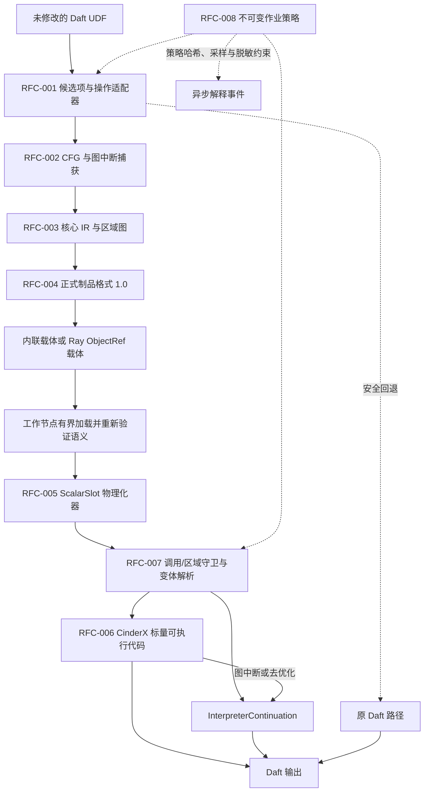
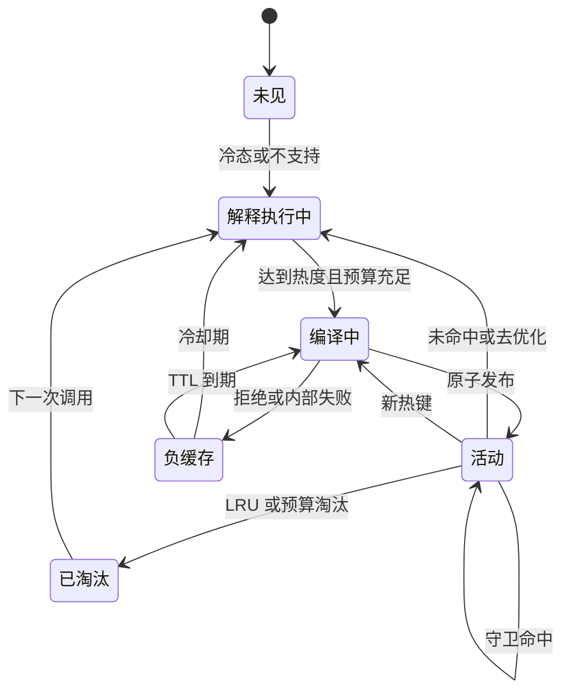
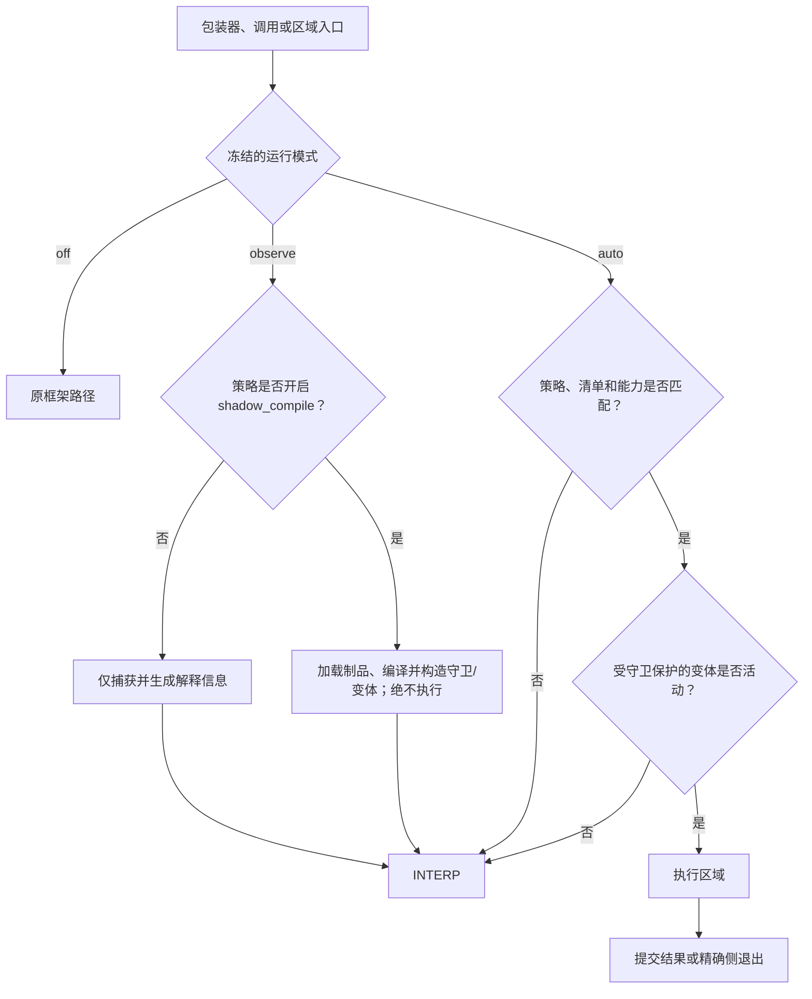
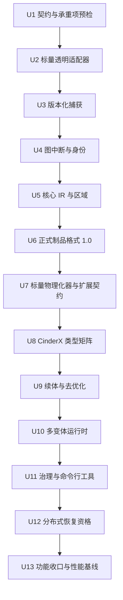

# RFC-001～RFC-008 标量主线生产化补全实施计划

<!-- ce-section: Goal Capsule | goal-capsule -->
## 目标概述

- **目标：** 从已通过的既有 `scalar-piercing` U12 `float64 -> float64` 固定三节点纵向切片出发，完成 RFC-001～RFC-008 的标量主线生产实现、治理闭环和工程功能完备验收；向量和 Arrow 执行只保留扩展契约，不在本期实现。
- **权威依据：** `docs/rfcs/RFC-001-transparent-integration.md` 至 `docs/rfcs/RFC-008-runtime-governance.md` 定义长期产品契约；`docs/solutions/architecture-patterns/scalar-mainline-vertical-slice.md` 定义后续扩展必须保留的四个承重接缝；本计划按用户确认的交付边界分期实现 RFC-005 和 RFC-006 的标量部分，并明确排除 RFC-009～RFC-012。
- **目标代码库：** `python-udf-jit` 承载适配器、编译器、制品、布局、运行时、治理和验收；CinderX 工作树承载数据感知内建指令、HIR/LIR、运行时与去优化，`vendor/cinderx/` 保存可审查的补丁序列和交付清单。
- **执行方式：** 本机开发并执行单元测试和不依赖容器的集成测试；每个里程碑在 blue-98 重建候选镜像并执行固定三容器系统测试；候选版本通过工程功能门禁后，再进入真实多物理节点、恢复和安全门禁。性能分项基线从 U1 开始持续维护，功能完备后执行一次完整 A/B，不阻断本期功能完成。
- **停止条件：** 跨代码对象续体验证原型无法保证活跃值、异常和副作用恰好执行一次；新增 CinderX 数据加载/存储内建指令无法被守卫支配；`ScalarSlot` 生命周期或隔离无法证明；或提交后退出仍可能整函数重放。触发任一条件时停止扩大功能面，先修复承重接缝。代表性下一基线的试行变基用于暴露维护风险，超过预算时必须登记负责人和收敛方案，但不阻塞当前锁定基线的功能实现。
- **收尾责任：** RFC-008 的作业级只读策略、解释信息、工程功能完备报告、运维手册和部署回滚演练属于本期完成条件。性能报告、热点清单和可重复 A/B 基础设施也必须交付，但 `1.15x` 是后续持续调优目标，不是本期功能完成的前置条件。

---

<!-- ce-section: Product Contract | product-contract -->
## 产品契约

### 方案概述

主线生产版保持业务脚本无改动，在 Daft 0.7.2 和 Ray 2.55.0 中透明发现 `where/select/with_columns` 的标量 UDF，生成可验证的捕获 IR、核心 IR 和可移植制品，在工作节点对 `ScalarSlot` 晚绑定，并由标量 Python 执行提供器选择 CinderX JIT 或精确的 `InterpreterContinuation`。描述符和 `AccessSpec` 携带精确的布局类型，当前只接受 `scalar_slot`；后续 `BatchView` 和 Arrow 必须单独立项，本期不实现也不预埋可读取的扩展分段。正确性、恢复、资源、安全和治理门禁全部通过后可标记为 `functional-complete`；是否达到 `1.15x` 则通过独立的性能资格状态持续推进。

### 问题背景

既有 `scalar-piercing` U12 已证明 Daft `RaySwordfishActor`、工作节点本地能力与描述符、制品驱动的 `Artifact Lowering`（由已验证区域生成代码对象的降层/代码生成过程）和 CinderX 数据读取四个承重接缝成立，但穿刺实现不构成正式版本。它仍局限于单参数、非空 `float64`、单基本块、内联制品、`ScalarSlot`、同步单变体和验收专用事件，不能覆盖其余基础类型、可空值、分支、图中断、正式制品、异步编译、多变体缓存、治理或生产恢复。

本期优先消除标量路径的语义、生命周期、恢复和治理缺口。现有包装器 → 适配器 → 缓存 → 变体 → 执行器链路和全局槽位表仍有逐行开销，这是必须持续测量和优化的已知问题，但不再以“一次重构达到 `1.15x`”作为扩大功能面的前置证明。每个优化都在功能矩阵通过后做方向性 A/B；批处理或区域提升、Arrow 零拷贝和逐元素执行进入后续阶段。

### 参与角色

- A1. **Daft 业务用户：** 保持原有 UDF、装饰器和 DataFrame 接口，不学习 JIT 接口。
- A2. **平台运维人员：** 通过 Wheel、作业级只读策略、运行模式、发布配置和 `udfjitctl` 完成灰度、诊断与部署回滚。
- A3. **编译器和运行时开发者：** 扩展捕获、IR、描述符、CinderX 和守卫，并为每个新语义提供差分与路径证据。
- A4. **发布验收人员：** 在 blue-98 和多物理节点环境执行同一运行批次和代次的功能、恢复、隐私门禁，并维护独立的性能趋势与资格报告。
- A5. **首发业务负责人（进入首发小流量试运行时必需）：** 指定一个位于生产支持矩阵内的真实 Daft 作业，签收正确性、可诊断性、灰度和回滚，并确认方向性性能报告符合真实作业事实，不以合成基准测试代替采用验收。未绑定 A5 不阻塞标量功能完备，但灰度状态最高为 `observe-ready`。

<!-- ce-section: Requirements | product-requirements -->
### 需求

**透明接入与捕获**

- R1. A1 的 UDF 源码、装饰器和调用方式不变；适配器覆盖 Daft 0.7.2 的 `where/select/with_columns` 规范入口并保存完整 UDF 配置。包装器构造前发现 Daft 版本、签名、指纹或初始化不受支持时保持原 Daft 路径；一旦生成分布式包装器，驱动节点与工作节点的 Wheel、包装器和载体契约必须精确一致，否则在提交前拒绝，禁止把反序列化失败描述为无感回退。
- R2. 引导过程必须实现 `UDFJIT_DISABLE > plugin enable > off/observe/auto > exact compatibility > policy` 的确定优先级，新安装默认 `off`。模式和策略在作业启动时冻结；本期不实现运行中分布式紧急停用通道，停用通过新作业使用 `off` 或部署回滚完成，已进入语义执行的区域不被中断或整函数重放。
- R3. 捕获前端必须按锁定的 CPython 3.14 字节码格式解码 CFG、异常边、位置信息、源码映射和类 SSA 值，支持五种基础类型、可空值、算术、比较、布尔短路、局部分支、固定字段或索引、白名单内建函数、受控小函数，以及 RFC-002 要求的受控 `str` 操作和只读 `tuple`/`list` 构造；后两类只要求完成建模、参考解释和 Python 区域正确性，不进入 CinderX JIT 类型门槛。
- R4. 未知调用或不安全语义形成带 `Effect`、入口和出口活跃值、异常状态、源码映射及版本化 `resume_id` 的 Python 区域；驱动节点不执行用户可调用对象，验证器无法证明续体正确性时保持整函数解释执行。
- R5. `CodeIdentity`、`DependencyFingerprint` 和 `CandidateId` 必须分离；前两者覆盖代码、常量、默认参数、闭包单元与受控全局变量和模块版本，且身份计算不得触发用户描述符、`repr` 或任意 Python 执行。

**语义 IR 与制品**

- R6. 核心 UDF IR 必须表达函数、CFG、`LogicalType`、`Null`、`Effect`、`MayRaise/ExceptionOrder`、`Alias/Identity`、`Determinism`、Python 区域和源码映射，并通过固定的优化与分析流水线、失效管理、预算和完整验证器生成 `SemanticRegionGraph`。
- R7. 参考解释器必须以 CPython 为判定基准验证支持节点和 Python 区域边界；区域划分不得跨越效应或异常屏障，跨多个 UDF 的融合不是发布门禁。
- R8. 穿刺期制品不构成任何已发布版本；当前是首个正式版本。可移植制品采用唯一的正式格式 1.0 和固定分段集合，提供确定性编解码器、资源上限、内容哈希、精确依赖/目标清单、内联与 `ObjectRef` 双载体，以及只读检查和验证能力。本期不提供穿刺制品读取器、格式迁移器、可选分段、前向兼容或后向兼容。
- R9. 可移植制品不得包含工作节点地址、描述符、HIR/LIR 或机器码；工作节点必须在分配物理资源前重新验证精确格式号、固定字段、固定分段、依赖、核心 IR 和区域。任何未知、重复、缺失或乱序字段/分段，任何其他格式号、目标/运行时 ABI 不一致或内容损坏，都必须在首个语义提交点前拒绝该制品，按完整缓存命名空间进入负缓存，并在原可调用对象仍可安全执行时改走解释路径；载体外壳本身无法读取时不允许声称回退。

**布局、CinderX 与守卫执行**

- R10. 物理化器本期只实现 `ScalarSlot` 描述符，覆盖 `bool/int32/int64/float32/float64`、可空值、类型标签、所有权、保活引用、进程代际、描述符代次、输入/输出能力和发布边界；制品、`AccessSpec` 和描述符协议必须携带精确的 `layout_kind`，当前只接受 `scalar_slot`，Arrow、批处理、未知类型或任何额外字段都稳定拒绝，且不得携带工作节点地址。
- R11. `BatchView`、Arrow C Data/Array 描述符、切片/数据块、列式输出、逐元素循环和跨元素内核均不在本期实现。遇到未实现的布局类型时，必须给出稳定的“不支持”原因并保持原 Daft/Python 路径；不得以“预留扩展”为名加入未经验证的隐藏向量执行分支。
- R12. 标量 Python 执行提供器必须提供 `Capability`、`Compile`、`Execute` 和 `InterpreterContinuation`，支持五种基础类型、可空值、算术、比较、分支、字段/结果的加载与存储、物化、侧退出、装箱标量和单值非装箱标量。
- R13. 每个数据感知 CinderX 加载/存储内建指令都必须被描述符守卫支配并携带完整去优化状态；机器码、语义哈希、制品哈希、区域哈希、代码哈希和变体键必须能够串联追踪。
- R14. 整个 UDF 的回退只允许发生在首个效应或语义提交点之前；已执行区域前缀后的图中断、守卫侧退出或去优化，只能依据 `resume_id + live values + exception state` 精确续接，禁止整函数重放。
- R15. 运行时必须实现完整的分层守卫、调用/区域级变体解析、进程内多变体缓存、热度门槛、异步 `Singleflight`、原子发布、负缓存、TTL/LRU、编译/代码/内存/并发预算和区域/UDF/作业熔断。预算、队列、负缓存和淘汰域必须同时受作业/租户命名空间与工作节点全局硬上限约束；平台若复用工作进程承载多个作业或租户，必须提供公平配额，否则保持 JIT 关闭。在途执行按安全点规则完成、精确退出或使当前执行尝试失败，禁止中断后整函数重放。
- R16. JIT 只承诺单次 Ray 执行尝试内不比同配置 Daft 基线增加执行次数或副作用；跨执行尝试服从 Daft/Ray 原有重试语义，不承诺整个作业恰好执行一次。

**治理、部署与发布**

- R17. `off` 模式不捕获、不编译、不执行；`observe` 模式完成发现与解释信息生成，但不执行优化变体；`auto` 模式仅在能力、预算、显式范围和守卫全部命中时执行。影子编译必须由显式策略开启。U2 起的每个里程碑都必须在固定输入上执行独立的 `off/observe` 差分运行，比较结果、异常、行序和路径证据；生产 `observe` 不得为了比较而重复执行具有副作用的用户代码，也不得发布影子结果。功能资格允许在已明确授权的受控小流量试运行中强制覆盖支持矩阵，扩大生产范围还必须满足本地收益策略；取得 `performance-qualified` 前只要求受限自动模式，不要求扩大自动模式。
- R18. 策略按作业冻结，并把精确策略标识和哈希写入制品、变体及事件。驱动节点与工作节点的策略不一致、治理初始化失败或租户/ABI 不匹配时只允许解释执行；本期不实现运行中策略更新、密钥吊销或紧急停用控制通道，业务异常不得计入内部熔断。
- R19. 遥测必须有界、异步、可采样，并以调用/区域粒度聚合且记录丢弃计数；不得记录逐行业务值、常量内容、可调用对象的 `repr`、异常消息、敏感配置、源码片段或绝对路径。解释信息串联“来源→捕获→IR→制品→布局→变体→执行”，对外只使用脱敏的 `SourceIdentity`。
- R20. `udfjitctl` 必须提供制品检查/验证、兼容性检查、解释信息和主线基准测试能力；机器可读的数据结构与原因码必须版本化。报告和临时证据沿用 `0700` 目录、`0600` 文件、拒绝符号链接和白名单清理契约；命令行工具仅是本地只读工具，不提供远程控制接口，也不得跨作业或租户枚举。
- R21. 既有 `scalar-piercing` U12 纵向切片保留为不可变回归配置集；新的 `mainline-production` 配置集逐 RFC 追踪单元测试、集成测试、系统测试、恢复、安全和性能，不以历史运行批次或其他代次拼接结论。
- R22. 两个工作节点的生产资格必须达到 `2/2`；普通端到端功能测试允许自然覆盖 `1/2` 或 `2/2`。另设真实负载系统测试，在执行前冻结版本、分区数、并发、CPU、运行次数和判定规则；不得使用亲和、延时或屏障，不得为追求 `2/2` 选择性重跑，并须自然观察到两个工作节点都实际执行且头节点无数据面事件。
- R23. blue-98 三容器是每个里程碑的预发布门禁；生产发布还需要一个头节点（兼任驱动节点）和两个物理隔离工作节点组成的多节点门禁，覆盖 `ObjectRef` 跨机、工作节点加入/退出/重启、任务重试和 CPU/ABI 变体隔离，并验证可信私网、最小端口 ACL、平台节点身份和未授权节点拒绝。提交时的精确准入结果必须写入作业清单；动态加入或重启的工作节点在进入合格资源池、创建 Actor 和首次读取载体前都要重新验证 Wheel、包装器/载体、运行时 ABI、镜像摘要和策略，无法读取载体外壳的节点不得承接该作业。候选镜像必须固定基础镜像与依赖摘要，来自批准的制品源，生成 SBOM、构建来源证明和补丁清单，并对完整候选镜像执行漏洞扫描，覆盖基础镜像、操作系统软件包、Python 依赖、Wheel、内嵌原生二进制和 CinderX 补丁；本期不设置组件支持期/EOL 准入门禁。
- R24. 性能采用独立的持续调优轨道：功能完备后建立固定环境基线、逐算子报告和热点清单，每个优化变更至少执行一次同环境 A/B，并记录结果与正确性哈希；不要求 ABBA，也不以单次结果形成正式结论。累计目标仍为主线 `>=1.15x`；只有后续声明 `performance-qualified` 时，才按 RFC-008 执行预热、五次 A/B 交替、中位数、MAD/漂移，以及回退路径、遥测和 `off` 模式回归门槛。未达到目标不得抹去数据或伪造收益，但不阻断 `functional-complete`。
- R25. RFC-009～RFC-012 在配置、代码路径、事件和发布报告中保持关闭，不把混合执行提供器、列式内核、稀疏批次退出或等价语义回填计入主线收益。

### 生产支持矩阵

| 维度 | 生产主线路径 | 仅解释器或 Python 区域 | 不在本期 |
|---|---|---|---|
| 类型 | `bool/int32/int64/float32/float64` 及可空值 | `string/binary/list/struct/dictionary` | 任意对象协议的完整加速 |
| 运算 | 算术、比较、空值、短路、局部分支、固定字段或索引、已建模内建函数 | 受控 `str`、只读 `tuple`/`list` 构造、不透明调用、不支持的 C 扩展、未建模动态访问 | 生成器、协程、元类特化 |
| 布局 | Python `ScalarSlot`、标量可空有效位、工作节点本地输入/输出槽位 | 原 Daft/Python 标量物化 | `BatchView`、Arrow 输入/输出、切片/数据块、零拷贝、RFC-010 内核/SIMD |
| 执行 | 装箱标量、单值非装箱标量、精确续体/去优化 | 证明不完整时整函数解释执行 | Arrow 逐元素循环、列式输出、RFC-009 混合执行提供器 |
| 缓存 | 工作进程内的多变体制品与代码缓存 | 重启后重建 | 跨集群全局机器码缓存 |

### 发布状态模型

`functional-complete` 只表示工程功能完备，不等于生产启用、首发业务采用完成或性能资格通过；实际可启用范围必须同时读取灰度状态轴。`performance-qualified` 是 `performance_qualification_status=qualified` 的人类可读称谓，机器可读报告和门禁只写入 `qualified`。每个实施单元另输出 `unit_completion_status=incomplete|complete`：未开始、进行中或缺少任一必需证据都属于 `incomplete`，不得用门禁结果 `inconclusive` 代替；只有该单元全部必需门禁均已执行并通过，才能写入 `complete`。

| 状态轴 | 状态 | 晋级规则 | 运维含义 |
|---|---|---|---|
| 标量功能 | `incomplete` → `functional-complete` | U1～U12 的正确性、恢复、资源、安全和治理门禁全部通过，U13 完成工程功能完备报告、RFC 状态和运维手册收口；不设置速度阈值 | 代码和标量支持矩阵已完成；默认仍为 `off`，可进入 `observe` 或受控资格测试 |
| 灰度范围 | `off-only` → `observe-ready` → `adopter-canary-authorized` → `adopter-canary-complete` → `wider-auto-ready` | `adopter-canary-authorized` 要求命名作业、目标集群、观察/影子编译证据、部署回滚方案和变更授权齐备；完成受限 `auto`、部署回滚演练及 A5 签收后才进入 `adopter-canary-complete`；`wider-auto-ready` 还要求 `performance-qualified` 和已验证的本地收益策略 | 把“允许执行小流量试运行”与“试运行已经完成”分开，明确当前最大启用范围 |
| 性能资格 | `unqualified` → `qualified` | 后续 `--formal` 满足 RFC-008 稳定性、主线 `>=1.15x` 及回退路径、遥测和 `off` 模式门槛 | 独立于功能状态；失败或无法判定不覆盖 `functional-complete` |

### 关键流程

- F1. **透明支持流程**
  - **参与角色：** A1、A3
  - **步骤：** 候选项 → 操作定稿 → 捕获 IR/核心 IR → 制品 → 工作节点物理化 → 守卫/变体 → CinderX 或续体。
  - **覆盖需求：** R1～R15
- F2. **图中断与去优化流程**
  - **参与角色：** A1、A3
  - **步骤：** 已编译区域前缀 → 效应屏障/侧退出 → 物化活跃值 → 精确续接 → 原 Python 后缀。
  - **覆盖需求：** R4、R6、R12～R16
- F3. **灰度与回滚流程**
  - **参与角色：** A2、A4、A5
  - **步骤：** `off` → `observe` → 小流量观察与影子编译资格验证（不执行优化代码）→ 小流量试运行授权 → 受限 `auto` → 停止新作业并部署回滚与签收；取得后续性能资格并通过本地收益策略后，才进入扩大 `auto`。
  - **覆盖需求：** R2、R17～R20
- F4. **分布式恢复流程**
  - **参与角色：** A2、A4
  - **步骤：** 工作节点重启或新执行尝试 → 重新加载可移植制品 → 重建描述符和变体 → 在当前执行尝试内运行并留存证据。
  - **覆盖需求：** R8～R9、R15～R16、R21～R23

### 验收示例

- AE1. **透明操作：** 未修改的 `where/select/with_columns` 作业在未安装、`off`、`observe` 和 `auto` 下的结果、行序、异常及 Daft UDF 选项一致；只有 `auto` 可以产生执行事件。U2～U12 每个里程碑都用独立的固定输入运行 `off/observe` 差分，生产 `observe` 不重复执行具有副作用的 UDF。
- AE2. **基础类型和可空矩阵：** 五种基础类型的装箱/非装箱标量、可空值、分支、比较、空输入和单行调用均与 CPython/Daft 判定基准一致。
- AE3. **图中断：** 不透明调用前后的区域保持源码映射、活跃值、异常和副作用顺序；续体只执行未完成的后缀，整函数调用次数不增加。
- AE4. **正式制品严格准入：** 内联制品与 `ObjectRef` 制品在两个工作节点验证同一内容哈希；驱动节点与工作节点的 Wheel、包装器和载体契约不完全一致时在提交前拒绝。载体可读但内部制品存在未知、重复、缺失或乱序字段/分段，或格式号、目标、运行时 ABI 不完全一致时，在语义提交前拒绝该制品并安全改走解释路径；工作节点重启后从句柄重建。
- AE5. **布局安全：** 过期代次、伪造能力、跨进程句柄、非法 `ScalarSlot` 类型标签、缺少保活引用、错误的可空有效位或输出容量不足，均在首次加载/存储操作前被拒绝，且不发布部分输出。
- AE6. **异步变体生命周期：** 100 个相同键的并发调用只触发一次后台编译，当前调用不等待；新键、负缓存 TTL、LRU、预算和熔断按状态机执行，活动变体在引用归零后回收。
- AE7. **去优化与失败：** 业务异常按原语义传播；提交前的内部失败安全回退到解释路径，提交后只允许精确侧退出/去优化或使当前执行尝试失败，不把内部故障包装为业务异常。
- AE8. **治理：** 驱动节点和工作节点的策略哈希一致时按冻结模式执行；策略漂移或治理初始化失败时只解释执行，遥测队列满时只增加丢弃计数。
- AE9. **分布式执行：** 双工作节点资格为 `2/2`；冻结的真实高分区负载契约在每个有效运行批次中自然观察到两个工作节点执行，头节点数据面事件为零，工作节点重启和 Ray 重试的每个执行尝试均可唯一归因。
- AE10. **工程功能完备与性能跟踪：** 固定的 TPC-H SF10/Lance 标量主线作业结果完全一致，工程功能完备状态不由 `1.15x` 决定；同环境 A/B、逐算子报告、热点排序和实际数值必须留档。FineWeb 实际文本负载走明确的“不支持”或回退路径，功能哈希一致，且不得误作标量 JIT 收益。
- AE11. **首发业务：** 一个命名的首发业务作业位于支持矩阵内；目标生产集群、观察/影子编译证据、部署回滚方案和变更授权齐备后，灰度状态才可标记为 `adopter-canary-authorized`。完成受限 `auto`、部署回滚并由 A5 签收结果和可诊断性后，才标记为 `adopter-canary-complete`。未指定首发业务不阻塞 `functional-complete`，但灰度状态最高为 `observe-ready`。
- AE12. **后续性能资格：** 当后续累计优化达到候选目标时，独立执行 RFC-008 正式统计门禁；达到 `1.15x` 才标记为 `performance-qualified`，失败或无法判定不反向否定已通过的标量功能矩阵。

### 成功标准

- RFC-001～RFC-008 的每个标量主线目标均映射到至少一个实施单元、自动化测试和工程功能完备门禁；RFC-005 和 RFC-006 的 Arrow/批处理条款明确标记为后续阶段，不以本计划冒充完整实现。
- 既有 `scalar-piercing` 回归配置集与 `mainline-production` 配置集独立判定，任何新增特性都不能破坏四个承重接缝。
- 所有支持类型和 `ScalarSlot` 布局都有“制品→描述符→守卫→HIR/LIR→结果”证据；所有 Python 区域都有续体，或明确保持整函数解释。
- blue-98 三容器、真实多物理节点、恢复和隐私报告均来自各自完整的运行批次和代次，不跨运行批次拼接。
- 用户可在不修改脚本的情况下从 `off` 灰度到 `observe/auto`，并在运维时通过新作业切换为 `off`、部署回滚、解释信息和稳定原因码完成回滚与定位。
- 首发业务负责人、代表性支持作业、目标集群、回滚方案、变更授权和验收责任在进入首发小流量试运行前写入发布清单；未经授权不得执行受限 `auto`，未完成真实作业签收不影响 `functional-complete`，但不得标记为 `adopter-canary-complete` 或扩大 `auto`。
- 初始性能基线、真实负载逐算子报告、热点清单和可重复的单次 A/B 工具随功能实现交付；`scalar_functional_status`、`rollout_status` 与 `performance_qualification_status` 三条状态轴不得相互替代或混用。

### 范围边界

#### 后续工作

- CPython 3.14 之外的解码器、Daft 0.7.2 之外的适配器和更宽版本矩阵。
- 字符串、二进制、列表、结构体和字典编码的 JIT 类型覆盖；它们仍可通过 Python 区域保持正确性。
- `BatchView`、Arrow C Data/Array 描述符、Arrow 基础类型输入/输出、切片/数据块、逐元素执行、列式输出、零拷贝、批处理或区域提升，以及相关原生模糊测试和性能资格。
- 跨工作节点或跨集群机器码缓存、远程签名服务、中心策略/遥测服务和全局制品注册表。
- KubeRay/Autoscaler 产品化、自动容量管理和多区域容灾；本计划只要求真实多节点发布门禁与故障恢复验证。
- 对同一工作进程内恶意用户 UDF 的隔离；首版威胁模型把同一作业的 UDF、驱动节点代码和运行时视为同一信任域。不可信多租户代码必须由平台通过进程或容器隔离，否则保持 JIT 关闭。

#### 本计划不包含

- RFC-009 混合执行提供器。
- RFC-010 跨元素列式/向量内核。
- RFC-011 稀疏批次侧退出。
- RFC-012 Daft 原生等价语义回填。
- 修改或维护 Daft、Ray、Lance 源码分叉。

### 产品契约保留说明

新计划不修改已完成的既有 `scalar-piercing` U12 穿刺计划。它把 RFC-001～RFC-008 和该穿刺经验作为生产化输入；用户确认的范围是 RFC-001～RFC-008 的标量主线，RFC-005 和 RFC-006 的 Arrow/批处理执行条款后置，RFC-009～RFC-012 明确排除。R10～R12、R15、R19、R24 及其验收映射已按此交付分期改写；RFC 文档在 U13 更新状态时必须写明“标量阶段完成、向量阶段未实现”。（session-settled: user-directed — chosen over 同期实现 ScalarSlot 与 Arrow/批处理: 本期先完成功能语义，向量接口只保留扩展能力。）

---

<!-- ce-section: Planning Contract | planning-contract -->
## 规划契约

### 关键技术决策

- KTD1. **新增生产验收配置集，不改写既有 `scalar-piercing` 配置集。** `scalar-piercing` 继续证明窄切片，`mainline-production` 追踪 RFC-001～RFC-008 的标量功能矩阵；验收聚合器按配置集和结构版本工作，避免测试数量或证据含义漂移。
- KTD2. **标量功能完备优先，向量执行后置。** U1 记录既有 `scalar-piercing` 路径的包装器、守卫/缓存、槽位、CinderX、物化和 Daft/Ray 调度开销，作为持续优化基线；U2 继续透明接入普通标量 UDF，不生成批处理包装器，也不要求取得 `BatchView` 或 Arrow 描述符。后续向量阶段只能通过已预留的版本化布局、描述符和执行提供器接口扩展。（session-settled: user-directed — chosen over 在语义扩展前实现 BatchView/Arrow: 当前里程碑先完成标量语义、可靠性和治理。）
- KTD3. **生产支持矩阵以五种基础类型和可空值为唯一 JIT 门槛。** 字符串和嵌套类型保留在 Python 区域中，不用无限覆盖阻塞主线发布。
- KTD4. **图中断使用显式区域续体，不把跨代码对象恢复伪装成原生去优化。** 效应屏障同时是提交边界；CinderX `FrameState` 只恢复区域自身，跨 `_verified_scalar_region` 与原始 UDF 的边界通过显式 `SideExit` 载荷返回 Python `InterpreterContinuation`。U1 必须先证明“已编译前缀→不透明副作用→原始后缀”恰好执行一次，并覆盖可空基础值、分支汇合、装箱 Python 值的身份/别名、借用与保活引用、活动异常状态及提交点两侧的副作用；侧退出携带版本化 `resume_id`、活跃值、异常状态和源码映射。证明不足时保持整函数解释。
- KTD5. **首个正式制品只接受唯一精确契约。** 穿刺期制品不是已发布版本，不建立读取、迁移或兼容路径。正式格式固定为 1.0，字段、分段、顺序、编解码器、IR 格式、运行时 ABI、适配器 ABI、Python、SOABI 和依赖必须精确匹配；任何未定义内容或其他版本都在执行前拒绝。本期不实现制品消息认证码、作业密钥、轮换或吊销。
- KTD6. **可移植清单与目标清单分层但共同严格准入。** 可移植清单表达精确格式、语义 IR 和资源上限，目标清单表达精确运行时 ABI、适配器 ABI、Python、SOABI 和依赖；CPU 与标量描述符进入工作节点绑定和变体键。未来布局或格式若要落地，必须单独立项和协同发布，当前读取器不会跳过或接受。
- KTD7. **本期只注册 `ScalarSlot`，稳定拒绝扩展类型。** 所有物理布局都必须复用现有能力和所有权门禁；当前注册表只注册 `ScalarSlot`。未知或尚未实现的批处理/Arrow `layout_kind` 返回版本化“不支持”原因并走原 Daft/Python 路径，接口测试确保以后扩展不需要把地址写入制品。
- KTD8. **CinderX 按 F64 `ScalarSlot` → 其余基础类型 → 可空值/分支/写入 → 续体/去优化递进。** 每一层独立通过 `RuntimeTests`、Python 差分和双工作节点资格后再继续；不以非装箱元素或 Arrow 用例作为本期前置层。
- KTD9. **当前调用从不等待后台编译。** 每个键使用 `Singleflight` 合并编译；队列满、冷态、编译中、负缓存命中或预算不足时立即执行续体，发布时使用不可变变体快照。
- KTD10. **变体缓存只在工作进程内。** 制品可跨工作节点共享，描述符、能力、代码对象和变体不能跨 PID 或进程代际复用。
- KTD11. **本期只有不可变作业策略。** `observe` 默认不影子编译；发布流程可为一个新作业显式开启小流量影子编译。模式和策略在作业启动时冻结，本期不建设运行中分布式紧急停用通道；停止优化通过新作业使用 `off` 或部署回滚完成。
- KTD12. **重试采用单次执行尝试内等价。** JIT 不比相同 Daft 配置增加单次执行尝试内的执行次数或副作用，不宣称跨执行尝试恰好执行一次。
- KTD13. **双工作节点资格和业务覆盖分开。** 每个工作节点都必须能够执行生产制品；普通功能作业不强制均衡，独立真实负载系统测试在执行前冻结版本化调度采样契约，每个有效运行批次必须自然观察到两个工作节点参与，不允许为得到 `2/2` 选择性重跑。
- KTD14. **功能完成和性能资格分层。** 本期先达到 `functional-complete`；随后以固定基线、热点排序和单次 A/B 持续积累优化，不要求 ABBA。`1.15x` 保留为 `performance-qualified` 的累计目标，只有声明该状态时才运行 RFC-008 五次交替中位数与 MAD/漂移门禁。（session-settled: user-directed — chosen over 以单次 `1.15x` 作为阻断门禁: 性能需要持续调优，不能阻塞功能完备。）
- KTD15. **主线不借用高阶能力达标。** RFC-009～RFC-012 的开关、事件和报告必须证明关闭；任何收益都来自 RFC-001～RFC-008。
- KTD16. **完整灰度包含独立授权和不执行优化代码的影子资格验证。** 新安装默认 `off`；本期 A2 按“`off`→`observe`→小流量观察与影子编译资格验证（不执行优化代码）→变更授权→受限 `auto`→停止新作业并部署回滚与签收”完成功能资格。观察与影子证据、命名作业、目标集群和回滚方案只能使状态进入 `adopter-canary-authorized`；实际受限 `auto` 与签收完成后才进入 `adopter-canary-complete`。扩大 `auto` 是同时取得 `performance-qualified`、通过本地收益策略并完成首发业务灰度签收后的独立晋级。
- KTD17. **不接受混合版本。** Wheel、包装器、载体外壳、正式制品、IR 和 ABI 必须逐项精确一致；提交、动态节点加入、Actor 创建和首次读取载体时都要复验。不一致的节点不得进入合格资源池；若载体外壳可读而内部制品不匹配，可在语义提交前改走解释路径。无法读取载体外壳时必须拒绝，禁止把反序列化失败描述为安全回退。
- KTD18. **本期保留已证明的 Daft `Func._method` 短暂替换接缝。** U2 继续在进程级 `_CALL_LOCK` 内把单个 `Func` 实例的 `_method` 临时替换为序列化包装器，调用保存的 `Func.__call__` 后在 `finally` 中恢复；兼容指纹覆盖所有私有成员，异常、递归和并发测试证明无可见漂移。隔离式影子 `Func` 或公开重写 SPI 作为后续兼容与性能优化，不在功能扩展前另造未经验证的注入抽象。

### 总体技术设计

#### 跨进程生产数据流

#### 变体生命周期

#### 模式与安全点决策

#### 交付依赖

图中的箭头表示功能完成依赖，不表示把端到端验证推迟到最后。既有 F64 `scalar-piercing` 纵向通道在整个实施期间保持可运行；U2～U12 每完成一个里程碑，都必须把当期实现接入该通道，在 blue-98 同时运行既有回归、`off/observe` 差分和当前可达的 `auto` 路径。若纵向通道不能运行或出现结果、异常、路径证据差分，当前单元保持 `incomplete`，不得继续叠加下一层能力。

### 前置假设

- 当前锁定的 CPython 3.14、CinderX、Daft 0.7.2、Ray 2.55.0 和 Lance 7.0.0 继续作为首个生产清单；Daft 的 PyArrow 依赖可存在于环境中，但不构成本期 JIT 布局支持范围，升级版本需要另行重新资格验证。
- blue-98 可持续提供三容器预发布环境；平台运维负责人必须在第二阶段结束前交付一台物理头节点（兼任驱动节点）、两台物理工作节点的预约与访问条件，以及可信私网/ACL、节点身份和清理证据，否则 U7 及以后状态为 `STOP`。
- U1 退出前在发布前置条件中登记首发业务负责人、代表性作业指纹、目标生产集群、当前 `off` 基线和该作业落入标量支持矩阵的比例；缺失时可继续形成 `functional-complete`，但灰度状态最高只能是 `observe-ready`。观察/影子编译证据、回滚方案和变更授权齐备前，不得进入 `adopter-canary-authorized` 或执行受限 `auto`。
- Daft/Ray 的跨执行尝试副作用语义以插件关闭时的同配置基线为上限，不增加“恰好执行一次”的承诺。
- `python-framework-analysis-pipeline` 的 FineWeb 逐算子报告用于验证“不支持”或回退路径的实际负载、功能正确性和方向性开销，不作为标量主线 `1.15x` 的正式数据集。

### 全局影响

- **框架边界：** Daft 私有钩子、包装器序列化和 `RaySwordfishActor` 载体都是外部契约面；新增 `where/select`、`ScalarCallView` 或 UDF 选项时，必须同步兼容性指纹和真实工作节点集成测试。未来接入 `BatchView` 必须作为新阶段单独资格验证。
- **编译器和协议边界：** `CaptureIR`、核心 IR、制品、描述符、续体和变体键形成连续 ABI 链；本期所有格式与 ABI 精确匹配，任何版本、字段或分段变化都拒绝，不提供可选分段或主次版本兼容。
- **CinderX 边界：** 数据感知内建指令影响 HIR/LIR 分支完备性、运行时 ABI、去优化和 CPython 版本维护；每次扩展都要更新补丁清单、`RuntimeTests`、Python 测试和双工作节点资格。
- **部署边界：** 业务代码仍保持无感，但驱动节点和工作节点必须通过准入检查证明 Wheel、载体、CinderX 和冻结策略精确一致；提交时准入不能替代动态工作节点在加入、Actor 创建和首次载体读取前的复验。仅在载体可读、原可调用对象仍可安全执行且内部制品不匹配时允许解释执行。
- **运维边界：** `udfjitctl`、作业级只读策略和解释信息成为平台接口，数据结构、原因码、本地授权、文件权限和保留策略必须精确锁定，不能依赖开发日志或远程任意命令。本期不提供远程控制或紧急停用接口。
- **性能边界：** 守卫、变体、遥测和 `ScalarSlot` 描述符进入逐调用热路径；本期必须建立包装器、守卫/缓存、槽位、CinderX、物化、编译和去优化的分项归因，但不要求先改成批处理或区域提升才允许扩展功能。
- **安全边界：** 作业/租户/ABI 命名空间、内容哈希、原生描述符/JIT 和无业务值遥测扩大了配置与内存安全边界。同一作业的 UDF 与运行时属于同一信任域；治理初始化不可用时只能收缩到解释路径，不能放宽编解码器、验证器或守卫。本期不声称提供制品来源认证或同进程恶意代码隔离。

### 风险与依赖

| 风险或依赖 | 影响 | 缓解措施或门禁 |
|---|---|---|
| 标量功能扩展放大现有逐调用开销 | 功能正确但当前性能收益有限或为负 | U1 固化分项基线；U13 维护热点清单，每个优化做同环境单次 A/B，功能实现不因尚未达到 `1.15x` 停止 |
| 扩展接口被误实现为未经验证的隐藏 Arrow/批处理路径 | 范围膨胀，正确性和内存安全证据失真 | U7 只注册 `ScalarSlot`；静态和行为测试验证未知 `layout_kind` 稳定回退，且生产配置集不出现 Arrow/批处理执行事件 |
| 跨代码对象的图中断或去优化无法精确恢复 | 提交后重放、副作用重复或异常错序 | U1 先证明显式 `SideExit→InterpreterContinuation` 最小链路；U4 和 U9 再以效应屏障和验证器扩展 |
| 驱动节点与工作节点的冻结策略不一致 | `auto` 可能采用不同决策 | 提交、节点加入、Actor 创建和首次调用时精确校验策略哈希；不一致时只允许解释执行 |
| CinderX 内建指令或补丁难以跟随上游 | 后续适配成本增加或 ABI 证据失效 | 按 KTD8 拆分补丁序列，每层锁定提交和源码树哈希；变更 Python/CinderX 基线时重新完成资格验证，本期不设置组件支持期门禁 |
| 能力/槽位全局锁或逐调用 Python 守卫成为热点 | 标量路径难以累积到 `1.15x` | 纳入 U1/U13 分项性能剖析并按贡献度持续优化；只有正确性、隔离或资源上限失守才阻断功能门禁 |
| Ray 重试被误解为恰好执行一次 | 作出超出 Daft/Ray 的副作用承诺 | R16/KTD12 固定单次执行尝试内等价，报告按执行尝试归因 |
| blue-98 仍是单物理宿主 | 无法证明跨机 `ObjectRef`、CPU 差异和节点丢失恢复 | U12 前分配三物理节点环境；缺失时发布状态为 `STOP` |
| TPC-H SF10 Lance 快照、固定资源或结果落点漂移 | 连续 A/B 趋势不可比较 | U13 把数据、资源和清单哈希纳入报告；发生漂移时开启新基线，不把不同基线拼接成收益 |
| 支持矩阵与测试数量快速膨胀 | RFC 之间覆盖不一致，既有 `scalar-piercing` 契约频繁破坏 | U1 先固定机器可读矩阵和配置集感知聚合，不以硬编码测试数量代表完整性 |
| 遥测或解释信息泄漏业务值，或对热路径产生反压 | 隐私事故或稳态回归 | 调用/区域聚合、白名单、丢弃计数、小流量扫描和持续遥测开关 A/B；隐私或有界性失败阻断工程功能完备验收 |
| `ScalarSlot` 描述符或 CinderX 原生输入触发越界、UAF 或 RWX 映射 | 工作节点崩溃或原生内存破坏 | U7～U9 执行 ASan/UBSan、标量描述符原生模糊测试、能力生命周期和 W^X 门禁 |
| Daft 相同版本包含不同源码补丁 | 钩子静默失效或误接入 | 使用版本、签名和规范 AST 指纹；遇到未知补丁时保持原路径，不扩充宽松白名单 |
| Docker 网桥、firewalld 或多网络头节点地址异常 | 工作节点已注册但 `ObjectRef`/载体数据面挂起 | 复用内部别名、头节点显式 IP、2 MiB `ObjectRef` 门禁和临时 firewalld 绑定；禁止修改宿主路由 |

### 分阶段交付

以下四阶段按功能依赖推进，但共享一条持续可运行的 F64 纵向验证通道；每个单元都先完成窄端到端集成和 blue-98 证伪，再扩展该层矩阵。

1. **契约与控制面：** U1 固化验收配置集、基础策略/模式、多机外部契约和性能基线，并以续体验证原型清除承重未知项；U2 完成普通标量 UDF 的透明适配器。
2. **可移植语义面：** U3～U6 完成捕获、图中断、核心 IR 和首个正式制品格式 1.0，全部在 `observe` 或解释路径证明语义。
3. **标量工作节点数据面：** U7～U10 完成 `ScalarSlot` 描述符、向量扩展契约、CinderX 类型矩阵、精确续体和多变体运行时。
4. **治理与工程功能完备：** U11～U13 完成灰度、解释信息、分布式恢复、多节点功能资格、文档状态和持续性能基线；后续优化迭代复用同一 A/B 工具，另行达到 `performance-qualified`。

---

<!-- ce-section: Implementation Units | implementation-units -->
## 实施单元

| 单元 | 标题 | 主要文件 | 前置依赖 |
|---|---|---|---|
| U1 | 固化契约并消除承重未知项 | `config/`、`governance/policy.py`、`diagnostics/acceptance.py`、`spikes/` | 无 |
| U2 | 完成 Daft 透明接入 | `bootstrap.py`、`integration/daft_ray/` | U1 |
| U3 | 构建版本化捕获前端 | `compiler/bytecode_decoder.py`、`compiler/cfg.py` | U2 |
| U4 | 增加图中断、身份与续体元数据 | `compiler/abstract_interpreter.py`、`compiler/capture_ir.py` | U3 |
| U5 | 完成核心 IR、分析与区域划分 | `compiler/core_ir.py`、`compiler/pipeline.py` | U4 |
| U6 | 交付正式制品格式 1.0 与双载体 | `protocol/`、`integration/daft_ray/carrier.py` | U5 |
| U7 | 实现标量物理化与向量扩展契约 | `runtime/layout.py`、`runtime/descriptors.py`、`runtime/physicalize.py` | U6 |
| U8 | 完成 CinderX 标量类型矩阵 | `provider/scalar_python/`、CinderX JIT/运行时 | U7 |
| U9 | 实现精确续体与去优化 | `runtime/continuation.py`、CinderX 去优化 | U8 |
| U10 | 构建受守卫保护的多变体运行时 | `runtime/variant_manager.py`、`runtime/compile_pool.py` | U9 |
| U11 | 完成运行时治理与命令行工具 | `governance/`、`diagnostics/`、`cli.py` | U10 |
| U12 | 完成分布式恢复与部署资格验证 | `tests/system/`、`docker/`、`config/` | U11 |
| U13 | 完成标量工程功能完备验收并建立持续性能调优 | `benchmarks/mainline/`、文档和报告 | U12 |

### U1. 固化契约并消除承重未知项

- **目标：** 固化标量生产支持矩阵、基础策略与模式、外部平台契约、验收配置集和性能基线，并在扩大实现前证明跨代码对象续体的承重假设。
- **覆盖需求：** R2～R5、R8、R14、R17～R25
- **前置依赖：** 无
- **涉及文件：**
  - `config/scalar-piercing-acceptance.json`
  - `config/mainline-production-acceptance.json`
  - `config/mainline-support-matrix.json`
  - `config/mainline-release-prerequisites.schema.json`
  - `src/python_udf_jit/governance/policy.py`
  - `src/python_udf_jit/governance/modes.py`
  - `src/python_udf_jit/governance/emergency.py`
  - `src/python_udf_jit/governance/credentials.py`
  - `src/python_udf_jit/diagnostics/acceptance.py`
  - `src/python_udf_jit/diagnostics/test_evidence.py`
  - `tests/system/run_blue98_acceptance.py`
  - `benchmarks/mainline/profile.py`
  - `benchmarks/mainline/profile_schema.json`
  - `spikes/continuation_boundary/`
  - `tests/unit/governance/test_policy.py`
  - `tests/unit/governance/test_modes.py`
  - `tests/unit/governance/test_credentials.py`
  - `tests/integration/test_job_secret_distribution.py`
  - `tests/integration/test_emergency_disable_distribution.py`
  - `tests/unit/benchmarks/test_profile_schema.py`
  - `tests/unit/diagnostics/test_acceptance.py`
  - `tests/unit/system/test_candidate_manifest.py`
  - `tests/unit/system/test_blue98_acceptance_runner.py`
- **实现思路：**
  1. 让聚合器按验收配置集和结构版本读取门禁，不再硬编码测试数量；同时让 blue-98 运行器从 U1 起支持通过 `--acceptance-profile scalar-piercing|mainline-production` 选择配置集。实施单元生命周期使用 `unit_completion_status=incomplete|complete`，与已执行门禁的四态结果分离。
  2. 实现不可变作业策略和运行模式，锁定多机环境与首发作业的负责人和截止点；本期不实现密钥分发、运行中策略更新或紧急停用通道。
  3. 锁定 CPython、CinderX、Daft、Ray 和 Lance 的精确版本与源码/构建指纹；变更任一基线时重新执行资格验证，不设置剩余支持期或 EOL 硬门槛。
  4. 对既有 `scalar-piercing` 热路径完成包装器、守卫/缓存、槽位、CinderX、物化、编译/去优化分项特征测试，保存可重复的初始基线和热点排序。
  5. 在锁定版 CinderX 上完成“已编译前缀→不透明副作用→原始后缀”恰好执行一次的最小续体验证原型。原型覆盖可空基础值、分支汇合、装箱 Python 值的身份与别名、借用/保活引用、活动异常状态，以及提交点前后的副作用和失败注入。结论固化到关键技术决策和测试后删除原型代码，性能基线保留为生产工具。
- **执行说明：** U2 的硬门槛只包括验收配置集/策略契约和续体可行性。性能特征测试与 U2～U6 并行维护，尚无正收益不阻断当前基线功能实施；U1 只登记多机负责人、预约、截止点和准备状态，真实环境在 U7 前检查。
- **参考模式：** `config/scalar-piercing-acceptance.json` 的机器可验证门禁；`diagnostics/acceptance.py` 的白名单聚合。
- **测试场景：**
  1. 现有 `scalar-piercing` 的 `PASS/FAIL/STOP/INCONCLUSIVE` 测试样例在新聚合器中得到相同判定。
  2. 未知验收配置集、结构主版本、重复需求或测试数量漂移均被拒绝，不降级为警告；未开始、进行中或缺少必需证据的单元保持 `incomplete`，不得伪造门禁结果或使用 `inconclusive` 代替。
  3. `mainline-production` 能逐项追踪 R1～R25、RFC-001～RFC-008 和单元/集成/系统/发布测试层级。
  4. RFC-009～RFC-012 任一开关启用时，主线验收配置集直接失败。
  5. 当前路径的分项性能剖析生成版本化环境指纹、阶段耗时、正确性哈希和热点排序；重复运行可比较，但不得因结果不佳删除样本或阻断功能矩阵扩展。
  6. 最小续体验证原型在可空值、分支汇合、Python 对象身份/别名、借用与保活引用、活动异常状态和提交点两侧保持副作用、异常状态和原始后缀恰好执行一次；明确 CinderX 去优化只在区域代码对象内恢复，跨边界使用 `SideExit` 载荷。
  7. 驱动节点与工作节点的模式、策略和精确版本/指纹一致；不一致时 `auto` 不可用，且不存在运行中控制通道测试。
  8. 平台负责人登记多物理节点预约、网络和身份准备的负责人、截止点及状态；发布前置条件明确首发业务负责人、作业指纹、目标集群、`off` 基线和标量矩阵覆盖率，或显式把灰度范围限制为 `observe-ready`。
- **完成判据：** 两个验收配置集可独立加载，并可由 blue-98 运行器通过参数选择；既有 `scalar-piercing` 证据不需要改写，续体承重预检通过即可进入 U2。所有未满足条件都保持 `unit_completion_status=incomplete`；多机环境在 U7 前保持 `STOP` 门禁，性能基线在 U13 前持续收口。

### U2. 完成 Daft 透明接入

- **目标：** 完成 RFC-001 的 Wheel、版本化平台引导、三个操作钩子、两阶段 `Candidate/CaptureRequest`、完整 UDF 选项和有界生命周期。
- **覆盖需求：** R1～R2、R5、R17
- **前置依赖：** U1
- **涉及文件：**
  - `pyproject.toml`
  - `src/python_udf_jit/bootstrap.py`
  - `src/python_udf_jit/bootstrap_install.py`
  - `src/python_udf_jit/resources/python-udf-jit-bootstrap.pth`
  - `src/python_udf_jit/integration/daft_ray/compatibility.py`
  - `src/python_udf_jit/integration/daft_ray/control.py`
  - `src/python_udf_jit/integration/daft_ray/registry.py`
  - `src/python_udf_jit/integration/daft_ray/wrapper.py`
  - `src/python_udf_jit/integration/daft_ray/schema.py`
  - `tests/unit/integration/daft_ray/test_control_hook.py`
  - `tests/unit/integration/daft_ray/test_wrapper_serialization.py`
  - `tests/unit/test_bootstrap_install.py`
  - `tests/integration/test_daft_operation_contract.py`
  - `tests/integration/test_daft_scalar_carrier_contract.py`
- **实现思路：**
  1. 候选阶段只记录可调用对象、`Expression` 和配置；仅在 `where/select/with_columns` 定稿时，以规范且可脱敏的 `Schema`（数据模式）构造 `CaptureRequest`，并消费 U1 已实现的策略与模式。
  2. 按 KTD18 复用既有 `scalar-piercing` 已证明的接缝：在 `_CALL_LOCK` 内临时替换当前 `Func._method`，调用保存的 `Func.__call__` 构造携带包装器的 `Expression`，并在 `finally` 中恢复。
  3. 注册表同时记录 `Expression` 身份、稳定的 `PyExpr` 血缘、作业命名空间、TTL/LRU 和结束清理，以便在三个操作边界解析嵌套或多候选项。
  4. 工作节点通过地址无关的制品句柄构造 `ScalarCallView`；原可调用对象只保留为首个效应或语义提交点前的整函数解释回退。U4 生成续体元数据，U9 才实现按 `resume_id` 执行未完成后缀且经过验证的 `InterpreterContinuation`。
  5. Wheel 把 `.pth` 作为包资源交付；U2 提供幂等、拒绝符号链接并校验目标 `purelib` 的版本化 `bootstrap_install`，由候选镜像或平台预置流程显式安装到 `purelib` 根目录，不再声称普通包数据会被 `site` 自动执行。
- **执行说明：** 先在 Daft 0.7.2 真实对象上证明 `_method`、保存的 `Func.__call__`、`Expression/PyExpr` 血缘、三个操作、嵌套或多候选项、序列化和异常恢复；私有成员漂移或无法无歧义绑定时状态为 `STOP`，不进入 U3。不得生成 `@daft.func.batch` 包装器，也不得把 `BatchView` 或 Arrow 作为成功条件。
- **参考模式：** 现有导入后钩子、AST 指纹、原方法保存和安全回退；`RaySwordfishActor` 生产载体。
- **测试场景：**
  1. `where/select/with_columns` 的嵌套、多候选、重复引用和并发调用只定稿一次，返回原 Daft 语义。
  2. `on_error/max_retries/use_process` 等配置在 `off/observe/auto` 和异常路径保持一致。
  3. 包装器构造前的 Daft 版本、指纹、签名、`Schema`（数据模式）、注册表满载或作业清理失败时调用原方法；Wheel、包装器序列化或载体外壳没有共同读取版本时由提交前准入明确拒绝，不进入工作节点。`_method` 在成功、异常、递归和并发路径都于 `finally` 恢复，钩子不递归。
  4. Wheel 检查确认 `.pth` 资源存在；`bootstrap_install` 只写显式 `purelib` 根目录，保持幂等，拒绝符号链接及错误属主或权限模式，并在全新的驱动节点和工作节点解释器中触发轻量导入后钩子。未预置、未安装与 `off` 都不产生捕获。
  5. 真实 Daft UDF 在工作节点暴露稳定的 `ScalarCallView` 和制品句柄边界；驱动节点不执行用户可调用对象，头节点不产生数据面执行事件。
  6. 标量包装器保留输入/输出 `Schema`（数据模式）、UDF 选项、异常和行序；测试证明未生成批处理包装器、Arrow 描述符或向量执行事件。
  7. 同一固定输入的独立 `off/observe` 运行在值、异常、行序和 UDF 选项上完全一致；`observe` 不重复调用具有副作用的用户函数，也不发布影子结果。
- **完成判据：** 未修改的用户作业覆盖投影、过滤、选择和异常场景，且 blue-98头节点数据面执行为零，双工作节点载体资格不退化。

### U3. 构建版本化捕获前端

- **目标：** 建立 CPython 3.14 版本化解码器、CFG/异常边、类 SSA 栈与局部变量模型和源码映射。
- **覆盖需求：** R3～R5
- **前置依赖：** U2
- **涉及文件：**
  - `src/python_udf_jit/compiler/capture.py`
  - `src/python_udf_jit/compiler/capture_ir.py`
  - `src/python_udf_jit/compiler/bytecode_decoder.py`
  - `src/python_udf_jit/compiler/cfg.py`
  - `src/python_udf_jit/compiler/source_map.py`
  - `tests/unit/compiler/test_capture.py`
  - `tests/unit/compiler/test_bytecode_decoder.py`
  - `tests/unit/compiler/test_capture_cfg.py`
- **实现思路：** 依据字节码格式和 SOABI 选择解码器，解码指令、异常表与位置表；构建基本块、控制/异常边、块参数/φ（Phi）节点和稳定源码映射，版本专用操作码不进入核心 IR。按 RFC-002 解码受控 `str` 操作与只读 `tuple`/`list` 构造，但把它们标记为解释器或 Python 区域能力，不进入 JIT 类型承诺。
- **执行说明：** 每个操作码族先建立 CPython 3.14 契约基准样例，再增加语义支持。
- **参考模式：** 当前 `dis` 静态读取和稳定拒绝枚举；RFC-002 要求驱动节点不执行用户函数。
- **测试场景：**
  1. 算术、比较、短路、局部分支、异常表、固定字段/索引、受控 `str`、只读 `tuple`/`list` 构造和合流生成确定的 CFG 与源码映射。
  2. 损坏的异常/位置信息、未知操作码、栈不平衡或不支持的字节码格式返回稳定拒绝。
  3. 解码器不调用用户描述符、`__getattr__`、`repr` 或任意函数。
  4. 同一函数的解码器 CFG、源码映射、确定性编码和转储在进程间一致。
- **完成判据：** CPython 3.14 操作码、异常和位置契约全部通过，验证器能够拒绝每类结构损坏。

### U4. 增加图中断、身份与续体元数据

- **目标：** 完成抽象解释、调用/效应分类、图中断、活跃值和稳定依赖身份。
- **覆盖需求：** R3～R5、R14
- **前置依赖：** U3
- **涉及文件：**
  - `src/python_udf_jit/compiler/abstract_interpreter.py`
  - `src/python_udf_jit/compiler/call_models.py`
  - `src/python_udf_jit/compiler/capture_verifier.py`
  - `src/python_udf_jit/compiler/capture_cache.py`
  - `src/python_udf_jit/compiler/identity.py`
  - `tests/unit/compiler/test_abstract_interpreter.py`
  - `tests/unit/compiler/test_graph_break.py`
  - `tests/unit/compiler/test_code_identity.py`
- **实现思路：** 对白名单内建函数/小函数、受控 `str` 和只读 `tuple`/`list` 构造建立受控模型，不透明调用默认标记为可能抛出异常且具有副作用；每个 Python 区域记录效应屏障、入口/出口活跃值、`resume_id`、异常边和源码映射。捕获缓存按 `CodeIdentity`、`DependencyFingerprint`、`Schema`（数据模式）、适配器 ABI 和策略隔离；对外 `SourceIdentity` 只保留加盐命名空间哈希、字节码偏移和必要行号，完整源码映射仅在工作进程内使用。
- **执行说明：** 先编写副作用和异常顺序的差分用例，再允许图中断前后形成可编译节点。
- **参考模式：** 既有 `scalar-piercing` 首个语义提交点规则；`compiler/capture.py` 的安全回退。
- **测试场景：**
  1. 不透明调用前后的算术形成两个区域，活跃值和 `resume_id` 完整且不重放调用。
  2. 默认参数、闭包、全局变量或模块变化形成新的 `DependencyFingerprint`；对象地址变化不应改变稳定的 `CodeIdentity`。
  3. 循环依赖、动态属性、递归、生成器或续体不可验证时保持整函数解释。
  4. 至少 20 类函数形状（含受控 `str` 和只读 `tuple`/`list` 构造）、10,000 组随机或边界输入，在捕获参考路径与 CPython 上的值、异常和副作用一致。
  5. 同一 `CodeIdentity` 的确定性编码和转储在进程间一致。
- **完成判据：** 所有未知语义要么形成可验证的 Python 区域，要么明确保持整函数解释，不再错误拒绝整函数或误判为纯函数。

### U5. 完成核心 IR、分析与区域划分

- **目标：** 完成 RFC-003 的多类型核心 IR、分析与优化管理器、`SemanticRegionGraph` 和参考解释器。
- **覆盖需求：** R6～R7
- **前置依赖：** U4
- **涉及文件：**
  - `src/python_udf_jit/compiler/core_ir.py`
  - `src/python_udf_jit/compiler/verifier.py`
  - `src/python_udf_jit/compiler/region.py`
  - `src/python_udf_jit/compiler/pipeline.py`
  - `src/python_udf_jit/compiler/analyses.py`
  - `src/python_udf_jit/compiler/passes.py`
  - `src/python_udf_jit/compiler/reference.py`
  - `tests/unit/compiler/test_core_ir.py`
  - `tests/unit/compiler/test_analyses.py`
  - `tests/unit/compiler/test_region_formation.py`
- **实现思路：** 扩展 `Operation/Type/Null/Effect` 和异常模型，固定“导入→规范化→分析→区域划分→语义优化→验证”的顺序；每个优化阶段声明保留的分析，区域图显式保存数据、控制、效应和异常顺序边。
- **执行说明：** 用参考解释器和区域基准样例驱动每类操作与分析。
- **参考模式：** 当前规范哈希、失败时关闭优化的验证器和 `reference_execute`。
- **测试场景：**
  1. 五种基础类型、可空值、类型转换、比较、分支、字段读取、受控 `str`、只读 `tuple`/`list` 构造、已建模调用和 Python 区域与 CPython 判定基准一致；非 JIT 类型不得误生成 CinderX 区域。
  2. 删除或错误声明保留分析会被失效测试捕获，不能复用陈旧证明。
  3. 区域划分不跨越 I/O、写全局变量、随机操作、`MayRaise` 顺序或 Python 区域屏障。
  4. 节点、迭代和时间预算超限时稳定改走解释路径，制品不产生部分区域。
  5. 多个 UDF 各自形成独立的 `SemanticRegionGraph`，并按原始顺序独立执行；本期不建立组合式跨 UDF 图或融合协议。
- **完成判据：** 所有支持的捕获要么形成经过验证的核心 IR 和区域，要么明确形成 Python 区域；每个边界都有稳定的解释原因。

### U6. 交付正式制品格式 1.0 与双载体

- **目标：** 完成 RFC-004 的首个正式格式 1.0、内联/`ObjectRef` 双载体、加载器缓存和重启重建；不读取穿刺期制品，不提供前向或后向兼容。
- **覆盖需求：** R8～R9、R18
- **前置依赖：** U5
- **涉及文件：**
  - `src/python_udf_jit/protocol/manifest.py`
  - `src/python_udf_jit/protocol/artifact.py`
  - `src/python_udf_jit/protocol/codec.py`
  - `src/python_udf_jit/protocol/sections.py`
  - `src/python_udf_jit/protocol/loader.py`
  - `src/python_udf_jit/protocol/admission.py`
  - `src/python_udf_jit/integration/daft_ray/carrier.py`
  - `tests/unit/protocol/test_artifact_codec.py`
  - `tests/unit/protocol/test_artifact_contract.py`
  - `tests/integration/test_artifact_objectref_recovery.py`
  - `tests/integration/test_component_admission.py`
- **实现思路：**
  1. 制品封装固定七个分段及其顺序，把可移植清单与目标清单分层；未知、重复、缺失、乱序分段或字段一律拒绝。
  2. 格式号固定为 1.0，语义 IR、区域图、运行时 ABI、适配器 ABI、Python、SOABI 和依赖都采用精确匹配；本期不实现认证密钥及其分发、轮换或吊销。
  3. 小制品内联，大制品按阈值写入 Ray `ObjectRef`；工作进程级加载器缓存以“作业、租户、进程代际、内容哈希”为完整命名空间，编解码或依赖失败也按同一命名空间进入负缓存，不允许只凭内容哈希跨作业复用。
  4. Wheel、包装器和载体外壳只接受当前正式契约。载体可读但内部制品不满足精确契约或内容损坏时，在语义提交前拒绝该制品并安全改走解释路径。
- **执行说明：** 穿刺期样例只用于证明当前读取器明确拒绝，不建立兼容读取测试或迁移代码。
- **参考模式：** 当前无 `pickle`、有界预检、多层哈希和工作节点语义重验。
- **测试场景：**
  1. 任何未知、重复、缺失或乱序字段/分段，以及任何其他主版本或次版本都被拒绝；Wheel、包装器或载体外壳不是当前正式契约时在提交前拒绝。载体可读时，格式/目标/运行时 ABI、哈希或依赖失败在语义提交前拒绝该制品并改走解释路径。
  2. 截断、重复分段、整数溢出、过深、过大或节点过多的制品在分配物理资源前被拒绝。
  3. 1、10、100、1000 个制品通过内联或 `ObjectRef` 分发时，在单个工作进程的同一“作业、租户、进程代际、内容哈希”命名空间内只解析一次；相同内容进入不同作业、租户或进程代际时必须独立解析，不能跨命名空间命中。
  4. 工作节点或 Actor 重启后从 `ObjectRef` 或包装器重建，旧描述符和变体不复用。
  5. 静态扫描确认制品不含地址、描述符、HIR/LIR 或机器码。
  6. 驱动节点与工作节点使用同一正式 Wheel、包装器和载体契约时允许提交；任一项不一致时拒绝进入合格资源池，不构造兼容组合矩阵。
  7. 两个并发作业的加载器缓存和 `ObjectRef` 命名空间互不命中；作业结束与工作节点重启后按生命周期重建。
- **完成判据：** 两个工作节点能够独立验证同一制品，制品损坏、丢失或版本漂移不破坏原 Daft 作业。

### U7. 实现标量物理化与向量扩展契约

- **目标：** 完成 RFC-005 标量阶段的五种类型 `ScalarSlot` 描述符、所有权和输入/输出发布，并冻结可在后续扩展但当前稳定拒绝的布局契约。
- **覆盖需求：** R10～R11
- **前置依赖：** U6
- **涉及文件：**
  - `src/python_udf_jit/runtime/layout.py`
  - `src/python_udf_jit/runtime/descriptors.py`
  - `src/python_udf_jit/runtime/physicalize.py`
  - `src/python_udf_jit/runtime/ownership.py`
  - `src/python_udf_jit/runtime/guards.py`
  - `tests/unit/runtime/test_layout.py`
  - `tests/unit/runtime/test_scalar_descriptors.py`
  - `tests/unit/runtime/test_layout_extension_contract.py`
  - `tests/fuzz/fuzz_scalar_descriptor.py`
  - `tests/integration/test_daft_scalar_physicalization.py`
- **实现思路：** 框架适配器产出 `ScalarCallView`；物理化器从地址无关的 `AccessSpec` 建立工作节点本地 `ScalarSlot DescriptorSet`。协议包含精确的 `layout_kind` 和描述符版本，当前只允许 `scalar_slot`；未知、Arrow、批处理布局或额外字段在分配或访问原生资源前返回稳定的“不支持”原因。能力注册表增加并发/调用级池，借用期内不变更全局表结构；输出先写入工作节点本地临时 `ScalarSlot`，区域成功后原子发布。
- **执行说明：** 先完成 F64 `ScalarSlot` 的正确性和生命周期门禁，再扩展其余基础类型与可空值；不实现 Arrow C Data/Array、切片/数据块、逐元素循环或列式输出。
- **参考模式：** 当前能力句柄的进程代际、代次、ABA、令牌、借用期和保活引用。
- **测试场景：**
  1. 五种基础类型的装箱/非装箱标量、可空值、边界值和输出与 CPython/Daft 判定基准一致。
  2. 类型标签、空值状态、代次、进程代际、能力、所有权或输出容量非法时，在首次访问前拒绝。
  3. 借用、临时所有和输出三类生命周期正确；跨进程、过期、ABA、缺少保活引用和并发借用均失败。
  4. 复制、物化、装箱/拆箱只记录数量、字节和时间，不记录业务值；失败时不发布部分输出。
  5. 工作节点重启后旧描述符失效，新进程重新绑定。
  6. 未知、Arrow 或批处理 `layout_kind` 在 `off/observe/auto` 下均不进入 JIT，返回稳定原因，生产事件中没有向量执行。
  7. ASan/UBSan 与原生模糊测试覆盖 `ScalarSlot`、容量整数溢出、能力生命周期和异常清理，不出现越界或 UAF。
- **完成判据：** 每个标量类型产生稳定的布局指纹和守卫证据，扩展契约兼容测试与未知布局回退通过后进入 U8；不设置 Arrow 或性能出口门禁。

### U8. 完成 CinderX 标量类型矩阵

- **目标：** 完成 RFC-006 标量阶段的五种类型数据感知加载/存储内建指令、空值、分支、装箱/非装箱标量变体和稳定执行提供器接口。
- **覆盖需求：** R12～R13
- **前置依赖：** U7
- **涉及文件：**
  - `src/python_udf_jit/provider/scalar_python/capability.py`
  - `src/python_udf_jit/provider/scalar_python/compiler.py`
  - `src/python_udf_jit/provider/scalar_python/executor.py`
  - `vendor/cinderx/patches/manifest.json`
  - `vendor/cinderx/patches/0001-runtime-candidate.patch`
  - `vendor/cinderx/patches/0002-primitive-data-intrinsics.patch`
  - CinderX 工作树：`cinderx/Jit/hir/`
  - CinderX 工作树：`cinderx/Jit/lir/generator.cpp`
  - CinderX 工作树：`cinderx/Jit/jit_rt.cpp`
  - CinderX 工作树：`cinderx/RuntimeTests/`
  - CinderX 工作树：`cinderx/RuntimeTests/udf_descriptor_fuzz_test.cpp`
  - CinderX 工作树：`cinderx/PythonLib/test_cinderx/test_udf_data_intrinsic.py`
  - `tests/unit/provider/scalar_python/test_executor.py`
  - `tests/integration/test_ray_cinderx_scalar_slot_smoke.py`
- **实现思路：** 执行提供器输入升级为物理区域、标量描述符 ABI、守卫、目标、预算和源码映射；CinderX 增加最小守卫、空值、基础类型加载/存储、物化和 `SideExit` 内建指令/HIR/LIR。一次执行只消费一个 `ScalarCallView/ScalarSlot`；执行提供器接口保留版本化布局判别，但稳定拒绝未注册布局。补丁序列和清单按上游提交、运行时源码树哈希和 ABI 版本交付。
- **执行说明：** 严格按 KTD8 分层，每层先通过 CinderX 单元测试和基准样例，再做两个工作节点定向资格验证。
- **参考模式：** 现有 `LoadUdfDataF64`、`force_compile/is_jit_compiled`、HIR/LIR 结构证据。
- **测试场景：**
  1. 每种基础类型的装箱/非装箱标量加载/存储、可空值、分支、NaN/Inf、整数边界和异常与 CPython 一致。
  2. 描述符守卫未支配加载/存储操作时，HIR 验证器拒绝；伪造或过期句柄在数据读取前失败。
  3. 制品常量、操作和类型变化会改变代码哈希、HIR、变体键和结果。
  4. 编译超时、代码大小、内存超限或不支持语义返回稳定的拒绝/解释判定，不传播为业务异常。
  5. 两个工作节点各自通过真实载体的全类型生产资格；普通 Ray 任务不能替代。
  6. ASan/UBSan `RuntimeTests`、标量描述符/去优化原生模糊测试和进程映射检查证明不存在 RWX JIT 页，外部输入不能直接成为机器码。
- **完成判据：** `RuntimeTests`、HIR/LIR 基准样例、CinderX Python 测试和双工作节点资格全部通过，执行路径不能靠耗时推断。

### U9. 实现精确续体与去优化

- **目标：** 让图中断、守卫侧退出和 CinderX 去优化在已执行区域后精确续接。
- **覆盖需求：** R4、R12～R16
- **前置依赖：** U8
- **涉及文件：**
  - `src/python_udf_jit/runtime/continuation.py`
  - `src/python_udf_jit/provider/scalar_python/executor.py`
  - `src/python_udf_jit/compiler/reference.py`
  - `vendor/cinderx/patches/manifest.json`
  - `vendor/cinderx/patches/0003-continuation-deopt.patch`
  - CinderX 工作树：`cinderx/Jit/deopt.cpp`
  - CinderX 工作树：`cinderx/Jit/deopt.h`
  - CinderX 工作树：`cinderx/Jit/hir/`
  - CinderX 工作树：`cinderx/RuntimeTests/udf_continuation_test.cpp`
  - `tests/unit/runtime/test_continuation.py`
  - `tests/integration/test_cinderx_udf_deopt.py`
- **实现思路：** 继承 U1 验证原型的跨代码对象决策：CinderX 去优化只恢复区域代码对象；需要回到原 UDF 时，区域返回版本化 `SideExit` 载荷，由 `InterpreterContinuation` 根据 `resume_id`、活跃的基础类型值/Python 值、物化状态、异常状态、脱敏 `SourceIdentity` 和提交状态执行未完成后缀。删除通过 `locals()` 推断提交状态的做法，由运行时显式推进效应或语义提交点；同时更新锁定的 CinderX 上游提交和源码树哈希、补丁哈希及续体 ABI 清单。
- **执行说明：** 先建立提交前和提交后故障注入及副作用计数特征测试，再接入 CinderX 去优化。
- **参考模式：** 既有 `scalar-piercing` 首个语义加载提交点；CinderX 原生栈帧和去优化机制。
- **测试场景：**
  1. 图中断前的区域只执行一次，不透明 Python 后缀从正确的 `resume_id` 开始；可空基础值、分支汇合、装箱 Python 值的身份/别名、借用与保活引用和活动异常状态均从 U1 原型扩展为生产差分用例。
  2. 守卫未命中或内部失败在提交前可回退到整函数解释；提交后只能通过续体继续、传播异常或使当前执行尝试失败。
  3. Python 异常类型、堆栈/来源、`on_error/max_retries` 和副作用顺序与 `off` 一致。
  4. 活跃值缺失、类型不匹配、ABI 过期或物化失败时，不尝试不安全续接。
  5. 每个 Ray 执行尝试内不额外重放；跨执行尝试报告不宣称恰好执行一次。
- **完成判据：** 图中断、侧退出、去优化与异常矩阵全部通过差分测试；任何提交后的整 UDF 重放都是发布阻断项。

### U10. 构建受守卫保护的多变体运行时

- **目标：** 完成 RFC-007 的调用/区域级守卫、多变体、异步 `Singleflight`、负缓存、预算与熔断。
- **覆盖需求：** R15～R16、R18
- **前置依赖：** U9
- **涉及文件：**
  - `src/python_udf_jit/runtime/variant.py`
  - `src/python_udf_jit/runtime/variant_manager.py`
  - `src/python_udf_jit/runtime/compile_pool.py`
  - `src/python_udf_jit/runtime/negative_cache.py`
  - `src/python_udf_jit/runtime/circuit_breaker.py`
  - `src/python_udf_jit/runtime/guards.py`
  - `tests/unit/runtime/test_variant.py`
  - `tests/unit/runtime/test_variant_manager.py`
  - `tests/unit/runtime/test_compile_singleflight.py`
  - `tests/integration/test_worker_variant_lifecycle.py`
- **实现思路：** 守卫程序按制品、`Schema`（数据模式）、布局、Python、目标环境和冻结策略分层，并按成本排序；当前调用不等待后台编译。活动变体不可变，发布时原子替换；LRU/TTL 仅在执行引用归零后回收。编译队列、并发、代码/内存预算、负缓存和淘汰域按作业/租户命名空间分区，并受工作节点全局硬上限约束；熔断按区域/UDF/作业分层，业务异常不计入内部失败。
- **执行说明：** 用确定性并发测试和守卫变异测试驱动状态机，不以休眠时间作为正确性断言。
- **参考模式：** 当前 `VariantKey` 与进程代际隔离；RFC-007 状态机。
- **测试场景：**
  1. 100 个相同键并发时只编译一次，调用立即解释执行；不同键受队列、线程和内存上限约束。
  2. 新 `Schema`（数据模式）、布局、闭包、CPU 或策略形成独立变体；旧负缓存不污染新键。
  3. TTL/LRU 或代码预算淘汰不释放正在执行的变体，工作节点重启后从制品冷启动。
  4. 删除任一守卫的变异都会被差分测试捕获，避免错误复用。
  5. 编译崩溃或超时打开熔断，业务异常不打开；`CircuitOpen` 保持原语义。
  6. 稳态调用/区域命中不重复解析制品、不等待编译，也不持有全局槽位表锁；每次调用的守卫/缓存成本均纳入分项性能剖析。
  7. 并发双作业中，一个作业持续产生高基数变体键时，不能占满另一作业的队列或预算、驱逐其活动变体或触发其熔断；不支持安全进程复用的平台保持 JIT 关闭。
- **完成判据：** 状态机、并发、资源和重启集成测试全部通过，并给出热路径结构证据和可重复性能基线；是否获得正收益不阻断功能完成。

### U11. 完成运行时治理与命令行工具

- **目标：** 在 U1 已实现的模式和冻结策略契约上，完成异步遥测、解释信息、本地授权、命令行工具和灰度集成。
- **覆盖需求：** R2、R17～R20
- **前置依赖：** U10
- **涉及文件：**
  - `pyproject.toml`
  - `src/python_udf_jit/governance/telemetry.py`
  - `src/python_udf_jit/governance/explain.py`
  - `src/python_udf_jit/diagnostics/events.py`
  - `src/python_udf_jit/diagnostics/report.py`
  - `src/python_udf_jit/cli.py`
  - `tests/unit/governance/test_telemetry.py`
  - `tests/unit/test_cli.py`
  - `tests/integration/test_policy_driver_worker_consistency.py`
  - `tests/integration/test_cli_namespace_authorization.py`
- **实现思路：** 策略按作业冻结，驱动节点和工作节点精确校验同一策略哈希；本期不建设运行中控制通道。事件队列有界、异步且可采样，并显式记录丢弃计数；完整源码映射不离开工作节点，对外只使用 `SourceIdentity`。命令行工具复用协议、清单和解释信息接口，是受本地属主、用户组、权限模式和作业命名空间限制的只读工具；它拒绝符号链接，不映射机器码，也不暴露远程控制端点。
- **执行说明：** 先固定运行模式、作业策略和事件数据结构，再让各层发送事件。
- **参考模式：** 既有 `scalar-piercing` 无业务值白名单证据、私有输出权限和安全回退。
- **测试场景：**
  1. `UDFJIT_DISABLE`、`off`、`observe`、`auto` 的启动优先级和影子编译开关符合 R2/R17。
  2. 驱动节点和工作节点的策略哈希漂移时只解释执行；配置不能绕过编解码器、验证器或守卫。
  3. 作业运行期间模式和策略保持不变；不存在远程更新或紧急停用入口。
  4. 队列满或后端失败只增加丢弃计数，不阻塞调用/区域，也不传播异常。
  5. 解释信息串联全部阶段，并默认删除业务值、常量、字段明文、异常消息、敏感配置、绝对路径、源码片段和明文模块/函数名。
  6. 命令行工具的 JSON 数据结构和退出码对损坏制品、精确契约漂移、结果差分和性能未达标保持稳定；跨作业/租户、非授权用户、符号链接和错误权限访问均被拒绝。
- **完成判据：** `off/observe/auto`、冻结策略一致性和隐私扫描通过，遥测开关开销进入持续 A/B 报告；工程功能完备验收只阻断隐私、有界性或正确性失败。

### U12. 完成分布式恢复与部署资格验证

- **目标：** 在 blue-98 和真实多物理节点环境证明双工作节点、自然执行、重启、重试、隔离和恢复。
- **覆盖需求：** R16、R18、R20～R23
- **前置依赖：** U11
- **涉及文件：**
  - `docker/scalar-piercing/Dockerfile.candidate`
  - `docker/scalar-piercing/compose.yaml`
  - `config/mainline-production-acceptance.json`
  - `tests/integration/test_per_worker_artifact_qualification.py`
  - `tests/integration/test_artifact_objectref_recovery.py`
  - `tests/system/run_blue98_acceptance.py`
  - `tests/system/run_mainline_production_acceptance.py`
  - `tests/system/test_mainline_production_acceptance.py`
  - `tests/system/test_multihost_network_security.py`
  - `tests/system/test_dynamic_worker_admission.py`
  - `tests/system/test_candidate_supply_chain.py`
  - `tests/e2e/test_mainline_production.py`
- **实现思路：**
  1. 每个里程碑先重跑既有 `scalar-piercing` 验收配置集，再运行新增配置集。
  2. 候选构建固定基础镜像和依赖摘要，从批准的制品源取件，生成 SBOM、构建来源证明、Wheel/补丁清单，并对完整候选镜像执行漏洞扫描，覆盖基础镜像、操作系统软件包、Python 依赖、Wheel、内嵌原生二进制和 CinderX 补丁。blue-98 和多机准入检查校验同一镜像摘要、风险阈值、限时例外及供应链判定。
  3. 资格测试分别定向两个工作节点；业务系统测试在执行前将分区、并发、CPU、运行次数和判定规则固化到版本化清单，每个有效运行批次自然观察双工作节点，不允许选择性重跑。
  4. 恢复门禁覆盖工作节点重启/加入/退出、Ray 重试和 CPU/ABI 差异，并按执行尝试连接状态，不修改宿主路由。提交兼容性清单随作业分发；动态加入或重启的工作节点在进入合格资源池、Actor 创建和首次读取载体前复验，无法读取包装器或载体外壳的节点不得承接作业，载体可读但内部目标/运行时 ABI 不匹配时才允许解释执行。
  5. 多机环境仅使用平台批准的可信私网和最小 Ray 端口 ACL；节点身份由平台预置流程验证，插件不自造节点认证协议。
- **执行说明：** blue-98 通过后才能进入多物理节点；环境不具备时状态为 `STOP`，不得用三容器冒充生产多机。
- **参考模式：** 现有 `ObjectRef` 数据面门禁、内部别名、临时 firewalld `trusted` 绑定、Ray 状态唯一归因和清理。
- **测试场景：**
  1. 两个工作节点各自通过完整的“制品→物理化器→CinderX”资格验证，头节点数据面事件为零。
  2. 冻结的高分区真实作业不使用亲和、延时或屏障，每个有效运行批次自然观察到两个工作节点；普通功能作业仍允许 `1/2`，选择性重跑或清单漂移时判定为无法确定。
  3. 工作节点或 Actor 重启后重新加载制品并重建描述符和变体，旧进程代际证据不复用。
  4. 每次任务重试均可唯一归因，并与 `off` 模式下单次执行尝试内的行为等价；存在歧义时判定为无法确定。
  5. 不同 CPU/ABI 使用不同变体键；能够读取载体但内部目标/运行时 ABI 不兼容的工作节点改走解释路径，而不是加载错误机器码。无法读取 Wheel、包装器或载体外壳的动态工作节点在进入作业资源池前被拒绝，并产生稳定的准入原因。
  6. 网络分区、`ObjectRef` 丢失、冻结策略漂移、原始事件清理和未修改路由均有证据。
  7. 未授权节点加入、非许可端口访问和公共地址绑定均被平台门禁拒绝；测试后对临时 ACL/firewalld 绑定和原始事件完成白名单清理。
  8. 未固定摘要、制品源未获批准、构建来源证明/SBOM 缺失、补丁哈希漂移，或基础镜像、操作系统软件包、Python 依赖、Wheel、内嵌原生二进制、CinderX 补丁中任一项未完成扫描或超过风险阈值且无有效限时例外时，候选项状态为 `STOP`；头节点（兼任驱动节点）与两个工作节点（共三个节点）运行的镜像摘要与发布清单完全一致。
  9. 提交后动态加入、重启或替换的工作节点分别覆盖“完全兼容”“载体可读但内部 ABI 不兼容”“载体外壳不可读”三类情况，依次得到执行、解释回退和拒绝进入作业资源池的确定结果，不能绕过提交时准入。
- **完成判据：** blue-98 和多物理节点分别生成完整白名单与供应链报告；资格、自然覆盖、恢复、重试和镜像可信度不混成一个指标。

### U13. 完成标量工程功能完备验收并建立持续性能调优

- **目标：** 通过标量功能门禁、实际负载、版本化性能基线、文档和回滚演练达到 `functional-complete`，并建立后续持续优化到 `performance-qualified` 的统一工具和报告契约。
- **覆盖需求：** R19～R25
- **前置依赖：** U12
- **涉及文件：**
  - `benchmarks/mainline/run.py`
  - `benchmarks/mainline/config.json`
  - `benchmarks/mainline/report_schema.json`
  - `benchmarks/mainline/release_manifest.schema.json`
  - `benchmarks/mainline/workloads.py`
  - `tests/system/test_mainline_benchmark_contract.py`
  - `docs/operations/mainline-deployment-and-rollback.md`
  - `docs/rfcs/README.md`
  - `docs/rfcs/RFC-001-transparent-integration.md`
  - `docs/rfcs/RFC-002-dynamic-graph-capture.md`
  - `docs/rfcs/RFC-003-semantic-ir-compilation.md`
  - `docs/rfcs/RFC-004-portable-artifact.md`
  - `docs/rfcs/RFC-005-data-layout-specialization.md`
  - `docs/rfcs/RFC-006-scalar-cinderx-jit.md`
  - `docs/rfcs/RFC-007-guarded-execution.md`
  - `docs/rfcs/RFC-008-runtime-governance.md`
  - `README.md`
- **实现思路：**
  1. U13 使用 U1 已登记的 A5、首发业务作业、目标集群和签收人；缺失时只形成 `functional-complete + observe-ready`，不伪造首发小流量试运行状态。观察/影子编译证据、部署回滚方案和变更授权齐备后才写入 `adopter-canary-authorized`；实际受限 `auto`、部署回滚和 A5 签收完成后才写入 `adopter-canary-complete`。
  2. 发布清单绑定唯一支持的精确版本组合、镜像/SBOM/构建来源证明哈希和 CinderX 补丁清单；本期不把组件支持期、EOL 或升级兼容窗口作为准入条件。
  3. 固定 TPC-H SF10 `lineitem` Lance 快照、资源、调用规模、结果落点和清单；先验证结果、异常和路径一致性，再执行一次同环境 `off/auto` A/B，保存真实数值、阶段分解、环境指纹和热点排序。不要求 ABBA，也不把该结果作为正式性能结论。
  4. FineWeb 逐算子流水线验证实际“不支持”或回退路径的透明性、逐算子证据和方向性开销。
  5. 功能资格演练按“`off`→`observe`→小流量观察与影子编译资格验证（不执行优化代码）→变更授权→受限 `auto`→停止新作业并部署回滚与签收”执行，不要求扩大 `auto`。U13 汇总 U2～U12 已持续执行的 `off/observe` 差分证据，而不是首次验证 `observe` 的值正确性。
  6. 基准测试工具保留 `--formal` 模式，供后续候选达到目标后运行 RFC-008 五次交替统计门禁。
- **执行说明：** 先判定 U1～U12 的标量功能、恢复、安全和治理门禁，再生成性能报告；性能无正收益或未达到 `1.15x` 时仍可标记为 `functional-complete`，但性能资格只能记录为 `unqualified`。任一结果差分、清单漂移、向量执行事件或 RFC-009～RFC-012 开启都会使对应运行批次无效。
- **参考模式：** RFC-008 的报告字段与后续正式口径；`python-framework-analysis-pipeline` 的逐算子和 HTML 报告；既有 `scalar-piercing` 白名单报告。
- **测试场景：**
  1. 主线 Q6 过滤/收入计算的行数、聚合、异常和路径证据完全一致；单次 `off/auto` A/B 无论快慢都生成不可删改的机器可读报告和 HTML 报告。
  2. 仅回退路径、遥测开关、安装后 `off` 和未安装四种情况均记录方向性数据和正确性哈希；阈值只在后续 `--formal` 性能资格中生效。
  3. 五种基础类型与可空值的标量测试集分别记录 CinderX/解释器数据和热点，不要求所有用例首轮均有正收益；报告不得包含 Arrow/批处理支持项或外推其收益。
  4. FineWeb 实际负载的输出结构和多重集哈希一致，报告明确替代实现及“不支持”路径，不外推 JIT 收益。
  5. 新作业使用 `off` 或完成部署回滚后不再产生优化执行事件；旧作业中已进入执行的区域不被中断或重放，部署与清理运维手册可重复执行。
  6. RFC-001～RFC-008 只有在各自标量功能矩阵和跨 RFC 门禁全部通过后，才更新为“标量阶段完成”；RFC-005 和 RFC-006 同时明确列出尚未实现的 Arrow/批处理阶段。
  7. 小流量 `observe + shadow_compile` 完成正式制品严格加载、工作节点编译、守卫/变体构造、预算和无业务值解释信息，但优化代码不可执行；命名作业、目标集群、部署回滚方案和变更授权齐备后状态进入 `adopter-canary-authorized`。随后首发业务作业完成受限 `auto`、部署回滚和 A5 签收，状态才进入 `adopter-canary-complete`。
  8. 报告数据结构分离 `scalar_functional_status`、`rollout_status` 与 `performance_qualification_status`；前者不得被速度阈值覆盖，方向性回退超出首发作业预声明预算时灰度状态保持 `observe-ready`，后者只有在 `--formal` 满足主线 `>=1.15x`、回退路径 `>=0.98x`、遥测 `>=0.99x`、`off` 回归和稳定性门槛时才为 `qualified`。`rollout_status` 只有在首发业务已达到 `adopter-canary-complete`、性能资格通过且本地收益策略验证完成时，才可进入 `wider-auto-ready`。
  9. 发布清单的精确版本、镜像/SBOM/构建来源证明和补丁哈希字段完整；缺失或漂移时不能进入新作业。
- **完成判据：** 形成机器可读报告、高可读报告、环境指纹、热点清单、回滚记录和 RFC 标量追踪矩阵；本期所有功能门槛通过即可标记为 `functional-complete`，性能报告继续作为后续调优输入。

---

<!-- ce-section: Verification Contract | verification-contract -->
## 验证契约

| 门禁 | 适用范围 | 命令或证据 | 通过条件 |
|---|---|---|---|
| 静态契约 | U1～U13 | `PYTHONPATH=src python -m unittest tests.unit.diagnostics.test_acceptance tests.unit.system.test_candidate_manifest` | `scalar-piercing` 与生产验收配置集、数据结构/ABI/原因字典一致，Arrow/批处理执行和 RFC-009～RFC-012 保持关闭 |
| Python 单元测试 | U1～U11 | `PYTHONPATH=src python -m unittest discover -s tests/unit -p 'test_*.py'` | 策略/模式、捕获、IR、编解码器、布局、执行提供器、续体、变体和治理全矩阵通过 |
| Python 集成测试 | U1～U11 | `PYTHONPATH=src python -m unittest discover -s tests/integration -p 'test_*.py'` | 真实 Daft 标量操作、独立进程、`ObjectRef`、`ScalarSlot`、CinderX、冻结策略和重启全部通过 |
| CinderX 运行时 | U8～U9 | `cmake --build build --target RuntimeTests` 后运行 UDF 内建指令/续体过滤集 | HIR/LIR、运行时、去优化、守卫支配和类型矩阵通过 |
| 原生安全 | U7～U9 | ASan/UBSan `RuntimeTests`、标量描述符/续体模糊测试、进程映射检查 | 无越界、UAF、UB 或 RWX，外部数据不能直接成为机器码 |
| CinderX Python | U8～U9 | CinderX `test_udf_data_intrinsic` 与 UDF 续体 Python 测试 | 解释/JIT、异常和去优化差分通过 |
| 既有穿刺回归系统测试 | 每个里程碑 | `python -m tests.system.run_blue98_acceptance --acceptance-profile scalar-piercing` | 原穿刺 11 项检查和四个承重接缝不退化 |
| blue-98 生产系统测试 | U2～U12 | `python -m tests.system.run_blue98_acceptance --acceptance-profile mainline-production` | 每个里程碑的 F64 纵向通道可运行，独立 `off/observe` 结果、异常和行序一致；标量双工作节点资格、真实多分区自然执行、头节点隔离及当前可达的语义/治理/恢复场景通过，且无 Arrow/批处理执行 |
| 多物理节点发布系统测试 | U12 | `python -m tests.system.run_mainline_production_acceptance` | 一个头节点（兼任驱动节点）和两个物理工作节点，冻结采样契约、双节点自然执行、重启/重试、动态节点逐层准入、异构变体、可信网络/节点负向测试和安全清理全部通过 |
| 候选供应链 | U12～U13 | 候选镜像准入检查、SBOM/构建来源证明/补丁清单和完整镜像漏洞扫描报告 | 基础镜像、操作系统软件包、Python 依赖、Wheel、内嵌原生二进制和 CinderX 补丁均来自批准源并满足风险阈值或有效限时例外；三个节点镜像一致，缺失、漂移或扫描失败时状态为 `STOP` |
| 实际回退负载 | U13 | `python-framework-analysis-pipeline` 的 `pipeline_text_fineweb_full_min` 在 `off/auto` 下的逐算子 A/B | 输出结构和多重集哈希一致，逐算子证据完整，“不支持”和回退口径明确 |
| 方向性标量性能 | U13 | `python -m benchmarks.mainline.run --directional` | 单次 `off/auto` A/B 的结果哈希一致，环境指纹、真实数值、阶段分解和热点清单完整；不设置速度阈值 |
| 后续性能资格 | U13 后，不阻塞本期 | `python -m benchmarks.mainline.run --formal` | 仅在声明 `performance-qualified` 时执行；五次交替满足稳定性、主线 `>=1.15x` 及回退路径、遥测和 `off` 模式门槛 |
| 首发业务灰度 | U13 | 命名作业的发布清单、逐算子/解释信息报告、变更授权和部署回滚签收 | 观察/影子编译证据、目标集群、部署回滚方案和变更授权齐备后才可标记为 `adopter-canary-authorized`；完成受限 `auto`、部署回滚和 A5 签收后才可标记为 `adopter-canary-complete`。负责人或目标集群缺失不影响 `functional-complete`，但灰度状态最高为 `observe-ready` |
| 隐私和安全 | U6～U13 | 制品解析器模糊测试、守卫变异、小流量/`SourceIdentity` 扫描、本地授权、文件权限和清理证据 | 无业务值、地址、绝对路径或源码泄漏；正式制品、验证器和守卫不能被策略绕过 |

所有已执行功能门禁的机器枚举均使用 `pass/fail/stop/inconclusive` 四态，不存在“带警告通过”；历史 `PASS/FAIL/STOP/INCONCLUSIVE` 只作为显示值或输入兼容别名，中文“无法确定”或“无法判定”统一映射到 `inconclusive`。实施单元生命周期单独使用 `unit_completion_status=incomplete|complete`：未开始、进行中或缺少必需证据均为 `incomplete`，不生成虚假的四态门禁结果；只有必需门禁全部执行且为 `pass` 才能转为 `complete`。开发阶段的单次 A/B 只记录趋势，不进入正式性能判定；后续正式性能门禁的失败或无法判定不反向覆盖 `scalar_functional_status`。

---

<!-- ce-section: Definition of Done | definition-of-done -->
## 完成定义

- 既有 `scalar-piercing` 验收配置集在每个里程碑和最终候选上保持通过，四个承重接缝没有被替换成测试旁路。
- RFC-001～RFC-008 的每个标量主线目标均有生产代码、单元测试、集成测试、系统测试、解释信息和验收需求映射；RFC-005 和 RFC-006 的向量阶段显式延期，RFC-009～RFC-012 保持关闭。
- 未修改的用户脚本覆盖 `where/select/with_columns` 和 `off/observe/auto`，结果、异常、行序及 UDF 选项与原 Daft 一致。
- 五种基础类型、可空值、分支、图中断、`ScalarSlot`、内联/`ObjectRef`、守卫/去优化、异步编译、多变体、预算和熔断全部通过差分测试和路径证据。
- 受控 `str` 和只读 `tuple`/`list` 构造完成捕获、核心 IR、参考解释和 Python 区域语义，但不会被误报为 CinderX JIT 支持。
- 制品地址无关、内容哈希完整、有界，并且只接受正式格式 1.0 的固定字段与分段；描述符、能力、代码和变体只在正确的工作进程代际和完整键内复用。穿刺期制品、未知内容和任何其他版本均被拒绝。
- 所有提交后退出都使用精确续体/去优化，或使当前执行尝试失败；不存在整 UDF 重放或额外副作用。
- blue-98 双工作节点资格和冻结真实负载契约下的自然双节点执行通过；多物理节点的重启、重试、`ObjectRef`、CPU/ABI 隔离、可信网络/节点身份和头节点隔离通过。
- `udfjitctl`、冻结策略、解释信息、遥测、灰度和部署回滚运维手册可独立操作，治理故障不影响正确性路径；不存在远程控制或紧急停用通道。
- TPC-H SF10 与 FineWeb 各完成一次同环境方向性 A/B，结果哈希一致，机器可读/HTML 报告、环境指纹、阶段分解和热点清单完整；实际性能无论正负均如实记录，不把方向性数据包装成正式结论，也不要求本期一次达到 `1.15x`。
- 若已绑定命名首发业务作业，则目标生产集群、观察/影子编译资格证据、部署回滚方案和变更授权齐备后，灰度状态才可标记为 `adopter-canary-authorized`；完成受限 `auto`、部署回滚并由业务负责人签收后，才可标记为 `adopter-canary-complete`。未绑定不阻塞 `functional-complete`，但灰度状态最高为 `observe-ready`；扩大 `auto` 还必须同时取得性能资格并通过本地收益策略。
- 发布清单固定候选镜像摘要、SBOM、构建来源证明、补丁哈希和精确组件版本；完整镜像扫描覆盖基础镜像、操作系统软件包、Python 依赖、Wheel、内嵌原生二进制和 CinderX 补丁。不可信、超过风险阈值且无有效限时例外的候选不能进入新作业；本期不设置组件支持期或 EOL 门禁。
- README、RFC 索引、八份 RFC 和运维手册准确描述标量支持矩阵、向量扩展契约、尚未实现的 Arrow/批处理阶段、兼容边界、部署方式、工程功能完备证据和持续性能状态。
- 所有临时验证原型、重复包装器、测试旁路、废弃补丁和未使用故障注入均已清理；工作树只保留生产路径和受控测试接口。

---

<!-- ce-section: Appendix | appendix -->
## 附录

### 资料来源与调研依据

- `docs/plans/2026-07-21-001-feat-scalar-mainline-piercing-plan.md`：已完成穿刺的原始决策和验收边界。
- `docs/solutions/architecture-patterns/scalar-mainline-vertical-slice.md`：四个承重接缝、七类真实失败和后续扩展次序。
- `docs/rfcs/RFC-001-transparent-integration.md` 至 `docs/rfcs/RFC-008-runtime-governance.md`：主线产品、接口、性能和 DFX 契约。
- `README.md` 与 `docs/rfcs/README.md`：当前证据边界、RFC 依赖和统一发布口径。
- `src/python_udf_jit/` 与 `tests/`：既有 `scalar-piercing` 当前实现表明控制面、语义、制品、布局、CinderX、变体和治理均为窄切片，需要按本计划扩展。
- `vendor/cinderx/patches/0001-runtime-candidate.patch`：当前 `LoadUdfDataF64` 接缝与后续补丁序列的起点。
- `python-framework-analysis-pipeline` 的 FineWeb 逐算子 A/B：实际文本负载、逐算子证据与方向性开销基线；不承担主线性能结论。
