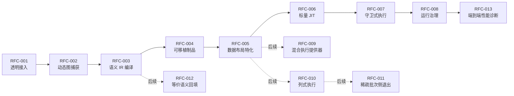

# Python UDF JIT RFC 索引

## 1. 状态与范围

RFC-001～RFC-008 的标量生产代码已经实现，并在提交 `eb97ee8a806f676cda8e1c9f78e6dedb5b501aca` 上通过单元、集成和 blue-98 三容器系统契约。真实三物理节点、Python 3.11.6 生产资格、供应链和首发业务证据尚未完成，因此当前状态是“标量阶段已实现，发布门禁待完成”，不是“发布就绪”。

RFC-005 和 RFC-006 只完成标量槽位与标量 CinderX 路径。向量、Arrow 和批处理执行未实现；RFC-009～RFC-012 保持关闭。

| RFC | 类别 | 特性 | 当前状态 |
|---|---|---|---|
| [RFC-001](RFC-001-transparent-integration.md) | 主线 | 透明接入 | 标量阶段已实现，发布门禁待完成 |
| [RFC-002](RFC-002-dynamic-graph-capture.md) | 主线 | 动态图捕获 | 标量阶段已实现，发布门禁待完成 |
| [RFC-003](RFC-003-semantic-ir-compilation.md) | 主线 | 语义 IR 编译 | 标量阶段已实现，发布门禁待完成 |
| [RFC-004](RFC-004-portable-artifact.md) | 主线 | 可移植制品 | 正式格式 1.0 已实现，发布门禁待完成 |
| [RFC-005](RFC-005-data-layout-specialization.md) | 主线 | 数据布局特化 | 标量槽位已实现；向量/Arrow 未实现 |
| [RFC-006](RFC-006-scalar-cinderx-jit.md) | 主线 | 标量 JIT | 标量阶段已实现；向量/批处理未实现 |
| [RFC-007](RFC-007-guarded-execution.md) | 主线 | 守卫式执行 | 标量阶段已实现，发布门禁待完成 |
| [RFC-008](RFC-008-runtime-governance.md) | 主线 | 运行治理 | 标量阶段已实现，发布门禁待完成 |
| [RFC-009](RFC-009-mixed-execution-providers.md) | 后续 | 混合执行提供器 | 未实现、关闭 |
| [RFC-010](RFC-010-columnar-execution.md) | 后续 | 列式执行 | 未实现、关闭 |
| [RFC-011](RFC-011-sparse-batch-side-exit.md) | 后续 | 稀疏批次侧退出 | 未实现、关闭 |
| [RFC-012](RFC-012-equivalent-semantic-rewrite.md) | 后续 | 等价语义回填 | 未实现、关闭 |
| [RFC-013](RFC-013-end-to-end-performance-diagnostics.md) | 主线横切 | 端到端性能诊断与热点回溯 | Draft，未实现 |

## 2. 标量主线证据

最近一次正式预发布运行：

| 项目 | 结果 |
|---|---|
| 运行批次 | `u13-20260729-071503-eb97ee8a` |
| 单元测试 | 297/297，通过，零跳过 |
| 集成测试 | 59/59，通过，零跳过 |
| 实时系统测试 | 22/22，通过，零跳过 |
| RFC 标量契约 | RFC-001～RFC-008 全部通过 |
| 拓扑 | 一个 Head/Driver 容器、两个 Worker 容器 |
| 自然 Worker 覆盖 | 2/2 |
| 每个 Worker | 1 次编译、60 次缓存命中、60 次语义执行 |
| Head/Driver 数据面 | 0 个事件 |
| 清理 | 容器、网络、令牌、原始事件和临时防火墙绑定全部移除 |

56 项已执行门禁全部通过。完整配置仍缺少第 57 项 `prerequisite.multi_node_environment`，所以 `release_ready=false`。详细证据见[标量主线正式验收报告](../reports/2026-07-29-mainline-scalar-acceptance.md)。

## 3. 依赖关系

运行治理是横切能力。虚线表示已保留但本期没有启用的扩展方向。

## 4. 跨 RFC 稳定契约

| 契约 | 生产方 | 消费方 | 作用 |
|---|---|---|---|
| `CaptureRequest` | RFC-001 | RFC-002 | 传递可调用对象、表达式、数据模式、用途和原始语义引用 |
| `CaptureIR` | RFC-002 | RFC-003 | 表达控制流、数据依赖、效应、图中断和源码映射 |
| `CoreUdfModule` / `SemanticRegionGraph` | RFC-003 | RFC-004 | 提供与框架物理布局无关的可验证语义表示 |
| `PortableUdfArtifact` | RFC-004 | RFC-005 | 跨驱动节点和工作节点传递 IR、守卫模板、区域候选和兼容信息 |
| `LayoutDescriptorSet` / `PhysicalRegion` | RFC-005 | RFC-006 | 把逻辑访问绑定到工作进程内的标量槽位 |
| `ScalarExecutable` / `InterpreterContinuation` | RFC-006 | RFC-007 | 提供 CinderX JIT 与 CPython 解释续体入口 |
| `RuntimeVariant` | RFC-007 | RFC-008 | 承载守卫、多版本、缓存、侧退出和执行计数 |
| `PolicySnapshot` / `GovernanceEvent` | RFC-008 | 适配器、编译器、工作节点 | 冻结模式、预算、权限和无业务值诊断 |
| `DiagnosticPolicySnapshot` / `ProvenanceMap` / `DiagnosticBundle` | RFC-013 | 编译器、CinderX Bridge、Worker、诊断 CLI | 隔离诊断运行并连接源码、中间 IR、机器码和热点样本 |

所有跨进程数据结构使用封闭字段和精确版本。当前制品格式 1.0 是首个正式格式；穿刺期对象、未知字段、其他版本和未来版本一律拒绝，不提供兼容或迁移路径。

## 5. 支持矩阵

| 维度 | 已实现 | 未实现 |
|---|---|---|
| 类型 | `bool/int32/int64/float32/float64`，含可空值 | 字符串、二进制、列表、结构体、字典编码的 JIT |
| 语义 | 算术、比较、空值、分支、精确图中断和后缀续接 | 生成器、协程、元类特化和任意对象协议 JIT |
| 布局 | Python 标量槽位、能力句柄、有效位、所有权和进程代际 | Arrow 列描述符、批次视图、零拷贝和向量内核 |
| 执行 | 标量 CinderX JIT、解释续体、精确侧退出 | 混合提供器、列式执行和稀疏批次侧退出 |
| 缓存 | 工作进程内、作业/租户隔离的多变体缓存 | 跨工作节点或跨集群机器码缓存 |

## 6. 性能口径

性能状态不覆盖功能状态：

- 每个优化变更至少执行一次同环境 A/B，记录正确性哈希、环境指纹、实际数值、阶段分解和热点。
- 当前 A/B 只作方向性观测，不要求 ABBA，不进行正式统计结论。
- 未达到正收益或累计 `1.15x` 不否定已通过的功能契约。
- 只有另行声明 `performance-qualified` 时，才执行预热、五次交替、中位数、MAD/漂移、回退路径、遥测和 `off` 模式门槛。

FineWeb 200K 文本负载的单次 A/B 结果为 `auto` 慢 2.64%，但数据模式和无序多重集哈希一致。该负载不在当前标量 JIT 支持域，只能作为不支持路径无感和开销方向证据。

## 7. 版本基线

| 软件 | 当前基线 |
|---|---|
| 生产目标 Python | 3.11.6，CinderX 适配待完成 |
| 当前开发验证 Python | 3.14.3 |
| CinderX | `ac09c68527153b43cc8b4f16f36d9245cb861d12` 与锁定补丁 |
| Daft | 0.7.2，版本、接口和源码指纹精确匹配 |
| Ray | 2.55.0 |
| PyArrow | 22.0.0 |
| Lance | 7.0.0，当前不阻断标量执行 |

部署和回滚步骤见[标量主线部署、灰度与回滚手册](../operations/mainline-deployment-and-rollback.md)。
