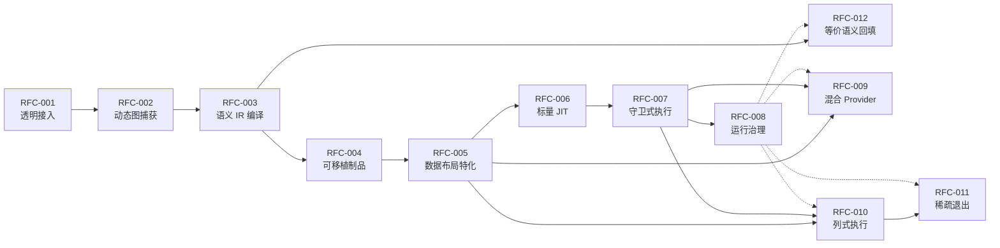

# Python UDF JIT RFC 索引

## 1 编号与范围

RFC 状态仍为 Draft。当前实现只抽取 RFC-001～RFC-008 的一个 fixed-topology scalar vertical slice；“纵向切片通过”不把任一 RFC 的完整状态改为 Done。

| RFC | 类别 | 特性 | 工作量（人周） | 状态 |
|---|---|---|---:|---|
| [RFC-001](RFC-001-transparent-integration.md) | 主线 | 透明接入 | 4 | Draft |
| [RFC-002](RFC-002-dynamic-graph-capture.md) | 主线 | 动态图捕获 | 8 | Draft |
| [RFC-003](RFC-003-semantic-ir-compilation.md) | 主线 | 语义 IR 编译 | 6 | Draft |
| [RFC-004](RFC-004-portable-artifact.md) | 主线 | 可移植制品 | 4 | Draft |
| [RFC-005](RFC-005-data-layout-specialization.md) | 主线 | 数据布局特化 | 6 | Draft |
| [RFC-006](RFC-006-scalar-cinderx-jit.md) | 主线 | 标量 JIT | 10 | Draft |
| [RFC-007](RFC-007-guarded-execution.md) | 主线 | 守卫式执行 | 6 | Draft |
| [RFC-008](RFC-008-runtime-governance.md) | 主线 | 运行治理 | 4 | Draft |
|  |  | **主线合计** | **48** | 目标 `1.15x` |
| [RFC-009](RFC-009-mixed-execution-providers.md) | 可选 | 混合 Execution Provider | 8 | Draft |
| [RFC-010](RFC-010-columnar-execution.md) | 高阶 | 列式执行 | 6 | Draft |
| [RFC-011](RFC-011-sparse-batch-side-exit.md) | 高阶 | 稀疏退出 | 4 | Draft |
| [RFC-012](RFC-012-equivalent-semantic-rewrite.md) | 高阶 | 等价语义回填 | 6 | Draft |
|  |  | **高阶合计** | **16** | 相对原始基线增加 `0.15`，最终 `1.30x` |

### 纵向切片证据

- 入口：Ray Jobs 在 Head/Driver 启动真实 Driver；Head 逻辑 CPU 为零。
- 部署资格：两个 Worker 分别完成 Readiness 与生产 Artifact 资格测试，和自然调度覆盖分开报告。
- 主链：Daft Candidate/Operation → 受限 Capture/Core IR → Inline Artifact → Worker semantic reverify → Scalar Slot → Region-derived CinderX Load/Compile/Hit。
- 回退：只允许首个语义 Data Load 前 whole-UDF fallback；提交点后异常原样传播，不重放。
- 证据：Run/Epoch、Container Boot、Node/角色、Manifest、Ray PartitionTask/Attempt 和进程代际必须可连接；任一缺口为失败、停止或 Inconclusive，不用耗时猜路径。
- 性能：本切片没有 `1.15x` 发布门槛；RFC 中的倍率仍是未来正式性能验收口径。

执行入口和架构处置见 [标量主线纵向切片复盘](../solutions/architecture-patterns/scalar-mainline-vertical-slice.md)。

## 2 依赖关系



运行治理是横切能力，虚线表示治理契约而非编译数据依赖。等价语义回填在 Driver 侧结束，不依赖 Worker Artifact、布局绑定或 CinderX Codegen。

## 3 跨 RFC 稳定契约

| 契约 | 生产方 | 消费方 | 作用 |
|---|---|---|---|
| `CaptureRequest` | RFC-001 | RFC-002 | 传递 Callable/Expression、Schema、用途和原始语义引用 |
| `CaptureIR` | RFC-002 | RFC-003 | 忠实表达 Python CFG、数据依赖、Effect、Graph Break 和 Source Map |
| `CoreUdfModule` / `SemanticRegionGraph` | RFC-003 | RFC-004、RFC-012 | 提供框架物理布局无关的可验证语义表示 |
| `PortableUdfArtifact` | RFC-004 | RFC-005 | 跨 Driver/Worker 传递 IR、Guard Template、Region 候选和兼容性信息 |
| `LayoutDescriptorSet` / `PhysicalRegion` | RFC-005 | RFC-006、RFC-009 | Worker-local 的 Schema/Layout/Ownership 绑定结果 |
| `ScalarExecutable` / `InterpreterContinuation` | RFC-006 | RFC-007 | Scalar Python Provider 的 JIT 与解释两级执行入口 |
| `RuntimeVariant` | RFC-007 | RFC-008、RFC-009 | Guard、多版本、Cache、Side Exit 和执行计数 |
| `ExecutionProvider` 基础契约 | 架构基线、RFC-006 | RFC-009、RFC-010 | 提供 Capability/Compile/Execute 扩展点；主线只实现 Scalar Python |
| `BoundRegionPlan` / 转换契约 | RFC-009 | Worker Region Executor | 可选地在同一 UDF 中组合多个 Provider |
| `ColumnarExecuteRequest` / `SpeculativeBatchResult` | RFC-010 | RFC-011 | 定义整批列式执行及 Lane 级退出扩展边界 |
| `RewriteRequest` / `RewriteDecision` | RFC-012 | RFC-001 Daft Adapter | 在 Driver 构图边界回填 Daft 原生 Expression |

## 4 性能验收总口径

统一在相同 Daft/Ray 集群、相同 Lance Snapshot、相同并发度、Batch Size、输出 Sink 和依赖版本上进行 A/B。每组预热一次，正式运行五次，使用端到端墙钟时间中位数：

```text
speedup = median(T_baseline) / median(T_candidate)
```

- `baseline`：插件关闭，执行原始 Daft UDF。
- `mainline`：仅启用 RFC-001～RFC-008，强制关闭 RFC-009～RFC-012；门槛 `speedup >= 1.15`。
- `advanced`：在 mainline 上启用适用的 RFC-010～RFC-012；门槛 `speedup >= 1.30`，相对原始基线按加法增加 `0.15`。
- RFC-009 为可选扩展，不是 RFC-010 的前置条件，也不纳入主线或高阶阶段的强制门槛；仅在验收同一 UDF 的跨 Provider 混合时启用。
- 单项 RFC 的性能验收采用同一端到端方法，但基础设施型 RFC 只要求不引入超过 2% 的稳态回退路径回归；阶段倍率由 RFC-008 和 RFC-010～012 的组合验收统一判定。

## 5 版本基线

| 软件 | 基线 |
|---|---|
| Daft | 0.7.2，版本与兼容指纹精确匹配 |
| Ray | 2.55.0 |
| Lance / pylance | 7.0.0 |
| PyArrow | 22.x |
| CPython/CinderX | 由同一交付 Manifest 精确锁定 SOABI、CinderX ABI 和构建标识 |
