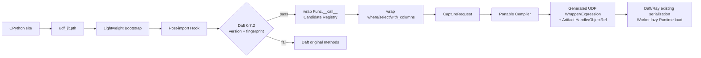

# RFC-001：透明接入

**状态 (Status):** Draft

**作者 (Authors):** Python UDF JIT 项目组

**创建日期 (Created):** 2026-07-17

**更新日期 (Updated):** 2026-07-17

**相关 Issue/PR:** 本地方案评审阶段，无外部 Issue/PR

**类别:** 主线特性

**工作量估算:** 4 人周

**上游文档:** [Python UDF JIT 架构设计](../design/2026-07-13-python-udf-jit-architecture.md)

---

# 1. 概述

## 1.1 简介

本提案定义 Python UDF JIT 在 Daft 0.7.2 + Ray 2.55.0 中的透明接入方式。安装运行包后，用户继续使用原有 `@daft.func`、`DataFrame.where/select/with_columns` 等 API，不增加 `@jit`、显式导入或 UDF 改写；系统自动发现 UDF 候选、形成 `CaptureRequest`，并将生成的 UDF Wrapper/Expression 和 Artifact Handle 沿 Daft/Ray 既有序列化链送入 Worker。

透明接入不修改 Daft、Ray 或 Lance 源码。Daft 0.7.2 没有公开的 UDF Rewrite、Optimizer Rule 或 Native Extension 注册 SPI，因此本期采用精确版本约束下的 Python Runtime Instrumentation：`.pth` 只负责 CPython 启动引导，Post-import Hook 在 Daft 导入后校验版本与兼容指纹，再包装当前进程内的 Python 方法。失配或异常时保持原方法和原始 UDF 行为。

## 1.2 动机

如果要求用户改用新装饰器、显式 `compile()` 或 Pandas UDF，系统只能覆盖主动迁移的业务；如果修改 Daft Rust/Python 源码，则会扩大版本耦合和交付范围。透明接入要解决的是：

- 在不改变业务代码的前提下发现 Callable、输入 Expression、返回类型和 UDF 配置；
- 在获得 DataFrame Schema 和 Filter/Projection 用途后再做不可逆决策；
- 让 Driver 与 Worker 都自动加载同一运行包，但不创建 Sidecar 或第二条数据通道；
- 任一兼容性检查失败时完全保留 Daft 原行为。

不实施本提案，后续 Capture、Artifact 和 JIT 只能依赖显式 API 或框架源码修改，无法满足“通用 UDF、用户无感”的产品边界。

## 1.3 目标

### 目标

1. 用户 UDF 源码、装饰器和 DataFrame 调用保持不变。
2. 在 `Func.__call__` 阶段登记 UDF 候选，在规范 DataFrame 操作边界补齐 Schema 与用途并生成 `CaptureRequest`。
3. 通过生成的 Scalar/Batch UDF Wrapper 或 Expression 闭包携带 Artifact Handle；大制品使用 Ray ObjectRef。
4. Driver 和 Worker 进程通过同一个 Wheel 与 `.pth` 自动引导。
5. 版本、指纹、签名或 Hook 失败时 Fail Open，结果和异常与插件关闭时一致。
6. 为 PySpark、PyFlink 等未来 Adapter 保留统一 Control/Worker Adapter 接口。

### 非目标

- 不宣称 Daft 0.7.2 提供官方插件 SPI。
- 不修改 Daft LogicalPlan、Rust Optimizer 或 Flotilla Task Metadata。
- 不在 Hook 中执行用户 UDF、推断完整调用图或绑定 Worker 数据布局。
- 不解决跨任意 Daft 小版本的宽兼容；本期精确适配 0.7.2。
- 不在本 RFC 中实现 Bytecode Capture、IR 优化、CinderX Codegen 或列式 Kernel。

# 2. 用例分析

| 用例 | 输入 | 期望结果 |
|---|---|---|
| UDF 候选登记 | 用户调用 `udf(expr...)` | 返回原始 Expression，并在 Driver-local Registry 登记 Callable、参数、配置和 Source Location |
| Schema 定稿 | 用户调用 `where/select/with_columns` | 取得 `self.schema()`、用途和顶层 Expression，形成 `CaptureRequest` |
| 自动 Worker 注入 | Daft/Ray 反序列化生成的 UDF Wrapper | Wrapper 首次调用时懒加载 Runtime 与 Artifact，不依赖 Actor Attach SPI |
| 兼容失配 | Daft 版本、方法签名或源码指纹不匹配 | 不安装包装器或立即调用原方法，只记录一次诊断事件 |
| 插件关闭 | `UDFJIT_MODE=off` | 不改变表达式、计划、结果、异常或性能路径 |

DFX 要求：Hook 幂等、可撤销、线程安全、弱引用/有界登记；不得上传业务值；启动或 Hook 故障不得使 Daft 作业失败。

# 3. 方案设计

## 3.1 总体方案



接入分成两个阶段：

1. **候选登记**：包装 `Func.__call__`。先调用或等价复用原方法构造原始 Expression，再按 Python Expression 身份和底层 PyExpr Hash 登记 Callable、输入绑定、返回类型、`on_error/max_retries/use_process` 等配置。
2. **操作定稿**：包装 `DataFrame.where/select/with_columns`。在调用原 Builder 前取得 DataFrame Schema、Filter/Projection 用途和顶层候选，构造 `CaptureRequest`。`filter`、`with_column` 在 Daft 0.7.2 中分别委托给规范方法，不重复包装。

`.pth` 和方法包装不是 CPython JIT 插件：它们是普通 Python 启动/运行时机制。只有后续 Scalar Python Execution Provider 中的 CinderX/Native 模块属于 CPython Runtime 编译扩展。

## 3.2 技术选型

| 方案 | 优点 | 缺点 | 结论 |
|---|---|---|---|
| 版本专用 `.pth` + Post-import Hook | 用户代码不变；不改 Daft 源码；可 Fail Open | 依赖私有 Python 对象和兼容指纹 | 本期采用 |
| 显式 `udfjit.optimize(...)` | 只依赖公共 API，兼容边界清晰 | 用户需要改代码，不满足透明目标 | 仅保留诊断/开发备用入口 |
| 修改 Daft 源码或 Rust UDF Operator | 可取得更深控制面和更低调用开销 | 侵入框架、维护分叉、扩大交付面 | 不采用 |
| 伪装 Daft Native Extension | 理论上接口清晰 | Daft 0.7.2 不存在相应 ABI/SPI | 不可采用 |

## 3.3 功能与性能设计

### 候选登记数据

```text
UdfCandidate {
  candidate_id,
  python_callable_ref,
  original_expression_ref,
  input_expression_refs,
  declared_return_type,
  udf_options,
  source_location,
  daft_object_fingerprint
}
```

Registry 只在 Driver 进程存在，使用弱引用和容量上限，不进入 Portable Artifact。Operation Hook 将候选转成 RFC-002 消费的 `CaptureRequest`；无法补齐 Schema 或用途时返回原始 Expression。

### Worker 载体

Daft Adapter 生成可序列化的 UDF Wrapper/Expression。闭包只保存内容 Hash、内联小 Artifact 或 Ray ObjectRef、原始 Callable 和兼容 Manifest，不保存 Driver 私有对象。Worker 首次调用时懒加载 Native Runtime，不依赖 `attach_region/detach_region`。

### 性能验收

- Benchmark：Daft 0.7.2 + Ray 2.55.0 读取固定 Lance 7.0.0 Snapshot，运行数值 Projection、带分支 Filter 和不支持 UDF 三个作业。
- A：运行包未安装/`off`；B：运行包安装且 `observe`，始终执行原始 UDF。
- 五次正式运行的端到端中位数满足 `median(T_A) / median(T_B) >= 0.98`，即透明框架本身稳态回归不超过 2%。
- 功能门槛：用户脚本字节级不变；结果、行序和异常一致；版本指纹失配时所有作业成功走原路径。
- 本 RFC 不单独承担主线 `1.15x`，其输出进入 RFC-002～RFC-008 的组合验收。

## 3.4 安全隐私与DFX设计

- 兼容校验包含 Daft 版本、目标对象签名和关键实现指纹；任一不匹配即不 Patch。
- 原方法引用在安装包装器前保存；包装器异常必须清除自身异常并调用原方法。
- Registry 不记录业务值，只记录函数、Schema、表达式和 Source Location；诊断输出可对字段名脱敏。
- Hook 安装使用进程级锁和幂等标记，避免重复 import 或并发 import 产生包装链。
- `off` 和紧急 Kill Switch 在任何 Capture/JIT 初始化前生效。
- Worker Wrapper 不额外扩大 Ray Job 权限，不新增网络端口或文件访问能力。

## 3.5 编程与调用设计

### 3.5.1 编程模型基本设计

开发环境固定为 Linux x86-64/aarch64、Daft 0.7.2、Ray 2.55.0、Lance 7.0.0、PyArrow 22.x，以及 Manifest 锁定的 CPython/CinderX。用户仍按 Daft 文档定义 UDF：

```python
@daft.func(return_dtype=daft.DataType.float64())
def score(price, quantity):
    return price * quantity * 0.9

result = df.with_column("score", score(df["price"], df["quantity"]))
```

平台安装一次 Wheel；业务代码不导入 UDF JIT。调试模式提供 `off | observe | auto`，但不要求应用设置额外标记。

### 3.5.2 接口定义与设计

#### 3.5.2.1 `IF-FRAMEWORK-CONTROL-HOOK-API`

- **接口描述：** Framework Adapter 接收 UDF 候选与 DataFrame 操作事件。
- **接口原型：** `on_udf_candidate(event) -> CandidateId`；`on_dataframe_operation(event) -> OriginalOrReplacementExpression`
- **输入：** Callable/Expression 引用、可见 Schema、用途、返回类型、UDF 配置。
- **输出：** 候选 ID、原始或经证明可替换的框架 Expression。
- **异常处理：** 任意异常转为结构化拒绝原因并调用原方法。
- **约束说明：** 不执行用户 Callable；不要求完整 LogicalPlan。

#### 3.5.2.2 `CaptureRequest`

| 参数名称 | 输入/输出 | 类型 | 描述 | 取值范围 |
|---|---|---|---|---|
| `framework_target` | 输出 | Manifest | 框架版本与适配指纹 | Daft 0.7.2 本期唯一支持值 |
| `function_ref` | 输出 | CallableRef | Python Callable 与代码身份 | 当前 Driver 可解析对象 |
| `expressions` | 输出 | ExpressionRef[] | 输入/原始输出表达式 | 顶层候选白名单 |
| `logical_schema` | 输出 | LogicalSchema | 当前 DataFrame 可见 Schema | 不包含 Worker Offset/Buffer |
| `usage_context` | 输出 | Enum | Filter 或 Projection | `FILTER/PROJECTION` |
| `fallback_ref` | 输出 | CallableRef | 原始语义执行入口 | 必须存在 |

### 3.5.3 编程手册设计

在项目用户手册中新增“透明安装与兼容模式”章节，包含版本矩阵、安装方式、`off/observe/auto`、兼容拒绝诊断、Kill Switch 和显式开发备用入口；不单独要求用户学习编译器 API。

# 4. 缺点和风险

| 风险 | 影响 | 应对 |
|---|---|---|
| Daft 私有 Python 对象变化 | Hook 失效或错误包装 | 精确版本/源码指纹、契约测试、Fail Open |
| 包装器递归或重复安装 | 栈溢出、重复 Capture | 保存原方法、幂等标记、进程锁 |
| Registry 泄漏 | Driver 内存增长 | 弱引用、容量/TTL、Job 结束清理 |
| Ray 序列化不兼容 | Worker 无法解析载体 | 只传稳定 Handle/Manifest，失败调用原始 Callable |
| “透明”被误解为无需平台部署 | 环境不一致 | 明确透明仅针对业务代码；Driver/Worker 必须安装相同 Wheel Hash |

# 5. 现有技术

- CinderX 使用 `.pth` 和自动加载模块在 CPython 启动阶段注册 Runtime 能力；本提案复用启动模式，但把框架发现放到延迟 Post-import Hook。
- TorchDynamo 在不改模型源码的前提下截获 Python 执行；本提案只借鉴透明捕获理念，不依赖 Tensor Operator Dispatch。
- importlib/Post-import Hook 和代理包装是成熟 Python Instrumentation 手段；本提案增加版本指纹、幂等、Fail Open 与 Daft 两阶段上下文补全。

# 6. 未解决问题

本 RFC 无阻塞性未决问题。未来若 Daft 提供官方 UDF/Rewrite SPI，Adapter 应在不改变 `CaptureRequest` 的前提下替换当前版本专用 Hook；该迁移不属于本期范围。

---

## 附录 A：参考资料

- [架构设计](../design/2026-07-13-python-udf-jit-architecture.md)
- [Daft 0.7.2 UDF v2](https://github.com/Eventual-Inc/Daft/blob/v0.7.2/daft/udf/udf_v2.py)
- [Daft 0.7.2 DataFrame API](https://github.com/Eventual-Inc/Daft/blob/v0.7.2/daft/dataframe/dataframe.py)
- [CinderX 自动注入](../../../cinderx/cinderx/PythonLib/cinderx.pth)

## 附录 B：术语

| 术语 | 定义 |
|---|---|
| Runtime Instrumentation | 在当前 Python 进程内包装对象/方法，不修改框架磁盘源码 |
| Candidate | 尚未补齐 Schema/用途、不能做不可逆优化决策的 UDF 调用 |
| Fail Open | 插件失败时执行原始框架路径而不是使作业失败 |

## 附录 C：文档更新计划

Daft 兼容指纹、Hook 对象或 Artifact Carrier 发生变化时更新本 RFC；`CaptureRequest` 语义变化必须同时更新 RFC-002。
