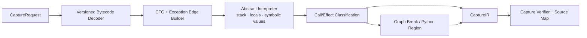

# RFC-002：动态图捕获

**状态 (Status):** Draft

**作者 (Authors):** Python UDF JIT 项目组

**创建日期 (Created):** 2026-07-17

**更新日期 (Updated):** 2026-07-17

**相关 Issue/PR:** 本地方案评审阶段，无外部 Issue/PR

**类别:** 主线特性

**工作量估算:** 8 人周

**上游 RFC:** [RFC-001：透明接入](RFC-001-transparent-integration.md)

---

# 1. 概述

## 1.1 简介

本提案定义 Capture Frontend：从 RFC-001 的 `CaptureRequest` 和 Python Callable Bytecode 构建忠实的 `CaptureIR`，显式表达控制流、数据依赖、调用、Effect、Graph Break、Guard 假设和 Source Map。Capture 的目标是“看懂 Python 程序并保留不能证明的部分”，而不是在该阶段优化数据布局或生成机器码。

控制端默认不执行任意用户 UDF。Frontend 通过 CPython 版本适配的 Bytecode Decoder、CFG Builder 和抽象解释器模拟值栈与局部变量；遇到动态属性、未知调用或无法安全建模的操作时产生 Python Continuation/Graph Break，而不是拒绝整个函数。

## 1.2 动机

框架只能看到一个 Python Callable，CinderX 单独看到的是当前函数 Bytecode；两者都缺少跨框架上下文、Field 语义和可移植的 Graph Break 边界。直接使用 AST 会丢失装饰器包装、闭包绑定和实际 Bytecode 控制流；直接执行 Proxy 又难以覆盖 Python 协议并可能触发副作用。

因此需要一个以 Bytecode 为权威、以 Schema/符号值补充语义、以 Graph Break 保证渐进覆盖的 Capture Frontend。没有该层，后续 Core UDF IR 只能接受人工 DSL 或不可靠 Trace。

## 1.3 目标

### 目标

1. 支持算术、比较、布尔短路、局部分支、字段/下标访问和白名单纯调用的 Bytecode Capture。
2. 构建基本块、控制边、数据依赖和异常边，维护 Bytecode Offset 到源码位置的 Source Map。
3. 对未知或不安全语义产生显式 Graph Break/Python Region，并定义输入输出活跃值。
4. 提取代码对象、闭包/全局依赖和类型假设，形成 Guard Template。
5. 按 CPython Bytecode 版本隔离 Decoder，不把版本专用 Opcode 暴露给 Core UDF IR。
6. 提供可复现、可 Verify、可 Dump 的 `CaptureIR`。

### 非目标

- 不在 Driver 执行用户 UDF 或任意 C Extension。
- 不做 Region Formation、跨 UDF 融合、布局绑定或 Provider 选择。
- 不保证捕获所有动态 Python、生成器、协程、反射和元类行为。
- 不把 CPython Bytecode 直接作为跨 Worker Portable Artifact 的稳定协议。

# 2. 用例分析

代表性输入：

```python
def discount(row, threshold=100.0):
    price = row.price
    if price is None:
        return None
    if price > threshold:
        return price * 0.9
    return price
```

Capture 应得到字段访问、Null 分支、阈值闭包依赖、乘法和合流值；Source Map 能定位每个节点。对于：

```python
def udf(row):
    value = row.price * 2
    audit(value)          # unknown, may have side effects
    return value + 1
```

`audit` 形成 Graph Break，前后计算保持可捕获，但不得跨调用重排或删除。

| 场景 | 要求 |
|---|---|
| 支持的纯控制流 | CaptureIR 与 CPython 结果/异常一致 |
| 未知调用 | 形成有输入、输出、Effect 和 Source Map 的 Python Region |
| Bytecode 版本差异 | Decoder 按 SOABI/Opcode Table 选择，未知版本拒绝 Capture |
| 闭包/全局变化 | Guard Template 记录身份或版本依赖 |
| Capture 失败 | 返回结构化原因，原始 UDF 仍可执行 |

# 3. 方案设计

## 3.1 总体方案



### 捕获步骤

1. 冻结 `CodeIdentity`：代码 Hash、defaults、closure cells、相关 globals/modules 版本。
2. 解码当前 CPython 版本的指令、Exception Table 和 Position Table。
3. 构建 CFG，并将栈状态转换为显式 SSA-like Value；合流点使用 Block Argument/Phi 语义。
4. 抽象解释每条指令。Schema-aware Symbolic Value 只记录逻辑 Field/Type 约束，不记录 Offset/Buffer。
5. 对调用进行 `PURE_INTRINSIC / MODELED_CALL / OPAQUE_CALL` 分类；Opaque Call 默认 `may_raise + side_effect`。
6. 在不支持区域创建 Python Region，记录 live-in/live-out、异常边和恢复 Bytecode Offset。
7. Verifier 检查栈平衡、Dominance、异常边、Source Map 和 Continuation 完整性。

## 3.2 技术选型

| 方案 | 优点 | 缺点 | 结论 |
|---|---|---|---|
| Bytecode + 抽象解释 | 对实际 Callable 权威；不执行用户逻辑；可捕获闭包/控制流 | CPython 版本耦合，需维护 Opcode Decoder | 主方案 |
| Proxy Tracing | 高层表达直观 | `__bool__/__iter__` 等协议不完备，可能执行副作用 | 仅用于受控补充，不作为权威 |
| AST 转换 | 实现简单、源码友好 | 源码可能不可得；与实际 Bytecode/装饰器不一致 | 不采用 |
| 运行一次真实 Trace | 能看到动态分支 | 只覆盖样例路径，可能触发 I/O/副作用 | Driver 禁止；未来 Worker 受控 Profile 可选 |

## 3.3 功能与性能设计

### CaptureIR 数据模型

```text
CaptureModule {
  code_identity,
  functions: CaptureFunction[],
  dependency_manifest,
  guard_template,
  source_map
}

CaptureFunction {
  blocks,
  values,
  control_edges,
  exception_edges,
  effects,
  python_regions
}

PythonRegion {
  start_offset,
  resume_offsets,
  live_in,
  live_out,
  may_raise,
  effect_summary,
  source_range
}
```

CaptureIR 保留 Python 语义但不是最终 Data IR。`LOAD_ATTR price` 只有在 RFC-001 提供 Schema/Expression 证据时才提升为逻辑 `FieldCandidate(price)`；否则保持动态属性访问或进入 Python Region。

### 初始覆盖白名单

- 局部变量、常量、tuple/list 的只读构造；
- `int/float/bool/str` 的受控算术与比较；
- `and/or/not`、条件跳转和可归约的短路控制流；
- Schema 证明的字段读取、固定键/索引读取；
- `len/abs/min/max` 等经语义模型验证的 Builtin；
- 无递归、无动态代码生成的同模块小函数内联候选。

### 性能与验收

- Benchmark UDF 集：数值直线、Null 分支、多分支、闭包常量、白名单调用、未知调用 Graph Break、异常路径各至少 20 个函数形状。
- 对每个 UDF 比较 CPython 原函数与 CaptureIR Reference Interpreter 的返回值、异常类型/顺序及可见副作用，随机与边界输入合计不少于 10,000 组。
- 端到端 A/B：插件 `observe` 且启用/禁用 Capture，稳态作业中位数比值 `T_no_capture / T_capture >= 0.98`；同一 CodeIdentity 在 Job 内只 Capture 一次。
- 支持白名单用例 Capture 成功率为 100%；未知调用必须产生 Graph Break，不得错误编译为纯节点。
- 本 RFC 不单独承担主线 `1.15x`，但 Capture 结果必须覆盖主线 Benchmark 中进入 Scalar JIT 的 UDF。

## 3.4 安全隐私与DFX设计

- Decoder 只读 `code`、defaults、closure/global 元数据，不调用用户描述符、`__getattr__` 或任意 Python 函数。
- 任何可能触发 Python 代码的元操作都标为 Opaque，不在 Driver 求值。
- CaptureIR 和 Dump 不包含业务行值；常量大对象只记录内容 Hash/受控序列化引用。
- Opcode Table、Exception Table 和 Position Table 按 CPython 版本契约测试；不识别的 Opcode Fail Closed 到原始 UDF。
- Graph Break 必须保留异常顺序、live values 和 Source Map；Verifier 失败不得进入 Core IR。
- Capture Cache 按 CodeIdentity、Schema 和 Adapter ABI 隔离，闭包/全局变化导致新 Key。

## 3.5 编程与调用设计

### 3.5.1 编程模型基本设计

普通用户无新增 API。编译器开发者通过离线 Explain/测试工具提交 `CaptureRequest`，查看 CaptureIR、Graph Break 原因和 Source Map。调试工具不得成为生产运行的同步依赖。

### 3.5.2 接口定义与设计

#### 3.5.2.1 `IF-CAPTURE-REQUEST-API`

- **接口描述：** 将框架无关的 `CaptureRequest` 转换为已验证 CaptureIR。
- **接口原型：** `capture(request, capture_policy) -> CaptureResult`

| 参数名称 | 输入/输出 | 类型 | 描述 | 取值范围 |
|---|---|---|---|---|
| `request` | 输入 | `CaptureRequest` | RFC-001 输出 | 必须含原始 Callable 与 Fallback 引用 |
| `capture_policy` | 输入 | Policy | Opcode/Call 白名单和预算 | 版本化只读快照 |
| `module` | 输出 | `CaptureModule` | 捕获结果 | Verifier 通过时存在 |
| `diagnostics` | 输出 | Diagnostic[] | Break/拒绝原因与 Source | 不含业务值 |

- **异常处理：** 返回 `UNSUPPORTED_BYTECODE / OPAQUE_SEMANTICS / BUDGET_EXCEEDED / VERIFY_FAILED`，不得传播为 Daft 作业异常。
- **约束说明：** Driver 侧不执行用户函数。

#### 3.5.2.2 `IF-CAPTURE-VERIFY-API`

- **接口描述：** 验证 CFG、SSA Value、异常边、Python Region 和 Source Map 完整性。
- **接口原型：** `verify_capture(module) -> VerifyResult`
- **变更说明：** CaptureIR 格式版本变化必须同步 RFC-003 的 Importer。

### 3.5.3 编程手册设计

编译器开发手册新增“Capture Frontend”章节：CPython 版本适配、Opcode 支持表、Graph Break 分类、IR Dump、Reference Interpreter 和新增 Builtin/Call Model 的验证流程。

# 4. 缺点和风险

| 风险 | 影响 | 应对 |
|---|---|---|
| CPython Opcode 快速变化 | Decoder 维护成本 | 版本化适配层、生成式 Opcode Table、契约测试 |
| Effect 分类错误 | 错误重排或结果 | 未知默认最保守、Verifier、差分/Shadow 测试 |
| Graph Break live value 不完整 | 恢复失败 | Liveness Analysis + Continuation Verifier |
| CaptureIR 过于贴近 Bytecode | 后续优化困难 | RFC-003 统一 Lower 到 Core UDF IR |
| 大函数 Capture 延迟 | Driver 计划延迟 | 节点/时间预算、缓存、超限整函数 Python Region |

# 5. 现有技术

- TorchDynamo 从 CPython Frame/Bytecode 捕获 FX Graph，并用 Guard/Graph Break 处理动态性；本提案借鉴 Bytecode 权威性和渐进捕获，但输出面向数据 Schema、Null、Effect 和 Python Continuation。
- CinderX Bytecode Frontend 提供实际 CPython Opcode 到 HIR 的经验；CaptureIR 不直接复用 HIR，因为其产物必须在 Worker 目标绑定前保持可移植。
- CPython `dis`、Exception Table 和 Position Table 是版本适配的权威基础，但生产实现需使用稳定的内部 Decoder，而非依赖格式化文本。

# 6. 未解决问题

本 RFC 无阻塞性未决问题。递归、生成器、协程和 Worker 受控动态 Trace 均列入后续覆盖扩展，不进入本期成功门槛。

---

## 附录 A：参考资料

- [RFC-001：透明接入](RFC-001-transparent-integration.md)
- [TorchDynamo Overview](https://docs.pytorch.org/docs/stable/torch.compiler_dynamo_overview.html)
- [CinderX JIT Guide](../../../cinderx/cinderx/Jit/guide.md)

## 附录 B：术语

| 术语 | 定义 |
|---|---|
| Abstract Interpreter | 不执行真实 Python 操作、只传播抽象值和语义约束的解释器 |
| Graph Break | 在可编译图中显式保留的 Python Continuation 边界 |
| Source Map | IR 节点到函数、Bytecode Offset 和源码位置的映射 |

## 附录 C：文档更新计划

每增加一个 CPython 版本、Opcode Family 或 Call Model 时更新支持矩阵和差分用例；CaptureIR 契约变更需同步 RFC-003 与 RFC-004。
