# RFC-003：语义 IR 编译

**状态 (Status):** Draft

**作者 (Authors):** Python UDF JIT 项目组

**创建日期 (Created):** 2026-07-17

**更新日期 (Updated):** 2026-07-17

**相关 Issue/PR:** 本地方案评审阶段，无外部 Issue/PR

**类别:** 主线特性

**工作量估算:** 6 人周

**上游 RFC:** [RFC-002：动态图捕获](RFC-002-dynamic-graph-capture.md)

---

# 1. 概述

## 1.1 简介

本提案定义如何把忠实但贴近 Python Bytecode 的 `CaptureIR` Lower 为框架物理布局无关的 `CoreUdfModule`，并通过原子 Pass 完成类型、Null、Effect 分析和 UDF Region 划分。输出的 `SemanticRegionGraph` 是后续 Artifact、布局特化、标量 JIT 和 Planner 回填共同依赖的语义边界。

Region 不是 Daft/Ray 已有概念，也不是 Framework Adapter 在 Capture 前拼装的函数集合。`RegionFormationPass` 必须在 Capture 和基础语义分析之后，根据数据依赖、控制流、Effect、异常顺序与框架操作上下文识别可联合优化区域。

## 1.2 动机

CaptureIR 需要保留 Bytecode Offset、栈行为和 Python Continuation，适合保证忠实性，但不适合跨 CPython 版本优化；CinderX HIR 又绑定 Python Runtime 和目标编译细节，不能作为 Driver/Worker 间的稳定 Data IR。Core UDF IR 提供中间语义层，使编译器能够：

- 用稳定 LogicalType/FieldId 表达数据计算，而不是 `LOAD_ATTR` 或物理 Offset；
- 显式建模 Null、异常、确定性、外部状态和 Python Region；
- 在不触及 Buffer 的前提下形成可融合、可分区的 Region；
- 将 Graph Optimizer 与 Data Layout Specializer 放在不同 IR 层，避免并行修改同一图。

## 1.3 目标

### 目标

1. 定义版本化 `CoreUdfModule`、LogicalType、Operation、Effect 和 PythonRegion。
2. 将 CaptureIR 的 Bytecode/CFG 细节归一化为框架无关控制流和数据流。
3. 完成类型约束求解、Null Flow、Effect/MayRaise、Alias/Identity 和 Determinism 分析。
4. 以原子 Pass/Analysis 构建、验证和优化 IR，并声明 Analysis 失效关系。
5. 在 Capture 后执行 Region Formation，输出 `SemanticRegionGraph`。
6. 为 Scalar Python 和未来 Host Columnar/Vector Provider 提供同一语义输入。

### 非目标

- 不绑定 Arrow Buffer、Offset、Validity、CPU Feature 或 CinderX ABI。
- 不在 Driver 选择最终 Execution Provider 或生成机器码。
- 不复制 Daft LogicalPlan、Join/Shuffle/Cost Optimizer。
- 不将常量折叠、DCE 等普通函数内优化作为核心差异化能力。
- 不在本 RFC 中完成 Daft Native Expression 回填；RFC-012 消费本层证明结果。

# 2. 用例分析

| 用例 | Core IR 处理 |
|---|---|
| `row.price * 0.9` | `field.load(field_id)` + typed multiply；保留 nullable 约束 |
| `x is None` 分支 | 显式 `is_null` 与控制流，不擅自采用 Python truthiness |
| 两个连续纯 UDF | 数据/控制/Effect 允许时形成同一 Semantic Region 候选 |
| `print/audit/random/time` | 标注副作用或非确定性，阻止跨边界融合/回填 |
| 未知 Python 调用 | 保留 PythonRegion 和 live-in/live-out，不使全函数失败 |
| 异常顺序敏感表达式 | `may_raise` 边进入排序约束，不得交换求值顺序 |

正确性以 CPython 语义为 Oracle；Daft/Arrow 数值、Null、Filter 三值逻辑只有在证明等价时才能作为替代语义。

# 3. 方案设计

## 3.1 总体方案

```mermaid
flowchart LR
    C["Verified CaptureIR"] --> IMPORT["Capture Import + Normalize"]
    IMPORT --> TYPE["Type / Schema Analysis"]
    TYPE --> NULL["Null Flow Analysis"]
    NULL --> EFFECT["Effect / MayRaise / Alias Analysis"]
    EFFECT --> REGION["RegionFormationPass"]
    REGION --> SEM["Provider-independent Semantic Passes"]
    SEM --> VERIFY["Core/Region Verifier"]
    VERIFY --> OUT["CoreUdfModule<br/>SemanticRegionGraph"]
```



固定 Pass 顺序：

```text
Capture Import/Verify
  -> Canonicalize & Functionalize
  -> Type/Schema/Null/Effect Analyses
  -> Region Formation
  -> Provider-independent Semantic Passes
  -> Framework Expression Extraction Analysis
  -> Core/Region Verify
```

Data Layout Specializer 不在此 Pipeline 中运行。它在 Worker 收到 Candidate Plan 后把逻辑约束绑定为 Physical IR；Provider-specific Pass 更晚运行。

### Region Formation 规则

一个 Semantic Region 是满足以下不变量的最大安全子图候选：

- 入口/出口 Value 和控制边可显式表示；
- PythonRegion、I/O、副作用和对象身份边界不可被静默跨越；
- 异常顺序和短路行为可保持；
- LogicalType/Null 约束可以序列化；
- 所需框架上下文已包含在 `CaptureRequest`，不依赖 Driver 私有对象。

Region Formation 只形成语义边界，不分配 Provider。后续 Candidate Partitioner 可以按能力进一步拆分，但不得越过 Effect Barrier 合并。

## 3.2 技术选型

| 方案 | 优点 | 缺点 | 结论 |
|---|---|---|---|
| 自有 Core UDF IR + 原子 Pass | 可精确表达 Python/Data 语义；首期工程可控 | 需自建 Verifier、Printer、Pass Manager | 本期采用 |
| 直接使用 CinderX HIR | 复用编译器基础设施 | 绑定 CPython Runtime，缺少跨框架 Data/Null/Region 语义 | 仅作为 RFC-006 后端 IR |
| 直接使用 MLIR Dialect | 多层 IR/Pass 基础成熟 | 首期引入依赖和学习成本较高 | 预留 Bridge，不作为首期前提 |
| 使用 Arrow Expression/Daft Expression | 生态执行能力成熟 | 无法表达任意 Python 控制流、Effect 和 Continuation | 只作为 RFC-012 输出目标 |

## 3.3 功能与性能设计

### 核心数据模型

```text
CoreUdfModule {
  format_version,
  functions,
  logical_schema,
  effects,
  guard_obligations,
  source_map,
  python_regions
}

SemanticRegionGraph {
  regions: SemanticRegion[],
  data_edges,
  control_edges,
  effect_edges,
  exception_order_edges
}

SemanticRegion {
  region_id,
  entry_values,
  exit_values,
  operations,
  constraints,
  source_range
}
```

核心 Operation 初始覆盖：`field.load`、constant、typed arithmetic/comparison、Null ops、cast、select/branch、tuple/struct、modeled call、external call 和 `python.region`。所有 Operation 必须声明类型规则、Null 规则、Effect、异常和可序列化属性。

### Analysis 与失效

| Analysis | 生产信息 | 典型消费者 |
|---|---|---|
| TypeConstraint | LogicalType、Union/Unknown、转换义务 | Region Formation、Provider Capability |
| NullFlow | Nullable、KnownNull/NonNull、Null propagation | Simplify、Layout、Planner Proof |
| Effect | Pure/ReadGlobal/Write/IO/Nondeterministic | Region Formation、Rewrite |
| MayRaise/ExceptionOrder | 异常类型与顺序约束 | Fusion、Reorder、Fallback |
| Liveness | Region/Python Continuation live values | Artifact、Side Exit |
| LayoutRequirement | 仅逻辑布局要求和成本包络 | Candidate Partitioner；不得写 Offset |

变换 Pass 必须声明 Preserved Analyses；未声明即默认失效并重算，禁止沿用陈旧类型或 Effect 证明。

### 性能与验收

- 对 RFC-002 用例集执行 `CaptureIR -> Core IR -> Reference Interpreter` 差分，结果、异常类型/顺序和可见副作用一致。
- Region Formation Golden Test 覆盖纯链、分支、PythonRegion、异常、读写全局、跨 UDF 数据边；每个边界有确定 Explain Reason。
- 端到端 A/B：启用/禁用 Semantic Pipeline 但均执行原始 UDF，稳态中位数比 `>= 0.98`；同一 Artifact 构建只运行一次 Pipeline。
- 主线 Benchmark 中进入 RFC-006 的 UDF 必须全部生成 Verified Core IR；错误形成跨 Effect/Exception Region 的数量为 0。
- 本 RFC 不单独承担 `1.15x`，但其 Region 覆盖率和语义证明是阶段性能门槛的前置条件。

## 3.4 安全隐私与DFX设计

- 每层 Import/Pass 后可配置 Verifier；Artifact 发布前强制执行完整 Verify。
- IR 属性采用白名单、长度上限和版本化 Codec，不允许携带可执行对象指针。
- Source Map 和 Schema 可脱敏；业务值不得进入 Analysis/Event。
- PythonRegion 是显式安全边界，未知 Effect 默认最保守。
- Pass 设置节点数、迭代次数和时间预算，防止恶意 UDF 导致编译期资源耗尽。
- Pass 顺序、版本和 Policy Hash 写入 Artifact，支持复现和二分。

## 3.5 编程与调用设计

### 3.5.1 编程模型基本设计

普通用户无新 API。编译器开发者通过注册 Operation Schema、Analysis 和原子 Pass 扩展语义层；扩展必须提供 Verifier、Printer/Parser、Reference Semantics 与差分用例。

### 3.5.2 接口定义与设计

#### 3.5.2.1 `IF-IR-PIPELINE-API`

- **接口描述：** 将 Verified CaptureIR 编译为 Core/Region 语义产物。
- **接口原型：** `compile_semantic(capture_module, policy) -> SemanticCompileResult`

| 参数名称 | 输入/输出 | 类型 | 描述 | 取值范围 |
|---|---|---|---|---|
| `capture_module` | 输入 | CaptureModule | RFC-002 输出 | 必须 Verify |
| `policy` | 输入 | PassPolicy | Pass 顺序、预算、白名单 | 版本化不可变 |
| `core_module` | 输出 | CoreUdfModule | 规范化语义 IR | 必须 Verify |
| `region_graph` | 输出 | SemanticRegionGraph | Provider-neutral Region | 允许含 PythonRegion |
| `analysis_summary` | 输出 | AnalysisSummary | 类型/Null/Effect/证明摘要 | 不含物理布局 |

- **异常处理：** `IMPORT_FAILED / ANALYSIS_CONFLICT / BUDGET_EXCEEDED / VERIFY_FAILED` 返回拒绝结果，原始 UDF 保持可用。

#### 3.5.2.2 `Pass` / `Analysis` Contract

- **接口原型：** `run(operation, analysis_manager) -> PassResult`
- **约束：** 声明输入 IR 层、前置 Analysis、Preserved Analysis 和修改范围；禁止访问 Worker Buffer/ABI。
- **变更说明：** 新 Operation 或序列化属性需要升级 Core IR Minor Version；破坏语义需升级 Major Version。

### 3.5.3 编程手册设计

编译器开发手册新增 Core UDF IR 语言参考、Operation/Type/Effect 表、Pass 编写指南、Analysis 失效规则、Verifier 规则和 Region Formation Explain 示例。

# 4. 缺点和风险

| 风险 | 影响 | 应对 |
|---|---|---|
| IR 过度抽象 | 丢失 Python 异常/身份语义 | PythonRegion、Effect/MayRaise、Source Map 和 Reference Interpreter |
| IR 过度贴近框架 | 多框架复用失败 | Framework Adapter 只在边界转换，Core 禁止私有对象 |
| Pass 顺序耦合 | 难维护或错误优化 | Analysis Manager、Preserved 声明、每步 Verifier |
| Region 过大 | Provider 拒绝、回退成本高 | Candidate Partitioner 可安全拆分；Effect Barrier 不可跨越 |
| Region 过小 | 切换/物化成本高 | 使用数据依赖和成本包络，但不牺牲语义证明 |

# 5. 现有技术

- LLVM New Pass Manager 提供 Analysis 缓存、失效和分层 Pipeline 经验。
- MLIR 通过 Dialect/Lowering 明确每层不变量；本提案借鉴多层语义边界但首期采用轻量自有 IR。
- PyTorch Core ATen IR、TensorFlow/XLA HLO 和 ONNX Runtime Capability Partition 表明 Provider-independent 规范化应先于后端分区。
- CinderX HIR Pass 展示了原子 Pass 和 SSA 优化模式，但本层额外表达 Schema、Null、Effect 和 PythonRegion。

# 6. 未解决问题

本 RFC 无阻塞性未决问题。自有 IR 是否长期迁移为 MLIR Dialect 属于实现演进选择，不改变本期逻辑契约。

---

## 附录 A：参考资料

- [RFC-002：动态图捕获](RFC-002-dynamic-graph-capture.md)
- [LLVM New Pass Manager](https://llvm.org/docs/NewPassManager.html)
- [MLIR Pass Management](https://mlir.llvm.org/docs/PassManagement/)

## 附录 B：术语

| 术语 | 定义 |
|---|---|
| Core UDF IR | 与框架物理布局和目标机器解耦的数据计算语义表示 |
| Semantic Region | Capture 后依据语义约束形成的可联合优化子图 |
| Region Plan | UDF JIT 自有计划；不是 Daft/Ray 计划类型 |

## 附录 C：文档更新计划

新增 Core Operation、Type、Effect 或 Region 不变量时更新本 RFC；序列化变化同步 RFC-004，Planner Proof 变化同步 RFC-012。
