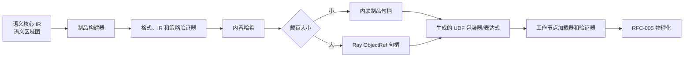

# RFC-004：可移植制品

**状态：** 正式格式 1.0 已实现，发布门禁待完成

**作者：** Python UDF JIT 项目组

**创建日期：** 2026-07-17

**更新日期：** 2026-07-29

**本次修订：** 记录正式格式 1.0 的实现状态和无兼容包袱原则

**相关议题/合并请求：** 本地方案评审阶段，无外部议题或合并请求

**类别：** 主线特性

**工作量估算：** 4 人周

**上游 RFC：** [RFC-003：语义 IR 编译](RFC-003-semantic-ir-compilation.md)

---

# 0. 实现状态与本期边界

RFC-004 的正式格式 1.0 已进入生产代码。编码器、解码器、固定字段与七个固定分段、大小预算、内容哈希、运行目标、依赖清单、内联载体、Ray `ObjectRef` 载体、工作节点二次校验、正负缓存和重启重建均已实现。

格式 1.0 是项目第一个正式格式，不存在旧正式版本。穿刺期内存对象、未知字段、未知分段、缺失或乱序分段、任意其他格式号和未来格式均被拒绝；本期没有兼容或迁移逻辑。制品只描述标量布局访问规格，并为未来向量布局保留明确拒绝点，不承诺读取未来字段。

# 1. 概述

## 1.1 简介

本提案定义驱动节点与工作节点之间的不可变信息交换边界 `PortableUdfArtifact`。穿刺期制品不构成任何已发布版本；当前制品格式 1.0 是项目的首个正式格式，不提供穿刺格式读取或迁移路径。制品携带语义核心 IR、语义区域图、物理布局访问规格、守卫模板、回退身份以及精确的运行目标和依赖清单；工作节点验证后再结合实际数据模式、布局、ABI 和 CPU 生成目标绑定产物。

可移植制品不等于 UDF IR，也不包含工作节点缓冲区地址、布局描述符、CinderX HIR 或机器码。Daft 0.7.2 没有任务元数据扩展 SPI，本期由生成的 UDF 包装器/表达式携带制品句柄；小制品内联，大制品通过 Ray `ObjectRef` 间接分发。

## 1.2 动机

如果直接把驱动节点内的 Python 对象或 CinderX HIR 发送给工作节点，产物会绑定进程地址、CPython/CinderX 版本或目标 CPU；如果只发送 UDF IR，又无法复现守卫、回退身份、依赖和布局要求。独立制品契约能够：

- 在头节点/驱动节点与工作节点之间保留足够语义而不固化目标布局；
- 对内容做精确版本、哈希和大小验证；
- 支持 Ray 分发、工作节点缓存、解释信息和故障重建；
- 把正式线格式与穿刺期内存对象完全隔离。

## 1.3 目标

### 目标

1. 定义唯一、严格、可验证且内容寻址的正式可移植制品格式 1.0。
2. 固定七个分段：`manifest`、`target`、`physical_layout`、`semantic_core_ir`、`semantic_region_graph`、`guard` 和 `fallback`。
3. 支持小载荷内联和大载荷 Ray `ObjectRef` 两种载体。
4. 工作节点完成格式、哈希、依赖、目标 ABI、语义 IR、区域图和布局访问规格校验后，才允许进入物理化。
5. 制品内容失败或丢失时，在原可调用对象仍可安全执行的前提下改走原始 UDF。
6. 为后续向量阶段保留明确的布局类型拒绝点，但本格式不承诺读取任何未来字段、分段或版本。

### 非目标

- 不建设独立 Artifact Registry、Compile Service 或网络协议。
- 不把 Worker-local Descriptor、RuntimeVariant、机器码或 Native Pointer 写入 Portable Artifact。
- 不替代 Ray Object Store 的生命周期、重试或容错。
- 不把任意 pickle 反序列化当作可信 Artifact Codec。
- 不在本 RFC 中定义数据布局或 CinderX 编译。
- 不读取穿刺期制品，不提供格式迁移器，不跳过未知字段或未知分段。
- 不提供前向兼容、后向兼容或混合版本执行能力。
- 本期不实现制品签名、消息认证码、作业密钥、轮换或吊销通道。

# 2. 用例分析

| 用例 | 行为 |
|---|---|
| 同一作业多个 Worker | 共享同一内容 Hash 的 Portable Artifact，各 Worker 独立目标特化 |
| 异构 CPU Worker | Artifact 相同，RuntimeVariant 按 CPU/ABI Key 分离 |
| Actor/Worker 重启 | 从 Wrapper Handle/ObjectRef 重新加载 Artifact，再编译或解释执行 |
| 制品损坏/格式不一致 | 加载器拒绝并记录原因，在满足安全回退前提时调用原始 UDF |
| Explain 离线分析 | 不加载业务数据或执行代码即可查看 IR、Region、Guard 和 Source Map |
| 大闭包或依赖对象 | Artifact 只保存受控引用/Hash，原始 Callable 由框架既有序列化载体承载 |

# 3. 方案设计

## 3.1 总体方案



制品采用“封装头 + 固定分段”结构。封装头保存精确格式号、总长度、分段数和主体哈希；每个分段单独保存名称、编解码器、长度和哈希。分段集合及顺序完全固定，任何未知、重复、缺失或乱序分段都被拒绝，不存在可跳过的可选分段。

## 3.2 技术选型

| 方案 | 优点 | 缺点 | 结论 |
|---|---|---|---|
| 自描述封装头 + 固定二进制分段 | 可精确校验、限制资源并稳定定位损坏 | 变更需要整套组件同步发布 | 本期采用 |
| 直接 pickle 内存对象 | 实现快 | 安全风险、版本/类路径脆弱、不可跨 ABI | 不采用 |
| CinderX HIR/机器码制品 | Worker 加载快 | 绑定 Runtime/CPU，失去可移植性 | 仅允许进入 SpecializedArtifact |
| 独立 Registry 服务 | 全局复用和治理强 | 增加服务、网络和故障域 | 本期不采用 |
| Ray ObjectRef | 复用现有集群分发和生命周期 | 依赖 Ray Job/对象可用性 | 大 Payload Carrier |

## 3.3 功能与性能设计

### Artifact 数据模型

```text
PortableUdfArtifact {
  header: {
    magic, format_major=1, format_minor=0,
    total_length, section_count, body_hash
  },
  manifest,
  target,
  physical_layout,
  semantic_core_ir,
  semantic_region_graph,
  guard,
  fallback
}

ArtifactHandle = Inline(bytes) | RayObjectRef(object_id, content_hash)
```

`fallback` 只保存原可调用对象的稳定身份；原可调用对象仍由框架现有序列化路径承载，制品编解码器不会反序列化任意 Python 对象。加载器先校验封装头、固定分段名称与顺序、长度和哈希，再解析 IR。任何未定义内容都被拒绝。

### 兼容键

正式制品声明精确的制品格式、语义核心 IR 格式、语义区域图格式、框架适配器 ABI、运行时 ABI、Python 版本、SOABI 和依赖版本。驱动节点、工作节点与制品必须逐项完全一致；不存在“最低版本”“兼容范围”或主次版本容忍。CPU 特征和工作节点本地描述符进入变体键，不写入可移植制品。

### 性能与验收

- Benchmark：主线 UDF 集分别生成 1、10、100、1000 个 Artifact，在本地与 Ray ObjectRef 两种 Carrier 下执行完整 Daft Job。
- Candidate 与 baseline 都执行原始 UDF，仅开启/关闭 Artifact 构建、分发和 Worker 校验；稳态端到端中位数比 `>= 0.98`。
- 同一 Content Hash 在单 Worker 进程只完成一次解析/验证；Actor/Worker 重启后能从 ObjectRef 重建。
- 对截断、分段越界、哈希错误、任意版本不一致、未知字段、未知分段、依赖缺失分别拒绝，作业在满足安全回退前提时走原始 UDF。
- 可移植制品不得包含地址样式的工作节点指针、机器码分段或真实缓冲区描述符；静态检查必须通过。
- 本 RFC 不单独承担主线 `1.15x`，但制品分发失败不得破坏 RFC-007 的安全解释路径。

## 3.4 安全隐私与DFX设计

- 解析采用长度上限、深度上限、节点数上限和整数溢出检查；验证前不得映射可执行内存。
- 内容哈希覆盖完整制品；分段哈希和主体哈希用于尽早定位损坏。
- 制品不保存业务行值；事件和解释信息不得输出业务值、源码或绝对路径。
- Ray `ObjectRef` 与作业和租户命名空间绑定；缓存不得跨命名空间命中。
- 格式号必须精确等于 1.0，其他主版本或次版本一律拒绝。
- 加载失败写结构化诊断和负缓存，避免每批重复解析损坏制品。

## 3.5 编程与调用设计

### 3.5.1 编程模型基本设计

普通用户不直接构造制品。编译器、运行时和离线工具共享同一严格数据模式和编解码器；开发者可用 `udfjitctl artifact inspect|verify` 查看不含业务值的结构和验证结果。

### 3.5.2 接口定义与设计

#### 3.5.2.1 `IF-ARTIFACT-BUILD-API`

- **接口描述：** 从 Verified Core/Region 产物生成不可变 Artifact。
- **接口原型：** `build_artifact(input, policy) -> ArtifactBuildResult`
- **输入：** 语义核心 IR、语义区域图、物理布局访问规格、守卫模板、回退身份和清单。
- **输出：** Artifact bytes、Content Hash、ArtifactHandle、诊断。
- **异常处理：** IR 未验证、Section 超限或 Codec 失败时返回拒绝，不产生部分制品。

#### 3.5.2.2 `IF-ARTIFACT-LOAD-API`

| 参数名称 | 输入/输出 | 类型 | 描述 | 取值范围 |
|---|---|---|---|---|
| `handle` | 输入 | ArtifactHandle | Inline 或 Ray ObjectRef | 必须含 Content Hash |
| `runtime_manifest` | 输入 | Manifest | 工作节点环境与 ABI | 只读 |
| `artifact` | 输出 | VerifiedArtifact | 已解析只读对象 | 全部固定分段通过 |
| `reject_reason` | 输出 | Enum | 失败原因 | 版本、哈希、依赖、ABI、编解码器等 |

#### 3.5.2.3 `IF-ARTIFACT-CARRIER-API`

- **接口描述：** Framework Adapter 将 Handle 装入已有可序列化 UDF/Task 载体。
- **Daft 0.7.2 绑定：** 生成的 UDF Wrapper/Expression 闭包；不修改 Flotilla Task Metadata。
- **约束说明：** Carrier 只传 Handle/Manifest/原始 Callable，不传 Worker-local 对象。

### 3.5.3 编程手册设计

运维/开发手册新增正式制品格式 1.0、精确准入键、`inspect/verify`、Ray `ObjectRef` 生命周期、缓存清理和损坏制品诊断章节。

# 4. 缺点和风险

| 风险 | 影响 | 应对 |
|---|---|---|
| 格式需要变更 | 当前读取器不能接受新内容 | 作为新的协同发布项目设计；当前读取器严格拒绝，不在本期预埋兼容逻辑 |
| Artifact 过大 | Driver 延迟和 Object Store 压力 | 常量外置、压缩、大小预算、内容去重 |
| Fallback Callable 序列化失败 | Worker 无正确性路径 | Adapter 在发布前验证框架原始序列化能力；失败不替换原 Expression |
| 反序列化攻击 | Crash/越界或资源耗尽 | 受控 Codec、边界检查、签名、预算、Verifier |
| ObjectRef 丢失 | Worker 无法加载 | 原始 UDF 可用；Ray 重试后重建或负缓存 |

# 5. 现有技术

- LLVM Bitcode、MLIR Bytecode 和 ONNX Model 体现了版本化 IR 制品、Verifier 和可选字段演进。
- Ray ObjectRef 提供现有集群内内容承载，但不替代本提案的格式与语义校验。
- TensorRT Engine 是目标绑定产物，适合作为 SpecializedArtifact 参考，不适合作为本 Portable Artifact。

# 6. 未解决问题

本 RFC 无阻塞性未决问题。跨作业/集群的全局制品注册表和制品认证机制不进入本期；如后续确有需求，必须单独设计并重新完成端到端资格验证。

---

## 附录 A：参考资料

- [RFC-003：语义 IR 编译](RFC-003-semantic-ir-compilation.md)
- [Ray Objects](https://docs.ray.io/en/latest/ray-core/objects.html)
- [ONNX IR](https://onnx.ai/onnx/repo-docs/IR.html)

## 附录 B：术语

| 术语 | 定义 |
|---|---|
| Portable Artifact | 未绑定 Worker 真实布局、ABI/CPU 机器码的跨节点不可变制品 |
| Specialized Artifact | Worker 目标绑定后产生的 Provider IR/机器码及 Descriptor 依赖 |
| Carrier | 框架既有的 UDF/Task 序列化载体，只承载 Artifact Handle |

## 附录 C：文档更新计划

语义核心 IR、守卫模板、载体或清单发生任何结构变化时，当前格式 1.0 读取器继续严格拒绝新结构。是否设计下一正式格式由独立 RFC 决定，本 RFC 不承诺迁移或兼容路径。
