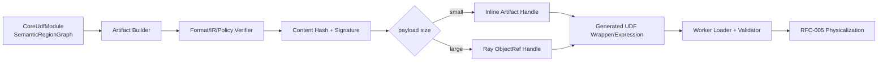

# RFC-004：可移植制品

**状态 (Status):** Draft

**作者 (Authors):** Python UDF JIT 项目组

**创建日期 (Created):** 2026-07-17

**更新日期 (Updated):** 2026-07-17

**相关 Issue/PR:** 本地方案评审阶段，无外部 Issue/PR

**类别:** 主线特性

**工作量估算:** 4 人周

**上游 RFC:** [RFC-003：语义 IR 编译](RFC-003-semantic-ir-compilation.md)

---

# 1. 概述

## 1.1 简介

本提案定义 Driver 与 Worker 之间的不可变信息交换边界 `PortableUdfArtifact`。制品以 Core UDF IR 为核心 Payload，同时携带 Semantic Region Graph、Candidate Region Plan、Guard Template、Source Map、原始语义引用、依赖和兼容性 Manifest；Worker 验证后再结合实际 Schema/Layout/ABI/CPU 生成目标绑定产物。

Portable Artifact 不等于 UDF IR，也不包含 Worker Buffer 地址、Layout Descriptor、CinderX HIR 或机器码。Daft 0.7.2 没有 Task Metadata 扩展 SPI，本期由生成的 UDF Wrapper/Expression 携带 Artifact Handle；小制品可内联，大制品通过 Ray ObjectRef 间接分发。

## 1.2 动机

如果直接把 Driver 内 Python 对象或 CinderX HIR 发送给 Worker，产物会绑定进程地址、CPython/CinderX 版本或目标 CPU；如果只发送 UDF IR，又无法复现 Guard、Source Map、Fallback、依赖和分区决策。独立 Artifact Contract 能够：

- 在 Head/Driver 与 Worker 之间保留足够语义而不固化目标布局；
- 对内容做版本、Hash、签名和大小验证；
- 支持 Ray 分发、Worker 缓存、Explain 和故障重建；
- 将格式演进与内部内存对象解耦。

## 1.3 目标

### 目标

1. 定义版本化、可验证、内容寻址的 Portable Artifact 格式。
2. 包含 Core IR、Region 候选、Guard Template、Source Map、Fallback/原始语义引用和 Compatibility Manifest。
3. 支持小 Payload 内联和大 Payload Ray ObjectRef 两种 Carrier。
4. Worker 在反序列化、格式、Hash、签名、依赖和 ABI 校验后才交给 Physicalizer。
5. Artifact 失败或丢失时执行原始 UDF，不影响 Daft/Ray 作业恢复。
6. 为未来 Host Columnar/Vector 和 Accelerator Provider 保留能力声明，不包含目标机器码。

### 非目标

- 不建设独立 Artifact Registry、Compile Service 或网络协议。
- 不把 Worker-local Descriptor、RuntimeVariant、机器码或 Native Pointer 写入 Portable Artifact。
- 不替代 Ray Object Store 的生命周期、重试或容错。
- 不把任意 pickle 反序列化当作可信 Artifact Codec。
- 不在本 RFC 中定义数据布局或 CinderX 编译。

# 2. 用例分析

| 用例 | 行为 |
|---|---|
| 同一作业多个 Worker | 共享同一内容 Hash 的 Portable Artifact，各 Worker 独立目标特化 |
| 异构 CPU Worker | Artifact 相同，RuntimeVariant 按 CPU/ABI Key 分离 |
| Actor/Worker 重启 | 从 Wrapper Handle/ObjectRef 重新加载 Artifact，再编译或解释执行 |
| Artifact 损坏/版本过新 | Loader 拒绝并记录原因，调用原始 UDF |
| Explain 离线分析 | 不加载业务数据或执行代码即可查看 IR、Region、Guard 和 Source Map |
| 大闭包或依赖对象 | Artifact 只保存受控引用/Hash，原始 Callable 由框架既有序列化载体承载 |

# 3. 方案设计

## 3.1 总体方案



Artifact 采用 Envelope + Sections：Envelope 保存格式、Hash、兼容要求和 Section Directory；各 Section 单独设长度、Codec 和 Hash，允许未来增加可跳过的 Optional Section。

## 3.2 技术选型

| 方案 | 优点 | 缺点 | 结论 |
|---|---|---|---|
| 自描述 Envelope + 二进制 Sections | 可版本化、校验、跳过未知可选段 | 需维护 Schema/Codec | 本期采用 |
| 直接 pickle 内存对象 | 实现快 | 安全风险、版本/类路径脆弱、不可跨 ABI | 不采用 |
| CinderX HIR/机器码制品 | Worker 加载快 | 绑定 Runtime/CPU，失去可移植性 | 仅允许进入 SpecializedArtifact |
| 独立 Registry 服务 | 全局复用和治理强 | 增加服务、网络和故障域 | 本期不采用 |
| Ray ObjectRef | 复用现有集群分发和生命周期 | 依赖 Ray Job/对象可用性 | 大 Payload Carrier |

## 3.3 功能与性能设计

### Artifact 数据模型

```text
PortableUdfArtifact {
  header: {
    magic, format_major, format_minor,
    semantic_hash, content_hash,
    producer_manifest, compatibility_requirements
  },
  core_ir,
  semantic_region_graph,
  candidate_region_plan,
  guard_template,
  effect_summary,
  source_map,
  planner_expression_candidates,
  fallback_payload_ref,
  dependency_manifest,
  policy_fingerprint
}

ArtifactHandle = Inline(bytes) | RayObjectRef(object_id, content_hash)
```

`fallback_payload_ref` 指向由框架正常序列化的原始 Callable/Expression，不要求 Artifact Codec 反序列化任意 Python 对象。Loader 先校验 Envelope、Section 长度和 Hash，再解析 IR；Optional Section 未识别时可跳过，Required Section 未识别时拒绝。

### 兼容键

Portable Artifact 声明：Format Version、Core IR Version、Framework Adapter ABI、最低 Runtime ABI、逻辑依赖版本范围。CPython/CinderX SOABI、CPU Feature、Arrow 具体布局只作为 Worker Binding 的输入，不固化为唯一可用目标；若 Artifact 含 Python Bytecode/Callable 引用，则同时声明其 CPython Code Format 约束。

### 性能与验收

- Benchmark：主线 UDF 集分别生成 1、10、100、1000 个 Artifact，在本地与 Ray ObjectRef 两种 Carrier 下执行完整 Daft Job。
- Candidate 与 baseline 都执行原始 UDF，仅开启/关闭 Artifact 构建、分发和 Worker 校验；稳态端到端中位数比 `>= 0.98`。
- 同一 Content Hash 在单 Worker 进程只完成一次解析/验证；Actor/Worker 重启后能从 ObjectRef 重建。
- 对截断、Section 越界、Hash 错误、Major Version 不兼容、依赖缺失和伪造签名分别拒绝，作业仍走原始 UDF。
- Portable Artifact 不得包含地址样式的 Worker Pointer、机器码 Section 或真实 Buffer Descriptor；静态检查必须通过。
- 本 RFC 不单独承担主线 `1.15x`，但 Artifact 分发失败不得破坏 RFC-007 的安全解释路径。

## 3.4 安全隐私与DFX设计

- 解析采用长度上限、深度上限、节点数上限和整数溢出检查；验证前不得映射可执行内存。
- Content Hash 覆盖 Header 和所有 Required Sections；签名/发布来源策略由运行环境配置。
- Artifact 不保存业务行值；Source Map/字段名按策略脱敏。
- Ray ObjectRef 与 Job Namespace 绑定；跨租户缓存必须使用租户隔离和签名。
- 格式 Major 不兼容时拒绝；Minor 只允许新增可跳过字段/Section。
- Loader 失败写结构化诊断和负缓存，避免每批重复解析损坏 Artifact。

## 3.5 编程与调用设计

### 3.5.1 编程模型基本设计

普通用户不直接构造 Artifact。编译器、Runtime 和离线工具共享生成式 Schema/Codec；开发者可用 `udfjitctl artifact inspect|verify` 查看不含业务值的结构和兼容结果。

### 3.5.2 接口定义与设计

#### 3.5.2.1 `IF-ARTIFACT-BUILD-API`

- **接口描述：** 从 Verified Core/Region 产物生成不可变 Artifact。
- **接口原型：** `build_artifact(input, policy) -> ArtifactBuildResult`
- **输入：** CoreUdfModule、SemanticRegionGraph、CandidateRegionPlan、Guard Template、Source Map、Fallback Ref、Manifest。
- **输出：** Artifact bytes、Content Hash、ArtifactHandle、诊断。
- **异常处理：** IR 未验证、Section 超限或 Codec 失败时返回拒绝，不产生部分制品。

#### 3.5.2.2 `IF-ARTIFACT-LOAD-API`

| 参数名称 | 输入/输出 | 类型 | 描述 | 取值范围 |
|---|---|---|---|---|
| `handle` | 输入 | ArtifactHandle | Inline 或 Ray ObjectRef | 必须含 Content Hash |
| `runtime_manifest` | 输入 | Manifest | Worker 环境与 ABI | 只读 |
| `artifact` | 输出 | VerifiedArtifact | 已解析只读对象 | 全部 Required Section 通过 |
| `reject_reason` | 输出 | Enum | 失败原因 | Version/Hash/Signature/ABI/Codec 等 |

#### 3.5.2.3 `IF-ARTIFACT-CARRIER-API`

- **接口描述：** Framework Adapter 将 Handle 装入已有可序列化 UDF/Task 载体。
- **Daft 0.7.2 绑定：** 生成的 UDF Wrapper/Expression 闭包；不修改 Flotilla Task Metadata。
- **约束说明：** Carrier 只传 Handle/Manifest/原始 Callable，不传 Worker-local 对象。

### 3.5.3 编程手册设计

运维/开发手册新增 Artifact 格式版本、兼容键、`inspect/verify`、Ray ObjectRef 生命周期、缓存清理和损坏制品诊断章节。

# 4. 缺点和风险

| 风险 | 影响 | 应对 |
|---|---|---|
| 格式过早固化 | 后续 IR 演进困难 | Envelope/Sections、Major/Minor 规则、兼容测试 |
| Artifact 过大 | Driver 延迟和 Object Store 压力 | 常量外置、压缩、大小预算、内容去重 |
| Fallback Callable 序列化失败 | Worker 无正确性路径 | Adapter 在发布前验证框架原始序列化能力；失败不替换原 Expression |
| 反序列化攻击 | Crash/越界或资源耗尽 | 受控 Codec、边界检查、签名、预算、Verifier |
| ObjectRef 丢失 | Worker 无法加载 | 原始 UDF 可用；Ray 重试后重建或负缓存 |

# 5. 现有技术

- LLVM Bitcode、MLIR Bytecode 和 ONNX Model 体现了版本化 IR 制品、Verifier 和可选字段演进。
- Ray ObjectRef 提供现有集群内内容承载，但不替代本提案的格式与语义校验。
- TensorRT Engine 是目标绑定产物，适合作为 SpecializedArtifact 参考，不适合作为本 Portable Artifact。

# 6. 未解决问题

本 RFC 无阻塞性未决问题。跨 Job/集群的全局 Artifact Registry 和远程签名服务属于后续运维演进，不进入本期。

---

## 附录 A：参考资料

- [RFC-003：语义 IR 编译](RFC-003-semantic-ir-compilation.md)
- [Ray Objects](https://docs.ray.io/en/latest/ray-core/objects.html)
- [ONNX IR](https://onnx.ai/onnx/repo-docs/IR.html)

## 附录 B：术语

| 术语 | 定义 |
|---|---|
| Portable Artifact | 未绑定 Worker 真实布局、ABI/CPU 机器码的跨节点不可变制品 |
| Specialized Artifact | Worker 目标绑定后产生的 Provider IR/机器码及 Descriptor 依赖 |
| Carrier | 框架既有的 UDF/Task 序列化载体，只承载 Artifact Handle |

## 附录 C：文档更新计划

Core IR、Guard Template、Carrier 或 Compatibility Manifest 变化时更新；任何破坏 Required Section 语义的变化升级 Major Version。
