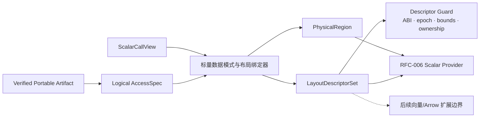

# RFC-005：数据布局特化

**状态：** 标量槽位已实现；向量与 Arrow 未实现

**作者：** Python UDF JIT 项目组

**创建日期：** 2026-07-17

**更新日期：** 2026-07-29

**本次修订：** 将本期范围收紧为标量槽位，Arrow/向量路径明确后置

**相关议题/合并请求：** 本地方案评审阶段，无外部议题或合并请求

**类别：** 主线特性

**工作量估算：** 6 人周

**上游 RFC：** [RFC-004：可移植制品](RFC-004-portable-artifact.md)

---

# 0. 实现状态与本期边界

RFC-005 本期只实现标量物理化：`bool/int32/int64/float32/float64`、可空有效位、输入/输出访问规格、能力句柄、进程代际、所有权、保活引用、边界检查和失败时的原子输出。工作节点把可移植制品绑定为进程内 `ScalarSlot`，CinderX 只能通过已验证的能力访问槽位。

向量、Arrow 列描述符、`BatchView`、切片/数据块、逐行扫描 Arrow 批次、零拷贝和批处理输出均未实现。本期只保留版本化布局类别和稳定拒绝点，未来实现不得改变现有标量契约。

# 1. 概述

## 1.1 简介

本提案定义工作节点侧数据布局特化：将可移植制品中的逻辑字段、类型、空值和布局约束，绑定到当前调用的标量数据表示，生成工作进程内的 `LayoutDescriptorSet` 与 `PhysicalRegion`。当前描述符只实现 Python `ScalarSlot`；CinderX 通过稳定 `access_id` 访问描述符，而不是把进程地址写入可移植字节码。

本期不接收 Daft 批处理 UDF 或 Arrow/Series 微批输入。RFC-010 的列式执行将在扩展契约之上改变计算模型；本 RFC 当前只解决单个标量值在哪里、如何安全读写以及谁拥有其生命周期。

## 1.2 动机

单纯 CinderX JIT 可以优化 Python 对象和稳定类布局，但不知道逻辑字段对应哪个进程内标量槽位、有效位和所有权。把能力句柄或进程地址固化在驱动节点产物中又会绑定工作进程和代际。

数据布局特化通过晚绑定解决两端信息不对称：驱动节点保留字段语义和合法布局约束，工作节点根据当前 `ScalarCallView` 生成标量描述符。这样既能让标量机器码读取已验证数据，也能用独立的版本化类别为后续列式/向量布局保留扩展位置。

## 1.3 目标

### 目标

1. 将稳定 FieldId/ResultId 映射为 Worker-local `access_id` 与 Layout Descriptor。
2. 支持 Python `ScalarSlot` 表示；覆盖可空有效位、容量、进程代际、保活引用和所有权。
3. 以 `AccessSpec + Descriptor + Guard` 向 CinderX 传递足够布局信息，不在 Portable Artifact 中保存地址。
4. 对类型、Null、Bounds、Alignment、Buffer 生命周期和输出容量进行验证。
5. 支持单值标量 Load/Store 和按需 Python 物化。
6. 以版本化布局类别和封闭拒绝点保留后续列式/向量扩展能力。

### 非目标

- 不实现 Arrow 描述符、Arrow Compute、SIMD、跨 Lane 融合或向量内核。
- 不重新排列 Daft MicroPartition、修改 Ray Object Store 或 Lance Scanner。
- 不实现 Arrow 转换或零拷贝。
- 不在 Driver 绑定真实 Buffer、Chunk 或 Offset。
- 不自行决定 Region 使用 Scalar 还是 Columnar Provider。

# 2. 用例分析

| 输入表示 | 示例 | 物理化结果 |
|---|---|---|
| Python 单值调用 | `score(12.5)` | `ScalarSlotDescriptor`，保留基础类型、可空有效位和 GIL 约束 |
| 可空标量 | `score(None)` | 有效位为假，不读取未初始化数值 |
| 越界整数 | 超出 `int32/int64` | 在写入槽位前拒绝，不发布部分输出 |
| 过期句柄 | 旧进程代际的能力 | 在首次读写前拒绝 |
| 未来向量/Arrow 布局 | 任意批次或列描述 | 稳定拒绝，不进入标量提供器 |

本期一次调用只处理一个标量值。批次、列和逐元素循环都不属于当前运行时。

# 3. 方案设计

## 3.1 总体方案



### 信息传递方式

Portable Artifact 保存逻辑签名：

```text
AccessSpec[17] = {
  field_id: 42,
  logical_type: Nullable<Float64>,
  mode: Read,
  accepted_representations: [ScalarSlot]
}
```

工作节点绑定真实标量布局：

```text
LayoutDescriptor[17] = {
  representation: ScalarSlot,
  physical_type: Float64,
  nullable: true,
  capacity: 1,
  ownership: Owned,
  process_generation: "…",
  descriptor_epoch: 9
}
```

Scalar Bytecode/Intrinsic 只携带稳定 ID 和已验证类型：

```text
GUARD_LAYOUT_DESC 3
IS_DATA_NULL     17
LOAD_DATA_F64    17
STORE_DATA_F64    4
```

Verifier 校验 AccessSpec 与 Descriptor 的类型、Null、读写和表示约束；Runtime Guard 保护 Descriptor ABI/Epoch。信息由 Opcode、AccessSpec 和 Descriptor 共同传递，任何无法证明的属性都导致重新绑定或解释执行。

## 3.2 技术选型

| 方案 | 优点 | 缺点 | 结论 |
|---|---|---|---|
| 稳定 `access_id` + 工作节点描述符 | 可移植、晚绑定、后续可增加新布局类别 | 需要额外守卫与间接层 | 本期采用 |
| 字节码直接编码槽位地址 | 代码生成简单 | 产物不可跨工作进程，生命周期危险 | 不采用 |
| 始终构造 Python Row/Object | 语义最兼容 | 保留 Hash/Boxing/属性查找开销 | 仅解释路径使用 |
| Arrow/向量描述符 | 可降低后续批处理物化成本 | 当前没有实现和验收证据 | 后续阶段 |

## 3.3 功能与性能设计

### Descriptor 类型

```text
LayoutDescriptor =
  ScalarSlotDescriptor {
    scalar_type, nullable, validity, value, capacity,
    process_generation, descriptor_generation, ownership
  }
```

布局类别保留未来扩展标识，但当前解码器不接受未来字段。标量路径强制支持 `bool/int32/int64/float32/float64` 及其可空形式。

### 生命周期与所有权

- 借用的标量槽位必须持有保活引用，作用域不超过当前包装器调用。
- 能力句柄绑定注册表、进程身份、集群代次和描述符代次。
- 输出槽位只有在完整写入和校验后才能发布；失败时不得暴露部分结果。
- Python 物化遵守 GIL；类型或空值校验失败在提交前进入解释路径。

### 性能与验收

- 五种基础类型、边界值、可空值、空输入、单值、错误类型、并发帧和工作节点重启都与 CPython 基准一致。
- 单次 A/B 记录槽位注册、守卫、读写、物化和发布阶段，不设置本 RFC 的速度阻断门槛。
- 解释信息必须证明布局类别、标量类型、有效位、进程代际和能力校验，不记录业务值。
- 向量、Arrow 或批处理事件一旦出现，本期验收直接失败。

## 3.4 安全隐私与DFX设计

- 描述符构造检查类型、整数范围、容量、可空状态和输出上界。
- 提供器只能通过验证后的能力句柄访问槽位，不得猜测框架私有对象布局。
- 借用槽位由保活引用和调用代次保护；过期描述符守卫必须失败。
- W^X 代码不包含业务地址常量；进程内句柄不得写入可移植制品。
- 物化、装箱/拆箱和校验时间可观测，默认不记录数据内容。
- 描述符 ABI 或进程代次变化导致变体失效。

## 3.5 编程与调用设计

### 3.5.1 编程模型基本设计

用户不操作描述符。框架工作节点适配器实现 `ScalarCallView`，提供器只消费标量描述符。未来新增向量适配器时必须使用新的版本化调用视图，不能扩展当前封闭结构。

### 3.5.2 接口定义与设计

#### 3.5.2.1 `IF-PHYSICALIZE-API`

- **接口描述：** 将 Verified Artifact 与当前调用布局绑定为 Physical Region。
- **接口原型：** `physicalize(artifact, call_view, worker_manifest) -> PhysicalizeResult`

| 参数名称 | 输入/输出 | 类型 | 描述 | 取值范围 |
|---|---|---|---|---|
| `artifact` | 输入 | VerifiedArtifact | RFC-004 输出 | 未绑定真实布局 |
| `call_view` | 输入 | ScalarCallView | 当前单值调用数据视图 | 生命周期受框架控制 |
| `descriptor_set` | 输出 | LayoutDescriptorSet | access_id 到真实布局 | Worker-local |
| `physical_regions` | 输出 | PhysicalRegion[] | 布局/类型已绑定 Region | 无机器码 |
| `guards` | 输出 | ConcreteLayoutGuard[] | ABI/Epoch/Bounds 等 | 每 Variant/调用检查 |

#### 3.5.2.2 `IF-DESCRIPTOR-ACCESS-API`

- **接口描述：** Provider 以 Handle 获取已验证 Descriptor，不暴露框架私有对象。
- **接口原型：** `resolve_access(descriptor_set, access_id) -> TypedScalarCapability`
- **异常处理：** 类型、Bounds、Epoch 或 Ownership 失败返回 Side Exit，不执行未验证 Load/Store。

### 3.5.3 编程手册设计

开发手册新增描述符 ABI、支持类型、有效位、进程代际、能力生命周期和新增框架标量布局绑定指南。Arrow C Data/Array 绑定留待后续向量阶段另行设计。

# 4. 缺点和风险

| 风险 | 影响 | 应对 |
|---|---|---|
| Descriptor 间接访问开销 | 小 UDF 收益下降 | JIT 内联已 Guard Descriptor 字段、热点缓存 |
| 生命周期错误 | Use-after-free | Keepalive、Epoch Guard、Ownership Verifier |
| 标量槽位与列式概念混淆 | 范围失控 | 当前只接受 `ScalarSlot`；其他布局稳定拒绝 |
| Python 与槽位空值/数值语义差异 | 错误结果 | 核心空值/类型契约、物化基准和差分测试 |

# 5. 现有技术

- Arrow C Data Interface 提供跨语言数组/Schema/Buffer 交换边界；本提案在其上增加 UDF FieldId、Ownership 和 Guard Contract。
- 数据库 Vectorized Engine 使用 Tuple/Column Descriptor 将逻辑字段绑定到物理 Buffer；本提案还必须支持 Python Materialization 和 Deopt。
- Moko 的专用 Bytecode/Intrinsic 表明可以用逻辑 ID 连接 Python 与数据布局；本提案通过 Worker Descriptor 避免把目标布局固化在 Bytecode。

# 6. 未解决问题

本 RFC 的标量范围无阻塞性未决问题。Arrow、字符串、嵌套类型、字典编码和跨数据块重打包属于后续向量阶段，不进入本期主线。

---

## 附录 A：参考资料

- [RFC-004：可移植制品](RFC-004-portable-artifact.md)
- [Arrow C Data Interface](https://arrow.apache.org/docs/format/CDataInterface.html)
- [Moko](https://doi.org/10.1145/3689031.3696100)

## 附录 B：术语

| 术语 | 定义 |
|---|---|
| AccessSpec | Driver 产物中的逻辑字段/结果访问契约 |
| LayoutDescriptor | Worker-local 的真实数据表示、地址、Null 和所有权描述 |
| Lane | 后续微批执行中按标量语义独立处理的一行/元素位置；本期未实现 |

## 附录 C：文档更新计划

新增物理类型、表示、Ownership 或 Descriptor ABI 时更新；Provider 访问契约变化同步 RFC-006、RFC-009 和 RFC-010。
