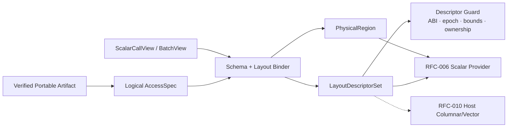

# RFC-005：数据布局特化

**状态 (Status):** Draft

**作者 (Authors):** Python UDF JIT 项目组

**创建日期 (Created):** 2026-07-17

**更新日期 (Updated):** 2026-07-17

**相关 Issue/PR:** 本地方案评审阶段，无外部 Issue/PR

**类别:** 主线特性

**工作量估算:** 6 人周

**上游 RFC:** [RFC-004：可移植制品](RFC-004-portable-artifact.md)

---

# 1. 概述

## 1.1 简介

本提案定义 Worker 侧 Data Layout Specializer：将 Portable Artifact 中的逻辑 FieldId、LogicalType、Null 和布局约束，绑定到当前调用的真实数据表示，生成 Worker-local `LayoutDescriptorSet` 与 `PhysicalRegion`。Descriptor 可描述 Python Scalar Slot 或 Arrow values/offset/validity/ownership；CinderX 通过稳定 `access_id` 访问 Descriptor，而不是把 Buffer 地址写入 Portable Bytecode。

本期即使输入由 Daft Batch UDF 以 Arrow/Series 微批承载，计算仍按 Lane 逐元素执行 Scalar Region，不生成跨 Lane Arrow Compute、SIMD 或 Fused Batch Kernel。RFC-010 的“列式执行”在本契约之上改变计算模型；本 RFC 只解决数据在哪里、如何安全读取和谁拥有内存。

## 1.2 动机

单纯 CinderX JIT 可以优化 Python 对象和稳定类布局，但不知道 `row.price` 对应 DataFrame Field、Arrow Column、Validity Bitmap 或 Batch 生命周期。把物理 Offset 固化在 Driver 产物中又会绑定 Worker、Chunk 和 ABI。

Data Layout Specializer 通过晚绑定解决两端信息不对称：Driver 保留 Field 语义和合法布局约束，Worker 根据实际 `daft.Series`/PyArrow Array、Scalar Call 或未来框架 Batch 生成 Descriptor。这样既能让标量机器码直接读取已验证数据，也为 Host Columnar/Vector Provider 复用同一布局契约。

## 1.3 目标

### 目标

1. 将稳定 FieldId/ResultId 映射为 Worker-local `access_id` 与 Layout Descriptor。
2. 支持 Python Scalar Slot 和 Arrow Primitive Column 两类首期表示；覆盖 Offset、Length、Stride、Validity、Chunk 和 Ownership。
3. 以 `AccessSpec + Descriptor + Guard` 向 CinderX 传递足够布局信息，不在 Portable Artifact 中保存地址。
4. 对类型、Null、Bounds、Alignment、Buffer 生命周期和输出容量进行验证。
5. 支持逐 Lane 标量 Load/Store 和按需 Python Materialization。
6. 保留 Host Columnar/Vector Provider 读取同一 Descriptor 的能力。

### 非目标

- 不生成 Arrow Compute、SIMD、跨 Lane Fusion 或向量 Kernel。
- 不重新排列 Daft MicroPartition、修改 Ray Object Store 或 Lance Scanner。
- 不假设所有 Arrow 转换零拷贝；复制必须显式记录。
- 不在 Driver 绑定真实 Buffer、Chunk 或 Offset。
- 不自行决定 Region 使用 Scalar 还是 Columnar Provider。

# 2. 用例分析

| 输入表示 | 示例 | 物理化结果 |
|---|---|---|
| Python Scalar Call | `score(12.5, 4)` | `ScalarSlotDescriptor`，保留 PyObject/primitive 状态与 GIL 约束 |
| Daft Series / Arrow Array | `price: float64[4096]` | values buffer、validity、offset、length、ownership、keepalive |
| Sliced Array | offset 非 0 | Load 地址包含 logical offset，Bounds Guard 使用 slice length |
| Chunked Array | 多 Chunk | 首期按 Chunk 生成 Descriptor/循环，或显式合并并记录 Copy |
| Nullable Column | Validity Bitmap | `IS_DATA_NULL` 在 Load 前检查；NonNull Guard 成立才可删除检查 |
| Fallback Row | 某 Lane 进入 Python | 只物化该 Lane 的所需字段，保持原始 Python 类型和异常语义 |

首期标量执行可在 Arrow Batch 上逐 Lane 调用 Scalar Executable；其循环粒度仍是一行，区别于 RFC-010 在整列/微批上进行计算图 Lowering。

# 3. 方案设计

## 3.1 总体方案



### 信息传递方式

Portable Artifact 保存逻辑签名：

```text
AccessSpec[17] = {
  field_id: 42,
  logical_type: Nullable<Float64>,
  mode: Read,
  accepted_representations: [ScalarSlot, ArrowColumn]
}
```

Worker 绑定真实布局：

```text
LayoutDescriptor[17] = {
  representation: ArrowColumn,
  physical_type: Float64,
  values: BufferRef,
  validity: BufferRef,
  offset: 128,
  length: 4096,
  stride: 8,
  ownership: Borrowed,
  keepalive: BatchRef,
  descriptor_epoch: 9
}
```

Scalar Bytecode/Intrinsic 只携带稳定 ID 和已验证类型：

```text
GUARD_LAYOUT_DESC 3
IS_DATA_NULL     17
LOAD_DATA_F64    17
STORE_DATA_F64    4
```

Verifier 校验 AccessSpec 与 Descriptor 的类型、Null、读写和表示约束；Runtime Guard 保护 Descriptor ABI/Epoch。信息由 Opcode、AccessSpec 和 Descriptor 共同传递，任何无法证明的属性都导致重新绑定或解释执行。

## 3.2 技术选型

| 方案 | 优点 | 缺点 | 结论 |
|---|---|---|---|
| 稳定 access_id + Worker Descriptor | 可移植、晚绑定、Scalar/Vector 复用 | 需要额外 Guard 与间接层 | 本期采用 |
| Bytecode 直接编码 Buffer 地址/Offset | Codegen 简单 | 产物不可跨 Batch/Worker，生命周期危险 | 不采用 |
| 始终构造 Python Row/Object | 语义最兼容 | 保留 Hash/Boxing/属性查找开销 | 仅解释路径使用 |
| 始终合并为连续 Arrow Buffer | Kernel 简单 | Copy 成本可能抵消收益 | 仅成本模型明确获益时采用 |

## 3.3 功能与性能设计

### Descriptor 类型

```text
LayoutDescriptor =
  ScalarSlotDescriptor {
    pyobject_slot, primitive_cache, type_guard, ownership
  }
  | ArrowColumnDescriptor {
    values, validity, offsets?, data?, offset, length,
    stride, alignment, chunks, ownership, keepalive
  }
  | OutputColumnDescriptor {
    mutable_values, mutable_validity, capacity, ownership
  }
```

字符串、Binary、List/Struct 的复杂 Descriptor 预留在格式中，但不进入本期 Scalar JIT 必须覆盖范围。首期强制支持 `bool/int32/int64/float32/float64` 及其 Nullable 形式。

### 生命周期与所有权

- `Borrowed` Descriptor 必须持有 Daft/PyArrow Keepalive，作用域不超过当前 Wrapper 调用。
- `OwnedTemporary` 由 Memory Manager 管理，可在 Region 完成后归还 Pool。
- 输出 Buffer 在发布给 Daft 前不可释放；失败时不得发布部分写入结果。
- Python Materialization 增加引用并遵守 GIL；Unbox 失败进入 Scalar Interpreter。

### 性能与验收

- Benchmark 数据：固定 Lance Snapshot，100,000,000 行 `price:float64`、`quantity:int32`、`tax:float64 nullable`，固定 Batch Size。
- A：主线框架启用但强制 Python Scalar Slot；B：启用 Arrow Descriptor + 逐 Lane Scalar Load，RFC-010 关闭。
- B 必须在至少一个数值 UDF 上端到端优于 A；所有受支持用例不得低于 A 的 `0.98x`。
- 与原始 Daft UDF 的主线 `1.15x` 由 RFC-007/008 组合验收；本 RFC Explain 必须证明布局命中、Copy 字节、Box/Unbox 次数和 Materialization Lane 数。
- 功能覆盖 sliced/chunked/nullable/empty/single-row Batch、错误类型和 Worker 重启；结果与原始 UDF 一致。

## 3.4 安全隐私与DFX设计

- Descriptor 构造检查 Buffer 长度、Offset、Stride、Alignment、Validity 容量和输出上界，使用溢出安全算术。
- Provider 只能通过验证后的 Descriptor Handle 访问内存，不得猜测 Daft/PyArrow 私有对象布局。
- Borrowed Buffer 由 Keepalive 和调用 Epoch 保护；过期 Descriptor Guard 必须失败。
- W^X Code 不包含业务地址常量；真实地址只存在于 Worker-local Descriptor Table。
- Copy、Materialize、Box/Unbox 的字节数和时间可观测；默认不记录数据内容。
- ABI/Arrow 版本变化导致 Descriptor ABI Key 变化和 Variant 失效。

## 3.5 编程与调用设计

### 3.5.1 编程模型基本设计

用户不操作 Descriptor。Framework Worker Adapter 实现 `ScalarCallView/BatchView`，Provider 只消费统一 Descriptor。开发者新增框架时需实现 Schema Resolver、Layout Binder、Keepalive 和 Output Builder 契约。

### 3.5.2 接口定义与设计

#### 3.5.2.1 `IF-PHYSICALIZE-API`

- **接口描述：** 将 Verified Artifact 与当前调用布局绑定为 Physical Region。
- **接口原型：** `physicalize(artifact, call_view, worker_manifest) -> PhysicalizeResult`

| 参数名称 | 输入/输出 | 类型 | 描述 | 取值范围 |
|---|---|---|---|---|
| `artifact` | 输入 | VerifiedArtifact | RFC-004 输出 | 未绑定真实布局 |
| `call_view` | 输入 | ScalarCallView/BatchView | 当前调用数据视图 | 生命周期受框架控制 |
| `descriptor_set` | 输出 | LayoutDescriptorSet | access_id 到真实布局 | Worker-local |
| `physical_regions` | 输出 | PhysicalRegion[] | 布局/类型已绑定 Region | 无机器码 |
| `guards` | 输出 | ConcreteLayoutGuard[] | ABI/Epoch/Bounds 等 | 每 Variant/调用检查 |

#### 3.5.2.2 `IF-DESCRIPTOR-ACCESS-API`

- **接口描述：** Provider 以 Handle 获取已验证 Descriptor，不暴露框架私有对象。
- **接口原型：** `resolve_access(descriptor_set, access_id, lane) -> TypedAddressOrScalar`
- **异常处理：** 类型、Bounds、Epoch 或 Ownership 失败返回 Side Exit，不执行未验证 Load/Store。

### 3.5.3 编程手册设计

开发手册新增 Descriptor ABI、支持类型、Arrow C Data/Array 绑定、生命周期、Copy 记账和新增 Framework Layout Binder 指南。

# 4. 缺点和风险

| 风险 | 影响 | 应对 |
|---|---|---|
| Descriptor 间接访问开销 | 小 UDF 收益下降 | JIT 内联已 Guard Descriptor 字段、热点缓存 |
| Arrow Chunk/编码复杂 | 覆盖不足或隐式 Copy | 首期类型白名单、按 Chunk 执行、Copy 显式计价 |
| 生命周期错误 | Use-after-free | Keepalive、Epoch Guard、Ownership Verifier |
| Scalar Lane 模式与列式概念混淆 | 范围失控 | 本 RFC 只绑定/逐 Lane；跨 Lane Kernel 仅 RFC-010 |
| Python 与 Arrow Null/数值语义差异 | 错误结果 | Core Null/Type Contract、Materialization Oracle、差分测试 |

# 5. 现有技术

- Arrow C Data Interface 提供跨语言数组/Schema/Buffer 交换边界；本提案在其上增加 UDF FieldId、Ownership 和 Guard Contract。
- 数据库 Vectorized Engine 使用 Tuple/Column Descriptor 将逻辑字段绑定到物理 Buffer；本提案还必须支持 Python Materialization 和 Deopt。
- Moko 的专用 Bytecode/Intrinsic 表明可以用逻辑 ID 连接 Python 与数据布局；本提案通过 Worker Descriptor 避免把目标布局固化在 Bytecode。

# 6. 未解决问题

本 RFC 无阻塞性未决问题。字符串、嵌套类型、Dictionary Encoding 和跨 Chunk 重打包作为后续类型覆盖，不进入本期主线性能门槛。

---

## 附录 A：参考资料

- [RFC-004：可移植制品](RFC-004-portable-artifact.md)
- [Arrow C Data Interface](https://arrow.apache.org/docs/format/CDataInterface.html)
- [Moko](https://doi.org/10.1145/3689031.3696100)

## 附录 B：术语

| 术语 | 定义 |
|---|---|
| AccessSpec | Driver 产物中的逻辑字段/结果访问契约 |
| LayoutDescriptor | Worker-local 的真实数据表示、地址、Null 和所有权描述 |
| Lane | 微批中按标量语义独立处理的一行/元素位置 |

## 附录 C：文档更新计划

新增物理类型、表示、Ownership 或 Descriptor ABI 时更新；Provider 访问契约变化同步 RFC-006、RFC-009 和 RFC-010。
