# RFC-006：标量 CinderX JIT

**状态：** 标量阶段已实现；向量与批处理未实现

**作者：** Python UDF JIT 项目组

**创建日期：** 2026-07-17

**更新日期：** 2026-07-29

**本次修订：** 记录五类型标量实现状态，删除 Arrow Lane 和批处理承诺

**相关议题/合并请求：** 本地方案评审阶段，无外部议题或合并请求

**类别：** 主线特性

**工作量估算：** 10 人周

**上游 RFC：** [RFC-005：数据布局特化](RFC-005-data-layout-specialization.md)

---

# 0. 实现状态与本期边界

RFC-006 的标量提供器已进入生产代码：五种基础标量类型、可空值、算术、比较、选择和局部分支可通过标量槽位进入 CinderX；运行时提供受控数据内建函数、HIR/LIR 证据、强制编译、W^X 代码分配、描述符预检和解释续体。CinderX JIT 与 CPython 解释器仍属于同一个标量 Python 执行提供器。

本期没有 Arrow 批次逐元素执行、非装箱 Arrow Lane、SIMD、列式输出或批处理包装器。Python 3.14.3 路径已验证；生产目标 Python 3.11.6 仍需 CinderX 适配和重新资格验证。

# 1. 概述

## 1.1 简介

本提案定义 Scalar Python Execution Provider 及其 CinderX JIT 路径。Provider 接收 RFC-005 的 Physical Scalar Region 和 Layout Descriptor，通过少量专用 Bytecode/Intrinsic 接入 CinderX Bytecode Frontend，Lower 为 Data-aware HIR，复用现有 SSA/HIR Pass、LIR、Codegen、Frame/Exception 和 Deopt 基础设施，生成并执行机器码。

CinderX JIT 与 CPython Interpreter 不是两个后端。它们共享同一个 CPython Runtime、对象模型、Frame、异常和 GIL：可特化 Region 执行 JIT Variant；编译拒绝、Guard Miss、Graph Break 或 Deopt 进入同一 Provider 的 `InterpreterContinuation`。本期只打通标量执行，不生成跨 Lane SIMD/Arrow Kernel。

## 1.2 动机

直接从 Core UDF IR 生成 LLVM/机器码需要重新实现 Python ABI、引用计数、异常、Frame、GC Safe Point 和 Deopt；让 UDF IR 先退化成普通 `LOAD_ATTR/PyNumber_*` Bytecode 又会丢失 FieldId、Null 和 Descriptor 信息。

在 CinderX Bytecode Frontend 增加受控 Intrinsic，可以把 Data-aware Load/Store 和 Guard 传到 HIR，同时复用成熟 Runtime JIT 后半段。该方案在改动范围、Python 兼容性和数据语义保真之间取得平衡。

## 1.3 目标

### 目标

1. 定义 Scalar Python Execution Provider 的 Capability、Compile、Execute 和 Interpreter Continuation 契约。
2. 将 Physical Scalar Region Lower 为专用 Bytecode/Intrinsic + Descriptor Table。
3. 在 CinderX Frontend 新增最小 Data-aware HIR Node 与类型映射，复用现有优化和 Codegen。
4. 支持 `bool/int32/int64/float32/float64`、Nullable、算术、比较、分支和字段/结果 Load/Store。
5. 支持 Python 单值标量调用入口，并为未来批处理入口保留独立扩展边界。
6. 保持 CPython 异常、引用、GIL、Frame 和 Deopt 语义。
7. 为 RFC-009 的 Execution Provider SPI 保持可替换边界。

### 非目标

- 不实现 Arrow Compute、NumPy/Pandas Batch Adapter、SIMD 或跨 Lane Fusion。
- 不把 CPython Interpreter 注册为独立 Provider。
- 不让 Portable Artifact 携带 CinderX HIR/LIR 或机器码。
- 不在首期支持任意 Python 对象协议、生成器、协程或所有 C Extension 内联。
- 不重写 CinderX 整体编译器或直接开放通用 HIR Frontend。

# 2. 用例分析

主线 Scalar Suite：

```python
def numeric(price, quantity, tax):
    return price * quantity * (1.0 + tax)

def branch(price, threshold):
    if price > threshold:
        return price * 0.9
    return price

def nullable(price):
    if price is None:
        return None
    return price * 1.1
```

| 场景 | 执行方式 |
|---|---|
| 类型/Layout Guard 命中 | CinderX ScalarExecutable |
| Python Scalar 输入 | Descriptor 指向 Scalar Slot，机器码保持 Python/primitive 边界 |
| Opaque PythonRegion | InterpreterContinuation 调用原始 Python 片段 |
| CinderX Deopt | 在同一 CPython Runtime 恢复解释 Frame/Continuation |
| 编译失败 | 写负缓存，当前和后续调用走解释路径直到冷却/Key 变化 |

# 3. 方案设计

## 3.1 总体方案

```mermaid
flowchart LR
    PHYS["Physical Scalar Region<br/>+ LayoutDescriptorSet"] --> LOWER["Scalar Provider Lowering"]
    LOWER --> BC["Specialized Bytecode/Intrinsic<br/>+ Descriptor ABI"]
    BC --> FRONT["CinderX Bytecode Frontend"]
    FRONT --> HIR["Data-aware HIR"]
    HIR --> PASS["Existing HIR/SSA Passes"]
    PASS --> LIR["LIR + Register Allocation"]
    LIR --> CODE["Machine Code + Deopt Metadata"]
    CODE --> EXEC["ScalarExecutable"]
    EXEC -->|"guard/deopt"| INTERP["CPython InterpreterContinuation"]
    PHYS -->|"unsupported"| INTERP
```



### 首期 Intrinsic

| Intrinsic | 语义 |
|---|---|
| `GUARD_LAYOUT_DESC id` | 校验 Descriptor ABI/Epoch/类型集合 |
| `IS_DATA_NULL access_id` | 读取标量槽位的空值状态 |
| `LOAD_DATA_{I32,I64,F32,F64,BOOL}` | 从已验证标量槽位读取基础值 |
| `STORE_DATA_{...} result_id` | 把基础值写入标量结果槽位 |
| `MATERIALIZE_PY access_id` | Side Exit 前按需构造 Python Object |
| `SIDE_EXIT reason,resume_id` | 转入 Region/Interpreter Continuation |

Bytecode Builder 必须携带 Source Map 和 Deopt State。CinderX Frontend 只在 Descriptor Guard 已支配 Load/Store 时构造 Unboxed HIR；否则拒绝编译。

### 标量变体

当前变体的输入和输出都通过 `ScalarSlot` 能力句柄传递。槽位内部按类型保存基础值和可空有效位，必要时在 Python 边界物化对象；不存在 Arrow Lane 或批次变体。

## 3.2 技术选型

| 方案 | 优点 | 缺点 | 结论 |
|---|---|---|---|
| 专用 Bytecode/Intrinsic → CinderX HIR | 改动集中；复用完整 Runtime/Deopt；保留 Descriptor 语义 | 需维护 Opcode/ABI 和 Frontend 映射 | 首期采用 |
| Physical IR 直接构建 HIR | 信息最完整、少一次 Lowering | 扩大 HIR API/Verifier 面，耦合 CinderX 内部 | 长期可选 |
| Core IR → LLVM | Native 优化空间大 | 需重建 Python Runtime/Deopt/异常 | 不采用主线 |
| 仅使用现有 CinderX 普通 Bytecode | 接入最简单 | 无 FieldId/Layout/Null 语义，性能上限低 | 作为 Boxed 兼容基线，不是目标路径 |

## 3.3 功能与性能设计

### Provider 契约

```text
ScalarCompileRequest {
  physical_region,
  descriptor_abi,
  guard_set,
  target_manifest,
  compile_budget,
  source_map
}

ScalarCompileResult =
  Compiled { executable, deopt_metadata, code_size }
  | Interpreted { continuation_handle, reason }
  | Rejected { reason, retry_policy }
```

### 编译与执行预算

- 只编译达到热度阈值、类型/Layout 已稳定且估算收益为正的 Region。
- 同一 Variant Key 由 RFC-007 Singleflight；编译线程池有 CPU、内存、时间和代码大小预算。
- Compile 失败不传播为 UDF 异常；原始 Python 异常仅由执行语义产生。
- Machine Code 按 CPython/CinderX SOABI、Descriptor ABI、CPU Feature、Region Hash 隔离。

### 性能与验收

环境固定为 Daft 0.7.2、Ray 2.55.0、Lance 7.0.0、PyArrow 22.x 和同一 CPython/CinderX Manifest。数据集为 100,000,000 行数值/Nullable Lance Snapshot，使用 `numeric/branch/nullable` 三类 UDF：

- A：RFC-001～005、007～008 启用，但 Scalar Provider 强制 CPython Interpreter。
- B：同一配置启用 CinderX Scalar JIT，RFC-009～012 全部关闭。
- 单次同环境 A/B 必须记录实际数值和正确性哈希，不以当前结果阻断功能实现。
- 累计 `1.15x` 目标只在后续声明性能资格时由 RFC-008 统一执行；RFC-006 解释信息必须证明 JIT 命中、代码大小、编译时间、标量类型、装箱/拆箱和去优化次数。
- 功能验收对边界值、Null、NaN/Inf、整数溢出、异常、Guard Miss 和 Deopt 与 CPython Oracle 做差分；错误结果为零容忍。

## 3.4 安全隐私与DFX设计

- 只有 Verified Physical Region 和 Descriptor 可进入 Bytecode Builder；Data-aware Load/Store 前必须有支配 Guard。
- Code Memory 使用 W^X；机器码 Cache 不接受未签名外部文件直接映射执行。
- JIT 遵守 CPython GIL、引用计数、GC Safe Point、异常状态和 Frame 可见性。
- Deopt Metadata 覆盖 live values、Python object materialization、Bytecode Resume Point 和 Source Map。
- Compiler Crash/Timeout 计入熔断；Actor/Worker 可由 Ray 恢复，原始 UDF 是正确性状态。
- 不在机器码或日志中固化/输出业务值；Descriptor 地址不进入 Portable Artifact。

## 3.5 编程与调用设计

### 3.5.1 编程模型基本设计

普通用户不选择 JIT API。Runtime 根据 Policy 和 Capability 自动选择 JIT 或 Interpreter。CinderX/Runtime 开发者在精确匹配的 CPython/CinderX 构建环境中开发，通过 HIR/LIR Dump、RuntimeTests、差分测试和端到端 Daft Benchmark 验证。

### 3.5.2 接口定义与设计

#### 3.5.2.1 `IF-EP-CAPABILITY-API`（Scalar Python）

- **接口描述：** 判断 Physical Region 能否由 Scalar JIT 或 Interpreter 承载。
- **接口原型：** `query_scalar_capability(region, target) -> CapabilityResult`
- **输出：** `JIT_SUPPORTED / INTERPRETER_ONLY / REJECTED`、类型/布局/Effect 约束、所需 Guard、估算成本。

#### 3.5.2.2 `IF-EP-COMPILE-API`

| 参数名称 | 输入/输出 | 类型 | 描述 | 取值范围 |
|---|---|---|---|---|
| `request` | 输入 | ScalarCompileRequest | Physical Region、Descriptor ABI、Target | 必须 Verify |
| `executable` | 输出 | ScalarExecutable | 机器码与 Deopt Metadata | JIT 成功时存在 |
| `continuation` | 输出 | InterpreterContinuation | 同 CPython Runtime 解释入口 | JIT 拒绝时存在 |
| `diagnostics` | 输出 | Diagnostic[] | 编译/拒绝原因 | 不含业务值 |

#### 3.5.2.3 `IF-EP-EXECUTE-API`

- **接口描述：** 执行 ScalarExecutable 或 InterpreterContinuation。
- **接口原型：** `execute_scalar(handle, descriptor_set, lane_or_scalar, runtime_context) -> RegionResult`
- **异常处理：** Python 语义异常按原 UDF 传播；内部 JIT 故障转 Side Exit/熔断，不伪装成业务异常。

### 3.5.3 编程手册设计

CinderX 集成手册新增 Descriptor Intrinsic、Bytecode→HIR 映射、Data-aware HIR Node、Deopt State、ABI/Variant Key、Debug Dump 和新增类型支持流程。

# 4. 缺点和风险

| 风险 | 影响 | 应对 |
|---|---|---|
| 修改 CinderX Frontend/Opcode | 维护和上游同步成本 | 最小 Intrinsic 集、版本隔离、生成式映射测试 |
| 逐标量调用有固定开销 | 短小 UDF 收益受限 | 持续按阶段热点做 A/B；向量内核留待后续 |
| Deopt State 不完整 | Crash/错误恢复 | 复用 CinderX Frame/Deopt + Region Continuation 差分测试 |
| Compile 开销大于收益 | 短作业回退 | 热度/成本门禁、缓存、预算、负缓存 |
| Python 与槽位基础值语义差异 | 错误结果 | 类型白名单、溢出/NaN/异常规则、CPython 基准 |

# 5. 现有技术

- CinderX 提供 Bytecode→HIR→SSA/优化→LIR→Machine Code 以及 Python Runtime/Deopt 基础，本提案新增 Data-aware Frontend 输入而非重造后端。
- TorchDynamo/Inductor 把 Python Capture 与后端编译分离；本提案的 Scalar Provider 更强调 CPython 语义续接和数据 Descriptor。
- Numba/Cython 可生成标量机器码，但要求特定类型/编程模型，且不直接提供本方案所需的框架 Region、Artifact 和 CinderX Deopt 集成。

# 6. 未解决问题

本 RFC 无阻塞性未决问题。Physical IR 直接构建 CinderX HIR、更多 Python Object 类型和无 GIL 执行属于后续演进，不进入本期。

---

## 附录 A：参考资料

- [RFC-005：数据布局特化](RFC-005-data-layout-specialization.md)
- [CinderX JIT Guide](../../../cinderx/cinderx/Jit/guide.md)
- [CinderX Deoptimization](../../../cinderx/cinderx/Jit/deoptimization.md)

## 附录 B：术语

| 术语 | 定义 |
|---|---|
| Scalar Python Provider | 同时承载 CinderX JIT 与 CPython Interpreter Continuation 的单一执行域 |
| Boxed Variant | 以 PyObject/Scalar Slot 为数据边界的标量机器码 |
| Scalar Slot Variant | 从受能力保护的标量槽位读写基础值的机器码 |

## 附录 C：文档更新计划

Intrinsic、HIR Node、支持类型、Deopt 或 CinderX ABI 变化时更新；Guard/Variant 生命周期变化同步 RFC-007。
