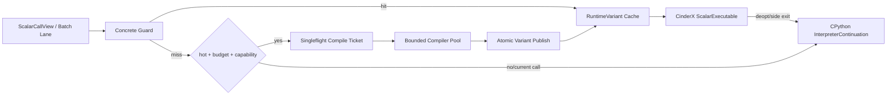
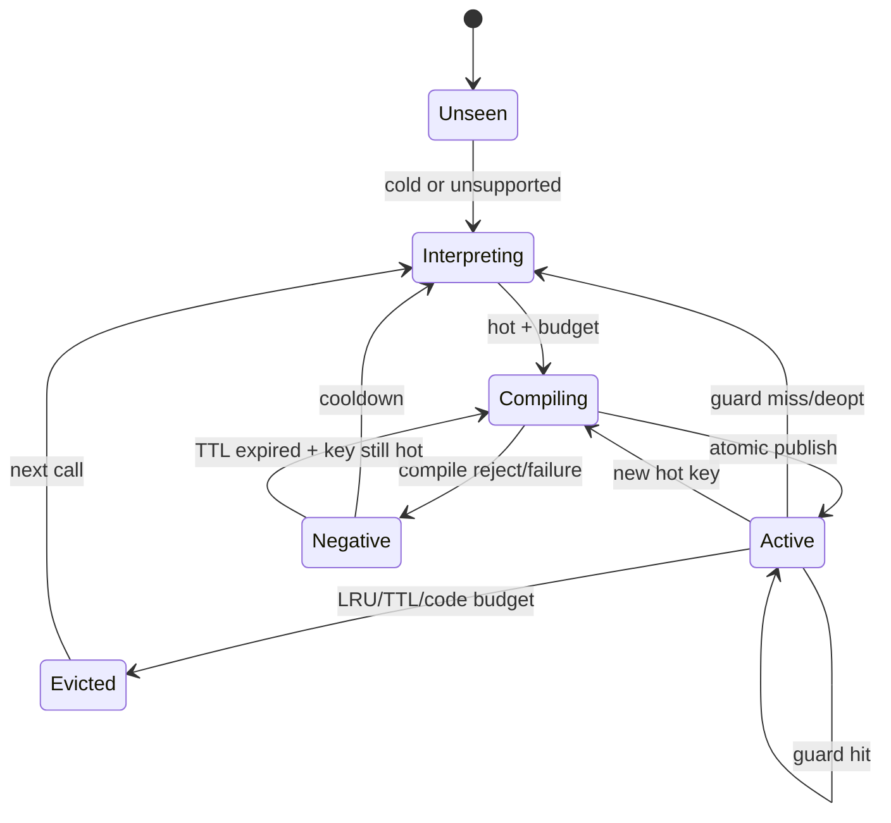

# RFC-007：守卫式执行

**状态：** 标量阶段已实现，发布门禁待完成

**作者：** Python UDF JIT 项目组

**创建日期：** 2026-07-17

**更新日期：** 2026-07-29

**本次修订：** 记录异步多变体、精确续体和进程级硬预算实现状态

**相关议题/合并请求：** 本地方案评审阶段，无外部议题或合并请求

**类别：** 主线特性

**工作量估算：** 6 人周

**上游 RFC：** [RFC-006：标量 CinderX JIT](RFC-006-scalar-cinderx-jit.md)

---

# 0. 实现状态与本期边界

RFC-007 的守卫式标量运行时已进入生产代码：变体键绑定代码、制品、数据模式、标量布局、运行时 ABI、CPU、进程代际、作业/租户和冻结策略；编译使用有界队列、单次并发合并和看门狗超时；缓存具有硬变体/代码预算、活动引用、LRU、资源关闭、负缓存和按键熔断。

提交前内部失败可安全走整函数解释；提交后只允许精确侧退出/去优化或使当前执行尝试失败，不能重放整个 UDF。缓存只存在于工作进程内，不实现跨工作节点或跨集群机器码缓存；向量和批内稀疏退出保持关闭。

# 1. 概述

## 1.1 简介

本提案定义 Worker Runtime 的守卫式执行闭环：将 Driver 侧 Guard Template 物理化为 Concrete Guard，按代码、Schema、布局、闭包、ABI 和 CPU 形成 Variant Key，管理 CinderX ScalarExecutable、InterpreterContinuation、多版本 Cache、Singleflight 编译、负缓存、Deopt 和安全回退。

“回退”不是切换到独立 CPython Backend，而是 Scalar Python Execution Provider 在同一 CPython Runtime 内从 CinderX JIT Variant 进入 InterpreterContinuation。任意编译失败、Guard Miss 或 Deopt 都不能改变原始 Daft UDF 的返回值、异常类型、行序或副作用顺序。

## 1.2 动机

Python 类型、闭包、全局对象、Schema 和 Arrow Layout 都可能变化。只编译一个无 Guard 的机器码版本会产生错误结果；每次变化都同步编译又会阻塞 Worker、引发编译风暴。守卫式多版本执行使系统能够在稳定场景走快路径，在新形状出现时复用已有 Variant、异步编译新版本或立即解释执行。

没有该特性，Scalar JIT 只能用于静态测试，不能安全进入通用 Daft/Ray 作业。

## 1.3 目标

### 目标

1. 将代码、Schema、逻辑假设、Descriptor、CPython/CinderX/Adapter ABI、CPU 和依赖版本纳入分层 Guard。
2. 定义稳定 `VariantKey`、`RuntimeVariant`、进程内 Cache 和生命周期。
3. 同一 Key 使用 Singleflight，支持后台目标编译和原子发布。
4. Guard Miss、编译失败、Graph Break 和 Deopt 安全进入 InterpreterContinuation。
5. 支持负缓存、版本/代码大小/编译时间预算，避免重复失败和编译风暴。
6. 保留未来混合 Provider 和稀疏 Side Exit 的统一 RegionResult/SideExit 契约。

### 非目标

- 不在本 RFC 中实现 Host Columnar/Vector Provider 或批内稀疏回退。
- 不把 Guard 用作语义证明替代品；IR/Physical Verifier 仍是强制边界。
- 不保证 Guard Miss 当前调用等待编译完成。
- 不建立跨集群全局机器码 Cache。
- 不在热路径同步调用远端治理服务。

# 2. 用例分析

| 场景 | 决策 |
|---|---|
| 完全命中 | 从进程 Cache 取得只读 RuntimeVariant，执行 CinderX ScalarExecutable |
| Schema/Layout 新 Key | 当前调用解释执行；达到热度且预算允许时后台编译新 Variant |
| 闭包阈值变化 | Value/Version Guard Miss，选择泛化 Variant或新版本，不复用旧常量代码 |
| 编译持续失败 | 写入带 TTL 的 Negative Cache，冷却期直接解释执行 |
| CinderX Deopt | 依据 Deopt Metadata 恢复 CPython Frame/Region Continuation |
| Worker 重启 | 丢失进程 Variant Cache，从 Portable Artifact 重新绑定/编译或解释执行 |
| UDF 抛出业务异常 | 按原 Daft 配置和行序传播，不计为 JIT 内部失败 |

# 3. 方案设计

## 3.1 总体方案



### Guard 分层

1. **Artifact Guard**：Code/Semantic Hash、Core IR/Policy、Framework Adapter ABI。
2. **Schema Guard**：字段 ID、LogicalType、Null、返回 Contract。
3. **Layout Guard**：Descriptor ABI/Epoch、Representation、Chunk/Offset/Alignment/Ownership。
4. **Python Guard**：Callable、defaults、closure cells、globals/modules、对象类型/版本。
5. **Target Guard**：CPython/CinderX SOABI、Runtime ABI、CPU Feature、依赖库版本。

便宜且高选择性的 Guard 优先；Guard 顺序是 Variant 的一部分。任何影响结果但未被 Guard 或静态证明覆盖的假设都禁止进入机器码。

## 3.2 技术选型

| 方案 | 优点 | 缺点 | 结论 |
|---|---|---|---|
| Guarded Multi-version + Interpreter Continuation | 动态性安全；热点可特化；当前调用不阻塞 | Cache/失效/Deopt 复杂 | 本期采用 |
| 单一泛化 JIT 版本 | Cache 简单 | 保留大量动态检查，布局特化收益低 | 作为可选泛化 Variant，不是唯一策略 |
| Guard Miss 同步编译 | 首次命中后快 | 阻塞 Worker、易编译风暴 | 不采用 |
| 任一 Miss 永久关闭 JIT | 实现简单 | 对偶发形状过度保守 | 仅连续失败熔断时采用 |

## 3.3 功能与性能设计

### 关键数据

```text
VariantKey {
  semantic_hash,
  schema_fingerprint,
  layout_fingerprint,
  python_dependency_fingerprint,
  adapter_runtime_abi,
  cpython_cinderx_soabi,
  cpu_features,
  provider_id,
  policy_version
}

RuntimeVariant {
  key,
  guard_program,
  executable_regions,
  interpreter_continuations,
  deopt_metadata,
  source_map,
  counters,
  lifecycle_state
}
```

### 状态机



### 并发与缓存

- Variant Cache 是 Worker 进程内只读快照；发布采用原子替换，执行线程不观察部分构建对象。
- Singleflight Key 与 VariantKey 一致；等待者可以短暂等待已接近完成的 Ticket，否则解释执行。
- 编译线程池和执行线程分离；配置 Actor/Worker 级并发、CPU、内存、时间和 Code Cache 上限。
- Negative Cache 保存失败类别、首次/最近时间、计数和 TTL；代码/Schema 变化形成新 Key，不受旧失败污染。

### 性能与验收

- 使用 RFC-008 主线端到端 Benchmark，比较：A 强制 Interpreter；B Guard + Variant Cache + CinderX JIT。
- 热身后守卫命中稳态不应引入独立 Python 函数调用；单次同环境 A/B 记录实际方向，累计 `1.15x` 只用于后续性能资格。
- Guard Miss/Deopt/编译失败 Case 的结果与异常 100% 一致；Fallback-only Case 端到端回归不超过 2%。
- 100 个并发相同 VariantKey 只允许一次实际编译；不同 Key 受线程池上限约束，无无界队列。
- Explain 必须输出 Key 摘要、Guard Miss 原因、Variant 状态、Compile/Negative Cache 和 Deopt Source。

## 3.4 安全隐私与DFX设计

- Guard Program 由受控 IR 生成并验证，不执行任意用户 Python。
- Guard 漏检是零容忍正确性缺陷；用 Mutation Test 删除单个 Guard，差分测试必须捕获错误复用。
- Machine Code 和 Descriptor 只在完整 Key 匹配时复用；跨 Job/租户隔离。
- 业务异常与内部失败分开计数，熔断不得吞掉或改写用户异常。
- Cache 有容量、TTL、LRU 和 Job Namespace；释放使用引用计数/Epoch，正在执行的 Variant 不被回收。
- 遥测异步采样，不在每 Lane 记录事件或业务值。

## 3.5 编程与调用设计

### 3.5.1 编程模型基本设计

用户不编写 Guard。Runtime 开发者通过 Guard Schema 和 Policy 定义可观察依赖；Provider 以 `required_guards` 声明运行假设。开发模式支持强制 Miss、禁用 Cache、Dump Guard 和差分 Shadow。

### 3.5.2 接口定义与设计

#### 3.5.2.1 `IF-VARIANT-RESOLVE-API`

- **接口描述：** 对当前 Runtime Context 解析可执行 Variant 或解释续接。
- **接口原型：** `resolve_variant(region_handle, runtime_context) -> ResolveDecision`

| 返回类型 | 描述 |
|---|---|
| `Hit(variant)` | Guard 全部通过，可立即执行 |
| `Compile(ticket, continuation)` | 后台编译，当前调用使用 continuation/兼容 Variant |
| `Interpret(continuation, reason)` | 冷、拒绝、负缓存或预算不足 |
| `CircuitOpen(continuation, reason)` | 当前 Region/UDF 已熔断 |

#### 3.5.2.2 `IF-BOUND-PLAN-REGISTER-API`

- **接口描述：** 注册 Bound Region、Guard Template、Descriptor ABI 和 Compatibility Key。
- **接口原型：** `register_bound_plan(plan) -> RegionHandle`
- **约束：** Plan 必须由 RFC-005 Physicalizer 验证；注册不触发无条件同步编译。

#### 3.5.2.3 `RegionResult / SideExit`

```text
RegionResult = Success(value_or_batch)
             | PythonException(exception_state)
             | SideExit(reason, resume_id, live_values)
             | InternalFailure(diagnostic_id)
```

内部失败必须转 InterpreterContinuation；PythonException 按原语义传播。

### 3.5.3 编程手册设计

Runtime 手册新增 Guard 层级、Variant Key、Cache/Singleflight、负缓存、Deopt、熔断联动、强制 Miss 和故障注入说明。

# 4. 缺点和风险

| 风险 | 影响 | 应对 |
|---|---|---|
| Variant Explosion | Code/内存失控 | 版本上限、泛化 Variant、LRU/TTL、熔断 |
| Guard 成本过高 | 抵消 JIT 收益 | 顺序优化、合并指纹、稳定依赖降频检查 |
| Guard 漏检 | 错误结果 | 完整依赖模型、Mutation/差分/Shadow、Verifier |
| 编译风暴 | Worker 资源耗尽 | Singleflight、线程池/预算、负缓存 |
| Deopt 重放错误 | 副作用重复或异常错序 | Effect Barrier、Resume Point、Commit 边界测试 |

# 5. 现有技术

- TorchDynamo 使用 Guard 和多版本图处理动态 Python；本提案增加 Schema/Layout/Framework ABI 和 CPython Interpreter Continuation。
- CinderX 提供函数级类型 Guard 与 Deopt；本提案在其外层增加 Region/Descriptor/Artifact Guard 和 Worker Cache。
- JavaScript JIT 的 Inline Cache/Deopt 展示了形状多版本与泛化策略，但数据框架还需处理 Batch Ownership 和任务生命周期。

# 6. 未解决问题

本 RFC 无阻塞性未决问题。跨 Worker 机器码 Cache 和自适应 Guard 排序属于后续优化，不影响本期安全执行闭环。

---

## 附录 A：参考资料

- [RFC-006：标量 CinderX JIT](RFC-006-scalar-cinderx-jit.md)
- [CinderX Deoptimization](../../../cinderx/cinderx/Jit/deoptimization.md)

## 附录 B：术语

| 术语 | 定义 |
|---|---|
| Guard Template | Driver 侧不含 Worker 地址/布局的运行假设模板 |
| Concrete Guard | Worker 结合 Descriptor、ABI 和目标环境形成的可执行检查 |
| InterpreterContinuation | Scalar Python Provider 内恢复原始 Python 语义的入口 |

## 附录 C：文档更新计划

Guard Schema、VariantKey、Cache 或 Deopt 变化时更新；治理策略和 Explain 字段变化同步 RFC-008。
