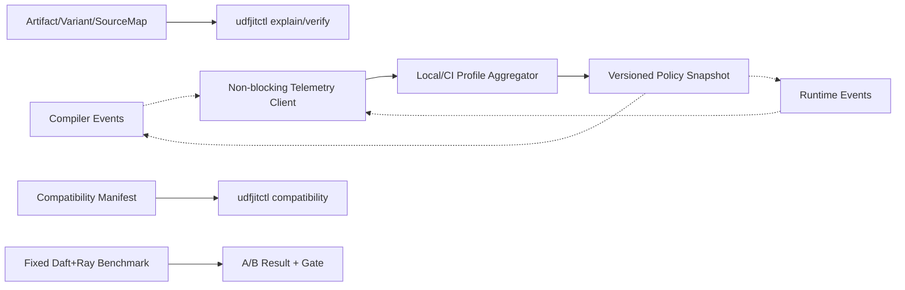

# RFC-008：运行治理

**状态：** 标量阶段已实现，发布门禁待完成

**作者：** Python UDF JIT 项目组

**创建日期：** 2026-07-17

**更新日期：** 2026-07-29

**本次修订：** 记录冻结治理实现状态，删除远程控制和紧急停用承诺，分离功能与性能资格

**相关议题/合并请求：** 本地方案评审阶段，无外部议题或合并请求

**类别：** 主线特性

**工作量估算：** 4 人周

**上游 RFC：** [RFC-007：守卫式执行](RFC-007-guarded-execution.md)

---

# 0. 实现状态与本期边界

RFC-008 的本地冻结治理已进入生产代码：`off/observe/auto`、作业提交时冻结的策略和策略哈希、模式上限、灰度授权、封闭资源预算、作业/租户隔离、解释信息、有限原因码、无业务值异步遥测、兼容检查、制品检查和验收报告聚合均已实现。

本期不实现远程凭据分发、运行中策略更新、中心控制服务或紧急停用通道。回滚通过停止新 `auto` 作业、新作业使用 `off` 或部署回滚完成，不能中断已经进入执行的区域。

性能与功能状态分离。单次 A/B 只提供方向性观测，不要求 ABBA，也不阻断标量功能实现；累计 `1.15x` 只用于后续另行声明的性能资格，不能作为本期一次性发布门槛。

# 1. 概述

## 1.1 简介

本提案定义 Python UDF JIT 的运行治理闭环：`off/observe/auto`、解释信息、结构化诊断、制品/变体隔离、预算与熔断、异步指标、兼容检查和端到端验收工具。治理模块不参与单个标量值的正确性决策，也不要求常驻远端服务；编译器和工作节点使用作业提交时冻结的本地只读策略。

RFC-008 同时定义持续性能跟踪口径：RFC-001～RFC-008 全部启用、RFC-009～RFC-012 关闭时，先以同环境单次 A/B 记录方向和热点；后续只有声明性能资格时，才以固定 Daft/Ray/Lance 标量负载和累计 `1.15x` 目标执行正式统计门禁。

## 1.2 动机

JIT 的收益依赖 Capture 覆盖、编译成本、Guard 命中、布局转换和作业热度。缺少统一 Explain 和 A/B Harness 时，无法判断“未提速”来自未捕获、未编译、频繁 Deopt 还是 Copy；缺少开关、预算和熔断时，个别 UDF 可造成编译风暴或 Worker 不稳定。

运行治理将系统从可运行原型变成可灰度、可诊断、可验收和可回滚的交付件。

## 1.3 目标

### 目标

1. 提供 `off/observe/auto`、标量提供器开关和作业提交时冻结的模式上限。
2. Explain 串联 Source→Capture→IR Pass→Region→Artifact→Layout→Variant→执行/回退原因。
3. 提供编译、代码、Cache、版本、内存、并发和失败预算，以及 Region/UDF/Job 级熔断。
4. Artifact、Variant、指标和策略按 Job/Tenant/ABI 隔离。
5. 提供 `udfjitctl` 的 Artifact Verify、Explain、Compatibility、Benchmark 和报告能力。
6. 定义方向性 A/B 与后续主线 `1.15x` 性能资格相互分离的端到端口径。

### 非目标

- 不建设必须在线的中心控制服务、指标服务或全局 Registry。
- 不用历史画像绕过 IR Verifier、Guard 或 Provider Capability。
- 不记录或上传业务行值。
- 不在本 RFC 中实现新的 Capture、Provider 或优化 Pass。
- 不以微基准代替 Daft+Ray 端到端发布门槛。

# 2. 用例分析

| 用例 | 期望结果 |
|---|---|
| 观察模式上线 | Capture/Compile 决策可见，执行始终走原始 UDF |
| 单 UDF 性能差 | Explain 显示 Break、Provider、Copy、Guard、Compile 和执行时间归因 |
| 编译连续失败 | 达阈值后 Region/UDF 熔断，后续调用直接解释执行 |
| 兼容版本漂移 | 启动/Artifact 检查拒绝不兼容模块，不加载错误机器码 |
| 部署回滚 | 停止新 `auto` 作业；新作业使用 `off`，现有区域自然完成 |
| 发布验收 | 一条命令运行固定环境正确性和方向性 A/B，分离功能与性能状态 |

# 3. 方案设计

## 3.1 总体方案



策略在作业提交时冻结并随载体分发，不在运行中切换。遥测客户端使用有界队列、采样和丢弃计数，不能反压标量运行路径。

### 运行模式

| 模式 | Capture/分析 | 编译 | 执行优化 Variant |
|---|---:|---:|---:|
| `off` | 否 | 否 | 否 |
| `observe` | 是 | 可选离线/影子 | 否 |
| `auto` | 是 | 按预算 | Guard 命中且收益门禁通过 |

## 3.2 技术选型

| 方案 | 优点 | 缺点 | 结论 |
|---|---|---|---|
| 本地策略 + 异步事件 + 离线 CLI | 无在线依赖、故障面小、易随 Wheel 交付 | 全局实时控制能力有限 | 本期采用 |
| 中心治理服务 | 统一全局策略和画像 | 引入网络、服务和热路径依赖 | 后续可选 |
| 仅日志 | 实现简单 | 难聚合、难自动门禁、结构不稳定 | 不采用 |
| 每次标量调用指标 | 细粒度 | 热路径开销和数据泄露风险高 | 禁止；只做区域、任务和运行批次聚合 |

## 3.3 功能与性能设计

### Explain 事件模型

```text
DecisionEvent {
  timestamp,
  job_region_source_ids,
  stage: ADAPTER | CAPTURE | IR | ARTIFACT | LAYOUT | VARIANT | EXECUTE,
  decision,
  reason_code,
  duration_ns,
  count_or_bytes,
  artifact_variant_policy_versions
}
```

Explain 必须能回答：是否发现 UDF、在哪里 Graph Break、形成哪些 Region、Artifact 是否加载、绑定何种 Layout、为何选择 JIT/Interpreter、Guard Miss/Deopt 原因、Copy/Materialize 数量和端到端收益。

### 预算与熔断

- Job/Worker：并发编译数、编译 CPU/内存、Code Cache、Artifact Cache 总量。
- Region/UDF：Variant 数、单次/累计编译时间、连续内部失败、Deopt/Guard Miss 比例。
- 达到软阈值停止新特化；达到硬阈值打开熔断并解释执行。
- Python 业务异常不计入内部失败熔断；内部 Crash/Timeout 与语义异常分开。

### 主线端到端 Benchmark

固定环境：Daft 0.7.2、Ray 2.55.0、Lance 7.0.0、PyArrow 22.x、同一 CPython/CinderX Manifest、相同 Ray 资源、Batch Size、Lance Snapshot 和输出 Sink。

使用 TPC-H SF10 `lineitem` 的约 6000 万行，日期预编码为 `shipdate_days:int32`，并把 Q6 的过滤和 Revenue 计算封装为普通标量 Python UDF：

```python
def q6_filter(shipdate_days, discount, quantity):
    return (
        8766 <= shipdate_days < 9131
        and 0.05 <= discount <= 0.07
        and quantity < 24
    )

def revenue(extendedprice, discount):
    return extendedprice * discount
```

| 组别 | 配置 |
|---|---|
| Baseline | UDF JIT `off`，Daft 原始 UDF |
| Mainline | RFC-001～008 `auto`，RFC-009～012 强制关闭 |

功能实现阶段先执行单次同环境 A/B；结果行数和 Revenue 聚合必须完全一致，并记录真实数值、环境指纹、阶段分解和热点。该结果只作方向性观测，不设置速度门槛。

只有后续声明性能资格时，才各预热一次、交替运行五次，并要求 `median(T_baseline) / median(T_mainline) >= 1.15`。包含不透明调用/图中断的回退作业和遥测/`off` 开销门槛也只在该正式资格阶段启用。

### 治理自身开销

Telemetry 开/关 A/B 的稳态端到端比 `>= 0.99`；事件队列满时丢弃事件而不是阻塞。`off` 模式相对未安装插件回归不超过 2%。

## 3.4 安全隐私与DFX设计

- Event 默认不含业务值、常量内容、完整闭包或明文敏感字段；Source/Schema 支持 Hash/脱敏。
- Artifact/Variant/Cache 按 Job/Tenant Namespace 和 ABI Key 隔离；文件权限最小化。
- Policy 只能收紧预算/Provider，不得关闭 Verifier 或强制绕过 Guard。
- 本地模式在启动时读取；冻结策略在作业提交时绑定，不接受热路径或远端命令。
- CLI 对 Artifact 只读；`verify` 不映射执行机器码。
- Event/Metric 后端故障不影响 Compiler/Worker；丢弃量可见。

## 3.5 编程与调用设计

### 3.5.1 编程模型基本设计

平台通过 Wheel、环境变量/只读配置和 `udfjitctl` 管理；业务用户不增加 API。建议配置：

```text
UDFJIT_PLUGIN_ENABLE=1
UDFJIT_MODE=off|observe|auto
UDFJIT_DISABLE=1
UDFJIT_POLICY=/etc/udfjit/policy.json
```

### 3.5.2 接口定义与设计

#### 3.5.2.1 `IF-TELEMETRY-EVENT-API`

- **接口描述：** Compiler/Runtime 非阻塞提交结构化事件。
- **接口原型：** `try_emit(event) -> ACCEPTED | DROPPED`
- **约束：** 不阻塞，不抛业务异常，不含业务值。

#### 3.5.2.2 `IF-POLICY-API`

| 参数名称 | 输入/输出 | 类型 | 描述 | 取值范围 |
|---|---|---|---|---|
| `policy_version` | 输入 | String | 不可变策略标识 | 进入 Artifact/Variant 日志 |
| `mode` | 输入 | Enum | off/observe/auto | 只能被本地禁用、兼容性和冻结策略收紧 |
| `budgets` | 输入 | BudgetSet | Compile/Code/Cache/Variant | 非负有上限 |
| `provider_flags` | 输入 | Map | Provider/特性开关 | 不能绕过正确性门禁 |

#### 3.5.2.3 `udfjitctl`

```text
udfjitctl artifact verify <artifact>
udfjitctl explain <artifact-or-report>
udfjitctl compatibility --manifest <path>
udfjitctl benchmark mainline --config <path>
```

命令输出机器可读 JSON；基准测试命令验证主线方向性报告和功能状态，不在当前阶段应用速度门槛。

### 3.5.3 编程手册设计

单独输出《标量主线部署、灰度与回滚手册》，覆盖安装、模式、冻结策略、指标字典、解释信息、熔断、兼容矩阵、方向性基准测试和部署回滚。

# 4. 缺点和风险

| 风险 | 影响 | 应对 |
|---|---|---|
| 治理功能过重 | 热路径回归 | 异步聚合、批级指标、采样、开销门槛 |
| Explain 信息过多 | 隐私/存储压力 | 默认脱敏、级别/采样、保留周期 |
| 自动熔断误判 | 性能收益丢失 | 只影响优化路径；原始语义可用；Reason 可解释 |
| Benchmark 不稳定 | 错误发布结论 | 固定环境/数据、交替运行、中位数、环境指纹 |
| 配置漂移 | Driver/Worker 行为不一致 | Policy Version/Hash 随 Artifact，兼容检查 |

# 5. 现有技术

- JVM JIT、PyTorch `torch.compile` 和数据库引擎均提供 Explain/编译指标/回退原因；本提案将这些信息串联到 UDF Source、Artifact 和 Worker Variant。
- Ray Dashboard/Metric 可承载异步运行指标，但不替代 UDF JIT 的结构化 Reason 和发布门禁。
- TensorRT Timing Cache/Profiler 展示了目标编译与性能画像分离；本期只使用确定性规则和离线 A/B。

# 6. 未解决问题

本 RFC 无阻塞性未决问题。生产集群的长期指标存储和中心策略服务可按平台条件后续接入，不进入本期运行依赖。

---

## 附录 A：参考资料

- [RFC-007：守卫式执行](RFC-007-guarded-execution.md)
- [RFC 索引与性能口径](README.md)

## 附录 B：术语

| 术语 | 定义 |
|---|---|
| Explain | 从源码到运行 Variant 的可读决策与原因报告 |
| Circuit Breaker | 连续内部失败/资源超限后停止优化并保持解释路径的机制 |
| 主线性能资格 | 后续声明 `performance-qualified` 时应用的累计 `1.15x` 端到端门槛 |

## 附录 C：文档更新计划

模式、事件 Schema、策略、性能数据集或发布门槛变化时更新；高阶组合门槛变化同步 RFC-010～012 和索引。
