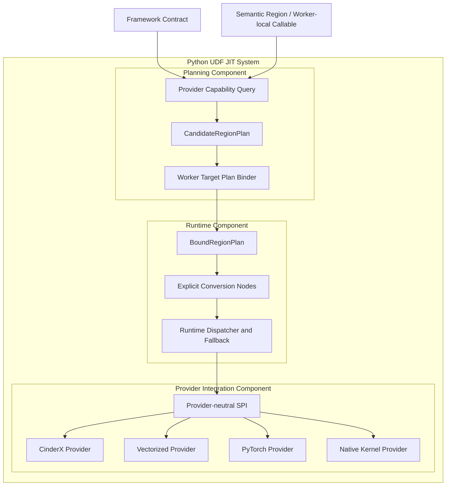
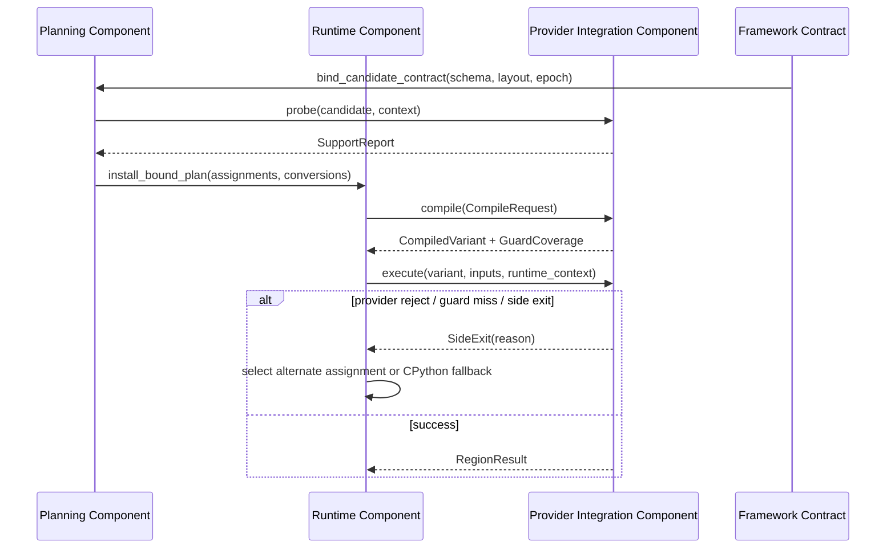

# RFC-009：混合 Execution Provider

**状态：** Draft，方案边界已对齐，尚未实现

**作者：** Python UDF JIT 项目组

**创建日期：** 2026-07-17

**更新日期：** 2026-08-06

**本次修订：** 按多后端信息归属架构重构为 CinderX、Vectorized、PyTorch、Native Kernel 的中立 SPI 与混合分发

**相关议题/合并请求：** 本地方案评审阶段，无外部议题或合并请求

**类别：** 后续特性

**工作量估算：** 8 人周

**上游 RFC：** [RFC-005：数据布局特化](RFC-005-data-layout-specialization.md)、[RFC-007：守卫式执行](RFC-007-guarded-execution.md)

**上游架构：** [多后端信息归属与接入架构](../design/2026-08-06-multi-provider-information-ownership-architecture.md)

---

# 1. 概述

## 1.1 简介

本提案定义在同一个 UDF Region Graph 中组合多个 Execution Provider 的能力。目标 Provider 包括 CinderX、Vectorized、PyTorch 和 Native Kernel；CPython Interpreter 是 CinderX Provider 的 fallback，不是第五个 Provider。Region Partitioner 根据能力和总成本选择 Provider，并在边界显式插入 Object/Arrow/Tensor/Buffer Convert、Materialize、Box/Unbox、Host/Device Transfer、GIL 和 Side Exit Contract。

Provider 接口不要求所有后端消费同一种输入：CinderX 优先接收 Worker-local Python callable，Vectorized/Native 通常接收 Semantic Region 与 Framework Contract，PyTorch 接收 Tensor-compatible Region 或可导出 Graph。每个 Provider 对自己的分析、Guard/Watcher/Deopt、内部 IR 和代码/图缓存负责。

## 1.2 动机

一个真实 UDF 或算子链可能同时包含可向量化算术、Tensor 推理、Native 聚合、动态 Python 分支和 Opaque Call。全函数只选择一个后端会导致两种极端：要么因少量动态逻辑放弃所有批量收益，要么为了进入 Tensor/Native 路径引入高成本全量转换。

混合 Provider 的价值不只是提高覆盖率，而是在保持 Python 语义的前提下改变局部执行模型，并把每一次跨域转换纳入成本与 Explain。RFC-010 可以不依赖本 RFC，把整个合法 Region 交给 Host Columnar Provider；本 RFC 进一步允许同一个 UDF 内同时存在 Scalar 与 Columnar Region，因此不属于本期主线 `1.15x` 或高阶阶段的强制前置范围。

## 1.3 目标

### 目标

1. 建立 Provider-neutral `probe/compile/execute/invalidate/diagnostics` 契约，使其支持同一 Region DAG 的多 Provider Assignment。
2. Driver 生成合法 Provider 候选和布局约束，Worker 结合实际 Target/Layout/Profile 形成 `BoundRegionPlan`。
3. 在 Object、Arrow/Column、Tensor、Native Buffer 之间显式建模 Value/Layout/Effect 和转换边。
4. 总成本同时考虑计算、编译、Copy、Materialize、Box/Unbox、设备传输、GIL、Region 切换和回退风险。
5. 支持 Provider 部分拒绝、失败隔离、GuardCoverage 和 CinderX/CPython fallback。
6. 保持 Semantic/Framework Contract 中立，不引入 CinderX HIR、Torch 私有节点或 Native ABI。

### 非目标

- 不把每个库名称定义为一个 Provider。
- 不在本 RFC 实现具体 Arrow/Vector、PyTorch 或 Native Kernel；各 Provider 另行功能设计。
- 不实现批内稀疏退出；RFC-011 负责 Lane 级恢复。
- 不跨 Effect/Exception Barrier 融合或重排。
- 不改变 Daft/Ray 的分区、调度、重试和 Object Store 语义。
- 不要求 CinderX 依赖 UDF JIT 的 Behavior、类型结论或外围 Guard；普通 callable 仍由 CinderX 自行闭环。

# 2. 用例分析

```python
def score(row):
    base = row.price * row.quantity       # columnar candidate
    adjusted = np.clip(base, 0, 1000)     # batch library candidate
    if audit_enabled:                     # scalar/global guard
        audit(adjusted)                   # opaque Python effect
    return adjusted * 0.9                 # columnar candidate
```

| 子区域 | Provider/执行方式 |
|---|---|
| primitive element-wise arithmetic | Vectorized/Arrow-SIMD（若对应 Provider 可用） |
| `np.clip` 且输入已是 ndarray/Arrow-compatible | Vectorized/NumPy Adapter |
| 可导出的 tensor 子图 | PyTorch Provider |
| 已验证的 buffer 聚合 | Native Kernel Provider |
| `audit_enabled/audit` | CinderX Provider；不支持时 CPython fallback |
| 类型/调用目标 Guard/Deopt | CinderX Provider 内部转移 |

若跨域 Materialize/Copy/Tensorize/Device Transfer 成本大于计算收益，Target Binder 可以选择整个 Region 留在 CinderX Provider；“支持”不等于“必须选择”。

# 3. 方案设计

## 3.1 总体方案



### 两阶段分区

1. Driver 只查询 Provider-independent 能力模型，生成合法候选、所需合同、Assumption 和成本包络；不固化 Worker Provider 版本，也不把 Assumption 当作 Guard。
2. Worker Target Binder 使用真实 Descriptor、CPU/Device、库 ABI 和运行画像选择最终 Provider Assignment，插入转换边并再次 Verify；Provider 编译后必须返回 GuardCoverage。

### 总成本

```text
total_cost = compute_cost
           + compile_cost_amortized
           + layout_conversion_cost
           + copy_and_materialization_cost
           + box_unbox_and_gil_cost
           + host_device_transfer_cost
           + dispatch_cost
           + region_switch_cost
           + guard_side_exit_risk_cost
```

首期使用规则与线性成本估计；只有热点候选允许有限 A/B 测量，不做全局自动调优搜索。

## 3.2 技术选型

| 方案 | 优点 | 缺点 | 结论 |
|---|---|---|---|
| ONNX Runtime 式 Capability Partition + Worker Binding | Provider 解耦；允许部分覆盖和目标晚绑定 | 转换边/成本模型复杂 | 采用 |
| 每个 Provider 独立遍历并抢占节点 | 实现局部简单 | 顺序依赖、全局转换成本不可控 | 不采用 |
| 全 UDF 固定单 Provider | 执行简单 | 小量动态逻辑污染整图，性能上限低 | 作为成本模型候选保留 |
| 强制所有 Provider 消费 CinderX typed-region 接口 | 表面统一 | 后端耦合，无法表达 Tensor/Arrow/Native 生命周期 | 不采用 |
| 中立 CompileRequest + Provider 声明输入模式 | 允许 callable、Semantic Region、Tensor Graph 等最合适输入 | SPI 和 Contract Test 更复杂 | 采用 |

## 3.3 功能与性能设计

### Capability Contract

```text
SupportReport {
  provider_id,
  accepted_input_modes,
  supported_region,
  type_null_effect_constraints,
  required_input_layouts,
  produced_output_layout,
  required_contracts,
  required_assumptions,
  side_exit_capabilities,
  cost_envelope,
  reject_reason
}
```

Assumption 不是可执行 Guard。`compile()` 只有在 Provider/Dispatcher 对所有 consumed assumption 形成
`GuardCoverage` 后才能返回可发布 Variant；Hint 缺失只允许影响成本，不允许改变正确性。

### Value/Layout Contract

跨 Region Value 必须声明 LogicalType、Null、Representation、Ownership、Mutability、Lifetime 和 Error/SideExit Contract。转换节点也是 Region DAG 的显式节点，必须计时、计字节和可回退，不能藏在 Provider 内部。

### Provider 失效

- Capability 拒绝：重新求解其他合法 Assignment，最终可全 CinderX/CPython fallback。
- Compile 失败：该 Provider/Region/Key 进入负缓存，当前执行走 CinderX Provider 的 CPython fallback。
- Execute 内部故障：未提交输出前 Side Exit；已产生不可逆副作用的 Region 禁止投机混合执行。
- Python 业务异常：按原顺序传播，不视为 Provider 故障。

### 性能与验收

- 功能 Benchmark 使用包含两段纯数值计算和一段 Opaque Python Call 的固定 UDF，验证 Region DAG、转换边、结果/异常和 Explain。
- A：强制整个候选使用 CinderX/CPython；B：额外启用已安装 Provider，允许混合分区。两组均以 diagnostics=off 运行并校验结果/异常一致。
- B 的端到端中位数必须优于 A，若成本模型选择全 CinderX 则允许相等但 Explain 必须给出转换成本拒绝原因；任何支持场景不得低于 A 的 `0.98x`。
- 本 RFC 为可选扩展，不计入本期 `1.15x`；高阶最终 `1.30x` 由 RFC-010～012 的组合作业判定。

## 3.4 安全隐私与DFX设计

- Provider 只接收中立 CompileRequest 声明的 callable/Semantic Region、Framework Contract 和 Target Context，不读取未授权框架私有对象或其他 Provider 内部状态。
- 转换节点验证 Bounds、Ownership、Null 和输出容量；跨 Provider Borrowed Buffer 必须持有 Keepalive。
- Provider Crash/Timeout 按 Provider/Region/Job 熔断，不关闭 CinderX/CPython fallback 正确性路径。
- Capability/Cost/版本和 Assignment 写入 Artifact/Variant Explain，支持复现。
- Provider Plugin 由 Manifest/签名白名单加载，不从用户可写路径动态装载。
- Profile 不包含业务值；高基数 Key 采样和限流。

## 3.5 编程与调用设计

### 3.5.1 编程模型基本设计

普通用户不指定 Provider。Provider 开发者实现版本化 SPI、Capability Schema、Compile/Execute 和 Contract Tests；框架 Adapter 不依赖具体 Provider。

### 3.5.2 接口定义与设计

#### 3.5.2.1 `ExecutionProvider` SPI

```text
provider_manifest() -> ProviderManifest
probe(candidate, context) -> SupportReport
compile(request: CompileRequest) -> CompiledVariant | Reject
execute(variant, inputs, runtime_context) -> RegionResult | SideExit
invalidate(variant, reason) -> None
diagnostics(variant, policy) -> ProviderDiagnostics
```

- **异常处理：** 内部错误返回结构化 `InternalFailure`；不得直接修改框架异常状态后继续。
- **约束说明：** Capability 必须保守；未声明的输入模式、类型、Effect、Layout 或 Assumption 一律不支持；GuardCoverage 不完整不得发布 Variant。

编译执行时序：



#### 3.5.2.2 `IF-TARGET-BIND-API`

- **接口描述：** 从 Candidate Plan 和真实 Worker Capability 生成 Bound Region Plan。
- **输入：** CandidateRegionPlan、LayoutDescriptorSet、Provider Manifests、Policy/Profile。
- **输出：** Provider Assignment、转换 Region、External Assumption、Guard owner 和总成本。
- **变更说明：** 新 Provider 不改变 Core UDF IR；只扩展 Provider Manifest/Physical/Provider IR。

### 3.5.3 编程手册设计

新增《Execution Provider 开发指南》，包括 SPI、能力保守性、Value/Layout Contract、转换记账、异常/Side Exit、Contract Test、ABI/签名和性能验收。

# 4. 缺点和风险

| 风险 | 影响 | 应对 |
|---|---|---|
| 分区/转换复杂度 | 维护成本与错误面增加 | 两阶段 Verify、显式 Contract、有限模式起步 |
| Provider 过多 | 搜索空间/编译延迟膨胀 | 按执行域而非库划分，候选/预算上限 |
| 成本模型不准 | 选择慢路径 | 保守门禁、Profile 校准、可回到全 CinderX/CPython |
| Side Effect 跨域 | 重放/异常顺序错误 | Effect Barrier、Commit Contract、禁止投机 |
| ABI 组合爆炸 | 交付/缓存复杂 | Provider Manifest、独立插件和 Compatibility Key |
| Guard 责任不清 | 错误 Variant 被发布 | Assumption/GuardCoverage 分离、单一 owner、发布完整性门禁 |
| Provider 私有 IR 泄漏到 Core | 后端锁定与版本耦合 | opaque artifact；Portable Artifact 禁止 HIR/Torch/LLVM/机器码 |

# 5. 现有技术

- ONNX Runtime Execution Provider 使用 Capability Partition 将图分配给硬件/库 Provider；本提案额外处理 PythonRegion、GIL、Boxing 和 Interpreter Continuation。
- TensorFlow PluggableDevice、PyTorch Backend 和 IREE HAL 展示了执行域插件化；本提案允许 Provider 声明最合适的 callable、Semantic Region 或 Tensor Graph 输入模式。
- 数据库异构执行器表明转换成本可能主导收益，因此 Provider Assignment 必须考虑 Materialization 和数据布局。

# 6. 未解决问题

1. 第一阶段先实现 Vectorized 还是 Native Kernel Provider，取决于可复用运行库和转换成本基线。
2. PyTorch Provider 第一版接收 Semantic Region、ExportedProgram，还是两者并存。
3. 混合分区先做到算子级还是 UDF 内 Region 级；必须以 Side Exit 和异常合同可实现性决定。
4. Framework/User External Contract 的签发、撤销和跨框架 schema 需要独立详细设计。
5. Provider SPI 进入 Reviewing 前必须创建并关联 Issue/PR；在此之前保持 Draft。

---

## 附录 A：参考资料

- [RFC-005：数据布局特化](RFC-005-data-layout-specialization.md)
- [RFC-007：守卫式执行](RFC-007-guarded-execution.md)
- [多后端信息归属与接入架构](../design/2026-08-06-multi-provider-information-ownership-architecture.md)
- [ONNX Runtime Execution Providers](https://onnxruntime.ai/docs/execution-providers/)

## 附录 B：术语

| 术语 | 定义 |
|---|---|
| Execution Provider | 按执行模型、数据表示和资源域划分的可插拔执行实现 |
| CandidateRegionPlan | Driver 侧合法 Provider 候选与成本包络，非 Daft/Ray 概念 |
| BoundRegionPlan | Worker 选定 Provider 并绑定真实 Layout 后的 Region DAG |
| External Assumption | Provider 无法自行完整恢复、且有明确来源和失效方式的正确性条件 |
| GuardCoverage | Provider/Dispatcher 对每个 consumed assumption 的执行保障报告 |

## 附录 C：文档更新计划

Provider SPI、成本字段、转换 Contract 或新执行域变化时更新；各 Provider 的具体能力由独立功能设计承接。
