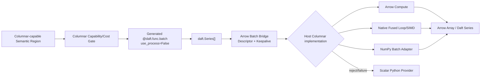

# RFC-010：列式执行

**状态：** 后续提案，本期关闭

**作者：** Python UDF JIT 项目组

**创建日期：** 2026-07-17

**更新日期：** 2026-07-29

**本次修订：** 明确本提案未实现并在本期关闭

**相关议题/合并请求：** 本地方案评审阶段，无外部议题或合并请求

**类别：** 后续特性

**工作量估算：** 6 人周

**上游 RFC：** [RFC-005：数据布局特化](RFC-005-data-layout-specialization.md)、[RFC-007：守卫式执行](RFC-007-guarded-execution.md)

---

# 1. 概述

## 1.1 简介

本提案定义如何把逐 Lane 执行的 Scalar UDF Region 提升为 Host Columnar/Vector Execution Provider 的微批执行：Daft 0.7.2 Adapter 复用 `@daft.func.batch`/`Series[]` 边界，Worker 通过 Arrow Descriptor 执行 Arrow Compute、Native Fused Loop/SIMD 或 NumPy Batch Adapter，并返回与声明类型完全一致的 Array/Series。

该特性不替代 NumPy/Pandas，也不要求用户改写为 Pandas UDF。Compiler 自动识别纯、element-wise、批处理友好的 Region并选择 Host Columnar 实现；用户代码保持普通 Daft UDF。关闭本特性后，同一 Artifact 仍可由 RFC-006 Scalar Python Provider 逐 Lane 执行。

## 1.2 动机

标量 JIT 消除了 Python Bytecode Dispatch 和部分对象开销，但仍存在 N 次 Lane 调用和标量循环。对于 `price * quantity * 0.9` 等纯计算，Arrow Batch 已在 Worker 中，若能把整个 Region Lower 为批量 Kernel，可进一步减少调用、分支和中间对象并利用 SIMD。

Daft 0.7.2 已提供 Batch UDF 和 MicroPartition/RecordBatch 承载，但其 Arrow 优化与显式 Batch/Pandas 风格 API 强绑定。本提案通过透明 Adapter 和 Provider SPI 把普通 UDF 自动提升为列式执行。

## 1.3 目标

### 目标

1. 自动识别纯、确定、可批处理且类型/Null 语义可证明的 Region。
2. 通过 Daft 0.7.2 既有 Batch UDF `Series[] -> Array` 边界接收微批，不修改框架源码。
3. 支持 Arrow Compute、Native Fused Loop/SIMD 和 NumPy ufunc 三类 Host Columnar 实现。
4. 显式管理 Chunk、Offset、Validity、Ownership、输出类型和 Copy。
5. 默认以完整 Region 为单位选择 Columnar 或 Scalar；启用 RFC-009 时再支持同一 UDF 内的混合 Provider 分区。
6. 对高阶阶段最终 `1.30x` 端到端门槛提供可归因收益。

### 非目标

- 不实现批内稀疏退出；任一 Lane 无法处理时本 RFC 只支持整批/Region Side Exit，RFC-011 再优化。
- 不处理任意 Python 对象、副作用、生成器、I/O 或不透明 C Extension。
- 不修改 Daft UDF Rust Operator、Ray Object Store 或 Lance Scanner。
- 不声称所有 Arrow↔NumPy/Pandas 转换零拷贝。
- 不在本 RFC 中实现 GPU/Accelerator Provider。

# 2. 用例分析

普通用户代码：

```python
@daft.func(return_dtype=daft.DataType.float64())
def score(price, quantity, tax):
    if price is None or quantity is None:
        return None
    return price * quantity * (1.0 + tax)
```

主线逐 Lane 模式：对 4096 行依次执行 ScalarExecutable。列式模式：输入 Arrow Columns 和 Validity，单个 Fused Kernel 处理整批并输出 Arrow Float64 Array。

| Region | 候选实现 |
|---|---|
| Arrow 已有算术/比较/Null/Cast | Arrow Compute Expression |
| 多节点纯 element-wise 链 | Native Fused Loop，允许 SIMD |
| 已有 ndarray/ufunc 科学计算 | NumPy Batch Adapter |
| Pandas/对象 dtype 或副作用 | 成本/能力拒绝，Scalar Python |

# 3. 方案设计

## 3.1 总体方案



生成的 Batch UDF 固定 `use_process=False`，保证 Native Runtime 在当前 Daft UDF 执行进程内运行，避免额外 Shared Memory + Arrow IPC 子进程链。外层错误策略不覆盖原 Row-wise 语义；可恢复失败由 Runtime 进入 Scalar Interpreter。

## 3.2 技术选型

| 方案 | 优点 | 缺点 | 结论 |
|---|---|---|---|
| Daft Batch UDF + Host Columnar Provider | 不改框架；直接取得 Series/Arrow；用户透明 | 依赖 Daft 0.7.2 Batch 契约 | 采用 |
| 修改 Daft Rust UDF Operator 调 Native ABI | 调用开销最低 | 侵入源码且无稳定 Extension ABI | 不采用 |
| 只生成 Pandas UDF | 生态兼容 | Copy/Object dtype、API 强绑定、性能上限较低 | 仅作为库适配，不作核心 |
| 只用 Arrow Compute | 复用成熟 Kernel | 覆盖/融合受 Kernel 集限制 | 与 Native/NumPy 组合 |

## 3.3 功能与性能设计

### Columnar Capability

Provider 仅接受：纯/确定、Effect-free、异常/Null 可批量保持、输入输出为支持的 Arrow primitive、无 Python 对象身份依赖的 Region。Python 短路仅在证明向量求值不会新增可观察异常时转换为 Select/Mask。

### 执行与内存

- `daft.Series.to_arrow()` 结果转换为 RFC-005 Descriptor；Sliced/Chunked Array 按 Chunk 运行或显式合并。
- Arrow Compute 优先复用已存在 Kernel；多 Operation 中间结果成本较高时选择 Fused Native Loop。
- NumPy Adapter 仅在 dtype/stride 可安全映射且 Copy 成本低于收益时选择；Object dtype 默认拒绝。
- 输出 Length、Physical Type、Nullability 和 Ownership 必须匹配 Daft 声明；部分写入失败不得发布。
- 所有 Copy、Materialize 和 Provider 切换进入 Explain。

### 独立 Benchmark

固定 100,000,000 行 Lance 数据：`price:float64`、`quantity:int32`、`tax:float64 nullable`，UDF 为前述 `score`，相同 Ray 资源、Batch Size 和输出 Sink。

| 组别 | 配置 |
|---|---|
| Scalar | RFC-001～008，强制 RFC-006 Unboxed Lane Scalar，RFC-009～012 关闭 |
| Columnar | 仅额外启用 RFC-010，选择 Arrow/Native 最优合法实现 |

预热一次、交替正式运行五次，结果逐值/Null 完全一致；`median(T_scalar) / median(T_columnar) > 1.00`，且 Explain 证明没有隐藏全量 Python Materialization。该独立用例证明列式特性有正收益。

### 高阶阶段门槛

在 RFC-008 的原始 Baseline 上启用适用的 RFC-010～012，使用同一基线按加法口径：

```text
speedup_advanced = median(T_baseline) / median(T_advanced) >= 1.30
```

RFC-010 不要求单独贡献全部 `0.15`，但必须在综合报告中提供自身开关 A/B 的端到端增量。

## 3.4 安全隐私与DFX设计

- Arrow Descriptor 执行前检查 Bounds、Chunk、Offset、Validity、Alignment 和 Ownership。
- Native Kernel 使用 W^X 和受控 Codegen；不得从 Artifact 直接映射未验证机器码。
- Python Effect/Exception 证明不足时拒绝列式化；不能以 Guard 代替不可逆语义证明。
- Batch Borrowed Buffer 由 Keepalive 保护；Provider 不在调用后保存裸指针。
- NumPy/Pandas/Arrow ABI 和版本进入 Variant Key；失配禁用对应实现而非整个作业。
- Batch/Region 指标不记录业务值。

## 3.5 编程与调用设计

### 3.5.1 编程模型基本设计

普通用户继续写 Scalar UDF。Provider 开发者可增加 Arrow Operation Lowering、Native Kernel Pattern 或 Batch Library Adapter；每个实现需声明类型、Null、Effect、布局和成本契约。

### 3.5.2 接口定义与设计

#### 3.5.2.1 `HostColumnarProvider` Capability

- **接口原型：** `query_capability(region, batch_layout, target) -> CapabilityResult`
- **输出：** 支持 Operation、Required Layout、输出 Layout、Null/异常约束、估算 Compute/Compile/Copy Cost。

#### 3.5.2.2 `ColumnarExecuteRequest`

```text
ColumnarExecuteRequest {
  executable_region,
  input_descriptors,
  output_descriptor,
  batch_length,
  runtime_context
}
```

- **返回：** `Success(OutputArray)`、`WholeRegionSideExit`、`PythonException` 或 `InternalFailure`。
- **约束：** 本 RFC 不返回 Failure Bitmap；RFC-011 扩展该结果。

#### 3.5.2.3 Daft Batch Wrapper

- **输入：** `daft.Series[]`、Artifact Handle、原始 Callable。
- **输出：** 与声明 return dtype/length 匹配的 `pyarrow.Array` 或 `daft.Series`。
- **失败：** Runtime 可恢复失败走 Scalar Python；原始业务异常按 Row-wise 语义恢复。

### 3.5.3 编程手册设计

Provider 手册新增 Arrow/Native/NumPy Capability、Batch Wrapper、支持类型/Operation、Copy/Chunk 策略、`use_process=False` 和列式拒绝诊断。

# 4. 缺点和风险

| 风险 | 影响 | 应对 |
|---|---|---|
| Batch Wrapper 改变错误粒度 | 与 Row-wise 语义不一致 | Runtime 恢复原始异常/行序；外层错误策略固定 |
| Copy/Chunk 成本 | 列式反而变慢 | 成本门禁、按 Chunk、显式 A/B 和 Explain |
| Null/短路语义差异 | 错误结果/新增异常 | 证明义务、Mask 执行、差分测试 |
| Kernel 覆盖不足 | 回退频繁 | 多实现 Provider、Scalar 保底、逐步扩展白名单 |
| 与 Daft 私有行为耦合 | 版本升级失效 | Adapter 指纹、Batch 契约测试、Fail Open |

# 5. 现有技术

- PyFlink/PySpark Pandas UDF 使用 Arrow Batch 连接 Python 科学生态，但要求用户选择批量 API；本提案自动从普通 UDF 推导列式 Region。
- Arrow Compute、NumPy ufunc 和数据库向量引擎提供成熟批处理实现；本提案用统一 Provider/Descriptor 选择而非替代它们。
- PyTorch Inductor 的 Fusion/Kernel 生成展示了改变执行粒度的收益，但数据 UDF 需要额外处理 Null、字符串、Arrow Ownership 和 Python Continuation。

# 6. 未解决问题

本 RFC 无阻塞性未决问题。字符串、嵌套类型、GPU 和跨 Batch Kernel Fusion 属于后续覆盖，不进入首个高阶验收集。

---

## 附录 A：参考资料

- [RFC-005：数据布局特化](RFC-005-data-layout-specialization.md)
- [RFC-007：守卫式执行](RFC-007-guarded-execution.md)
- [RFC-009：混合 Execution Provider（可选增强）](RFC-009-mixed-execution-providers.md)
- [Daft 0.7.2 Batch UDF](https://github.com/Eventual-Inc/Daft/blob/v0.7.2/daft/udf/__init__.py)
- [Arrow Compute](https://arrow.apache.org/docs/cpp/compute.html)

## 附录 B：术语

| 术语 | 定义 |
|---|---|
| Columnar Execution | 对整列/微批 Lower 并执行计算图，而非仅以 Arrow 承载逐 Lane Scalar 调用 |
| Host Columnar Provider | 在 CPU 主机内存上执行 Arrow/Native/NumPy/Pandas 批处理的执行域 |
| Fused Loop | 将多个 element-wise Operation 合并为一次 Batch 遍历的 Native Loop |

## 附录 C：文档更新计划

支持 Operation、类型、Batch Wrapper、Kernel 实现或高阶 Benchmark 变化时更新；局部 Lane 恢复能力同步 RFC-011。
