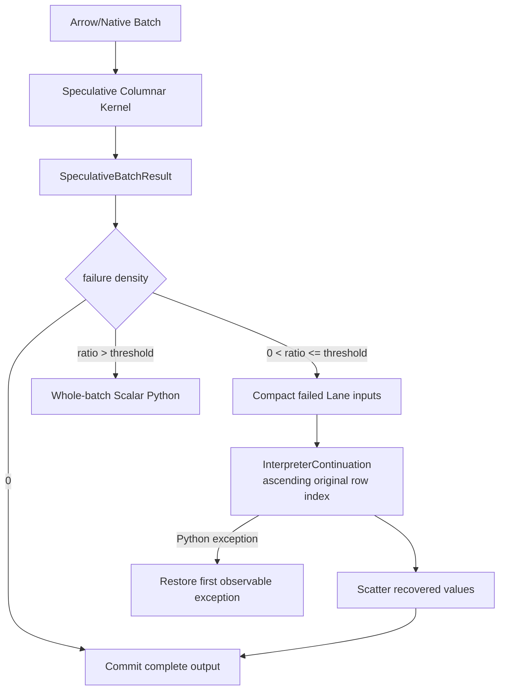
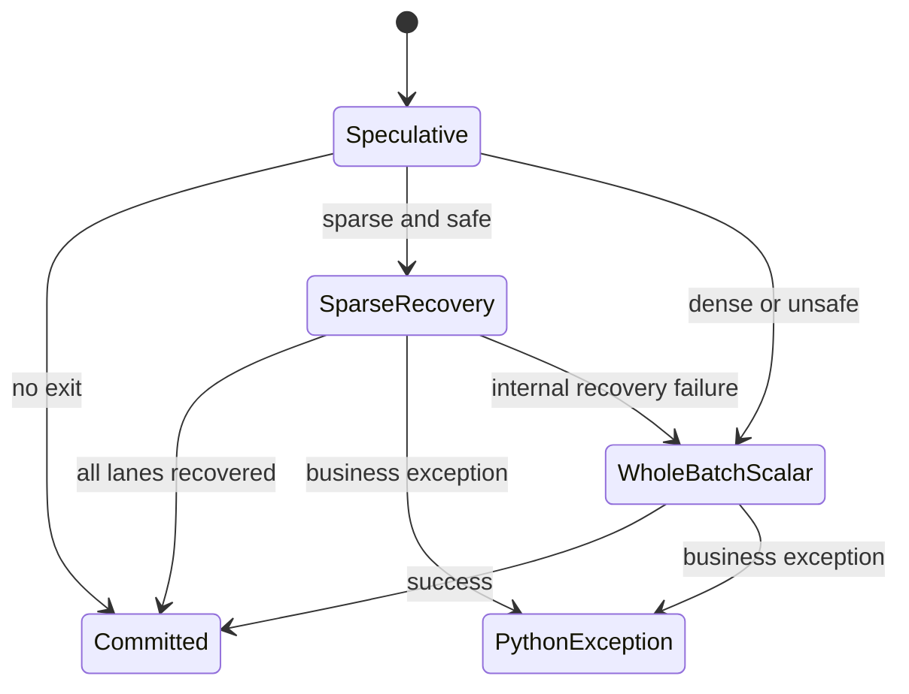

# RFC-011：稀疏退出

**状态 (Status):** Draft

**作者 (Authors):** Python UDF JIT 项目组

**创建日期 (Created):** 2026-07-17

**更新日期 (Updated):** 2026-07-17

**相关 Issue/PR:** 本地方案评审阶段，无外部 Issue/PR

**类别:** 高阶特性

**工作量估算:** 4 人周

**上游 RFC:** [RFC-007：守卫式执行](RFC-007-guarded-execution.md)、[RFC-010：列式执行](RFC-010-columnar-execution.md)

---

# 1. 概述

## 1.1 简介

本提案定义列式或 Native 批处理中的 Lane 级稀疏退出：当少量行触发数据相关 Guard、类型异常或不支持路径时，已编译 Kernel 返回失败位图，Runtime 仅压缩并回退这些 Lane，在 Scalar Python Provider 中恢复 CPython 语义，再把结果按原行号散射回批输出。

稀疏退出不是新增一个“CPython 后端”。CinderX JIT 与 CPython Interpreter 同属 Scalar Python Provider；本特性只改变从 Host Columnar Provider 返回标量 Continuation 的粒度，由“整批”细化为“少量 Lane”。

## 1.2 动机

RFC-010 首期采用整批 Side Exit。若 4096 行中仅一行包含罕见类型或触发慢路径，整批回退会抹去其余 4095 行的 Native 收益。真实数据常呈现“绝大多数规则、少量脏值或长尾值”的分布，因而需要一种不牺牲 Python 可观察语义的局部恢复机制。

不实现本提案时，列式执行的收益会对少量异常 Lane 极度敏感，成本模型只能保守拒绝本可加速的 Region。

## 1.3 目标

### 目标

1. 定义 `SpeculativeBatchResult`，传递成功结果、失败 Lane、退出原因和提交状态。
2. 对失败 Lane 执行 Compact → Scalar Continuation → Scatter，保持输入顺序和输出位置。
3. 用 Effect/Commit Barrier 限定允许投机执行的 Region，避免重复或乱序副作用。
4. 在退出密度过高时自动改为整批 Scalar，避免 Compact/Scatter 反向拖慢。
5. 保持 Python 异常类型、消息、首个可观察行位置和短路语义。
6. 通过独立端到端 A/B 证明稀疏退出优于整批回退，并参与高阶阶段 `1.30x` 总门槛。

### 非目标

- 不为带任意 I/O、外部状态写入、随机性或未知副作用的 Region 提供投机执行。
- 不把失败 Lane 丢弃、填默认值或吞掉业务异常。
- 不跨 MicroPartition 合并失败 Lane，也不改变 Ray Task 重试语义。
- 不修改 Daft、Ray 或 Lance 源码。
- 不在本 RFC 中定义 GPU Warp Divergence 或设备侧异常恢复。

# 2. 用例分析

```python
@daft.func(return_dtype=daft.DataType.float64())
def normalized_ratio(value, scale):
    if scale == 0:
        return python_slow_rule(value)
    return value / scale
```

若一个 Batch 中 99% 的 `scale != 0`，Host Columnar Kernel 可直接计算成功 Lane；`scale == 0` 的 Lane 返回 `GUARD_FALSE`，由原始 Callable/Continuation 逐行恢复。若失败率达到阈值，Runtime 不再进行稀疏恢复，而是整批走 Scalar Python。

| 场景 | 决策 |
|---|---|
| 无退出 | 直接提交批输出 |
| 少量可恢复退出，且 Region 未越过 Commit Barrier | 仅回退失败 Lane |
| 退出比例超过阈值 | 丢弃临时输出，整批 Scalar |
| 已发生不可逆副作用或异常顺序无法证明 | 编译前拒绝稀疏模式 |
| Scalar Continuation 抛出业务异常 | 按原始行序抛出首个可观察异常 |

# 3. 方案设计

## 3.1 总体方案



Kernel 写入的是未发布的 provisional output。只有所有失败 Lane 成功恢复且输出校验通过后，Runtime 才将批结果标记为 committed。任何不能安全恢复的内部错误都丢弃 provisional output，交由 RFC-007 的整 Region 回退策略处理。

## 3.2 技术选型

| 方案 | 优点 | 缺点 | 结论 |
|---|---|---|---|
| Failure Bitmap + Compact/Scatter | 与 Arrow Validity/Selection Vector 兼容；只恢复失败 Lane | 需要临时索引和提交协议 | 采用 |
| 首个失败即停止 Kernel | 实现简单 | 后续成功 Lane 无结果，SIMD 利用差 | 仅用于不能安全继续的 Operation |
| 整批回退 | 语义最直观 | 对罕见退出极敏感 | 密集退出或不安全 Region 的保底 |
| 在 Kernel 内直接调用 Python | 无 Scatter | GIL、异常和对象边界污染 Native Loop | 不采用 |
| 忽略失败并填 Null | 性能高 | 改变业务语义 | 禁止 |

## 3.3 功能与性能设计

### 结果与策略模型

```text
SpeculativeBatchResult {
  provisional_output: OutputBuffer,
  failure_bitmap: BitMap,
  failure_reasons: ReasonCode[],
  exception_tokens: ExceptionToken[]?,
  commit_state: UNCOMMITTED | COMMITTABLE | INVALID
}

SideExitPolicy {
  sparse_ratio_threshold: float,
  max_exit_lanes: uint32,
  preserve_exception_order: bool,
  max_recovery_attempts: uint8
}
```

`failure_bitmap` 长度必须等于 Batch Length；`failure_reasons` 可采用按失败 Lane 压缩存储。`ExceptionToken` 只保存可安全重建异常所需的受控元信息，不跨进程序列化任意异常对象。

### 合法性与提交协议

- Core UDF IR 的 Effect 分析必须证明 Region 为 Pure，或所有可观察 Effect 均位于退出后的 Scalar Continuation。
- Kernel 在 Commit Barrier 之前只能写私有临时 Buffer；不得修改输入、全局对象或外部系统。
- Compact 记录原始 Lane Index；Continuation 按 Index 升序运行，确保 Python 异常顺序与逐行执行一致。
- 若某失败 Lane 抛出业务异常，Runtime 不发布批输出，并在原始行位置恢复异常。其后的失败 Lane 不再执行；成功 Lane 的投机结果仍视为未提交。
- 若退出比例、数量或恢复次数超过策略阈值，Runtime 丢弃临时结果并整批 Scalar；阈值进入 Variant/Explain 配置，不改变 Artifact 语义。

### 状态机



### 独立 Benchmark

固定 50,000,000 行 Lance 数据，字段 `value:float64`、`mode:int8`。UDF 的快路径执行 8～12 个纯数值 Operation；恰好 1% Lane（均匀分布）令 `mode == 1`，触发等价但较慢的 Python 分支。相同 Daft/Ray 资源、Batch Size、Sink 和数据快照。

| 组别 | 配置 |
|---|---|
| Whole Batch | RFC-010 开启，RFC-011 关闭；任一退出导致整批 Scalar |
| Sparse Exit | 仅额外开启 RFC-011；失败率阈值固定高于 1% |

预热一次、交替正式运行五次。输出值、Null 和异常行为完全一致，且：

```text
median(T_whole_batch) / median(T_sparse_exit) > 1.00
```

报告必须同时给出真实 Exit Ratio、Compact/Scatter 时间和整批回退次数，证明收益来自 Lane 级恢复。另设 0%、1%、20% 和 100% 退出率功能档，验证阈值切换与性能不发生灾难性退化。

### 高阶阶段门槛

RFC-010～012 与主线共同启用后，仍以 RFC-008 定义的同一原始 Baseline 为分母：

```text
speedup_final = median(T_baseline) / median(T_all_features) >= 1.30
```

该口径是在主线 `1.15x` 基础上增加 `0.15`，不采用 `1.15 × 1.15`。RFC-011 必须提供自身开关 A/B 的端到端增量，但不要求独自贡献全部 `0.15`。

## 3.4 安全隐私与DFX设计

- 校验 Bitmap 长度、Lane Index、Buffer Bounds 和 Scatter 目标，拒绝越界或重复 Index。
- Provisional Buffer 使用 RAII/所有权句柄；异常、取消和 Ray Task 重试时不得泄漏或发布半成品。
- Reason Code 仅记录分类，不记录业务输入、输出或异常参数；采样日志受 RFC-008 治理。
- 随机化差分测试比较逐行 CPython、整批回退和稀疏退出，覆盖 Null、NaN、Inf、溢出、异常和短路。
- 用故障注入覆盖 Kernel 内部失败、Compact OOM、Continuation 异常、Scatter 失败及 Task Cancel。
- 默认阈值保守，并可由 RFC-008 熔断器按 Region 自动禁用稀疏模式。

## 3.5 编程与调用设计

### 3.5.1 编程模型基本设计

UDF 用户无新增 API。Provider 开发者可为 Operation 声明可恢复 Exit Site、Reason Code 和 Continuation Input Mapping；若未声明或 Effect 证明失败，Runtime 只允许整 Region Side Exit。

### 3.5.2 接口定义与设计

#### 3.5.2.1 `SpeculativeExecutionProvider`

- **接口原型：** `execute_speculative(request, side_exit_policy) -> SpeculativeBatchResult`
- **输入：** RFC-010 `ColumnarExecuteRequest` 与不可变 `SideExitPolicy`。
- **输出：** provisional output、失败集合、原因和提交状态。
- **异常处理：** 内部故障不得作为业务异常泄漏；由 Runtime 判定整批回退或熔断。
- **约束：** Provider 不得自行调用 Python，也不得提交部分输出。

#### 3.5.2.2 `SparseExitCoordinator`

- **接口原型：** `recover(result, continuation, batch_context) -> RecoveryOutcome`
- **调用方：** Worker Runtime 在 Provider 返回后调用。
- **返回：** `CommittedOutput`、`WholeBatchSideExit`、`PythonException` 或 `InternalFailure`。
- **约束：** 恢复顺序由原始 Lane Index 决定；Continuation 和 Artifact 必须属于同一 Semantic Region。

#### 3.5.2.3 `InterpreterContinuation`

- **接口原型：** `resume_lane(lane_inputs, resume_point, runtime_state) -> PyResult`
- **实现方：** Scalar Python Provider；优先复用 CinderX 可执行路径，必要时在同一 CPython Runtime 内解释执行。
- **变更：** RFC-007 的 Region 级 Continuation 增加 Lane Input Mapping，不改变 Python 用户接口。

### 3.5.3 编程手册设计

Provider 开发手册新增 Exit Site 合法性、Failure Bitmap ABI、Commit Barrier、异常顺序、阈值调优、故障注入和基准复现实例。

# 4. 缺点和风险

| 风险 | 影响 | 应对 |
|---|---|---|
| Effect 分析不完备 | 重复副作用或语义错误 | 仅对白名单 Pure Region 开启；不确定即整批/标量 |
| Compact/Scatter 成本过高 | 小批或密集退出变慢 | 成本阈值、退出率门禁、自动熔断 |
| 异常顺序不一致 | 用户可见行为变化 | 原行号升序恢复、未提交输出、差分测试 |
| Provisional Buffer 管理复杂 | 泄漏或半成品发布 | RAII、显式 Commit State、取消故障注入 |
| 失败原因种类膨胀 | ABI 和诊断难维护 | 稳定 Reason Code 分类、版本化扩展 |

# 5. 现有技术

- 向量数据库和分析执行引擎常用 Selection Vector 表示活跃行；本提案将其用于 Python Continuation 恢复。
- Trace JIT 的 Side Exit/Deoptimization 会恢复 Interpreter State；本提案增加 Batch Lane Mapping、提交协议和异常行序约束。
- GPU SIMT Masked Execution 可隔离分歧 Lane，但本提案运行于 Host Arrow/Native Batch，且必须恢复完整 CPython 语义。

# 6. 未解决问题

本 RFC 无阻塞性未决问题。首版默认阈值由实现期校准后固化为配置默认值；自适应阈值、跨批退出合并和设备侧稀疏恢复不进入本期。

---

## 附录 A：参考资料

- [RFC-007：守卫式执行](RFC-007-guarded-execution.md)
- [RFC-010：列式执行](RFC-010-columnar-execution.md)
- [Apache Arrow Columnar Format](https://arrow.apache.org/docs/format/Columnar.html)

## 附录 B：术语

| 术语 | 定义 |
|---|---|
| Lane | Batch 中与一条逻辑输入行对应的执行位置 |
| Sparse Exit | 仅把少量失败 Lane 转交 Scalar Continuation 的恢复机制 |
| Commit Barrier | 投机结果可对外可见前必须跨越的语义边界 |
| Provisional Output | 尚未提交、失败时可整体丢弃的临时批输出 |

## 附录 C：文档更新计划

Failure Bitmap ABI、退出阈值、异常恢复或 Commit 协议变化时更新；Provider SPI 变化同步 RFC-009、RFC-010 与 RFC-007。
