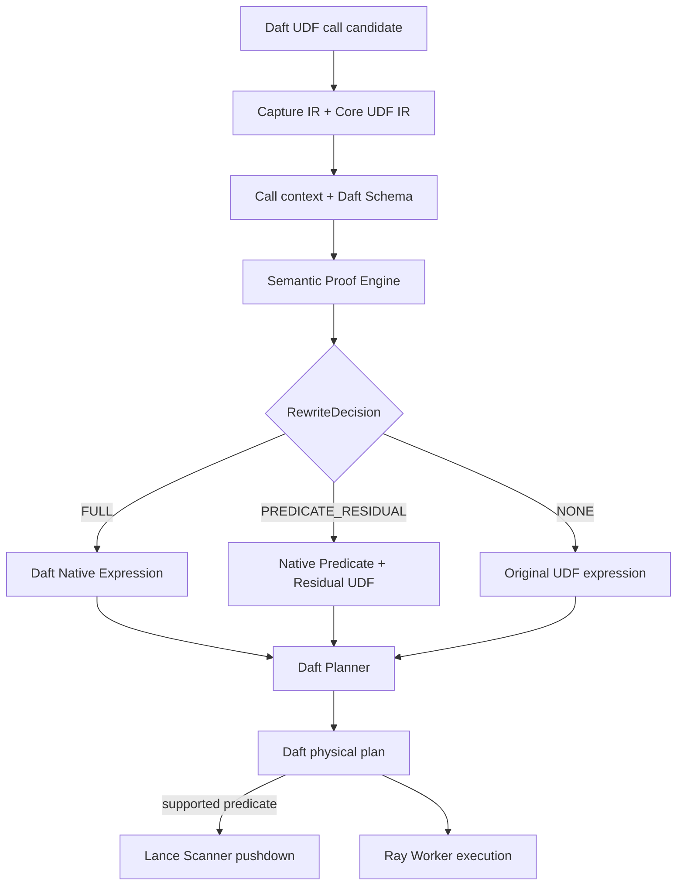

# RFC-012：等价语义回填

**状态：** 后续提案，本期关闭

**作者：** Python UDF JIT 项目组

**创建日期：** 2026-07-17

**更新日期：** 2026-07-29

**本次修订：** 明确本提案未实现并在本期关闭

**相关议题/合并请求：** 本地方案评审阶段，无外部议题或合并请求

**类别：** 后续特性

**工作量估算：** 6 人周

**上游 RFC：** [RFC-001：透明接入](RFC-001-transparent-integration.md)、[RFC-002：动态图捕获](RFC-002-dynamic-graph-capture.md)、[RFC-003：语义 IR 编译](RFC-003-semantic-ir-compilation.md)

---

# 1. 概述

## 1.1 简介

本提案定义把已证明等价的 UDF 语义回填为 Daft 0.7.2 原生 Expression。Driver 侧 Rewrite Engine 使用 Capture IR、Core UDF IR、Schema 与调用上下文生成证明；证明通过时，在 Daft Logical Plan 构建前以原生 Projection/Predicate 替代完整 UDF，或提取必要 Predicate 并保留 Residual UDF。

回填改变的是框架可见的逻辑表达，而非 Worker 内部执行速度。Daft Planner 因而可以继续做表达式融合、列裁剪和 Filter Pushdown；若 Lance 7.0.0 支持相应 Predicate，则由 Daft 既有 Planner/Scan 链路下推。本组件不直接向 Lance 注入表达式，也不修改 Daft Optimizer。

## 1.2 动机

即使列式 Kernel 很快，只要 UDF 仍是 Planner 黑盒，存储层仍可能读取并传输大量最终会被过滤的数据。例如 `return row.shipdate < cutoff and row.discount >= low` 若只在 Worker 执行，Lance 必须先扫描候选数据；若安全回填为 Daft Predicate，现有 Planner 可减少 I/O、传输和 Worker 计算。

单纯 CinderX JIT 无法跨越 UDF/Framework Planner 边界。本提案利用 UDF JIT 前端已恢复的数据计算语义，获得“改变物理执行计划”的更高优化上限。

## 1.3 目标

### 目标

1. 在 Driver 侧识别可映射为 Daft 原生 Expression 的纯、确定 UDF 语义。
2. 对类型、Null、数值、短路、异常、Effect 和确定性建立显式证明义务。
3. 支持完整替换，以及“必要 Predicate + Residual UDF”的保守部分回填。
4. 仅使用 Daft 0.7.2 暴露的 Expression/调用构建能力，不修改其源码。
5. 让 Daft Planner 决定 Projection/Filter 优化，并通过其既有链路与 Lance 7.0.0 协作。
6. 保留原始 Callable 和拒绝原因，证明失败时无条件执行原 UDF。
7. 通过独立端到端 A/B 验证回填收益，并参与最终 `1.30x` 总门槛。

### 非目标

- 不假设 Daft 0.7.2 提供公共 Optimizer Rule Plugin SPI；接入发生在 Plan Builder 之前。
- 不直接调用 Lance Scanner 私有接口，不控制索引选择或绕过 Daft Planner。
- 不对浮点重结合、异常消除、Null 语义变化或带副作用代码做“近似等价”回填。
- 不要求所有 UDF 均可回填；拒绝是正常路径。
- 不把 Core UDF IR 本身作为 Head→Worker Portable Artifact 的替代品；被完整回填的 UDF 不再需要该 Worker 路径。

# 2. 用例分析

```python
cutoff = 1995_01_01

@daft.func(return_dtype=daft.DataType.bool())
def eligible(shipdate_days, discount, quantity):
    return (
        shipdate_days < cutoff
        and discount >= 0.05
        and discount <= 0.07
        and quantity < 24
    )
```

若 Capture/IR 分析证明输入均为匹配的 Primitive Type、比较无附加 Python Effect，且 Bool/Null 语义等价，Rewrite Engine 可生成 Daft `col()` 比较与逻辑表达式。若完整等价无法证明，但 `quantity < 24` 是原 UDF 返回 True 的必要条件，可回填该 Predicate 以减少输入，同时保留原 UDF 对候选行做最终判断。

| 决策 | 条件 | 结果 |
|---|---|---|
| Full Rewrite | 整个 UDF 与原生 Expression 可证明等价 | 原生 Expression 替换 UDF |
| Necessary Predicate + Residual | Predicate 只排除原 UDF 必然拒绝的行 | Predicate 前置，原 UDF 保留 |
| No Rewrite | 任一证明义务不足 | 原调用原样进入 UDF JIT/CPython |

# 3. 方案设计

## 3.1 总体方案



透明接入采用两阶段 Hook：函数调用时 RFC-001 只记录 UDF、参数 Expression 和 Capture Candidate；当 DataFrame/Expression 构建 API 获得输入 Schema、操作位置和完整调用上下文后，再触发证明与回填。这样既不修改 Daft 源码，也避免仅代理 Python Callable 时缺少 Schema/Plan Context。

## 3.2 技术选型

| 方案 | 优点 | 缺点 | 结论 |
|---|---|---|---|
| Plan Builder 前生成 Daft Expression | 使用公开表达式能力；不改源码；Planner 可继续优化 | 需代理稳定 Python API 边界 | 采用 |
| Daft Optimizer Rule 插件 | 位置理想 | 0.7.2 无目标公共插件 SPI | 不采用 |
| 修改 Daft Rust/Python 源码 | 上下文最完整 | 侵入式、升级维护成本高 | 不采用 |
| 直接向 Lance 下推 UDF IR | 可能更直接 | 跨层耦合、语义与版本风险高 | 禁止 |
| 仅 Worker 生成 Native Kernel | 易复用主线 | 无法减少 Scan/I/O，Planner 仍见黑盒 | 作为回填拒绝后的执行路径 |

## 3.3 功能与性能设计

### 数据模型

```text
RewriteRequest {
  call_site_id,
  core_udf_region,
  daft_arguments,
  input_schema,
  operator_context,
  captured_constants,
  framework_version
}

SemanticProof {
  type_equivalence,
  null_equivalence,
  numeric_equivalence,
  short_circuit_equivalence,
  exception_equivalence,
  effect_freedom,
  determinism,
  assumptions,
  proof_fingerprint
}

RewriteDecision {
  kind: FULL | PREDICATE_RESIDUAL | NONE,
  native_expression?,
  residual_udf?,
  proof?,
  reject_reasons[]
}
```

### 证明义务

- **Type：** Python Operation、Daft Expression 和 Lance/Arrow Physical Type 的 Cast、Overflow 与比较规则一致。
- **Null：** `None`、Arrow Null 和 Daft 三值逻辑等价；Daft Field 的顶层 Nullability 不作为唯一可信证明来源。
- **Numeric：** 不做改变结果的浮点重结合；NaN、Inf、Signed Zero、整数溢出和 Decimal 精度逐项约束。
- **Short-circuit/Exception：** 原生表达式的求值不能新增原 Python 因短路而不会触发的异常或 Effect。
- **Effect/Determinism：** 无 I/O、全局写入、随机数、时间、对象身份或未知 C Extension Effect。
- **Captured Constants：** 值可冻结、可序列化，并以 Guard/Fingerprint 约束；变化时撤销回填并重建 Plan。

只有全部证明通过才允许 Full Rewrite。部分回填只允许提取**必要条件**：该 Predicate 为 False 时，原 UDF 必然不会产生保留结果；它不得假设充分条件而跳过 Residual。

### Planner 与存储交互边界

```text
Core UDF IR
  -> NativeExpressionSpec
  -> Daft Expression API
  -> Daft Logical/Physical Planner
  -> Arrow-compatible Predicate
  -> Lance Scanner（仅当 Daft/Lance 判定支持）
```

Rewrite Engine 的输出边界是 Daft Expression；是否发生 Filter Pushdown、列裁剪或 Scan 优化，由 Daft/Lance 现有能力决定。Explain 分别记录 `rewrite=full|residual|none`、Proof Fingerprint、Daft Plan 变化和可观察到的 Pushdown 结果，不把“已回填”误报为“已下推”。

### 独立 Benchmark

使用 TPC-H SF10 `lineitem` 的 Q6 语义。日期预处理为 `int32 days`，避免 Python 日期对象干扰；Predicate 和 `extendedprice * discount` 均写为普通 Daft UDF。数据固定为 Lance 7.0.0 数据集。

| 组别 | 配置 |
|---|---|
| UDF Baseline | RFC-001～008 启用，RFC-012 关闭；Predicate 在 Worker UDF 中执行 |
| Rewrite | 仅额外开启 RFC-012；Full Rewrite 为 Daft 原生 Filter/Projection |

相同 Daft 0.7.2、Ray 2.55.0、Lance 7.0.0、PyArrow 22.x、集群资源、数据快照和冷/热 Cache 口径。预热一次、交替正式运行五次；聚合结果逐位一致，并满足：

```text
median(T_udf_baseline) / median(T_rewrite) > 1.00
```

报告必须包含 Daft Explain/Physical Plan、Lance Scan 行数或字节数，以及 Rewrite 决策，证明收益来自原生表达式与实际执行计划变化。另设 NaN、Null、异常短路和 captured constant 变化的负向用例，必须拒绝不安全回填。

### 高阶阶段门槛

最终验收同时启用适用的 RFC-010～012，并始终相对于 RFC-008 中未启用 UDF JIT 的原始 Baseline：

```text
speedup_final = median(T_baseline) / median(T_all_features) >= 1.30
```

主线目标为 `1.15x`，高阶特性合计再增加 `0.15`，最终为原始基线的 `1.30x`；不使用复合乘法。RFC-012 需提供自身开关 A/B 增量，但不单独承诺全部 `0.15`。

## 3.4 安全隐私与DFX设计

- Proof Engine 默认拒绝：未知 Operation、未知 Effect、Schema 不完整或语义规则无版本定义时不得回填。
- Hook 只代理 Daft Python API 对象，不加载未签名代码或执行来自 Artifact 的任意表达式文本。
- Native Expression 由结构化节点构造，禁止字符串拼接执行；Captured Constant 按类型校验。
- Proof Fingerprint 包含 Python/Daft/Lance/PyArrow 语义版本和规则版本；失配时缓存失效。
- 差分属性测试比较 CPython UDF 与 Daft Expression，覆盖边界数值、Null、异常、短路和随机 Schema。
- 日志输出节点类型和拒绝码，不输出业务常量原值；必要时只记录哈希。
- 可由 RFC-008 全局、作业或 UDF 粒度关闭回填；错误率触发 Fail Open 到原 UDF。

## 3.5 编程与调用设计

### 3.5.1 编程模型基本设计

最终用户继续使用 Daft UDF 和 DataFrame API，无新增装饰器或改写要求。规则开发者通过受控 `RewriteRule` 注册 Core UDF Operation 到 `NativeExpressionSpec` 的映射，并为每条规则实现证明义务和差分测试。

### 3.5.2 接口定义与设计

#### 3.5.2.1 `IF-PLANNER-REWRITE-API`

- **接口原型：** `try_rewrite(request: RewriteRequest) -> RewriteDecision`
- **调用方：** RFC-001 Framework Control Adapter 在 Daft Plan/Expression Builder 边界调用。
- **输入：** Core Region、Daft 参数、Schema、Operator Context 和 Captured Constant。
- **输出：** Full、Predicate+Residual 或 None 决策。
- **异常处理：** Compiler/规则内部异常转为 `NONE` 并诊断；不得阻断原 Daft 构图。
- **约束：** 只有带完整 `SemanticProof` 的决策可被 Adapter 应用。

#### 3.5.2.2 `RewriteRule`

- **接口原型：** `match(region) -> MatchResult`；`prove(match, context) -> SemanticProof`；`emit(proof) -> NativeExpressionSpec`
- **实现方：** Compiler/Framework Adapter 插件开发者。
- **约束：** `emit` 只能使用白名单结构化 Expression Node；规则必须声明版本和负向测试。

#### 3.5.2.3 `FrameworkExpressionBridge`

- **接口原型：** `materialize(spec, daft_args) -> daft.Expression`
- **实现方：** Daft 0.7.2 Adapter。
- **边界：** 只负责 Core-neutral Spec 到 Daft Expression 的语法/类型映射，不参与等价性证明，也不直接调用 Lance。

### 3.5.3 编程手册设计

开发手册新增 Rewrite Rule 生命周期、证明清单、支持 Operation/Type、Daft Expression 映射、Partial Rewrite、安全拒绝、Explain 和 TPC-H Q6 复现步骤。

# 4. 缺点和风险

| 风险 | 影响 | 应对 |
|---|---|---|
| 等价证明错误 | 静默错误结果，风险最高 | 小型白名单、默认拒绝、属性/差分测试、版本指纹 |
| Daft Python Hook 失效 | 无法获得构图上下文 | 版本探针、Fail Open、0.7.2 契约测试 |
| 回填但未实际下推 | 收益不达预期 | 区分 Rewrite 与 Pushdown 指标，检查 Physical Plan/Scan 字节 |
| Captured Constant 变化 | 使用陈旧表达式 | Guard/Fingerprint、Plan Cache 失效 |
| 规则数量增长 | 维护复杂度上升 | 结构化 Proof API、规则分层、自动负向测试 |

# 5. 现有技术

- Spark Catalyst、Flink Planner 和 Daft Optimizer 可优化原生 Expression，但通常把 Python UDF 视为黑盒；本提案补齐 Python 语义提取与安全回填边界。
- Numba、CinderX 等 JIT 主要优化函数执行，不把函数语义重新暴露给数据框架 Planner。
- 编译器中的 Partial Evaluation、Predicate Extraction 和 Translation Validation 可借鉴，但数据系统还必须匹配 Null、存储 Predicate 和分布式重试语义。

# 6. 未解决问题

本 RFC 无阻塞性未决问题。首版仅覆盖 TPC-H Q6 所需的 Primitive Comparison、Boolean、Arithmetic、Cast 和 Null Operation；更复杂字符串、时间、嵌套类型、Aggregation 与 Join 语义进入后续规则集。

---

## 附录 A：参考资料

- [RFC-001：透明接入](RFC-001-transparent-integration.md)
- [RFC-002：动态图捕获](RFC-002-dynamic-graph-capture.md)
- [RFC-003：语义 IR 编译](RFC-003-semantic-ir-compilation.md)
- [Daft 0.7.2 Expressions](https://github.com/Eventual-Inc/Daft/tree/v0.7.2/daft/expressions)
- [Lance 7.0.0](https://github.com/lancedb/lance/tree/v7.0.0)

## 附录 B：术语

| 术语 | 定义 |
|---|---|
| 等价语义回填 | 将经证明与 UDF 等价的语义重新表示为框架原生 Expression |
| Full Rewrite | 用原生 Expression 完整替代 UDF 调用 |
| Residual UDF | 部分回填后仍对候选行执行、保证最终语义的原 UDF |
| Proof Fingerprint | 绑定规则、Schema、常量和版本假设的证明缓存标识 |

## 附录 C：文档更新计划

证明规则、Daft Expression 映射、版本基线、Partial Rewrite 边界或验收 Query 变化时更新；透明 Hook 变化同步 RFC-001，IR 语义变化同步 RFC-002/003。
