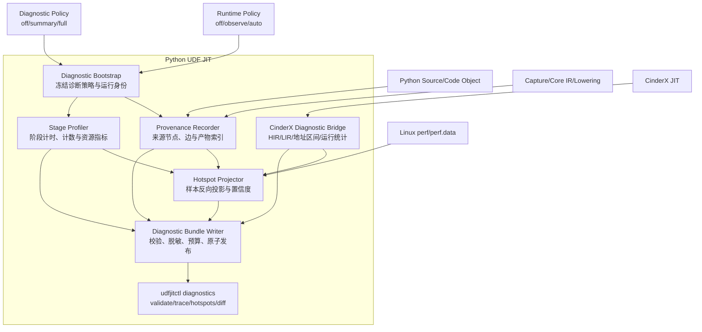
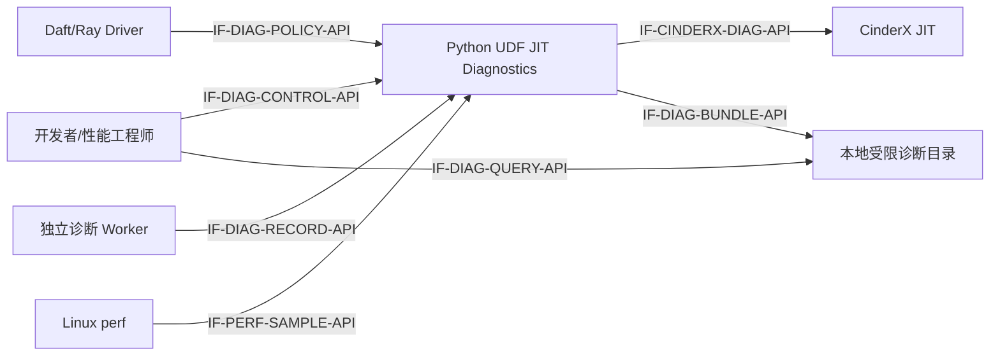
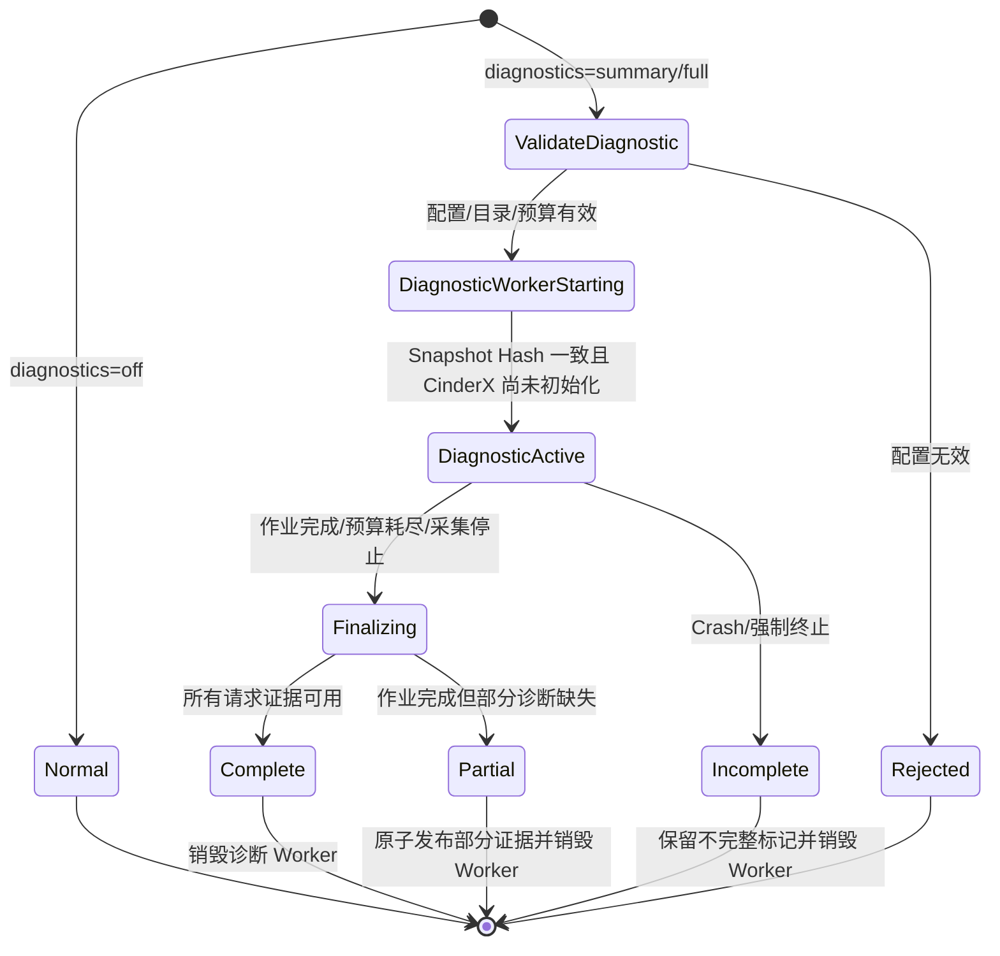
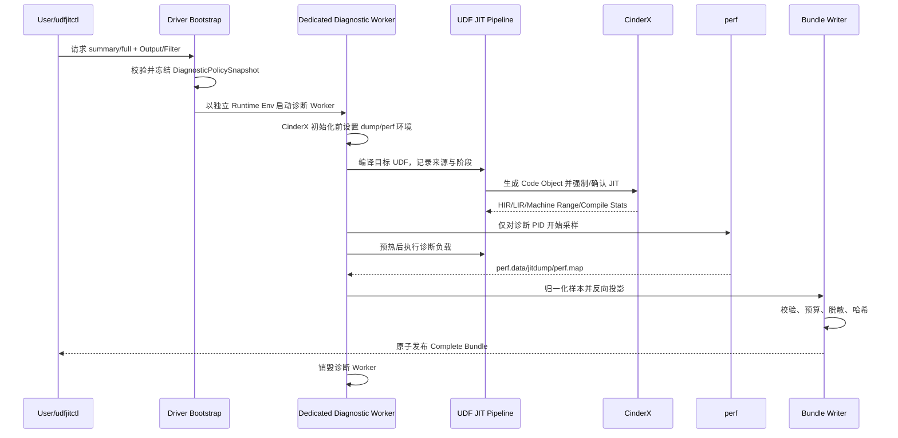

# RFC-013：端到端性能诊断与热点回溯

**状态：** Draft

**作者：** Python UDF JIT 项目组

**创建日期：** 2026-07-30

**更新日期：** 2026-07-30

**本次修订：** 初始提案；定义从 Python UDF 源码到机器码的来源映射、诊断制品、热点回溯以及正常/诊断运行隔离

**相关议题/合并请求：** 本地方案评审阶段，无外部议题或合并请求

**类别：** 主线横切诊断能力

**工作量估算：** 8～12 人周，另含 CinderX 侧小型诊断接口适配

**上游 RFC：** [RFC-003：语义 IR 编译](RFC-003-semantic-ir-compilation.md)、[RFC-006：标量 CinderX JIT](RFC-006-scalar-cinderx-jit.md)、[RFC-008：运行治理](RFC-008-runtime-governance.md)

---

# 0. 实现状态与本期边界

当前代码已经具备部分诊断基础：

- `SourceMapEntry` 保存原始 Bytecode Offset 与源码行列范围；
- Capture/CFG 保存 Bytecode Offset，Core IR 的 `SemanticOperation` 保存稳定 `operation_id`、`block_id`、`source_offset` 和 `python_region_id`；
- `SemanticRegion`、`PortableUdfArtifact`、`VariantKey` 和 Worker 进程标识可连接语义区域、制品、运行变体和进程实例；
- Worker `RuntimeEvent` 可记录阶段、决策、原因、Artifact/Variant/Code Hash 和 Task 归属；
- `PhysicalizationMetrics` 可记录复制、物化、装箱/拆箱、字节数和耗时；
- CinderX 可以输出 HIR、LIR、汇编、编译统计、deopt 统计，并通过 perf map/jitdump 让 Linux `perf` 识别 JIT 函数。

现有能力尚未形成完整链路：

1. 生成 AST/Code Object 的 Bytecode Offset 没有稳定映射回 Core IR Operation 和原始 Source Range；
2. CinderX 内部虽然保留 Bytecode → HIR → LIR → 汇编来源关系，但没有向本项目输出结构化的机器码地址区间来源表；
3. 现有运行事件主要回答“发生了什么”，不能可靠回答“时间消耗在哪里”；
4. CinderX perf 符号主要是函数级，无法直接回溯到 Semantic Operation、Region 和原始 Python 源码；
5. 尚无统一、可校验、可保留的诊断制品格式；
6. 尚无独立诊断开关，无法从契约上保证正常运行不承受 dump、计时、perf、序列化和文件 I/O 开销。

本 RFC 定义完整目标契约和分阶段实现路径。只有第 3.3.13 节的端到端验收全部通过后，才能将状态改为“已实现”。

# 1. 概述

## 1.1 简介

本提案建立一条从 Python UDF 源码到最终机器码的双向可追溯链路：

```text
Source Range
  -> 原始 CPython Bytecode Offset
  -> Capture/CFG Node
  -> Semantic Operation
  -> Semantic Region
  -> 生成 AST/Bytecode Offset
  -> CinderX HIR
  -> CinderX LIR
  -> Machine Code Address Range
  -> perf Sample
```

链路的核心不是在每个 IR 节点前后插入计时点，而是建立统一的 `ProvenanceMap`。机器码热点由 `perf` 采样，再按地址区间和来源集合逐层反向投影；编译期与 Python/C++ 包装层热点由低频阶段计时、计数器和事件定位。所有中间产物收敛到内容寻址的 `DiagnosticBundle`，既能给人阅读，也能被工具校验和聚合。

诊断能力与 `off/observe/auto` 运行模式正交。`UDFJIT_DIAGNOSTICS=off` 是默认且唯一的正常运行配置；`summary/full` 是显式诊断运行。Full 诊断必须使用独立作业和独立 Worker 进程，禁止在共享的正常 Worker 中热切换 CinderX dump 或 perf 能力。

## 1.2 动机

只看端到端耗时，无法区分慢在 Capture、Semantic Pass、Variant 排队、CinderX 编译、Guard、Physicalization、机器码、Deopt 还是 Python Continuation。只看 CinderX `perf`，又只能看到 JIT 函数或机器指令热点，不能回答热点对应哪个 UDF 源码表达式、Core IR Operation 或生成 Bytecode。

缺少完整来源链会导致以下问题：

- 编译回归只能靠逐层人工 dump 和猜测；
- 机器码热点不能反馈给中间层优化；
- Region 划分、装箱/物化、Guard 和 Side Exit 的成本无法统一排序；
- 非 JIT/回退路径无法与已编译路径使用同一归因口径；
- 不同运行产生的 HIR/LIR/汇编难以确认是否来自同一 Artifact/Variant；
- 为了定位问题临时打开全局 dump，容易污染正式性能数据或泄露源码信息。

本提案让诊断回答以下问题：

1. 某一行 Python UDF 最终生成了哪些 Bytecode、Core IR、HIR、LIR 和机器码？
2. 某个 perf 热地址来自哪个 Region/Operation/源码范围？
3. 某个 Core IR Operation 被融合、复制、删除或降级到了哪里？
4. 端到端时间主要消耗在编译、包装层、JIT 机器码还是 Python 回退？
5. 某次诊断结论能否用相同 Artifact、Variant、Worker 和环境指纹复现？

## 1.3 目标

### 1.3.1 目标

1. 定义覆盖源码、原始 Bytecode、Capture/CFG、Core IR、Region、生成 AST/Bytecode、HIR、LIR、机器码和 perf Sample 的统一来源模型。
2. 为每层产物提供可读格式、稳定标识、内容哈希和上下游定位方式。
3. 支持机器码热点向 HIR/LIR、生成 Bytecode、Semantic Operation、Region 和原始源码反向投影。
4. 支持编译期、Worker 包装层、JIT、解释回退四类热点使用同一报告入口。
5. 区分一对一、融合、复制、删除和合成节点，不伪造精确归因。
6. 定义独立诊断开关，保证正常运行不执行 IR dump、阶段计时、perf、诊断序列化或诊断文件 I/O。
7. Full 诊断使用独立 Worker 进程，隔离 CinderX 全局环境变量、JIT Code Cache、perf map/jitdump 和诊断文件。
8. 默认不记录业务值和源码正文；诊断输出具备最小权限、大小预算、保留周期和完整性校验。
9. 正式性能 A/B 与诊断运行物理分离，禁止把诊断运行耗时作为候选性能结论。
10. 在 Linux/CinderX 主线实现完整链路；在无 `perf` 平台保留编译期和包装层诊断。

### 1.3.2 非目标

- 不把 HIR、LIR、机器码或 perf 数据放入 `PortableUdfArtifact`。
- 不为每行数据或每次标量 Slot Load/Store 插入计时点。
- 不在正常运行中保留源码正文、业务常量、闭包值或输入数据样本。
- 不承诺诊断运行本身的端到端性能与正常运行等价。
- 不用诊断开关绕过 Guard、Verifier、预算、W^X、租户隔离或执行策略。
- 不把 `observe` 模式改造成诊断模式；`observe` 仍只控制捕获/影子编译/优化执行决策。
- 不在首期实现跨机器统一时钟的纳秒级因果追踪；跨进程使用 Run/Task/Process/Compile Instance 标识连接。
- 不对融合后机器指令的耗时做缺乏证据的任意均分。

# 2. 用例分析

## 2.1 用例与输出

| 用例 | 主要问题 | 必需输出 |
|---|---|---|
| 源码表达式变慢 | 某行代码落到了什么实现 | Source → Operation → HIR/LIR → Machine Range |
| CinderX 机器码热点 | perf 热地址属于哪个上层语义 | Sample → Machine Range → Origin Set → Source |
| 编译耗时变长 | 哪个阶段/Pass 变慢或膨胀 | 阶段耗时、Pass 前后节点数、IR Hash、Code Size |
| Region 划分不佳 | 切分、融合、Graph Break 是否引入开销 | Region Graph、边界原因、跨边界物化和调用次数 |
| Guard/Deopt 频繁 | 为什么没有稳定停留在机器码 | Guard/Deopt 原因、计数、源码/Bytecode Offset |
| Python 回退过热 | 哪些未编译代码占用 CPU | JIT Gate 结果、Continuation 时长、选择性 `sys.monitoring`/解释器 perf |
| Physicalization 过重 | 慢在数据转换还是算术 | copied/materialized/boxed/unboxed/bytes/elapsed |
| 两次运行对比 | 优化前后哪一层发生变化 | 两个 Bundle 的环境、IR、Pass、Code Size、Hotspot Diff |
| 正常生产运行 | 不需要深度诊断 | 不创建 Bundle，不打开 CinderX dump/perf，不增加热路径探针 |

## 2.2 功能要求

1. `udfjitctl diagnostics validate` 能校验 Bundle Schema、文件哈希、标识连接和地址区间合法性。
2. `udfjitctl diagnostics trace` 能从任意一个 Source/Bytecode/Operation/Region/HIR/LIR/Machine ID 正向或反向查询。
3. `udfjitctl diagnostics hotspots` 能按 source、operation、region、HIR、symbol 和 runtime phase 聚合。
4. `udfjitctl diagnostics diff` 能比较两个 Bundle 的中间产物与热点变化。
5. 产物缺失时报告 `unavailable` 及原因，不猜测或伪造映射。
6. 一个优化节点有多个来源时保留 `OriginSet`；一个来源被删除时保留 `elided` 关系及删除 Pass。
7. 合成的 Guard、Prologue、Epilogue、Refcount、Deopt Stub 和 Runtime Helper 使用明确的 `synthetic_kind`。

## 2.3 性能要求

### 2.3.1 正常运行

- 默认 `UDFJIT_DIAGNOSTICS=off`。
- 不调用 `perf_counter_ns()` 记录本 RFC 新增阶段，不构造 IR Snapshot，不进行诊断 JSON/文本序列化，不写诊断文件。
- 不设置 `PYTHONJITDUMP*`、`PYTHONJITLOGFILE`、`JIT_PERFMAP` 或 `JIT_DUMPDIR`。
- 不在逐行 UDF、Scalar Slot Load/Store 或机器码入口增加诊断回调。
- 允许在 Adapter/Compiler 生命周期外层进行一次冻结配置判断；热路径使用 `NoopDiagnosticSession` 或构造期绑定的无诊断实现。
- 同环境、同 Artifact、同工作负载的 `diagnostics=off` 相对未引入本 RFC 的基线，端到端中位数比必须 `>= 0.99`；若噪声低于 0.5%，目标为无统计显著回退。

### 2.3.2 Summary 诊断

- 只在编译阶段、批次边界、Variant 状态变化和 Continuation 边界记录计时/计数。
- 不输出源码、逐层 IR、汇编和 perf 数据。
- 运行时事件采用线程本地聚合或有界无阻塞队列；队列满时丢弃并记录 dropped count。

### 2.3.3 Full 诊断

- 允许编译 dump、来源表、选择性运行探针和 perf 采样。
- 诊断开销不用于性能资格结论；报告必须显式标记 `timing_scope=diagnostic_only`。
- perf 优先以采样方式工作，不在每条 IR/机器指令上插桩。
- 对 Python 回退的 instruction/line 监控只允许作用于命中的 UDF/Continuation，且支持采样和时间预算。

## 2.4 安全、隐私与 DFX 要求

- Bundle 根目录权限 `0700`，文件创建权限 `0600`。
- 默认 `source_text=omit`；只保存规范化 Source Identity、文件哈希和行列范围。
- 默认不保存业务值、对象 `repr`、闭包内容、Schema 明文字段、常量正文或输入样本。
- 所有列表、字符串、文件、节点和样本数量均有上限。
- 诊断失败不得改变 UDF 语义；但用户显式请求 Full 诊断而配置非法时，诊断作业必须在执行前失败，不能静默退回普通运行并声称已采集。
- Bundle 写入采用临时目录加原子完成标记；崩溃后保留 `incomplete` 状态，校验器不得把它当作完整证据。
- Linux `perf` 不可用时保留其余诊断，并将机器采样层标记为 `backend_unavailable`。

# 3. 方案设计

## 3.1 总体方案

### 3.1.1 架构图



逻辑元素清单：

| 元素 | 职责 |
|---|---|
| Diagnostic Bootstrap | 解析并冻结诊断配置，生成 Run/Session Identity，验证 Worker 一致性 |
| Provenance Recorder | 收集各层稳定标识、来源集合、变换关系和中间产物索引 |
| Stage Profiler | 收集编译、包装层、Physicalization、Continuation 等低频阶段指标 |
| CinderX Diagnostic Bridge | 复用 CinderX dump/统计并导出结构化 HIR/LIR/机器地址来源 |
| Hotspot Projector | 把 perf/运行样本映射到机器区间及各上层来源 |
| Diagnostic Bundle Writer | 安全、受限、内容寻址地写入诊断制品 |
| CLI | 校验、查询、聚合、对比和生成报告 |

### 3.1.2 上下文视图



### 3.1.3 正常运行与诊断运行隔离

`RuntimeMode` 和 `DiagnosticProfile` 是两个独立维度：

| 运行模式 | 诊断模式 | 行为 |
|---|---|---|
| `off/observe/auto` | `off` | 正常运行；不创建本 RFC 诊断产物 |
| `off` | `summary/full` | 诊断原始/解释路径，不会因为诊断而启用 JIT |
| `observe` | `summary/full` | 诊断捕获或影子编译，不执行优化结果 |
| `auto` | `summary/full` | 诊断完整编译和优化执行链 |

诊断配置：

```text
UDFJIT_DIAGNOSTICS=off|summary|full       # 默认 off，主开关
UDFJIT_DIAGNOSTIC_DIR=/absolute/path      # summary/full 必填
UDFJIT_DIAGNOSTIC_FILTER=<selector>       # UDF/Artifact/Region 白名单
UDFJIT_DIAGNOSTIC_SOURCE=ranges|text      # 默认 ranges；范围身份不可关闭
UDFJIT_DIAGNOSTIC_PERF=off|record         # 仅 full 有效
UDFJIT_DIAGNOSTIC_SAMPLE_RATE=<0..1>      # 运行探针采样率
UDFJIT_DIAGNOSTIC_MAX_BYTES=<bounded>     # Bundle 上限
```

隔离规则：

1. 配置只在 Driver/Worker 启动时读取一次，转换为不可变 `DiagnosticPolicySnapshot`。
2. Snapshot Hash 随 Carrier/Worker Context 传递；Driver 与 Worker 不一致时拒绝诊断会话。
3. `off` 绑定 `NoopDiagnosticSession`；编译器和 Worker 不创建真实 Recorder/Profiler。
4. `summary` 不设置任何 CinderX dump/perf 环境变量。
5. `full` 只能在专用诊断作业、专用 Ray Runtime Env 和新 Worker 进程中运行。
6. `PYTHONJITDUMP*`、`PYTHONJITLOGFILE`、`JIT_PERFMAP`、`JIT_DUMPDIR` 必须在 CinderX 初始化前由诊断 Worker Bootstrap 设置，禁止运行期修改。
7. 诊断 Worker 不与正常 Worker 共享进程内 VariantManager、JIT Code Cache、负缓存或 Bundle 目录。
8. 一个进程只允许一个不可变的 Diagnostic Session；结束后销毁进程，不恢复成正常 Worker。
9. 正式性能 A/B 使用 `diagnostics=off`；需要解释 A/B 结果时，另起相同输入和环境的诊断作业。

RFC-008 已有的无业务值 `RuntimeEvent`、`GovernanceEvent` 和发布门禁遥测属于生产治理契约，不由本 RFC 的深度诊断开关删除；它们继续遵守既有的有界、非阻塞和开销门槛。本开关隔离的是来源图、阶段 Profile、IR/HIR/LIR/汇编 dump、perf 和 Diagnostic Bundle。`diagnostics=off` 不增加本 RFC 的新计时、序列化和文件 I/O。

状态机：



## 3.2 技术选型

| 方案 | 优点 | 缺点 | 结论 |
|---|---|---|---|
| 统一 ProvenanceMap + perf 采样反投影 | 热路径侵入低；能连接所有层；支持融合/删除 | 需要维护结构化来源边 | 采用 |
| 每个 IR Operation 前后插入计时 | 实现直观 | 严重扰动小 UDF；优化后节点不再对应；无法解释机器指令 | 不采用 |
| 只保留文本 dump，事后按名称/Offset 猜测 | CinderX 改动少 | 格式脆弱；同名函数、Pass 改写和地址重定位会失配 | 仅作人读辅助，不作为证据主键 |
| 解析 CinderX annotated asm 文本生成地址表 | 可快速原型 | 文本格式不是稳定接口；丢失被删除/复制来源 | P0 原型可用，正式实现不采用 |
| CinderX 导出结构化 HIR/LIR/Machine Range | 精确、可版本化、可校验 | 需要维护小型 CinderX Patch | 正式实现采用 |
| 把机器码/HIR 放入 Portable Artifact | 单文件携带 | 不可移植、扩大攻击面、污染 Artifact Hash | 不采用 |
| 在共享 Worker 热开关 dump/perf | 节省进程 | CinderX 配置是进程级；污染正常 Code Cache 和性能数据 | 禁止 |
| 独立诊断作业/Worker | 隔离清晰、可复现 | 需要额外资源和一次复跑 | Full 诊断强制采用 |

## 3.3 功能与性能设计

### 3.3.1 标识模型

标识分三类，禁止用可读名称代替身份：

| 层级 | 标识 | 稳定范围 |
|---|---|---|
| 逻辑身份 | `source_unit_id`、`artifact_hash`、`semantic_hash`、`operation_id`、`region_id` | 相同源码/Artifact/语义内容 |
| 运行变体 | 现有 `VariantKey.sha256` | Artifact、Schema、Fallback、ABI、CPU、Policy 的组合 |
| 编译实例 | `compile_instance_id = hash(variant_key, run_id, process_generation, attempt)` | 某 Worker 某次真实编译 |

各层节点建议使用以下规范 ID：

```text
source:<source_identity_hash>:<start_line>:<start_col>:<end_line>:<end_col>
pybc:<code_hash>:<offset>
capture:<capture_hash>:<node_id>
core:<semantic_hash>:<operation_id>
region:<semantic_hash>:<region_id>
genbc:<generated_code_hash>:<offset>
hir:<compile_instance_id>:<instruction_id>
lir:<compile_instance_id>:<instruction_id>
machine:<compile_instance_id>:<start_address>:<end_address>
sample:<diagnostic_run_id>:<sample_id>
```

HIR/LIR ID 只在 Compile Instance 内稳定；不能跨编译实例直接比较。跨运行比较必须先连接相同 `VariantKey` 或按结构指纹进行显式 Diff。

### 3.3.2 来源数据模型

优化会融合、复制、删除和合成节点，因此来源关系使用集合而不是单父指针：

```text
ProvenanceNode {
  node_id,
  layer,
  kind,
  compile_instance_id?,
  artifact_ref?,
  source_range?,
  bytecode_offset?,
  attributes
}

ProvenanceEdge {
  from_node_id,
  to_node_id,
  relation:
    derived | fused | cloned | lowered | elided | synthetic,
  pass_name?,
  reason_code?,
  ordinal?
}

MachineRange {
  compile_instance_id,
  start_address,
  end_address,
  symbol,
  origin_set: NodeId[],
  synthetic_kind?
}
```

不变量：

- 地址区间使用半开区间 `[start, end)`，同一 Code Block 内不得非法重叠；
- `origin_set` 允许为空，但必须提供 `synthetic_kind`；
- `fused` 节点的样本归为一个共享来源集合，不对上层 Operation 任意均分；
- `elided` 节点没有机器地址，但保留删除 Pass 和替代节点；
- `cloned` 节点的多个目标都可回溯到同一来源；
- 所有跨文件引用必须能由 Bundle Manifest 解析，不能依赖进程指针。

### 3.3.3 转换链路与采集点

```mermaid
flowchart LR
    SRC["Python Source Range"] --> PBC["Original CPython Bytecode"]
    PBC --> CFG["Decoded Bytecode + CFG/Capture"]
    CFG --> CORE["Semantic Core IR"]
    CORE --> REGION["Semantic Region Graph"]
    REGION --> AST["Generated AST"]
    AST --> GBC["Generated CPython Bytecode"]
    GBC --> HIR0["Initial CinderX HIR"]
    HIR0 --> HIRN["HIR Pass Snapshots/Final HIR"]
    HIRN --> LIR["LIR + Register Allocation"]
    LIR --> ASM["Annotated Assembly"]
    ASM --> RANGE["Machine Address Range"]
    RANGE --> PERF["perf Samples"]

    PERF -. "reverse project" .-> RANGE
    RANGE -.-> LIR
    LIR -.-> HIRN
    HIRN -.-> GBC
    GBC -.-> REGION
    REGION -.-> CORE
    CORE -.-> PBC
    PBC -.-> SRC
```



采集要求：

| 转换边 | 采集方式 |
|---|---|
| Source → 原始 Bytecode | 复用 `SourceMapEntry`，保留完整行列范围和 Code Hash |
| 原始 Bytecode → Capture/CFG | 复用 Instruction Offset，补齐稳定 Capture Node ID |
| Capture/CFG → Core IR | 每个 `SemanticOperation.source_offset` 必填；Python Region 同样记录来源范围 |
| Core IR → Region | 复用 `operation_ids`，显式记录 Region 边界与拒绝原因 |
| Region → 生成 AST | AST 节点携带 `origin_set`，生成稳定 `lowering_node_id` |
| 生成 AST → 生成 Bytecode | 编译后按 AST Location/Lowering Marker 建立 Generated Bytecode Offset Map |
| 生成 Bytecode → HIR | 复用 CinderX HIR `bytecodeOffset`/FrameState，并绑定 Generated Code Hash |
| HIR → LIR | 复用 LIR 的 HIR Origin，导出结构化关系 |
| LIR → Machine Range | Codegen Label/Annotation 导出 `[start,end)` 与 Origin Set |
| Machine Range → perf | 由 `compile_instance_id`、PID、Code Load 和地址采样连接 |

### 3.3.4 可读中间产物

Full Bundle 至少包含：

```text
diagnostic-bundle/
  manifest.json
  source/
    identity.json
    ranges.json
    source.py                 # 仅 source=text 且授权时
  bytecode/
    original.json
    original.dis
    generated.json
    generated.dis
  capture/
    capture.json
    cfg.json
    cfg.dot
  semantic/
    core.initial.json
    core.final.json
    core.final.txt
    regions.json
    regions.dot
  lowering/
    generated_ast.txt
    lowering-map.json
  cinderx/
    hir.initial.txt
    hir.passes/
    hir.final.txt
    lir.txt
    lir-origin.json
    asm.annotated.txt
    machine-ranges.json
    compile-stats.json
    runtime-stats.json
  perf/
    perf.data
    jit.dump
    perf.map
    samples.json
  provenance/
    nodes.json
    edges.json
  reports/
    stages.json
    hotspots.json
    summary.md
  COMPLETE
```

| 产物 | 人读格式 | 机器格式 | 定位主键 |
|---|---|---|---|
| 原始/生成 Bytecode | `.dis` | JSON | Code Hash + Offset |
| CFG/Capture | DOT | JSON | Capture Hash + Node ID |
| Core IR | Canonical Text | JSON | Semantic Hash + Operation ID |
| Region Graph | DOT | JSON | Semantic Hash + Region ID |
| AST/Lowering | AST Text | JSON Map | Lowering Node ID |
| HIR | CinderX Text | Provenance Edge | Compile Instance + HIR ID |
| LIR | CinderX Text | Origin JSON | Compile Instance + LIR ID |
| 汇编 | Annotated ASM | Machine Range JSON | Compile Instance + Address Range |
| perf | perf report/script | Normalized Samples JSON | Run + PID + IP |

文本产物只用于阅读，JSON/Hash/ID 才是自动连接的证据。

### 3.3.5 Diagnostic Bundle Manifest

```text
DiagnosticBundleManifest {
  schema_version,
  status: complete | partial | incomplete,
  run_kind: diagnostic,
  diagnostic_profile: summary | full,
  runtime_mode: off | observe | auto,
  diagnostic_policy_hash,
  run_id,
  process_key,
  compile_instances[],
  environment_fingerprint,
  artifact_hashes[],
  variant_keys[],
  redaction_policy,
  timing_scope: diagnostic_only,
  artifacts: [
    { path, media_type, layer, sha256, byte_size, optional, unavailable_reason? }
  ],
  limits,
  dropped_counts,
  created_ns,
  finalized_ns
}
```

Bundle 与 `PortableUdfArtifact` 分离：

- Bundle 可以包含目标相关的 HIR/LIR/机器码/perf；
- Bundle 不参与 Artifact/Variant 语义哈希；
- Bundle 不进入正常 Artifact Cache；
- Bundle 不能作为可执行输入重新映射机器码；
- `udfjitctl diagnostics validate` 只读解析，不执行 Bundle 内容。

### 3.3.6 编译期热点

编译期使用显式阶段计时，不依赖 perf 猜测：

```text
decode
cfg_build
capture_import
semantic_verify_initial
semantic_pass:<pass_name>
region_formation
artifact_encode
artifact_load
artifact_reverify
physicalize
variant_lookup
compile_queue_wait
generated_ast
python_compile
cinderx_frontend
cinderx_hir_pass:<pass_name>
cinderx_lir
register_allocation
codegen
code_publish
```

每个阶段记录：

- wall duration、可选 thread CPU duration；
- 输入/输出节点数、基本块数和字节数；
- IR Hash；
- 新增/删除/复制节点数；
- 来源覆盖率；
- Code Size、Stack/Spill Size；
- 预算命中和拒绝原因。

CinderX 侧复用 per-pass timer、`get_compilation_time`、`get_function_compilation_time`、Code/Stack/Spill Size 和现有统计；正式接口需要按 `compile_instance_id` 返回结构化数据。

### 3.3.7 Worker 中间层热点

Worker 只在 Summary/Full 诊断中记录以下外层阶段的排他时间：

```text
adapter_entry
artifact_load_and_reverify
outer_guard
variant_lookup
compile_queue_wait
compile
physicalize
native_call
continuation_or_fallback
deopt_resume
result_publish
adapter_exit
```

同时输出：

- 调用次数、总耗时、中位数、P95/P99；
- Guard Hit/Miss；
- Variant Hit/Miss/Compile/Negative Cache；
- Deopt/Side Exit/Continuation 次数和原因；
- `PhysicalizationMetrics` 的 copied/materialized/boxed/unboxed/bytes/elapsed；
- Code Cache、Compile Queue 和预算水位。

禁止在每个标量 Slot Load/Store 上调用 Python 计时器。频繁事件先写线程本地计数器，在批次/安全点聚合。

### 3.3.8 JIT 机器码热点

Full 诊断的主路径：

```text
perf IP Sample
  -> PID/Code Load 定位 Compile Instance
  -> MachineRange[start,end)
  -> LIR Origin
  -> HIR Origin
  -> Generated Bytecode Offset
  -> Semantic Operation/Region
  -> Original Bytecode Offset
  -> Source Range
```

CinderX 适配要求：

1. 生成函数名包含短身份，例如 `__CINDER_JIT:udfjit_<variant12>_<region>`；
2. 导出 HIR ID、Bytecode Offset、LIR ID、机器地址区间及 Origin Set；
3. 保留 annotated asm 供人读；
4. perf jitdump 写入 Code Load；条件允许时补充 `JIT_CODE_DEBUG_INFO`，将机器地址关联到生成源码/Bytecode 位置；
5. 所有输出携带 PID、Process Generation、Compile Instance 和 Code Hash。

热点聚合提供三种口径：

- `exclusive_machine`：每个机器地址样本只计一次，是总量闭合口径；
- `inclusive_origin`：一个共享机器区间可出现在多个来源查询结果中，不能求和；
- `unattributed`：地址落在未知、Runtime Helper 或来源缺失区间，单独报告。

报告必须给出覆盖率：

```text
machine_sample_coverage =
  attributed_machine_samples / all_jit_machine_samples

source_sample_coverage =
  samples_with_source_range / all_jit_machine_samples
```

首期验收要求 machine coverage `>= 0.95`、source coverage `>= 0.90`；其余样本必须有有限原因码。

### 3.3.9 非 JIT 与 Python 回退热点

分析顺序固定：

1. 先确认目标 UDF 是否进入 CinderX JIT Gate；
2. 已 JIT 的函数走 HIR/LIR/Machine Range；
3. 未 JIT或进入 Continuation 的函数走解释路径诊断。

解释路径信号：

- JIT Gate 拒绝原因与次数；
- Worker `continuation_or_fallback` 排他耗时；
- CinderX `get_and_clear_runtime_stats` 的 filename、qualname、line、Bytecode Offset、opcode、deopt reason/count；
- Linux perf 的解释器/Runtime Helper 函数级热点；
- Full 诊断中对目标 UDF 使用 `sys.monitoring` 的 line/branch/instruction 事件。

`sys.monitoring` 必须：

- 只注册目标 Code Object；
- 默认 line/branch，instruction 需单独显式开启；
- 受采样率、持续时间和事件预算限制；
- 不在 Summary 或正常运行启用；
- 报告自身丢样和估算扰动。

回退优化机会可按以下指标排序，但不得当作精确收益预测：

```text
opportunity_score =
  fallback_call_count
  * fallback_mean_exclusive_ns
  * estimated_compilable_ratio
```

### 3.3.10 热点报告

`reports/hotspots.json` 和 `summary.md` 至少包含：

| 排名域 | 关键字段 |
|---|---|
| 编译阶段 | stage/pass、total/median/P95、节点增量、IR Hash |
| Worker 阶段 | phase、exclusive total、calls、bytes/counts |
| Region | region_id、exclusive samples、continuation/deopt、source ranges |
| Operation | operation_id、kind、origin relation、samples、source range |
| HIR/LIR | instruction ID/opcode、samples、generated Bytecode Offset |
| Machine | symbol、address range、asm、samples、synthetic kind |
| Python 回退 | code identity、line/offset、event count、exclusive duration |

每条结论包含：

- `evidence_refs`：Bundle 内文件和节点 ID；
- `confidence`：exact/range/shared/heuristic/unavailable；
- `run_scope`：Run、Worker、Variant、Compile Instance；
- `timing_scope=diagnostic_only`；
- 有限 `reason_code`。

### 3.3.11 诊断运行流程



采样时序要求：

- 编译诊断：不启动 perf 或单独标记 `phase=compile`；
- 运行热点：先完成目标 Variant 编译和预热，再启动 perf；
- 若需要同时分析编译和运行，生成两个明确 Phase，禁止混合成一个热点排序；
- Dump 运行和正式性能 A/B 是不同 Run ID。

### 3.3.12 分阶段实现

| 阶段 | 范围 | 完成判据 |
|---|---|---|
| P0 隔离契约 | DiagnosticPolicy、Noop Session、独立 Worker、Bundle Manifest | 默认 off 无文件/环境变量/新计时；非法 Full 配置启动前失败 |
| P1 上半链路 | Source → 原始 Bytecode → CFG/Capture → Core/Region → 生成 Bytecode | 任意 Operation 可双向定位到源码和生成 Offset；Golden Test 覆盖融合/删除/复制 |
| P2 CinderX 结构化来源 | Generated Bytecode → HIR → LIR → Machine Range | 地址区间、Origin Set、Compile Instance 可校验；Annotated ASM 与 JSON 一致 |
| P3 热点回溯 | perf Sample → Machine → Source；编译/Worker/Python 回退热点 | coverage 达标；CLI 可 trace/hotspots/diff |
| P4 生产化 | 预算、脱敏、清理、崩溃恢复、3.11.6 资格 | 权限/保留/上限/不完整 Bundle/跨版本门禁全部通过 |

### 3.3.13 验收标准

#### 功能验收

1. 使用包含算术、分支、Nullable、Graph Break、Continuation 和 Deopt 的固定 UDF 集。
2. 每个源码范围能查询原始 Bytecode、Core Operation、Region 和生成 Bytecode。
3. 每个 JIT Machine Range 能查询 LIR/HIR/Generated Bytecode；非 Synthetic Range 能继续查询 Core/Source。
4. DCE、融合、克隆、内联和合成节点均有正确 Relation，不产生断链或伪一对一。
5. `validate` 能拒绝哈希错误、非法地址区间、悬空边、越界 Offset、重复 Compile ID 和路径穿越。
6. `diff` 能在同一 Variant 的两次编译间显示 Pass、IR、Code Size 和热点差异。

#### 隔离验收

1. 未设置 `UDFJIT_DIAGNOSTICS` 时解析为 `off`。
2. `off` 不创建 Diagnostic Directory/Bundle，不设置 CinderX dump/perf 环境变量。
3. `off` 的编译与逐行执行路径不调用本 RFC 新增计时器和 Recorder。
4. Full 诊断与正常运行 PID、Process Generation、VariantManager、Code Cache 和输出目录不同。
5. 共享正常 Worker 中请求 Full 诊断必须拒绝，不能热切换。
6. 正式 A/B 报告若检测到 `diagnostic_profile != off` 必须拒绝生成性能资格结论。

#### 性能验收

1. `diagnostics=off` 端到端中位数比 `>= 0.99`。
2. Machine Sample Attribution Coverage `>= 0.95`。
3. Source Sample Attribution Coverage `>= 0.90`。
4. `exclusive_machine + unattributed` 样本数与全部目标 JIT 样本数闭合。
5. Summary 队列/预算耗尽时不阻塞 UDF，Dropped Count 可见。

#### 安全与可靠性验收

1. 目录 `0700`、文件 `0600`，Symlink/Path Traversal 拒绝。
2. 默认 Bundle 不含源码正文、业务值、对象 `repr` 和闭包内容。
3. 达到大小/事件/持续时间预算后停止采集并安全 Finalize，执行语义不变。
4. Worker Crash 产生 `incomplete` Bundle；CLI 不得输出“完整证据”结论。
5. CinderX/perf/文件后端故障不改变 UDF 结果、异常类型和顺序。

## 3.4 安全隐私与 DFX 设计

### 3.4.1 安全

- Output Root 必须是显式绝对路径，不能是 `/`、Home、Workspace Root 或共享 Artifact Cache。
- 使用安全创建和目录内相对路径；拒绝 `..`、绝对子路径、Symlink 和 Hardlink 替换。
- 先写随机临时目录，文件逐个 Hash，最后原子写 Manifest 和 `COMPLETE`。
- Bundle Reader 设置 JSON 深度、节点数、字符串长度、文件大小、总大小和地址区间数量上限。
- CinderX 输出通过受控文件描述符/目录写入，不接受 UDF 提供路径。
- CLI 默认只读，不加载 Code Object、不 `marshal.loads` 任意内容、不执行机器码。

### 3.4.2 隐私

| 数据 | 默认 | 可选 |
|---|---|---|
| Source Identity/Hash | 保存 | 不可关闭，作为定位主键 |
| Source Range | 保存 | 可脱敏文件名 |
| Source Text | 不保存 | `source=text` 且本地授权 |
| 常量 | 只保存类型/Hash | 不支持明文业务常量 |
| Schema 字段 | Hash/逻辑 ID | 受控白名单可读名 |
| 输入/输出值 | 不保存 | 本 RFC 不提供开启方式 |
| Closure/Global | 只保存身份和类型摘要 | 本 RFC 不提供明文 |

### 3.4.3 可靠性

- Recorder/Profiler/Writer 错误转为有限诊断原因码，不能传播为业务异常。
- 显式请求诊断但启动条件不满足时，在业务执行前失败，以免产生虚假“已诊断”结果。
- 运行中采集失败时继续业务执行并生成 `incomplete`/`partial` 证据。
- Process Generation 防止 PID 复用导致 perf Sample 连接错误。
- Code Load/Unload 与 Machine Range 生命周期显式记录，避免地址复用污染。

### 3.4.4 可维护性

- Provenance Schema、Bundle Schema 和 CinderX Bridge ABI 分别版本化。
- 人读 Printer 与机器数据分离，文本格式变化不影响自动定位。
- 每个新增 IR/Pass/HIR/LIR 节点必须声明来源传播规则。
- 每个来源断点都有有限原因码和覆盖率指标。
- CinderX Patch 只暴露只读诊断数据，不把本项目对象引入 CinderX 核心 IR。

### 3.4.5 可测试性

- Source/Bytecode/Core/Region/Generated Bytecode 使用 Golden + Round-trip Test。
- HIR/LIR/Machine Range 使用固定小函数与地址区间不变量测试。
- perf Normalizer 使用录制的小型 fixture，不要求所有单元测试具备 perf 权限。
- 独立系统测试验证真实诊断 Worker、CinderX dump、jitdump、perf Sample 和 CLI 回溯。
- 正常运行测试对 Noop Session 使用 spy/计数器证明未进入诊断实现。

### 3.4.6 兼容性

- Linux + CinderX 提供完整链路。
- Linux 无 perf 权限时，保留中间产物、Machine Range 和阶段热点，perf 层为 unavailable。
- 非 Linux 平台不承诺机器采样，但 Bundle/Provenance/Compile/Worker 诊断格式一致。
- Python/CinderX SOABI、CinderX Commit、Bridge ABI 和 CPU Feature 写入环境指纹；不兼容 Bundle 只能阅读，不能跨环境声称机器码等价。

## 3.5 编程与调用设计

### 3.5.1 编程模型基本设计

**开发环境设计：**

- Python UDF JIT Wheel、锁定 CinderX Build/Patch、Linux perf、Daft/Ray 专用诊断 Runtime Env；
- `udfjitctl diagnostics` 提供 Bundle 校验和查询；
- CinderX 原始 dump 只作为 Bundle 的人读附件。

**开发约束：**

- Full 诊断必须新建专用 Worker 进程；
- Diagnostic Snapshot 启动后不可热更新；
- Filter 必须至少限定 UDF、Artifact 或 Region，禁止无预算地 dump 整个共享 Worker；
- 正式性能 A/B 必须使用 `diagnostics=off`；
- Bundle 不得作为可执行制品。

**可验收设计：**

- 使用第 3.3.13 节的功能、隔离、性能、安全和可靠性门禁；
- 真实 Worker 命令必须记录在 Bundle Manifest；
- perf 运行必须记录 Kernel/perf 版本、采样事件、频率和 PID Scope；
- Dump 与正式跑分分别执行。

### 3.5.2 接口定义与设计

#### 3.5.2.1 `IF-DIAG-POLICY-API`

接口描述：解析、验证并冻结诊断策略。

接口原型：

```text
resolve_diagnostic_policy(environment, runtime_context)
  -> DiagnosticPolicySnapshot
```

| 参数名称 | 输入/输出 | 类型 | 描述 | 取值范围 |
|---|---|---|---|---|
| `environment` | 输入 | Mapping | 启动时环境 | 只读 |
| `runtime_context` | 输入 | RuntimeContext | Run/Worker/Policy 身份 | 已验证 |
| `profile` | 输出 | Enum | 诊断级别 | off/summary/full |
| `output_root` | 输出 | Path? | Bundle 根目录 | summary/full 为安全绝对路径 |
| `filter` | 输出 | Selector | 目标白名单 | 有限、可序列化 |
| `limits` | 输出 | LimitSet | 字节/事件/持续时间/采样预算 | 正整数且有上限 |
| `sha256` | 输出 | SHA-256 | Snapshot 身份 | 传递到 Worker |

- 异常处理：`off` 返回 Noop Policy；显式 summary/full 的非法配置返回 `diagnostics_configuration_invalid`。
- 约束说明：只在启动时调用，不支持热更新。
- 变更说明：新增接口。

#### 3.5.2.2 `IF-DIAG-RECORD-API`

接口描述：编译器和 Worker 向当前诊断会话提交低频阶段、来源和产物。

接口原型：

```text
DiagnosticSession {
  span(stage, identity) -> ContextManager
  record_metric(name, value, identity) -> bool
  record_nodes(nodes) -> bool
  record_edges(edges) -> bool
  record_artifact(kind, producer) -> ArtifactRef?
  finalize(status) -> BundleRef?
}
```

`NoopDiagnosticSession` 的方法必须在构造期绑定为空实现；调用方不得在逐行热路径反复读取环境变量。

- 异常处理：记录失败返回 false/partial，不改变 UDF 语义。
- 约束说明：真实 Session 仅存在于 summary/full。
- 变更说明：新增接口。

#### 3.5.2.3 `IF-CINDERX-DIAG-API`

接口描述：按 Compile Instance 导出 CinderX 编译与机器码来源。

接口原型：

```text
get_udfjit_compilation_diagnostics(function, compile_instance_id)
  -> {
       jit_compiled,
       generated_code_hash,
       pass_timings,
       hir_nodes,
       lir_nodes,
       provenance_edges,
       machine_ranges,
       code_size,
       stack_size,
       spill_size,
       deopt_metadata
     }
```

输入/输出：

| 参数名称 | 输入/输出 | 类型 | 描述 | 取值范围 |
|---|---|---|---|---|
| `function` | 输入 | Function | 已生成并请求编译的目标 | 当前进程对象 |
| `compile_instance_id` | 输入 | String | 编译实例身份 | 非空、格式合法 |
| `machine_ranges` | 输出 | Range[] | 地址和来源集合 | 当前 Code Block 内合法 |
| `pass_timings` | 输出 | Timing[] | CinderX 编译阶段 | 单调时钟、非负 |
| `deopt_metadata` | 输出 | Record[] | Offset/Line/Reason | 不含业务值 |

- 异常处理：未编译返回 `jit_compiled=false` 和 JIT Gate 原因；接口失败不影响函数执行。
- 约束说明：只读诊断接口，只在 Full 诊断请求结构化节点/地址。
- 变更说明：需要锁定 CinderX Patch/Bridge ABI。

#### 3.5.2.4 `IF-DIAG-BUNDLE-API`

接口描述：安全写入并校验内容寻址的 Bundle。

接口原型：

```text
open_bundle(policy, run_context) -> BundleWriter
BundleWriter.add(path, media_type, payload, metadata) -> ArtifactRef
BundleWriter.complete(summary) -> BundleRef
BundleWriter.abort(reason) -> BundleRef
```

- 异常处理：预算超限停止新增内容并输出 partial/incomplete；路径或权限错误在诊断启动前拒绝。
- 约束说明：临时目录、最小权限、原子完成标记。
- 变更说明：新增接口。

#### 3.5.2.5 `IF-DIAG-QUERY-API`

接口描述：只读校验、追踪、热点聚合和 Diff。

接口原型：

```text
udfjitctl diagnostics validate <bundle>
udfjitctl diagnostics trace <bundle> --id <node-id> [--direction both]
udfjitctl diagnostics hotspots <bundle> --group-by source|operation|region|hir|symbol|phase
udfjitctl diagnostics diff <bundle-a> <bundle-b>
```

返回参数：

| 参数名称 | 类型 | 描述 | 取值范围 |
|---|---|---|---|
| `status` | Enum | valid/invalid/incomplete | 有限值 |
| `results` | JSON | 查询结果 | 受输出上限 |
| `evidence_refs` | String[] | Bundle 内证据 | 不允许路径逃逸 |
| `coverage` | Number | 归因覆盖率 | 0～1 |

- 异常处理：无效 Bundle 返回非零退出码和有限原因码。
- 约束说明：不执行 Bundle 内容。
- 变更说明：在现有 `udfjitctl` 下新增 `diagnostics` 子命令。

### 3.5.3 编程手册设计

在 [用户指南](../USERGUIDE.md) 增加“性能诊断”章节，至少覆盖：

1. 正常运行与诊断运行的区别；
2. `UDFJIT_DIAGNOSTICS`、输出目录、Filter、Source Policy、Perf 和预算；
3. 如何启动独立诊断作业/Worker；
4. 如何确认目标 UDF 进入 CinderX JIT；
5. 如何用 `validate/trace/hotspots/diff`；
6. 如何解释 shared/unattributed/unavailable；
7. 如何安全清理 Bundle；
8. 为什么诊断运行不能作为正式性能 A/B。

# 4. 缺点和风险

| 风险 | 影响 | 应对 |
|---|---|---|
| 来源图增加实现复杂度 | 每个 Pass/Lowering 都要传播 Origin | 统一 Schema、默认继承规则、Verifier、覆盖率门禁 |
| CinderX Patch 漂移 | 升级后地址/Origin 接口失效 | Bridge ABI、锁定 Commit、Patch 测试、兼容门禁 |
| Full 诊断开销大 | 运行时间和磁盘显著增加 | 独立运行、Filter、预算、采样、与正式 A/B 分离 |
| 文本 dump 过大 | 磁盘/解析压力 | 文本可选、JSON 主链、单文件/总量上限 |
| Source/Schema 泄露 | 敏感业务逻辑暴露 | 默认 omit/hash、显式授权、0700/0600、保留周期 |
| perf 权限/平台不可用 | 缺少机器样本 | 明确 unavailable；保留 Machine Range、阶段与解释路径诊断 |
| 融合指令无法唯一归因 | 上层热点可能重复 | exclusive/inclusive 分离、Origin Set、禁止任意均分 |
| 地址复用 | 样本连接到错误机器码 | Process Generation、Code Load/Unload、Compile Instance、时间窗口 |
| 诊断误开污染生产 | 正常运行性能和文件系统受影响 | 默认 off、启动冻结、Full 独立 Worker、正式 A/B 门禁 |
| 诊断后端故障 | 影响业务语义 | Best-effort 记录、partial/incomplete、业务结果优先 |
| 新 API/Schema 兼容 | 旧 Bundle 无法完整分析 | 显式版本、只读迁移器；未知版本拒绝自动结论 |

# 5. 现有技术

- CinderX 已提供 HIR/LIR/汇编 dump、编译统计、deopt 运行统计、perf map 和 jitdump；本提案补充 UDF JIT 的稳定身份和跨层结构化来源。
- Linux perf jitdump 使用 Code Load 让采样器识别动态代码；本提案进一步要求按 Compile Instance 保存机器地址区间及上层 Origin。
- LLVM/MLIR 的 Debug Location、DILocation/Location Fusion 和 Optimization Remark 表明优化后来源应是集合或链，而不是单个源码行。
- JVM JIT 的 JITWatch、perf-map-agent 和 async-profiler 展示了动态机器码到语言级方法/源码的映射方式；本提案额外连接 Capture/Core IR/Region/Generated Bytecode。
- `torch.compile`/Dynamo 的 Graph Break、Explain 和分层 IR dump 展示了将编译决策与运行热点结合的必要性；本提案要求这些信息使用同一 Variant/Compile Instance 身份闭环。

与上述方案的主要差异是：本系统有一层独立于 CPython/CinderX 的 Semantic Core IR 和 Region Graph，因此必须把机器样本继续回溯到 Data-aware Operation/Region，而不能停留在 Python 函数或生成 Bytecode。

# 6. 未解决问题

1. CinderX 结构化接口最终采用 Python API、C++ Callback 还是 Bundle Writer Callback，需要在 P2 详细设计前确定；本 RFC 要求输出语义不变。
2. `JIT_CODE_DEBUG_INFO` 在目标 perf 版本上的兼容范围需要用锁定实验环境验证；即使不可用，`machine-ranges.json` 仍是必需主链。
3. Python 3.11.6 目标分支的 HIR/LIR Origin 与 Codegen Annotation 能力需要在 CinderX 适配完成后重新资格验证。
4. 集群长期保存 Bundle 的对象存储/加密/审计集成不在本期运行依赖内；首期只允许本地受限目录并由外部流程受控上传。

以上问题不改变正常/诊断隔离、ProvenanceMap、Bundle 和热点回溯的核心方案，但必须在对应阶段进入实现前关闭。

---

## 附录 A：参考资料

- [RFC-003：语义 IR 编译](RFC-003-semantic-ir-compilation.md)
- [RFC-006：标量 CinderX JIT](RFC-006-scalar-cinderx-jit.md)
- [RFC-008：运行治理](RFC-008-runtime-governance.md)
- [RFC 索引与性能口径](README.md)
- `src/python_udf_jit/compiler/source_map.py`
- `src/python_udf_jit/compiler/core_ir.py`
- `src/python_udf_jit/provider/scalar_python/compiler.py`
- `src/python_udf_jit/provider/scalar_python/executor.py`
- `src/python_udf_jit/integration/daft_ray/worker.py`
- `src/python_udf_jit/diagnostics/report.py`
- `src/python_udf_jit/runtime/physicalize.py`
- `src/python_udf_jit/benchmarks/mainline.py`

## 附录 B：术语表

| 缩略语 | 英文全称 | 中文名 |
|---|---|---|
| UDF | User-Defined Function | 用户自定义函数 |
| CFG | Control-Flow Graph | 控制流图 |
| IR | Intermediate Representation | 中间表示 |
| HIR | High-Level Intermediate Representation | 高层中间表示 |
| LIR | Low-Level Intermediate Representation | 低层中间表示 |
| JIT | Just-In-Time Compilation | 即时编译 |
| IP | Instruction Pointer | 指令地址 |
| ABI | Application Binary Interface | 应用二进制接口 |
| DFX | Design for X | 可靠性、安全、性能、可维护性等设计属性 |

| 术语 | 定义 |
|---|---|
| ProvenanceMap | 连接所有中间层节点、变换关系和机器地址区间的来源图 |
| OriginSet | 一个优化后节点对应的一个或多个上层来源集合 |
| Compile Instance | 某 Run、Worker Process Generation 和 Variant 下的一次真实编译 |
| Diagnostic Bundle | 诊断运行产生的受限、内容寻址、可校验制品集合 |
| Normal Run | `UDFJIT_DIAGNOSTICS=off` 的正常运行 |
| Diagnostic Run | 显式 `summary/full` 的诊断运行 |
| Exclusive Machine Attribution | 每个机器样本只计一次、可以闭合总量的归因口径 |
| Inclusive Origin Attribution | 共享机器区间可被多个来源查询命中、不可直接求和的口径 |

## 附录 C：修订记录

| 日期 | 版本 | 修订人 | 说明 |
|---|---|---|---|
| 2026-07-30 | Draft 0.1 | Python UDF JIT 项目组 | 初始提案，定义完整诊断链路与诊断开关隔离 |

## 附录 D：文档更新计划

- P0 完成后补充最终 `DiagnosticPolicySnapshot` 和 Bundle Schema；
- P1 完成后补充 Source/Core/Generated Bytecode Golden 示例；
- P2 完成后补充 CinderX Bridge ABI、HIR/LIR/Machine Range 示例；
- P3 完成后补充真实 perf Hotspot 回溯报告；
- P4 完成后更新状态、用户指南、部署手册、RFC 索引和 Python 3.11.6 资格证据。
